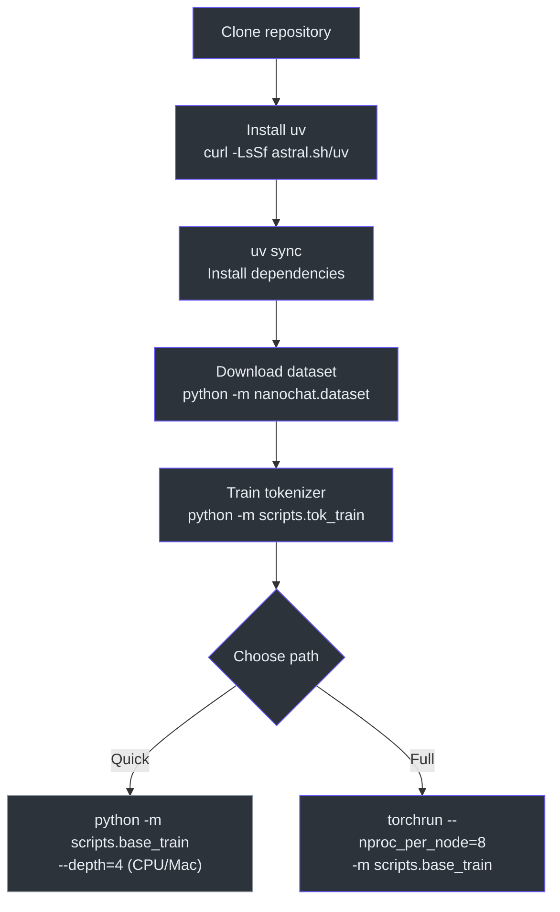
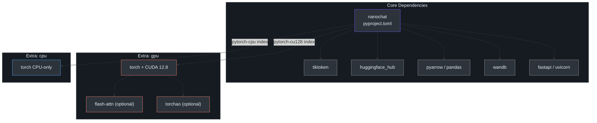

# Installation & Setup

## Prerequisites

| Requirement | Details |
|---|---|
| **Python** | 3.10 or higher (see `.python-version`) |
| **Package manager** | [uv](https://github.com/astral-sh/uv) (installed automatically by the run scripts if missing) |
| **GPU (recommended)** | NVIDIA GPU with ≥ 80 GB VRAM (H100/A100). Smaller GPUs work with reduced `--device-batch-size` |
| **CPU / Apple Silicon** | Supported for small-scale experiments via `--extra cpu` |



---

## Clone & Install

```bash
# Clone the repository
git clone https://github.com/karpathy/nanochat.git
cd nanochat

# Install uv if you don't have it
curl -LsSf https://astral.sh/uv/install.sh | sh

# Create a virtual environment
uv venv

# Install dependencies — pick ONE:
uv sync --extra gpu   # NVIDIA CUDA (production training)
uv sync --extra cpu   # CPU-only or Apple Silicon

# Activate the environment
source .venv/bin/activate
```

The `gpu` and `cpu` extras control which PyTorch build is installed. They are mutually exclusive — `gpu` pulls from the `pytorch-cu128` index (CUDA 12.8), while `cpu` pulls from the `pytorch-cpu` index.

> **Source:** [pyproject.toml](../../pyproject.toml) — see `[tool.uv.sources]` and `[tool.uv.conflicts]`

---

## Device Autodetection

nanochat automatically detects the best available device at startup via `autodetect_device_type()` in [`nanochat/common.py`](../../nanochat/common.py):

```python
def autodetect_device_type():
    if torch.cuda.is_available():
        device_type = "cuda"
    elif torch.backends.mps.is_available():
        device_type = "mps"
    else:
        device_type = "cpu"
    return device_type
```

You can override this with the `--device-type` CLI flag:

```bash
python -m scripts.base_train --device-type=cpu   # Force CPU
python -m scripts.base_train --device-type=mps   # Force Apple Silicon
```

---

## Dependency & Extras Layout

The `pyproject.toml` defines two mutually exclusive extras — `gpu` and `cpu` — that control the PyTorch index URL. The dependency tree looks like this:



---

## Environment Variables

| Variable | Default | Description |
|---|---|---|
| `NANOCHAT_BASE_DIR` | `~/.cache/nanochat` | Directory for all intermediate artifacts — data shards, tokenizer, checkpoints, reports |
| `OMP_NUM_THREADS` | (system default) | Set to `1` when using `torchrun` to avoid OpenMP thread oversubscription |
| `WANDB_RUN` | `dummy` | Set to a run name (e.g. `d26`) to enable Weights & Biases logging. `dummy` disables it |

```bash
# Typical setup before a training run
export OMP_NUM_THREADS=1
export NANOCHAT_BASE_DIR="$HOME/.cache/nanochat"
mkdir -p $NANOCHAT_BASE_DIR
```

> **Source:** [`runs/speedrun.sh`](../../runs/speedrun.sh), [`nanochat/common.py`](../../nanochat/common.py) — `get_base_dir()`

---

## Data Download

The pretraining dataset is a shuffled subset of [FineWeb-Edu](https://huggingface.co/datasets/karpathy/fineweb-edu-100b-shuffle), stored as parquet shards (~100 MB each). Download shards with:

```bash
# Download 8 shards (~800 MB) — enough to train the tokenizer
python -m nanochat.dataset -n 8

# Download 370 shards (~37 GB) — enough for a full GPT-2 speedrun (~10B tokens)
python -m nanochat.dataset -n 370
```

Shards are saved to `$NANOCHAT_BASE_DIR/base_data/`. The maximum available is 1,822 shards. The speedrun script downloads 8 shards first, then kicks off the remaining ~370 in the background while the tokenizer trains.

---

## Tokenizer Training

Once you have at least 8 data shards (~2B characters), train a BPE tokenizer:

```bash
# Train tokenizer (vocab size 2^15 = 32,768)
python -m scripts.tok_train

# Evaluate compression ratio
python -m scripts.tok_eval
```

For CPU/MPS with limited memory, you can cap the training data:

```bash
python -m scripts.tok_train --max-chars=2000000000
```

The trained tokenizer is saved to `$NANOCHAT_BASE_DIR` and reused by all subsequent stages.

---

## Quick Verification

### GPU (8×H100 full speedrun)

```bash
# Run the entire pipeline: tokenizer → pretrain → SFT → eval → chat
bash runs/speedrun.sh

# After ~3 hours, launch the web UI
python -m scripts.chat_web
```

### CPU / Apple Silicon (small demo)

```bash
# Run a miniature pipeline (~30 min on M3 Max)
bash runs/runcpu.sh

# Or manually train a tiny model
python -m scripts.base_train \
    --depth=6 \
    --max-seq-len=512 \
    --device-batch-size=32 \
    --total-batch-size=16384 \
    --num-iterations=5000
```

### Smoke test (< 1 minute)

```bash
# Verify the install works with a minimal training run
python -m scripts.base_train \
    --depth=4 \
    --max-seq-len=512 \
    --device-batch-size=1 \
    --eval-tokens=512 \
    --core-metric-every=-1 \
    --total-batch-size=512 \
    --num-iterations=20
```

> **Source:** [`runs/speedrun.sh`](../../runs/speedrun.sh), [`runs/runcpu.sh`](../../runs/runcpu.sh), [`scripts/base_train.py`](../../scripts/base_train.py)
