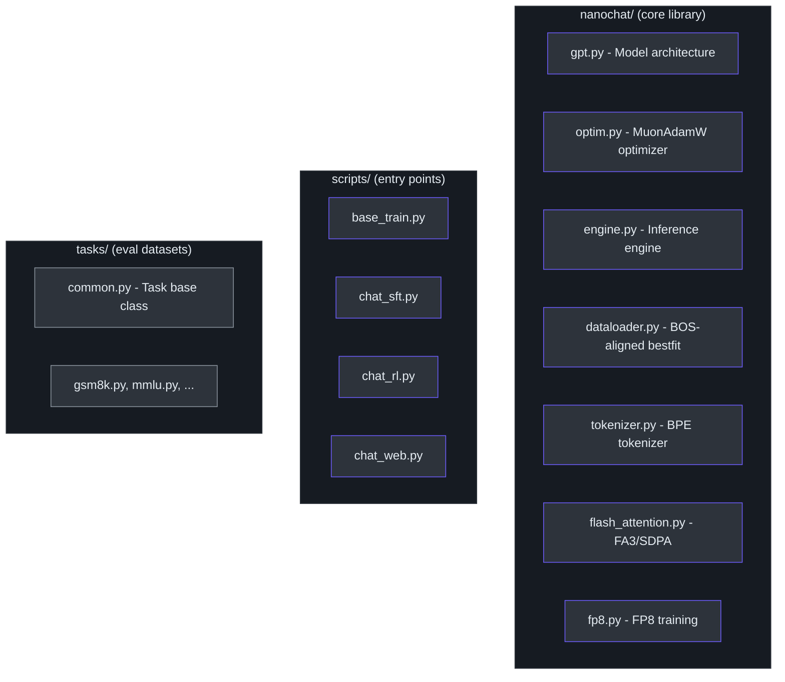

# Overview & Philosophy

## What is nanochat?

**nanochat** is the simplest experimental harness for training LLMs, created by [Andrej Karpathy](https://github.com/karpathy). It is designed to run on a single GPU node, with minimal and hackable code that covers **all major LLM stages**:

- **Tokenization** — train a BPE tokenizer from scratch
- **Pretraining** — train a GPT transformer on web-scale text
- **Finetuning (SFT)** — teach the model conversation, tool use, and personality
- **Reinforcement Learning** — further align the model with RL
- **Evaluation** — DCLM CORE score, bits-per-byte, task benchmarks
- **Inference** — efficient generation with KV cache
- **Chat UI** — a ChatGPT-like web interface to talk to your model

```mermaid
flowchart LR
    TOK["Tokenizer Training<br>tok_train.py<br>rustbpe → tiktoken"] --> DATA["Dataset Download<br>dataset.py<br>FineWeb-Edu 100B"]
    DATA --> BASE["Base Pretraining<br>base_train.py<br>GPT + MuonAdamW"]
    BASE --> SFT["Supervised Finetuning<br>chat_sft.py<br>860K conversations"]
    SFT --> RL["Reinforcement Learning<br>chat_rl.py<br>GSM8K GRPO"]
    RL --> SERVE["Web Server<br>chat_web.py<br>FastAPI + Multi-GPU"]

    style TOK fill:#2d333b,stroke:#6d5dfc,color:#e6edf3
    style DATA fill:#2d333b,stroke:#6d5dfc,color:#e6edf3
    style BASE fill:#2d333b,stroke:#6d5dfc,color:#e6edf3
    style SFT fill:#2d333b,stroke:#6d5dfc,color:#e6edf3
    style RL fill:#2d333b,stroke:#6d5dfc,color:#e6edf3
    style SERVE fill:#2d333b,stroke:#6d5dfc,color:#e6edf3
```



You can train your own GPT-2 capability LLM (which cost ~\$43,000 to train in 2019) for only **~\$72** (~3 hours on an 8×H100 GPU node). On a spot instance, the total cost can be closer to ~\$20.

> **Source:** [README.md](../../README.md), [pyproject.toml](../../pyproject.toml)

---

## The "One Dial" Philosophy

nanochat is configured around a **single complexity dial**: the `--depth` parameter — the number of layers in the GPT transformer model. All other hyperparameters are calculated automatically from depth:

| Hyperparameter | Derivation |
|---|---|
| Model dimension (`n_embd`) | `depth × aspect_ratio` (default aspect ratio: 64) |
| Number of attention heads | `n_embd / head_dim` (default head dim: 128) |
| Learning rate adjustments | Scaled ∝ 1/√(d_model / 768) |
| Training horizon | Computed from target param-to-data ratio (default: 10.5) |
| Total batch size | Auto-computed to be optimal |
| Weight decay, betas, etc. | Tuned defaults that work across all depths |

```
# Train a GPT-1 sized model (~5 min, great for experimentation)
torchrun --standalone --nproc_per_node=8 -m scripts.base_train -- --depth=12

# Train a GPT-2 grade model (~3 hours on 8×H100)
torchrun --standalone --nproc_per_node=8 -m scripts.base_train -- --depth=26
```

By sweeping `--depth`, you produce a **miniseries** of compute-optimal models at various sizes. GPT-2 capability happens to be approximately depth 24–26 with the current code. Any candidate changes to the repo must be principled enough that they work for **all** settings of depth.

---

## GPT-2 Speedrun Leaderboard

Inspired by the [modded-nanogpt](https://github.com/KellerJordan/modded-nanogpt) repo, nanochat maintains a leaderboard for the **"GPT-2 speedrun"**: the wall-clock time required to train a nanochat model to GPT-2 grade capability, measured by the **DCLM CORE score** (target: ≥ 0.256525).

| # | Time (hrs) | CORE | Description |
|---|---|---|---|
| 0 | 168 | 0.2565 | Original OpenAI GPT-2 (2019) |
| 1 | 3.04 | 0.2585 | d24 baseline |
| 2 | 2.91 | 0.2578 | d26 + FP8 |
| 3 | 2.76 | 0.2602 | Bump total batch size to 1M tokens |

The reference training script is always [`runs/speedrun.sh`](../../runs/speedrun.sh). See [`dev/LEADERBOARD.md`](../../dev/LEADERBOARD.md) for detailed contribution guidelines.

---

## File Structure




---

## Design Principles

nanochat is **not** an exhaustively configurable LLM "framework." It follows a specific set of design principles:

1. **No configuration objects** — hyperparameters are derived from `--depth` or passed as simple CLI args
2. **No model factories** — there is one `GPT` class in `gpt.py`, one `GPTConfig` dataclass
3. **Minimal, readable code** — each file has a clear, single purpose
4. **Maximally forkable** — designed as a "strong baseline" you can clone and hack on
5. **Single cohesive codebase** — no if-then-else monsters or plugin systems
6. **End-to-end** — from raw text to a ChatGPT-style conversation in one repository

The goal is to improve the state of the art in **micro models** accessible on budgets of < \$1,000, where accessibility means both overall cost and **cognitive complexity** of the code.
