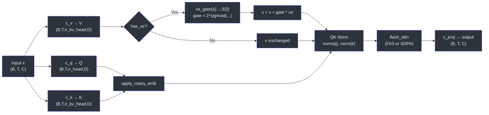
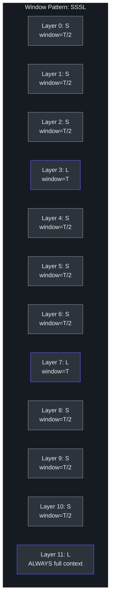
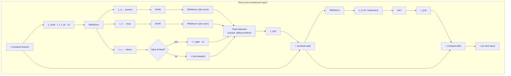
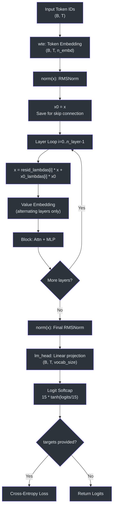
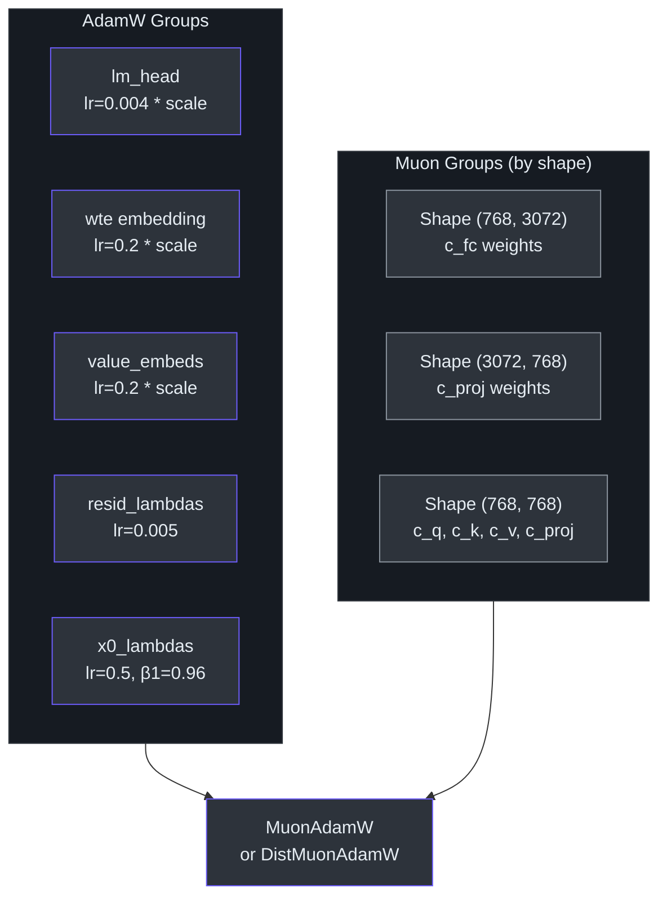

# GPT Model Architecture

This page documents the GPT model implementation in `nanochat/gpt.py` — a clean, modern decoder-only Transformer with a number of architectural improvements over the original GPT-2 design.

## GPTConfig

The model is configured via a `GPTConfig` dataclass with the following fields:

```python
@dataclass
class GPTConfig:
    sequence_len: int = 2048      # Maximum context length
    vocab_size: int = 32768       # Vocabulary size (32K BPE tokens + 10 special tokens)
    n_layer: int = 12             # Number of transformer layers
    n_head: int = 6               # Number of query attention heads
    n_kv_head: int = 6            # Number of key/value heads (GQA; when < n_head, enables grouped queries)
    n_embd: int = 768             # Model embedding dimension
    window_pattern: str = "SSSL"  # Sliding window attention pattern tiled across layers
```

In practice, `base_train.py` derives dimensions from a single `--depth` parameter:

```
model_dim = depth × aspect_ratio  (rounded up to nearest head_dim multiple)
num_heads = model_dim / head_dim
```

For example, `depth=20, aspect_ratio=64, head_dim=128` → `n_embd=1280, n_head=10, n_kv_head=10`.

<!-- source: nanochat/gpt.py:28-39, scripts/base_train.py:125-139 -->

## Architectural Features

### RoPE (Rotary Positional Embeddings)

nanochat uses RoPE instead of learned position embeddings. Rotary embeddings encode relative position information by rotating pairs of dimensions in the query and key vectors by frequency-dependent angles. This allows the model to generalize to sequence lengths not seen during training.

The embeddings are precomputed at initialization for `10× sequence_len` positions and stored as non-persistent buffers (not saved to checkpoints). The base frequency θ is 10,000 (standard RoPE).

```python
# nanochat/gpt.py:51-57 — applied to q and k before attention
def apply_rotary_emb(x, cos, sin):
    d = x.shape[3] // 2
    x1, x2 = x[..., :d], x[..., d:]
    y1 = x1 * cos + x2 * sin
    y2 = x1 * (-sin) + x2 * cos
    return torch.cat([y1, y2], 3)
```

<!-- source: nanochat/gpt.py:51-57, 179-186, 243-258 -->

### QK-Norm

After applying RoPE, both queries and keys are normalized using RMSNorm. This stabilizes attention logits and prevents gradient issues at scale. The norm function is purely functional with no learnable parameters:

```python
q, k = norm(q), norm(k)  # QK norm
```

<!-- source: nanochat/gpt.py:94 -->

### Group-Query Attention (GQA)

The model supports GQA via the `n_kv_head` config parameter. When `n_kv_head < n_head`, multiple query heads share the same key/value head, reducing KV-cache memory at inference time. Flash Attention handles the GQA expansion internally via its `enable_gqa` support.

The projections are separate linear layers with no bias:

```python
self.c_q = nn.Linear(n_embd, n_head * head_dim, bias=False)
self.c_k = nn.Linear(n_embd, n_kv_head * head_dim, bias=False)
self.c_v = nn.Linear(n_embd, n_kv_head * head_dim, bias=False)
self.c_proj = nn.Linear(n_embd, n_embd, bias=False)
```

<!-- source: nanochat/gpt.py:59-72 -->

#### CausalSelfAttention Internal Flow

The following diagram traces the full data path through `CausalSelfAttention.forward()`, from the input projection through RoPE, QK-norm, optional value embedding gating, Flash Attention, and the output projection:



<!-- source: nanochat/gpt.py:76-118 -->

### relu² Activation in MLP

The MLP uses squared ReLU (`relu²`) instead of GELU or SwiGLU. This is a simple non-gated activation that produces sparse activations:

```python
class MLP(nn.Module):
    def __init__(self, config):
        self.c_fc = nn.Linear(config.n_embd, 4 * config.n_embd, bias=False)
        self.c_proj = nn.Linear(4 * config.n_embd, config.n_embd, bias=False)

    def forward(self, x):
        x = self.c_fc(x)
        x = F.relu(x).square()  # relu² activation
        x = self.c_proj(x)
        return x
```

The expansion factor is 4×, so the hidden dimension is `4 * n_embd`.

<!-- source: nanochat/gpt.py:121-131 -->

### No Bias, No Learnable Norm Parameters

All `nn.Linear` layers throughout the model use `bias=False`. The RMSNorm function is purely functional — a single call to `F.rms_norm()` with no learnable scale/shift:

```python
def norm(x):
    return F.rms_norm(x, (x.size(-1),))
```

This reduces parameter count and simplifies the model.

<!-- source: nanochat/gpt.py:42-44, 69-72, 124-125 -->

### Untied Embedding/Unembedding Weights

Unlike GPT-2 which shares the token embedding and lm_head weights, nanochat uses separate parameters for the input embedding (`wte`) and the output projection (`lm_head`). They are initialized differently and optimized with different learning rates:

- `wte`: Normal init with `std=1.0`, optimized with AdamW at `embedding_lr` (default 0.3)
- `lm_head`: Normal init with `std=0.001`, optimized with AdamW at `unembedding_lr` (default 0.004)

<!-- source: nanochat/gpt.py:163-167, 204-206, 348-370 -->

### Value Embeddings (ResFormer-Style)

nanochat implements value embeddings inspired by the ResFormer paper. On alternating layers (determined by `has_ve(layer_idx, n_layer)`), a per-layer `nn.Embedding` maps input token IDs directly to value-space vectors. These are mixed into the attention values via a learned, input-dependent gate:

```python
# In CausalSelfAttention.forward():
if ve is not None:
    ve = ve.view(B, T, n_kv_head, head_dim)
    gate = 2 * torch.sigmoid(self.ve_gate(x[..., :32]))  # range (0, 2)
    v = v + gate.unsqueeze(-1) * ve
```

The gate operates on the first 32 channels of the input (`ve_gate_channels = 32`) and produces per-head scalars. It is initialized to zero so that `sigmoid(0) = 0.5`, scaled by 2 → `1.0` (neutral at initialization). The last layer always has value embeddings.

<!-- source: nanochat/gpt.py:47-49, 73-74, 85-89, 174-177, 227-230 -->

### Per-Layer Learnable Scalars

The model maintains two per-layer scalar parameters:

- **`resid_lambdas`** (`nn.Parameter`, shape `(n_layer,)`, init `1.0`): Scales the residual stream before each block. At init, `1.0` gives standard residual connections.
- **`x0_lambdas`** (`nn.Parameter`, shape `(n_layer,)`, init `0.1`): Blends the initial (post-embedding-norm) representation `x0` back into the residual stream at each layer.

The forward pass applies these before each block:

```python
# In GPT.forward():
x0 = norm(self.transformer.wte(idx))  # save initial embedding
for i, block in enumerate(self.transformer.h):
    x = self.resid_lambdas[i] * x + self.x0_lambdas[i] * x0
    x = block(x, ve, cos_sin, window_sizes[i], kv_cache)
```

These scalars have their own optimizer groups with dedicated learning rates (the `x0_lambdas` use a higher `beta1=0.96` for stability).

<!-- source: nanochat/gpt.py:168-173, 219-221, 356-372 -->

### Sliding Window Attention

The `window_pattern` config string controls per-layer attention window sizes. It is tiled across layers, with the final layer always getting full context:

| Character | Window Size | Meaning |
|-----------|-------------|---------|
| `L` (Long) | `sequence_len` (full context) | Full causal attention |
| `S` (Short) | `sequence_len // 2` | Sliding window (half context) |

The default pattern `"SSSL"` means: three layers with half-context sliding window, then one layer with full context, repeated. This reduces the quadratic cost of attention on most layers while maintaining global information flow through the periodic full-context layers.

Window sizes are passed to Flash Attention as `(left, right)` tuples, where `left` is the number of preceding tokens to attend to and `right=0` for causal masking. On non-Hopper GPUs, the SDPA fallback in `flash_attention.py` constructs explicit boolean masks for sliding window.

<!-- source: nanochat/gpt.py:36-39, 260-287 -->

#### Sliding Window Layer Pattern

The `SSSL` pattern tiles across all 12 layers, giving three short-window layers for every full-context layer. The final layer is always forced to full context regardless of the pattern:



<!-- source: nanochat/gpt.py:260-287 -->

### Logit Softcap

Output logits are smoothly capped to the range `[-15, 15]` using `tanh` squashing (inspired by Gemma 2). This prevents logit magnitudes from growing unboundedly:

```python
softcap = 15
logits = softcap * torch.tanh(logits / softcap)
```

The softcap is applied after casting logits to `float32` for numerical stability.

<!-- source: nanochat/gpt.py:410-414 -->

### Vocab Padding

The vocabulary is padded to the nearest multiple of 64 for tensor core efficiency:

```python
padded_vocab_size = ((vocab_size + 64 - 1) // 64) * 64
```

The embedding table and lm_head use the padded size, but `forward()` slices the logits back to the true `vocab_size` before loss computation:

```python
logits = self.lm_head(x)                          # (B, T, padded_vocab_size)
logits = logits[..., :self.config.vocab_size]      # slice to true vocab size
```

<!-- source: nanochat/gpt.py:147, 159-167, 411-412 -->

## Transformer Block Diagram



**Data flow through a single block:**
1. The residual stream `x` is scaled by `resid_lambdas[i]` and blended with the initial embedding `x0` (scaled by `x0_lambdas[i]`)
2. **Attention sub-block:** RMSNorm → Q/K/V projections → RoPE on Q,K → QK-norm → optional value embedding mixing → Flash Attention (causal, with per-layer window size) → output projection → residual add
3. **MLP sub-block:** RMSNorm → linear expansion (4×) → relu² → linear projection → residual add

<!-- source: nanochat/gpt.py:134-143, 388-414 -->

### Full Forward Pass Flow

The overall `GPT.forward()` method orchestrates embedding, the layer loop with residual lambdas and value embeddings, final normalization, and logit softcapping:



<!-- source: nanochat/gpt.py:388-423 -->

## Weight Initialization

The initialization strategy is defined in `init_weights()` and designed for maximum clarity:

| Component | Strategy | Value |
|-----------|----------|-------|
| `wte` (embedding) | Normal | `std = 1.0` |
| `lm_head` (unembedding) | Normal | `std = 0.001` |
| `attn.c_q`, `attn.c_k`, `attn.c_v` | Uniform | `[-s, s]` where `s = √3 · n_embd^(-0.5)` |
| `attn.c_proj` | Zeros | `0` |
| `mlp.c_fc` | Uniform | `[-s, s]` where `s = √3 · n_embd^(-0.5)` |
| `mlp.c_proj` | Zeros | `0` |
| `resid_lambdas` | Constant | `1.0` (identity residual) |
| `x0_lambdas` | Constant | `0.1` (small initial skip to input) |
| Value embeddings | Uniform | `[-s, s]` (same as c_v) |
| `ve_gate` weights | Zeros | `0` (sigmoid(0)=0.5, ×2=1.0 → neutral) |
| Rotary embeddings | Precomputed | Sinusoidal (non-persistent buffer) |

The uniform initialization uses `s = √3 · n_embd^(-0.5)` so that the standard deviation matches that of a normal distribution (`Uniform[-s,s]` has `std = s/√3`). Output projections (`c_proj` in both attention and MLP) are initialized to zero, meaning each block starts as an identity function (the residual stream passes through unchanged).

After initialization, embeddings are cast to `bfloat16` on CUDA to save memory — the optimizer tolerates this reduced precision for embedding parameters.

<!-- source: nanochat/gpt.py:188-241 -->

## FLOPs Estimation

The `estimate_flops()` method returns the estimated FLOPs per token for a full forward + backward pass:

```python
num_flops_per_token = 6 * (nparams - nparams_exclude) + attn_flops
```

The formula accounts for:
- **6× matmul parameters**: Each weight parameter contributes 2 FLOPs (multiply + accumulate) in the forward pass, and 4 FLOPs in the backward pass (2 for gradient w.r.t. input, 2 for gradient w.r.t. weight) → `6 × num_matmul_params`.
- **Excluded parameters**: Embeddings (`wte`, value embeddings) and per-layer scalars (`resid_lambdas`, `x0_lambdas`) are not matmul operations.
- **Attention FLOPs**: `Σ_layers 12 · n_head · head_dim · effective_seq_len` per layer, where `effective_seq_len` is capped by the sliding window size. The 12× factor accounts for Q·K and attn·V matmuls in forward and backward.

Reference: [PaLM paper](https://arxiv.org/abs/2204.02311) for the matmul formula, with corrections for sliding window attention.

<!-- source: nanochat/gpt.py:292-317 -->

## Optimizer Configuration

The model's `setup_optimizer()` method partitions parameters into separate optimizer groups, using a hybrid **Muon + AdamW** strategy:

| Parameter Group | Optimizer | Default LR | Notes |
|----------------|-----------|------------|-------|
| `lm_head` | AdamW | `0.004 × (d/768)^(-0.5)` | Scaled by `1/√d_model` |
| `wte` (embedding) | AdamW | `0.2 × (d/768)^(-0.5)` | Scaled by `1/√d_model` |
| Value embeddings | AdamW | `0.2 × (d/768)^(-0.5)` | Same as embeddings |
| `resid_lambdas` | AdamW | `0.005` | Very low LR |
| `x0_lambdas` | AdamW | `0.5` | Higher `beta1=0.96` |
| Transformer matrices | Muon | `0.02` | Grouped by shape for stacking |

The `1/√d_model` scaling of AdamW learning rates implements μP-style transfer — hyperparameters tuned at `d=768` (12 layers) transfer to larger models without re-tuning.

Muon parameters are grouped by weight shape to enable efficient batched Newton-Schulz orthogonalization (5 steps, momentum 0.95).

<!-- source: nanochat/gpt.py:348-386 -->

#### Parameter Groups Visualization

The following diagram shows how `setup_optimizer()` partitions all model parameters into AdamW and Muon groups with distinct learning rates:



<!-- source: nanochat/gpt.py:348-386 -->

## Generation

The `generate()` method implements naive autoregressive inference (batch size 1, no KV cache) for simple use cases:

```python
for _ in range(max_tokens):
    logits = self.forward(ids)       # full forward pass each step
    logits = logits[:, -1, :]        # take last position
    # top-k filtering + temperature sampling or argmax
    next_ids = sample(logits)
    ids = torch.cat((ids, next_ids), dim=1)
    yield next_ids.item()
```

For efficient batched generation with KV caching and tool use, see `nanochat/engine.py` which provides the `Engine` class with `generate()` and `generate_batch()` methods.

<!-- source: nanochat/gpt.py:425-455 -->
