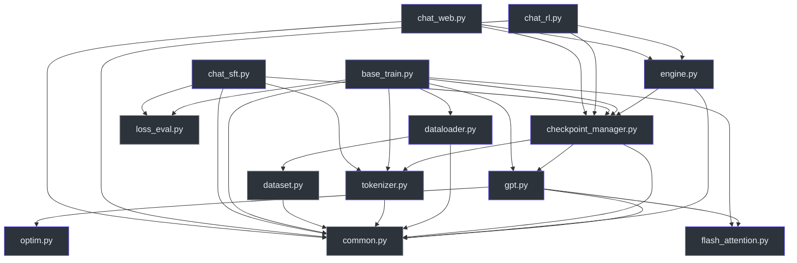
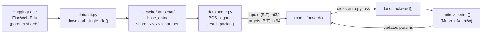

# System Architecture

nanochat is Andrej Karpathy's minimal ChatGPT clone — an end-to-end system that trains a GPT language model from scratch through three phases (pretraining → SFT → RL), then serves it for interactive chat. This page documents the full pipeline, how the pieces connect, and how data and checkpoints flow through the system.

## End-to-End Pipeline

The system follows a linear pipeline from raw text to interactive chatbot:

```
Tokenizer → Data → Model → Training → Eval → Inference → UI
```

1. **Tokenizer** (`scripts/tok_train.py`, `nanochat/tokenizer.py`): A BPE tokenizer (rustbpe + tiktoken) is trained on the dataset and stored on disk. Vocab size is 32,768 tokens with 10 special tokens (`<|bos|>`, `<|user_start|>`, `<|assistant_start|>`, etc.).

2. **Data** (`nanochat/dataset.py`, `nanochat/dataloader.py`): FineWeb-Edu parquet shards are downloaded on demand and streamed through a distributed dataloader with BOS-aligned best-fit packing.

3. **Model** (`nanochat/gpt.py`): A GPT-class decoder-only Transformer with modern features (RoPE, GQA, relu², sliding window attention, value embeddings, logit softcap). See [GPT Model Architecture](./gpt-model.md).

4. **Training** (`scripts/base_train.py`, `scripts/chat_sft.py`, `scripts/chat_rl.py`): Three sequential training phases — pretraining on raw text, supervised fine-tuning on conversations, and reinforcement learning on GSM8K.

5. **Eval** (`scripts/base_eval.py`, `scripts/chat_eval.py`, `nanochat/core_eval.py`, `nanochat/loss_eval.py`): Evaluation of base model loss (bits-per-byte), CORE metric aggregation, and chat-specific benchmarks (GSM8K pass@k, MMLU, ARC, HumanEval).

6. **Inference** (`nanochat/engine.py`): KV-cache-accelerated batched generation with built-in calculator tool use (`<|python_start|>` / `<|python_end|>` blocks evaluated via `eval()`).

7. **UI** (`scripts/chat_web.py`, `scripts/chat_cli.py`, `nanochat/ui.html`): A web UI served via a local HTTP server and a CLI chat interface.

## System Connectivity Diagram

```mermaid
graph TB
    subgraph "scripts/ — Training & Serving"
        tok_train["tok_train.py<br>(tokenizer training)"]
        base_train["base_train.py<br>(pretraining)"]
        chat_sft["chat_sft.py<br>(SFT)"]
        chat_rl["chat_rl.py<br>(RL / GRPO)"]
        base_eval["base_eval.py<br>(base eval)"]
        chat_eval["chat_eval.py<br>(chat eval)"]
        chat_web["chat_web.py<br>(web UI)"]
        chat_cli["chat_cli.py<br>(CLI chat)"]
    end

    subgraph "nanochat/ — Core Library"
        gpt["gpt.py<br>(GPT model)"]
        tokenizer["tokenizer.py<br>(BPE tokenizer)"]
        dataloader["dataloader.py<br>(distributed loader)"]
        dataset["dataset.py<br>(parquet dataset)"]
        ckpt["checkpoint_manager.py<br>(save/load)"]
        engine["engine.py<br>(KV-cache inference)"]
        optim["optim.py<br>(Muon + AdamW)"]
        common["common.py<br>(DDP, device, utils)"]
        flash["flash_attention.py<br>(FA3 / SDPA)"]
        loss_eval["loss_eval.py<br>(bpb eval)"]
        core_eval["core_eval.py<br>(CORE metric)"]
    end

    subgraph "tasks/ — SFT & RL Data"
        smoltalk["smoltalk.py"]
        gsm8k["gsm8k.py"]
        mmlu["mmlu.py"]
        spellingbee["spellingbee.py"]
        arc["arc.py"]
        customjson["customjson.py"]
    end

    tok_train --> tokenizer
    base_train --> gpt & tokenizer & dataloader & ckpt & optim & common & flash & loss_eval & core_eval
    dataloader --> dataset
    chat_sft --> gpt & tokenizer & ckpt & optim & common & loss_eval
    chat_sft --> smoltalk & gsm8k & mmlu & spellingbee & customjson
    chat_rl --> gpt & tokenizer & ckpt & optim & engine & common
    chat_rl --> gsm8k
    base_eval --> gpt & tokenizer & ckpt & engine & common & core_eval
    chat_eval --> gpt & tokenizer & ckpt & engine & common
    chat_eval --> gsm8k & mmlu & arc
    chat_web --> engine & tokenizer & ckpt
    chat_cli --> engine & tokenizer & ckpt
    gpt --> flash & optim & common
    engine --> gpt & common & ckpt
```



## Module Dependency Graph

The following diagram traces the actual import relationships between modules:



## Three Training Phases

nanochat trains in three sequential phases. Each phase reads checkpoints from the previous phase and writes to its own checkpoint directory.

### Phase 1: Pretraining (`scripts/base_train.py`)

**Goal:** Learn language from raw text (FineWeb-Edu 100B tokens).

- **Input data:** Parquet files from HuggingFace, streamed through `dataloader.py` with distributed BOS-aligned best-fit packing.
- **Model:** Freshly initialized GPT (via `GPT(config)` on meta device → `to_empty()` → `init_weights()`).
- **Optimizer:** Combined Muon (for transformer matrix params) + AdamW (for embeddings, lm_head, scalars) via `model.setup_optimizer()`.
- **Scaling laws:** Automatic batch size selection (`B_opt ∝ D^0.383`), LR scaling (`η ∝ √(B/B_ref)`), and weight decay scheduling (`λ ∝ √(B/B_ref) · D_ref/D`) following Chinchilla and Power Lines papers.
- **LR schedule:** Linear warmup → constant → linear warmdown.
- **Output:** Checkpoints in `~/.cache/nanochat/base_checkpoints/<model_tag>/`.
- **Run:** `torchrun --nproc_per_node=8 -m scripts.base_train` (or `python -m scripts.base_train` for single GPU).

<!-- source: scripts/base_train.py:1-82, 122-350 -->

### Phase 2: Supervised Fine-Tuning (`scripts/chat_sft.py`)

**Goal:** Teach the model to follow conversational format and answer questions.

- **Input data:** A mixture of conversation datasets defined via `TaskMixture`:
  - `SmolTalk` (460K general conversations)
  - `MMLU` auxiliary_train (100K multiple-choice problems)
  - `GSM8K` train × 2 epochs (16K math problems)
  - `CustomJSON` identity conversations × 2 epochs
  - `SimpleSpelling` (200K) + `SpellingBee` (80K)
- **Model:** Loaded from base checkpoints via `load_model("base", ...)`.
- **Dataloader:** Custom `sft_data_generator_bos_bestfit()` with best-fit padding (not cropping) — padding positions are masked with `target = -1` (ignored by cross-entropy loss).
- **LR schedule:** Constant for first 80%, then linear ramp-down to 0.
- **Output:** Checkpoints in `~/.cache/nanochat/chatsft_checkpoints/<model_tag>/`.
- **Run:** `torchrun --standalone --nproc_per_node=8 -m scripts.chat_sft -- --device-batch-size=16`

<!-- source: scripts/chat_sft.py:1-62, 103-120, 239-243 -->

### Phase 3: Reinforcement Learning (`scripts/chat_rl.py`)

**Goal:** Improve math reasoning via outcome-based RL on GSM8K.

- **Algorithm:** Simplified REINFORCE (labeled "GRPO" but without trust region, PPO clipping, or KL regularization). On-policy with DAPO-style token-level normalization. Advantages are `r - μ` (mean subtraction, no z-score).
- **Input data:** `GSM8K` train set, with `num_samples` rollouts per example.
- **Model:** Loaded from SFT checkpoints via `load_model("sft", ...)`.
- **Inference:** Uses `Engine` for batched KV-cache generation of rollouts. The model generates completions primed with `<|assistant_start|>`, and `task.reward()` scores correctness.
- **Training loop:** For each optimization step, sample `examples_per_step` questions, generate `num_samples` completions per question, compute per-token policy gradient loss weighted by advantages, then update.
- **LR schedule:** Linear ramp-down to 0 over `num_steps`.
- **Output:** Checkpoints in `~/.cache/nanochat/chatrl_checkpoints/<model_tag>/`.
- **Eval:** Periodic pass@k evaluation on GSM8K test set.
- **Run:** `torchrun --standalone --nproc_per_node=8 -m scripts.chat_rl -- --run=default`

<!-- source: scripts/chat_rl.py:1-64, 200-340 -->

## Model Sources and Checkpoint Directories

The checkpoint manager (`nanochat/checkpoint_manager.py`) maps three logical model sources to on-disk directories under `~/.cache/nanochat/` (or `$NANOCHAT_BASE_DIR`):

| Source | Directory | Produced By | Consumed By |
|--------|-----------|-------------|-------------|
| `"base"` | `base_checkpoints/` | `base_train.py` | `chat_sft.py`, `base_eval.py` |
| `"sft"` | `chatsft_checkpoints/` | `chat_sft.py` | `chat_rl.py`, `chat_eval.py` |
| `"rl"` | `chatrl_checkpoints/` | `chat_rl.py` | `chat_web.py`, `chat_cli.py`, `chat_eval.py` |

```python
# checkpoint_manager.py:164-172
def load_model(source, *args, **kwargs):
    model_dir = {
        "base": "base_checkpoints",
        "sft": "chatsft_checkpoints",
        "rl": "chatrl_checkpoints",
    }[source]
```

Within each directory, checkpoints are organized by **model tag** (typically `d<depth>`, e.g., `d12`, `d20`). The `find_largest_model()` function auto-selects the deepest model when no tag is specified.

## Data Flow

### Pretraining Data Flow



The pretraining dataloader (`tokenizing_distributed_data_loader_with_state_bos_bestfit`) streams parquet row groups, tokenizes batches with the BPE tokenizer, and packs documents into fixed-length rows using best-fit-decreasing bin packing. Every row starts with a BOS token. When no document fits the remaining space, the shortest buffered document is cropped to fill exactly — yielding 100% utilization but ~35% cropped tokens at `T=2048`.

### SFT Data Flow

SFT uses `TaskMixture` to shuffle across multiple task datasets. Each task produces a conversation (list of `{"role": ..., "content": ...}` messages). The tokenizer's `render_conversation()` method converts conversations into token IDs with special delimiters and a supervision mask (1 for assistant tokens, 0 for user/system/tool tokens). The SFT dataloader packs multiple conversations per row using best-fit *padding* (not cropping), masking padded positions with `target = -1`.

### RL Data Flow

RL generates rollouts on-the-fly: for each training example, the model generates `num_samples` completions via `Engine.generate_batch()`, rewards are computed by `task.reward()`, advantages are calculated as `r - μ`, and the policy gradient loss `-(logp · advantage)` is backpropagated through the generation tokens only (prompt and tool-output tokens are masked out).

## Checkpoint Flow

Each checkpoint consists of three files:

| File | Contents | Saved By |
|------|----------|----------|
| `model_NNNNNN.pt` | Model `state_dict()` (all parameter tensors) | Rank 0 only |
| `meta_NNNNNN.json` | Metadata: `model_config`, `step`, `val_bpb`, `user_config`, `dataloader_state_dict` | Rank 0 only |
| `optim_NNNNNN_rankN.pt` | Optimizer state (sharded per rank for DDP) | Each rank |

```python
# checkpoint_manager.py:42-59
def save_checkpoint(checkpoint_dir, step, model_data, optimizer_data, meta_data, rank=0):
    # model_NNNNNN.pt — saved by rank 0
    # meta_NNNNNN.json — saved by rank 0
    # optim_NNNNNN_rankN.pt — saved by each rank (sharded optimizer state)
```

**Loading** is handled by `build_model()` which:
1. Loads the checkpoint data from disk
2. Patches missing config keys for backward compatibility (e.g., `window_pattern` defaults to `"L"` for old checkpoints)
3. Patches missing parameter keys (e.g., `resid_lambdas` defaults to `1.0`, `x0_lambdas` to `0.0`)
4. Creates the model on meta device, materializes to target device, initializes rotary embeddings, then loads state dict
5. Strips `_orig_mod.` prefixes from keys (artifact of `torch.compile`)

**Resumption** is supported in `base_train.py` via `--resume-from-step`, which reloads both model and optimizer state and resumes the dataloader from the saved `(pq_idx, rg_idx, epoch)` position.

## How Depth Flows Through the System

The `--depth` parameter (defaulting to 20) is the single knob that controls model size. It cascades through the system as follows:

1. **Model dimensions** are derived from depth in `base_train.py`:
   ```python
   base_dim = depth * aspect_ratio  # aspect_ratio defaults to 64
   model_dim = round_up_to(base_dim, head_dim)  # ensures clean head division
   num_heads = model_dim // head_dim  # head_dim defaults to 128
   ```
   For `depth=20`: `base_dim=1280`, `model_dim=1280`, `num_heads=10`.

2. **Checkpoint directory** uses depth as the default model tag: `base_checkpoints/d20/`, `chatsft_checkpoints/d20/`, `chatrl_checkpoints/d20/`.

3. **Model selection** (`find_largest_model()`) parses the `d<N>` pattern to find the largest available model when no `--model-tag` is specified.

4. **Scaling laws** automatically scale batch size, learning rates, and weight decay based on the model's parameter count (which is a function of depth).

5. **SFT and RL** inherit the depth from the loaded base model — the config is stored in `meta_NNNNNN.json` and reconstructed by `build_model()`.

<!-- source: checkpoint_manager.py, common.py:50-59, scripts/base_train.py:49-51,125-139,151-152 -->
