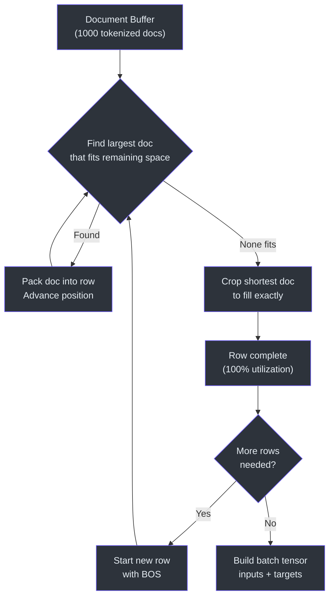
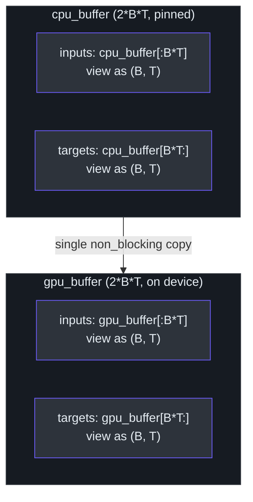

# Dataloader

> **Source**: [`nanochat/dataloader.py`](../../nanochat/dataloader.py)

The dataloader implements a BOS-aligned best-fit packing algorithm that achieves 100% token utilization (no padding) while supporting distributed training with checkpoint-resumable state.

---

## Packing Algorithm

### BOS-Aligned Best-Fit with Cropping



Each row in a batch has capacity `T + 1` tokens and is constructed as follows:

1. **BOS prefix** — every row begins with a `<|bos|>` token, acting as a document delimiter
2. **Best-fit packing** — from a buffer of tokenized documents, select the **largest document that fits entirely** in the remaining space
3. **Repeat** — continue packing until no buffered document fits
4. **Crop** — take the shortest remaining document and crop it to fill the remaining space exactly

```
Row layout (capacity = T + 1):

┌─────┬──────────────┬────────────┬───────────────────┐
│ BOS │   Doc A      │   Doc C    │   Doc F (cropped) │
│     │  (complete)  │ (complete) │                   │
└─────┴──────────────┴────────────┴───────────────────┘
       ◄──── best-fit packing ────► ◄── crop to fill ─►
```

### Utilization Characteristics

| Metric | Value |
|--------|-------|
| Padding tokens | **0%** — rows are always filled completely |
| Cropped tokens | **~35%** at `T = 2048` (varies with sequence length) |
| Net utilization | **100%** of the sequence length budget is used |

The cropping trade-off is favorable: rather than wasting capacity on padding, the algorithm sacrifices trailing tokens from documents that would otherwise leave gaps.

---

## Distributed Data Loading

### DDP Sharding

Documents are sharded across ranks at the **row group** level within Parquet files:

```python
# Each rank processes non-overlapping row groups
rg_idx += ddp_world_size  # stride by world size
```

This ensures each GPU sees a unique subset of the data without requiring inter-rank coordination during data loading.

### Resume Support

The dataloader tracks a checkpoint state tuple:

```
(parquet_file_index, row_group_index, epoch)
```

On resume, the dataloader fast-forwards to the exact position in the dataset, enabling seamless training continuation after interruptions.

---

## Memory Management



The dataloader uses pre-allocated pinned memory buffers and a single host-to-device transfer per batch to minimize PCIe overhead:

```
┌─────────────────────────────────┐
│  cpu_buffer (pinned, 2·B·T)     │
│  ├── cpu_inputs  (B × T view)   │
│  └── cpu_targets (B × T view)   │
└──────────────┬──────────────────┘
               │  single non_blocking H2D copy
               ▼
┌─────────────────────────────────┐
│  gpu_buffer (device, 2·B·T)     │
│  ├── gpu_inputs  (B × T view)   │
│  └── gpu_targets (B × T view)   │
└─────────────────────────────────┘
```

- **`row_buffer`** `(B, T+1)` — NumPy array used for row construction, avoiding Python list overhead
- **`cpu_buffer`** — contiguous pinned memory with `inputs` and `targets` as non-overlapping views
- **`gpu_buffer`** — matching device memory; receives a single `copy_(non_blocking=True)` per batch

This design ensures exactly **one DMA transfer per batch** and avoids repeated allocation/deallocation of page-locked memory.

---

## Pipeline


```
Parquet files
     │
     ▼
_document_batches()          # infinite iterator, DDP-sharded
     │                       # yields batches of tokenized documents
     ▼
best-fit packing + crop      # fills row_buffer (B, T+1)
     │
     ▼
cpu_buffer (pinned)          # inputs = row[:T], targets = row[1:T+1]
     │
     ▼ (single H2D copy)
gpu_buffer                   # ready for forward pass
     │
     ▼
yield (inputs, targets, state_dict)
```
