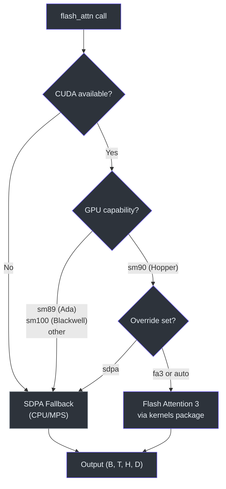

# Flash Attention

> **Source**: [`nanochat/flash_attention.py`](../../nanochat/flash_attention.py)

A unified attention interface that auto-detects the best available backend — Flash Attention 3 on Hopper GPUs or PyTorch SDPA everywhere else — and exports a consistent API via `SimpleNamespace` for drop-in use.

---

## Backend Selection

| GPU Architecture | Compute Capability | Backend |
|-----------------|-------------------|---------|
| Hopper (H100, H200) | `sm_90` | Flash Attention 3 |
| Ada (RTX 4090) | `sm_89` | SDPA fallback |
| Blackwell | `sm_100` | SDPA fallback |
| CPU / MPS | — | SDPA fallback |

Detection is automatic at import time based on `torch.cuda.get_device_capability()`. An internal `_override_impl` mechanism exists for testing.



---

## API

### `flash_attn_func(q, k, v, causal, window_size)`

**Training attention** — no KV cache, processes full sequences.

- **Input shape**: `(B, T, H, D)` for both FA3 and SDPA
- **`causal`**: enables causal (autoregressive) masking
- **`window_size`**: tuple `(left, right)` — sliding window bounds; `-1` means unlimited

```python
from nanochat.flash_attention import flash_attn

out = flash_attn.flash_attn_func(q, k, v, causal=True, window_size=(-1, -1))
```

### `flash_attn_with_kvcache(q, k_cache, v_cache, k, v, cache_seqlens)`

**Inference attention** — uses and updates a pre-allocated KV cache.

- **Cache shape**: `(B, T_max, H_kv, D)` — pre-allocated for the maximum sequence length
- **In-place update**: new K/V values are written at position `cache_seqlens[0]`
- Supports both **single-token** (autoregressive step) and **multi-token** (prompt processing) generation

```python
out = flash_attn.flash_attn_with_kvcache(
    q, k_cache, v_cache,
    cache_seqlens=seq_lens,
    window_size=(window_left, -1),
)
```

---

## SDPA Sliding Window Handling

The SDPA fallback doesn't natively support sliding window attention, so the module implements it manually:

| Scenario | Strategy |
|----------|----------|
| Full context + causal | Standard `is_causal=True` — no extra masking needed |
| Single token + window | **Slice** the KV cache to `[start : Tk]` range before attention |
| Multi-token + window | Build an **explicit boolean mask** with `row_idx <= col_idx` and window constraint |

This ensures consistent behavior across all backends regardless of hardware.

---

## Export

The module exports a `SimpleNamespace` object as a drop-in replacement:

```python
flash_attn = SimpleNamespace(
    flash_attn_func=flash_attn_func,
    flash_attn_with_kvcache=flash_attn_with_kvcache,
)
```

Consumer code imports `flash_attn` and calls methods on it without needing to know which backend is active.

---

## Flow

```mermaid
flowchart TD
    subgraph Train["Training Path"]
        TQ["Q, K, V<br>(B, T, H, D)"] --> TT["Transpose to<br>(B, H, T, D)"]
        TT --> TSDPA["SDPA or FA3<br>causal=True<br>window_size=(N, 0)"]
    end
    subgraph Infer["Inference Path (KV Cache)"]
        IQ["Q (B, T_new, H, D)"] --> IKV["Insert K,V into cache<br>k_cache[:, pos:pos+T] = k"]
        IKV --> FULL["Slice full cache<br>k_full = k_cache[:, :end_pos]"]
        FULL --> ISDPA["SDPA or FA3<br>with cache_seqlens"]
    end

    style Train fill:#161b22,stroke:#30363d,color:#e6edf3
    style Infer fill:#161b22,stroke:#30363d,color:#e6edf3
    style TQ fill:#2d333b,stroke:#6d5dfc,color:#e6edf3
    style TT fill:#2d333b,stroke:#6d5dfc,color:#e6edf3
    style TSDPA fill:#2d333b,stroke:#6d5dfc,color:#e6edf3
    style IQ fill:#2d333b,stroke:#6d5dfc,color:#e6edf3
    style IKV fill:#2d333b,stroke:#6d5dfc,color:#e6edf3
    style FULL fill:#2d333b,stroke:#6d5dfc,color:#e6edf3
    style ISDPA fill:#2d333b,stroke:#6d5dfc,color:#e6edf3
```



```
                        Import time
                            │
                 ┌──────────┴──────────┐
                 │  Detect GPU arch    │
                 └──────────┬──────────┘
                            │
              ┌─────────────┴─────────────┐
              │                           │
         sm_90 (Hopper)              All others
              │                           │
     ┌────────┴────────┐         ┌────────┴────────┐
     │  Load FA3 lib   │         │  SDPA fallback  │
     └────────┬────────┘         └────────┬────────┘
              │                           │
              └─────────┬─────────────────┘
                        │
              ┌─────────┴─────────┐
              │  SimpleNamespace   │
              │  flash_attn_func   │
              │  flash_attn_with_  │
              │    kvcache         │
              └────────────────────┘
```
