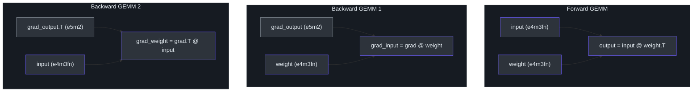
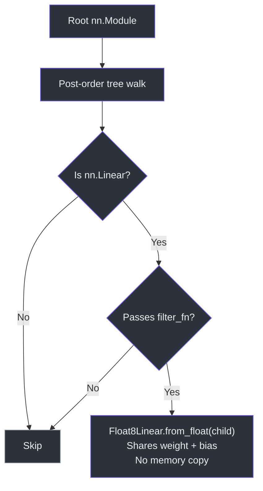

# FP8 Training

> **Source**: [`nanochat/fp8.py`](../../nanochat/fp8.py)

A minimal ~150-line FP8 linear layer that replaces torchao's ~2000-line `Float8Linear`. Uses tensorwise dynamic scaling with `torch._scaled_mm` for cuBLAS FP8 matrix multiplication kernels.

---

## FP8 Data Types

Two FP8 formats are used strategically based on precision vs. range requirements:

| Format | Exponent | Mantissa | Range | Used For |
|--------|----------|----------|-------|----------|
| `float8_e4m3fn` | 4 bits | 3 bits | [-448, 448] | Inputs & weights (higher precision) |
| `float8_e5m2` | 5 bits | 2 bits | [-57344, 57344] | Gradients (wider dynamic range) |

Inputs and weights benefit from the extra mantissa bit in `e4m3fn`, while gradients need the wider range of `e5m2` to avoid overflow during backpropagation.

---

## Quantization Strategy

```mermaid
flowchart LR
    X["Input Tensor<br>(bf16/fp32)"] --> AMAX["amax = abs(x).max()"]
    AMAX --> SCALE["scale = FP8_MAX / amax"]
    SCALE --> QUANT["x_scaled = x * scale"]
    QUANT --> CLAMP["clamp(-FP8_MAX, FP8_MAX)"]
    CLAMP --> CAST["cast to fp8 dtype"]
    CAST --> OUT["(fp8_data, inv_scale)"]

    style X fill:#2d333b,stroke:#6d5dfc,color:#e6edf3
    style AMAX fill:#2d333b,stroke:#6d5dfc,color:#e6edf3
    style SCALE fill:#2d333b,stroke:#6d5dfc,color:#e6edf3
    style QUANT fill:#2d333b,stroke:#6d5dfc,color:#e6edf3
    style CLAMP fill:#2d333b,stroke:#6d5dfc,color:#e6edf3
    style CAST fill:#2d333b,stroke:#6d5dfc,color:#e6edf3
    style OUT fill:#2d333b,stroke:#6d5dfc,color:#e6edf3
```



**Tensorwise dynamic scaling** — one scalar per tensor, computed on-the-fly:

```python
scale = tensor.abs().max() / FP8_MAX
quantized = (tensor / scale).to(fp8_dtype)
```

- Scale computation upcasts to `float64` for consistency between `torch.compile` and eager mode
- Division-by-zero protection with `EPS = 1e-12`

---

## Autograd Function: `_Float8Matmul`

The core is a custom `torch.autograd.Function` decorated with `@torch._dynamo.allow_in_graph`, which tells `torch.compile` to treat it as an opaque operation (no decomposition or tracing into the internals).



### Forward Pass

```
input (bf16) ──► quantize to e4m3 ──┐
                                     ├──► torch._scaled_mm ──► output (bf16)
weight (bf16) ──► quantize to e4m3 ──┘
```

- Uses `use_fast_accum=True` for speed (lower precision accumulation is acceptable in forward)

### Backward Pass

Two separate GEMMs, each with independent re-quantization:

```
grad_output (bf16) ──► quantize to e5m2 ──┐
                                           ├──► _scaled_mm ──► grad_input
saved weight (bf16) ──► quantize to e4m3 ──┘

grad_output (bf16) ──► quantize to e5m2 ──┐
                                           ├──► _scaled_mm ──► grad_weight
saved input  (bf16) ──► quantize to e4m3 ──┘
```

- Uses `use_fast_accum=False` for higher precision gradient computation
- Re-quantizes tensors independently per GEMM (does not reuse forward's FP8 data)

---

## Memory Layout Requirements

`torch._scaled_mm` has strict layout requirements:

| Argument | Required Layout | How Achieved |
|----------|----------------|--------------|
| First (A) | Row-major (contiguous) | Default tensor layout |
| Second (B) | Column-major | `_to_col_major()`: transpose → contiguous → transpose |

The `weight.T` is naturally column-major when `weight` is contiguous, so no extra conversion is needed for the forward pass weight argument.

---

## Public API

### `Float8Linear`

Drop-in replacement for `nn.Linear`:

```python
# Replaces: layer = nn.Linear(in_features, out_features)
layer = Float8Linear(in_features, out_features)
```

Stores weights in bf16 and quantizes to FP8 on-the-fly during each forward pass.

### `convert_to_float8_training(model)`



Post-order traversal that replaces all `nn.Linear` modules with `Float8Linear`:

```python
model = convert_to_float8_training(model, config=Float8LinearConfig())
```

Accepts an optional filter function to skip specific layers (e.g., the final output projection).

### `Float8LinearConfig`

Configuration dataclass. Only the `"tensorwise"` scaling recipe is supported — per-tensor dynamic scaling with no delayed scaling or per-channel variants.

---

## Comparison with torchao

| Aspect | nanochat FP8 | torchao Float8Linear |
|--------|-------------|---------------------|
| Lines of code | ~150 | ~2000 |
| Scaling recipes | Tensorwise only | Tensorwise, delayed, per-channel |
| Compile support | `@allow_in_graph` | Full dynamo tracing |
| Backend | `torch._scaled_mm` | `torch._scaled_mm` |
