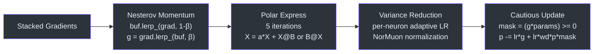
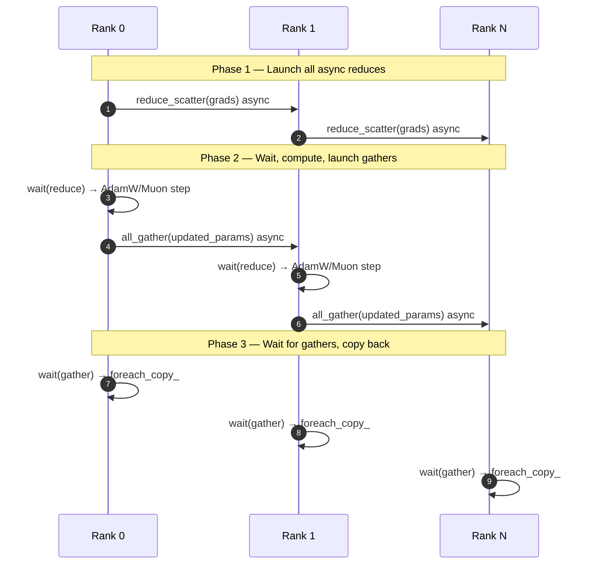
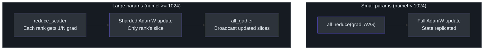

# Optimizer (MuonAdamW)

> **Source**: [`nanochat/optim.py`](../../nanochat/optim.py)

MuonAdamW is a hybrid optimizer that applies **Muon** (momentum + orthogonalization) to 2D matrix parameters and **AdamW** to everything else (embeddings, layer norms, biases, scalars). The distributed variant (`DistMuonAdamW`) adds ZeRO-2 style state sharding and overlapped all-reduce communication.

---

## Parameter Routing

```
All parameters
     │
     ├── 2D matrices (e.g. attention projections, FFN layers)
     │       └── Muon optimizer
     │
     └── Everything else (embeddings, scalars, biases, norms)
             └── AdamW optimizer
```

---

## AdamW

Standard Adam with decoupled weight decay, implemented as a fused `torch.compiled` kernel:

- Momentum (`β₁`) and second moment (`β₂`) with bias correction
- Weight decay applied directly to parameters (not through gradients)
- 0-D CPU tensors for hyperparameters to avoid `torch.compile` recompilation when learning rate or schedule changes

---

## Muon

Muon processes gradients through a four-stage pipeline:



### 1. Momentum

Exponential moving average of gradients, producing a smoothed update direction.

### 2. Polar Express Orthogonalization

An SVD-like orthogonalization step that projects the momentum matrix onto the nearest orthogonal matrix. Uses **Polar Express coefficients** (from [arXiv 2505.16932](https://arxiv.org/abs/2505.16932)) — a quintic polynomial variant of Newton-Schulz iteration that converges in 5 steps:

```
for each iteration (5 total):
    X = a·M + b·M·M^T·M + c·(M·M^T)²·M
```

This replaces the original Newton-Schulz iteration with better-conditioned coefficients for faster convergence.

### 3. NorMuon Variance Reduction

Per-row and per-column adaptive scaling applied after orthogonalization. This reduces variance across different parameter dimensions, stabilizing the update magnitudes.

### 4. Cautious Update

Only applies the update component where the **gradient and update agree in sign**:

```
mask = (gradient * update) >= 0
param -= lr * (mask * update)
```

This prevents destructive sign-flip updates, improving training stability.

---

## Fused Kernels

Both the AdamW and Muon update steps are implemented as `@torch.compile`-d functions, enabling kernel fusion across the entire update computation. Hyperparameters are stored as 0-D CPU tensors to prevent graph breaks when the learning rate schedule changes.

---

## DistMuonAdamW (Distributed)

The distributed variant overlaps communication with computation using a 3-phase async pipeline:



### Phase 1: Launch Communication

```
For each parameter group:
    if large (≥1024 elements):
        launch reduce_scatter (async)     # ZeRO-2: each rank gets a shard
    else:
        launch all_reduce (async)         # small params: replicate
```

### Phase 2: Compute + Launch Gather

```
For each parameter group:
    wait for reduce/all_reduce to complete
    run optimizer step on local shard
    if sharded:
        launch all_gather (async)         # broadcast updated shards
```

### Phase 3: Finish

```
For each parameter group:
    wait for all_gather
    copy gathered result back to parameter
```

### ZeRO-2 Sharding Strategy



| Parameter Type | Size | Communication | State |
|---------------|------|---------------|-------|
| Small params | < 1024 elements | `all_reduce` | Replicated on all ranks |
| Large AdamW params | ≥ 1024 elements | `reduce_scatter` / `all_gather` | Sharded by batch dim |
| Muon params | 2D matrices | `reduce_scatter` / `all_gather` | Stacked K params, chunked across N ranks |

For Muon parameters, multiple weight matrices are **stacked** into a single buffer, then **chunked** across ranks so each rank owns `⌈K/N⌉` parameters. The stacked gradient buffer is reused for `all_gather` output to minimize memory allocation.

---

## Architecture Overview

```
                    ┌─────────────────────────────┐
                    │     DistMuonAdamW            │
                    │                              │
Gradients ─────────►│  Phase 1: async all_reduce / │
                    │           reduce_scatter     │
                    │                              │
                    │  Phase 2: wait → step →      │
                    │           async all_gather   │
                    │                              │
                    │  Phase 3: wait → copy back   │
                    │                              │
                    │  ┌──────────┐ ┌──────────┐   │
                    │  │  AdamW   │ │   Muon   │   │
                    │  │(1D/embed)│ │  (2D)    │   │
                    │  └──────────┘ └──────────┘   │
                    └─────────────────────────────┘
```
