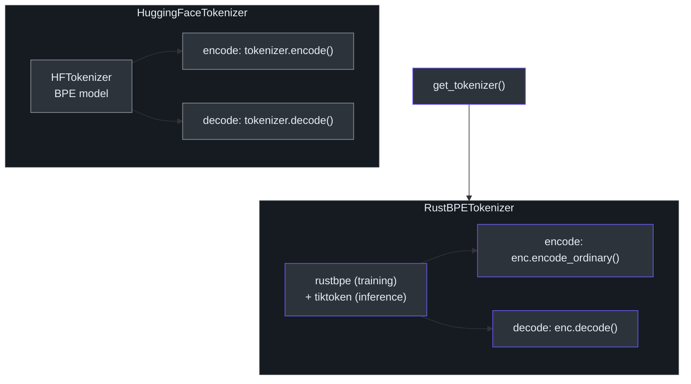
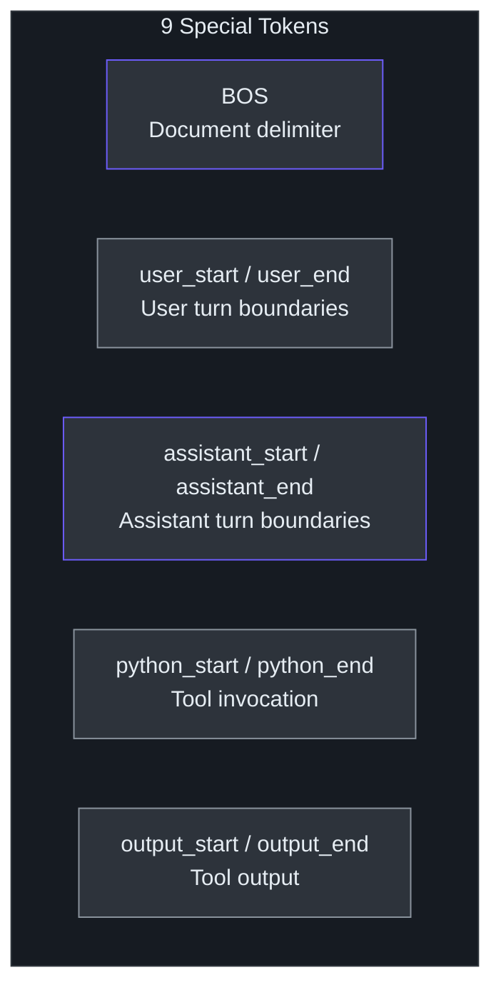

# Tokenizer

> **Source**: [`nanochat/tokenizer.py`](../../nanochat/tokenizer.py)

The tokenizer module provides two BPE tokenizer implementations and conversation rendering utilities that turn multi-turn chat conversations into token sequences with supervision masks for training.

---

## Implementations



### HuggingFaceTokenizer

A thin wrapper around a HuggingFace tokenizer that loads from a directory containing `tokenizer.json`. Used when a pre-trained HF tokenizer is available.

### RustBPETokenizer

A lightweight dual-backend tokenizer:

- **Training**: uses `rustbpe` — a fast Rust-based BPE encoder
- **Inference**: uses `tiktoken` — OpenAI's production tokenizer

Both backends share the same merge file and vocabulary, ensuring identical tokenization across training and serving.

---

## Split Pattern

The tokenizer uses a GPT-4 style regex split pattern with one deliberate modification:

```
\p{N}{1,2}   (nanochat)
\p{N}{1,3}   (GPT-4 original)
```

Limiting numeric runs to **2 digits** instead of 3 produces a smaller vocabulary while preserving tokenization quality. The full pattern handles contractions, letter sequences, punctuation clusters, and whitespace.

---

## Special Tokens

Nine special tokens define the conversation structure:



| Token | Purpose |
|-------|---------|
| `<\|bos\|>` | Beginning of sequence / document delimiter |
| `<\|user_start\|>` | Start of user message |
| `<\|user_end\|>` | End of user message |
| `<\|assistant_start\|>` | Start of assistant message |
| `<\|assistant_end\|>` | End of assistant message |
| `<\|python_start\|>` | Start of tool/code invocation |
| `<\|python_end\|>` | End of tool/code invocation |
| `<\|output_start\|>` | Start of tool output |
| `<\|output_end\|>` | End of tool output |

---

## Conversation Rendering

### `render_conversation(conversation)`

```mermaid
flowchart LR
    BOS["BOS"] --> US["user_start"]
    US --> UT["user text<br>mask=0"]
    UT --> UE["user_end"]
    UE --> AS["assistant_start"]
    AS --> AT["assistant text<br>mask=1"]
    AT --> PS["python_start<br>mask=1"]
    PS --> PE["python expr<br>mask=1"]
    PE --> PEnd["python_end<br>mask=1"]
    PEnd --> OS["output_start<br>mask=0"]
    OS --> OT["output text<br>mask=0"]
    OT --> OE["output_end<br>mask=0"]
    OE --> MORE["more text<br>mask=1"]
    MORE --> AE["assistant_end<br>mask=1"]

    style BOS fill:#2d333b,stroke:#6d5dfc,color:#e6edf3
    style US fill:#2d333b,stroke:#8b949e,color:#e6edf3
    style UT fill:#2d333b,stroke:#8b949e,color:#e6edf3
    style UE fill:#2d333b,stroke:#8b949e,color:#e6edf3
    style AS fill:#2d333b,stroke:#6d5dfc,color:#e6edf3
    style AT fill:#2d333b,stroke:#6d5dfc,color:#e6edf3
    style PS fill:#2d333b,stroke:#6d5dfc,color:#e6edf3
    style PE fill:#2d333b,stroke:#6d5dfc,color:#e6edf3
    style PEnd fill:#2d333b,stroke:#6d5dfc,color:#e6edf3
    style OS fill:#2d333b,stroke:#8b949e,color:#e6edf3
    style OT fill:#2d333b,stroke:#8b949e,color:#e6edf3
    style OE fill:#2d333b,stroke:#8b949e,color:#e6edf3
    style MORE fill:#2d333b,stroke:#6d5dfc,color:#e6edf3
    style AE fill:#2d333b,stroke:#6d5dfc,color:#e6edf3
```



Tokenizes a full multi-turn chat conversation for **supervised fine-tuning**:

1. Encodes each message (user, assistant, tool calls, tool outputs) with the appropriate start/end special tokens
2. Produces a **mask** array aligned with the token sequence:
   - `mask = 1` for **assistant** tokens (supervised — the model learns to predict these)
   - `mask = 0` for all other tokens (user messages, tool output, special tokens)

This enables standard cross-entropy loss to be applied only to assistant-generated content.

### `render_for_completion(conversation)`

Prepares a conversation for **reinforcement learning** or interactive completion:

1. Strips the final assistant message from the conversation
2. Tokenizes all preceding turns
3. Appends the `<|assistant_start|>` token

The model then generates a completion from this primed context. This is the format used during RL rollouts and interactive inference.

---

## Architecture Diagram

```
Conversation (list of messages)
        │
        ├── render_conversation()
        │       │
        │       ▼
        │   tokens[]  +  mask[]     → SFT training
        │   (full conversation)       (loss on assistant tokens only)
        │
        └── render_for_completion()
                │
                ▼
            tokens[]                → RL / Inference
            (up to assistant_start)   (model generates completion)
```
