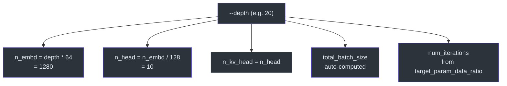
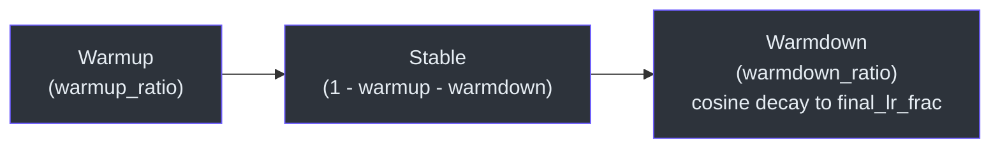
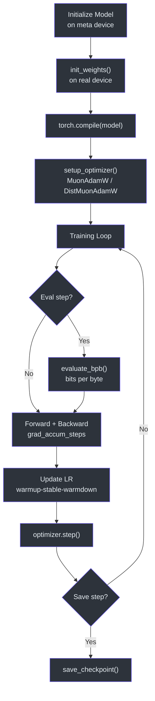

# Pretraining

The base model is pretrained from scratch on a large text corpus using `scripts/base_train.py`. This script handles everything from model initialization through training to checkpointing, and is designed to scale from a single CPU/MPS device up to multi-GPU distributed training via `torchrun`.

## Dataset

Pretraining uses the **FineWeb-Edu** dataset (parquet files streamed from HuggingFace). Data shards are downloaded incrementally — an initial 8 shards (~2B characters) are used for tokenizer training, then ~370 shards (~10B tokens) are fetched in the background for pretraining. See `runs/speedrun.sh` for the full orchestration.

## Running

```bash
# Single GPU
python -m scripts.base_train

# Distributed (8 GPUs)
torchrun --nproc_per_node=8 -m scripts.base_train

# CPU/Macbook (tiny model for testing)
python -m scripts.base_train --depth=4 --max-seq-len=512 --device-batch-size=1 \
    --eval-tokens=512 --core-metric-every=-1 --total-batch-size=512 --num-iterations=20
```

## Key CLI Arguments

| Argument | Default | Description |
|---|---|---|
| `--depth` | 20 | **The ONE dial** — depth of the Transformer. Auto-configures most other hyperparameters. |
| `--aspect-ratio` | 64 | `n_embd = depth × aspect_ratio` (nudged up to nearest multiple of `head_dim`) |
| `--head-dim` | 128 | Target head dimension; `n_head = n_embd / head_dim` |
| `--fp8` | off | Enable FP8 training (requires H100+ GPU and `torchao`) |
| `--fp8-recipe` | `tensorwise` | FP8 scaling recipe: `tensorwise` (faster) or `rowwise` (more accurate) |
| `--device-batch-size` | 32 | Per-device batch size (reduce to 16/8/4 if OOM) |
| `--total-batch-size` | auto | Total batch size in tokens. Auto-computed via Power Lines scaling law (`B_opt ∝ D^0.383`) |
| `--target-param-data-ratio` | 10.5 | Tokens:params ratio used to derive the training horizon (Chinchilla optimal ≈ 20) |
| `--window-pattern` | `SSSL` | Sliding window attention pattern tiled across layers (L=full context, S=half context) |
| `--warmdown-ratio` | 0.5 | Fraction of training for linear LR decay at the end |

## How `--depth` Auto-Configures Everything

The `--depth` flag is the single knob that controls model scale. From it, the script derives:



1. **Model dimensions**: `n_embd = depth × aspect_ratio`, `n_head = n_embd / head_dim`, `n_kv_head = n_head`
2. **Training horizon**: `target_tokens = target_param_data_ratio × scaling_params` (transformer matrices + lm_head)
3. **Optimal batch size**: via Power Lines scaling (`B_opt ∝ D^0.383`), relative to the d12 reference model (`B_ref = 2^19 ≈ 524K tokens`)
4. **Learning rates**: scaled by `√(B / B_ref)` following AdamW sqrt scaling
5. **Weight decay**: scaled by `√(B / B_ref) × (D_ref / D)` to maintain constant `T_epoch`

## Optimizer: MuonAdamW

The optimizer splits parameters into groups:

- **Muon** for transformer matrix parameters (`matrix_lr=0.02`)
- **AdamW** for embeddings (`embedding_lr=0.3`), unembeddings (`unembedding_lr=0.004`), and scalars (`scalar_lr=0.5`)

All learning rates are scaled by the batch size correction factor.

## Learning Rate Schedule



```
warmup → constant → linear warmdown
```

- **Warmup**: linear ramp over `warmup_ratio` fraction of training (default 0%)
- **Constant**: full learning rate
- **Warmdown**: linear decay over `warmdown_ratio` fraction of training (default 50%) to `final_lr_frac` (default 0)

## Momentum & Weight Decay Schedules

- **Muon momentum warmup**: linearly interpolates from 0.85 → 0.95 over the first 300 steps
- **Weight decay decay**: linearly decays to zero over the full training run: `λ(t) = λ_scaled × (1 - t/T)`

## Training Loop



The core loop uses:

- **Gradient accumulation** across micro-batches to reach the target `total_batch_size`
- **Autocast bfloat16** (or FP8 on H100+) for forward/backward passes
- **`torch.compile`** with `dynamic=False` for fused kernels
- **BOS-aligned bestfit packing** in the dataloader for efficient sequence packing
- **Manual GC management**: garbage collector is frozen after the first step and disabled, with periodic manual collections every 5000 steps

```python
# Simplified training step
for micro_step in range(grad_accum_steps):
    with autocast_ctx:
        loss = model(x, y)
    loss = loss / grad_accum_steps
    loss.backward()
    x, y, dataloader_state_dict = next(train_loader)  # prefetch

# Update LR, momentum, weight decay schedules
optimizer.step()
model.zero_grad(set_to_none=True)
```

## Evaluation During Training

| Metric | Default frequency | Description |
|---|---|---|
| **val_bpb** | every 250 steps | Bits-per-byte on validation split (FP8 disabled for accuracy) |
| **CORE metric** | every 2000 steps | Multi-task aggregate via `scripts/base_eval.evaluate_core` |
| **Samples** | every 2000 steps | Greedy completions from fixed prompts (master process only) |

## Logging

Metrics are logged to **Weights & Biases** (project: `nanochat`). Key logged values:

- `val/bpb`, `core_metric`, `centered_results`
- `train/loss`, `train/lrm`, `train/dt`, `train/tok_per_sec`, `train/mfu`, `train/epoch`
- `total_training_flops`, `total_training_time`

Set `--run=dummy` (default) to disable wandb logging.

## Checkpointing & Resume

Checkpoints are saved to `$NANOCHAT_BASE_DIR/base_checkpoints/d{depth}/` and include:

- Model state dict
- Optimizer state dict
- Metadata: step, val_bpb, model config, user config, dataloader state, loop state

Training can be resumed with `--resume-from-step=<step>`, which restores all state including the dataloader position and EMA statistics.

A markdown report section is written at the end via `nanochat.report`.

## Source Files

- [`scripts/base_train.py`](../../scripts/base_train.py) — Main pretraining script
- [`runs/speedrun.sh`](../../runs/speedrun.sh) — End-to-end orchestration (tokenizer → pretrain → SFT → eval)
