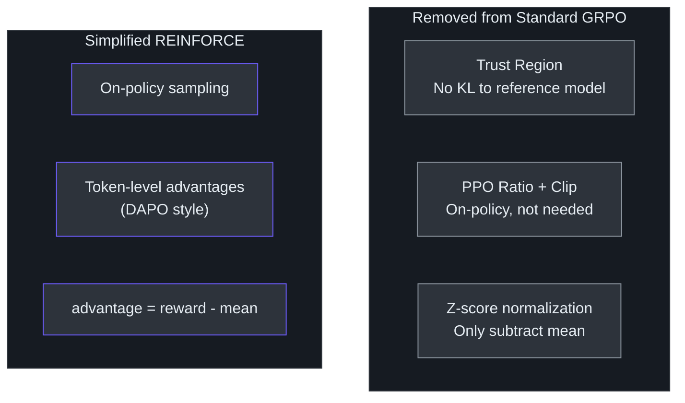
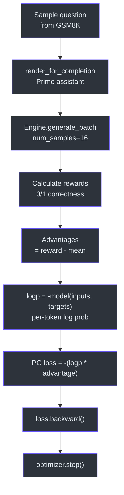
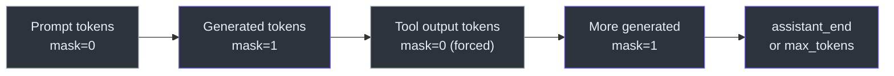

# Reinforcement Learning (GRPO)

After SFT, `scripts/chat_rl.py` applies reinforcement learning on **GSM8K** to improve the model's mathematical reasoning. The algorithm is a heavily simplified variant of GRPO that reduces to something close to REINFORCE.

## Running

```bash
# Single GPU
python -m scripts.chat_rl

# Distributed (8 GPUs)
torchrun --standalone --nproc_per_node=8 -m scripts.chat_rl -- --run=default
```

## Simplifications from GRPO

The implementation strips GRPO down to four key simplifications:

1. **No trust region** — no KL regularization to a reference model
2. **No PPO ratio/clip** — the model is always on-policy, so importance sampling is unnecessary
3. **DAPO-style token-level normalization** — loss is normalized per valid token, not per sequence
4. **`(r - μ)` advantage** — uses mean-subtracted rewards instead of full z-score normalization `(r - μ) / σ`



## Rollout Loop

Each training step generates rollouts for a batch of GSM8K problems:



```
conversation → render_for_completion → Engine.generate_batch → reward → advantage
```

1. **Render**: `tokenizer.render_for_completion(conversation)` tokenizes the problem, removing the ground-truth answer and priming `<|assistant_start|>`
2. **Generate**: `Engine.generate_batch` produces `num_samples` (default 16) completions per problem, handling tool use (calculator) automatically
3. **Reward**: `train_task.reward(conversation, generated_text)` scores each completion (binary: correct/incorrect)
4. **Advantage**: `advantages = rewards - rewards.mean()` (per-problem mean subtraction)

## Tool Use During Generation

The `Engine` supports tool use during rollout generation. The model can invoke a calculator by emitting `python_start` / `python_end` special tokens. The engine intercepts these, executes the calculation, and injects the result back into the sequence. Importantly, **tool-use forced tokens are masked out** (mask=0) so the model is not trained on them — only its own generated tokens contribute to the loss.



## Policy Gradient Objective

```python
# Log probabilities (model returns NLL, so negate)
logp = -model(inputs, targets, loss_reduction='none')  # (B, T)

# PG objective: weight log-probs by advantages
pg_obj = (logp * advantages.unsqueeze(-1)).sum()

# Normalize by valid tokens, passes, and examples
pg_obj = pg_obj / (num_valid * num_passes * examples_per_rank)

# Minimize negative objective
loss = -pg_obj
loss.backward()
```

## Optimizer & Schedule

Same **MuonAdamW** optimizer as pretraining/SFT with slightly different defaults:

| Parameter group | Learning rate | Optimizer |
|---|---|---|
| Embedding | 0.2 | AdamW |
| Unembedding | 0.004 | AdamW |
| Matrix (transformer) | 0.02 | Muon |

- **Initial LR fraction**: `--init-lr-frac=0.05` (starts at 5% of base LR)
- **LR schedule**: linear rampdown to zero over the full training run: `lrm = 1.0 - step / num_steps`
- **Weight decay**: 0.0

## Evaluation: Pass@k on GSM8K

Every `--eval-every` steps (default 60), the model is evaluated on the GSM8K test set:

- Generates `k` samples per problem (where `k = device_batch_size`)
- Computes **Pass@k** for k=1 through k=device_batch_size
- Results are aggregated across ranks in distributed training via `dist.all_reduce`
- Logged to wandb as `pass@1`, `pass@2`, ..., `pass@k`

## Key CLI Arguments

| Argument | Default | Description |
|---|---|---|
| `--model-tag` | None | SFT model tag to load |
| `--model-step` | None | SFT model step to load |
| `--num-epochs` | 1 | Epochs over GSM8K training set |
| `--examples-per-step` | 16 | Total problems per optimization step (across all ranks) |
| `--num-samples` | 16 | Completions generated per problem |
| `--max-new-tokens` | 256 | Max tokens per generated completion |
| `--temperature` | 1.0 | Sampling temperature for rollouts |
| `--top-k` | 50 | Top-k sampling (0 = disabled) |
| `--device-batch-size` | 8 | Max batch size per forward pass |
| `--eval-every` | 60 | Evaluate pass@k every N steps |
| `--eval-examples` | 400 | Number of test problems for evaluation |
| `--save-every` | 60 | Save checkpoint every N steps |

## Checkpointing

Checkpoints are saved to `$NANOCHAT_BASE_DIR/chatrl_checkpoints/d{depth}/` every `--save-every` steps and at the final step. Note: **optimizer state is not saved** for RL checkpoints (only model weights and config).

## Source Files

- [`scripts/chat_rl.py`](../../scripts/chat_rl.py) — RL training script
- [`tasks/gsm8k.py`](../../tasks/gsm8k.py) — GSM8K task with reward function
- [`nanochat/engine.py`](../../nanochat/engine.py) — Generation engine with tool-use support
