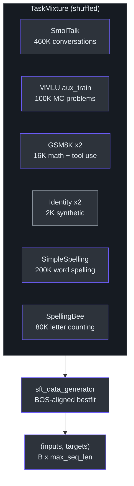
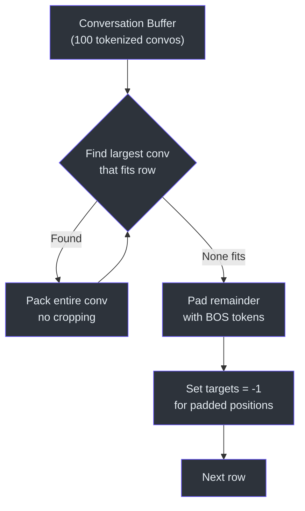
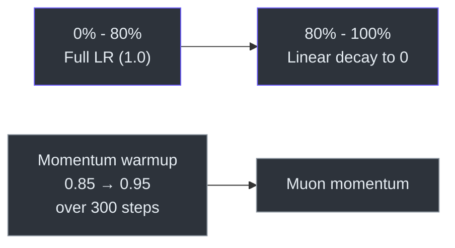

# Supervised Fine-Tuning (SFT)

After pretraining, `scripts/chat_sft.py` teaches the model conversation format, tool use, identity, and structured knowledge through supervised fine-tuning on a curated data mixture.

## Running

```bash
# Single GPU
python -m scripts.chat_sft

# Distributed (8 GPUs)
torchrun --standalone --nproc_per_node=8 -m scripts.chat_sft -- --device-batch-size=16
```

## Data Mixture

SFT uses a `TaskMixture` with deterministic shuffle across these datasets:

| Dataset | Source | Rows | Notes |
|---|---|---|---|
| **SmolTalk** | `tasks/smoltalk.py` | 460K | General conversations |
| **MMLU auxiliary_train** | `tasks/mmlu.py` | 100K | Multiple choice (ARC, MC_TEST, OBQA, RACE) |
| **GSM8K** (×2 epochs) | `tasks/gsm8k.py` | 16K | Math problems with calculator tool use |
| **Identity conversations** (×2 epochs) | `identity_conversations.jsonl` | ~2K | Synthetic personality/identity data |
| **SimpleSpelling** | `tasks/spellingbee.py` | 200K | "Spell the word 'apple'" style |
| **SpellingBee** | `tasks/spellingbee.py` | 80K | "How many 'r' in 'strawberry'?" style |
| **Total** | | **~856K** | |

The validation set mirrors the training ratios: SmolTalk test (24K) + MMLU test (5.2K) + GSM8K test (420).



## BOS-Aligned Bestfit Packing

SFT uses a custom packing strategy (`sft_data_generator_bos_bestfit`) that differs from naive truncation:

1. Each row in the batch starts with **BOS** (beginning of a conversation)
2. Conversations are packed using a **best-fit** algorithm — the largest conversation that fits the remaining space is selected from a buffer
3. When no conversation fits, the row is **padded** (not cropped) to ensure no tokens are ever discarded
4. Padding positions have targets masked with **-1** (`ignore_index` for cross-entropy loss)

This ensures every training token is seen exactly once per epoch with zero waste.



## Optimizer

Same **MuonAdamW** setup as pretraining:

| Parameter group | Learning rate | Optimizer |
|---|---|---|
| Embedding | 0.3 | AdamW |
| Unembedding | 0.004 | AdamW |
| Matrix (transformer) | 0.02 | Muon |

Weight decay is set to 0.0 (no regularization during SFT).

## Learning Rate Schedule

```
constant (80%) → linear decay to 0 (20%)
```

```python
def get_lr_multiplier(progress):
    return 1 if progress < 0.8 else 1 - (progress - 0.8) / 0.2
```

An optional `--init-lr-frac` (default 1.0) scales the initial learning rate as a fraction of the base rate.



## Momentum Schedule

Muon momentum warms up from **0.85 → 0.95** over the first 300 steps, identical to pretraining:

```python
def get_muon_momentum(it):
    frac = min(it / 300, 1)
    return (1 - frac) * 0.85 + frac * 0.95
```

## Training Details

- **Batch size**: 524,288 tokens total (default), with gradient accumulation
- **Max sequence length**: 2048 tokens
- **Precision**: bfloat16 autocast
- **Compilation**: `torch.compile(model, dynamic=False)`
- **Training horizon**: one full epoch over the mixture by default, or explicit `--num-iterations`
- **Progress tracking**: based on consumed conversations (not cursor position), ensuring accurate progress even with buffered packing

## Evaluation & Logging

- **val_bpb** evaluated every 150 steps (default) on the validation mixture
- Logged to **wandb** (project: `nanochat-sft`): `val/bpb`, `train/loss`, `train/lrm`, `train/dt`, `train/tok_per_sec`, `train/mfu`, `train/epoch`
- Checkpoint saved at end of training to `$NANOCHAT_BASE_DIR/chatsft_checkpoints/d{depth}/`
- Report section logged via `nanochat.report`

## Key CLI Arguments

| Argument | Default | Description |
|---|---|---|
| `--model-tag` | None | Base model tag to load from |
| `--model-step` | None | Base model step to load from |
| `--num-iterations` | -1 | Training steps (-1 = full epoch) |
| `--max-seq-len` | 2048 | Maximum context length |
| `--device-batch-size` | 32 | Per-device batch size |
| `--total-batch-size` | 524288 | Total batch size in tokens |
| `--eval-every` | 150 | Evaluate val BPB every N steps |
| `--dry-run` | off | Log to wandb but skip checkpoints/report |

## Source Files

- [`scripts/chat_sft.py`](../../scripts/chat_sft.py) — SFT training script
- [`tasks/smoltalk.py`](../../tasks/smoltalk.py), [`tasks/mmlu.py`](../../tasks/mmlu.py), [`tasks/gsm8k.py`](../../tasks/gsm8k.py), [`tasks/spellingbee.py`](../../tasks/spellingbee.py), [`tasks/customjson.py`](../../tasks/customjson.py) — Data task implementations
