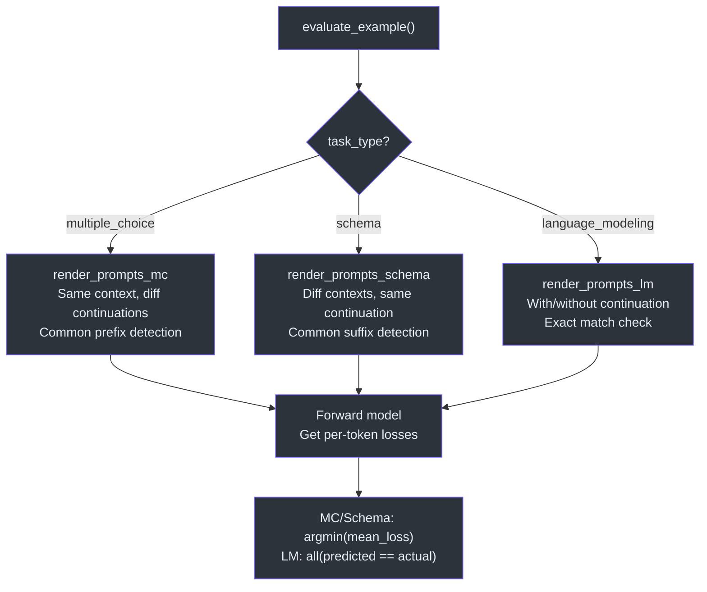
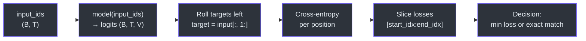
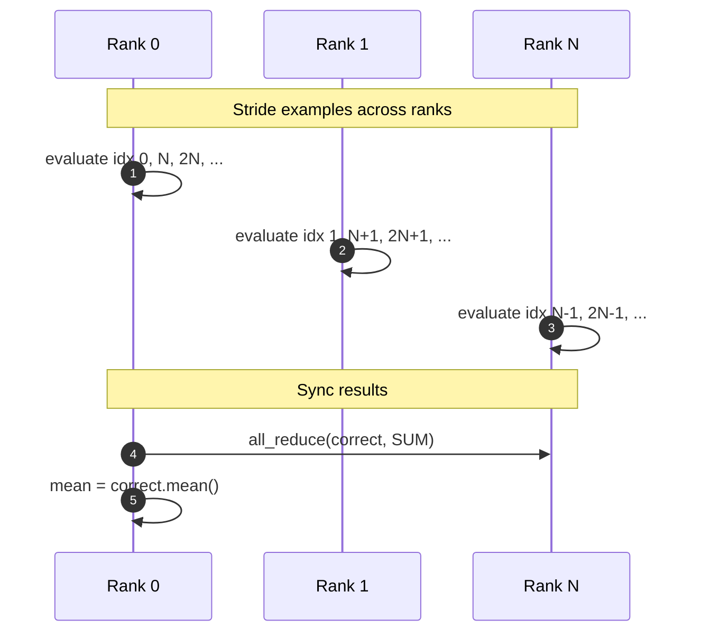

# CORE Metric

The CORE (Comprehensive Open-source Robustness Evaluation) metric is nanochat's implementation of the evaluation protocol from the [DCLM paper](https://arxiv.org/abs/2406.11794). It measures a base model's language understanding across multiple task types using autoregressive loss scoring.

> **Source:** [`nanochat/core_eval.py`](../../nanochat/core_eval.py)

---

## Task Types

CORE supports three evaluation task types, each with its own prompt rendering and sequence batching strategy:

| Task Type | Prompt Renderer | Batching Strategy | Selection Criterion |
|---|---|---|---|
| `multiple_choice` | `render_prompts_mc` | Common prefix (choices differ) | Lowest mean loss across choices |
| `schema` | `render_prompts_schema` | Common suffix (contexts differ) | Lowest mean loss across contexts |
| `language_modeling` | `render_prompts_lm` | Single sequence (batch=1) | Exact token match of continuation |



---

## Prompt Rendering

All prompts are rendered using **Jinja2 templates** that support few-shot examples. Each task type has a dedicated rendering function:

### Multiple Choice

Few-shot examples are prepended, followed by the query and each candidate choice:

```
{fewshot_query}{delimiter}{gold_answer}
...
{query}{delimiter}{choice}
```

One prompt is generated per choice — they share a common prefix up to the point where choices diverge.

### Schema

Context options vary while the continuation stays fixed:

```
{fewshot_context}{delimiter}{continuation}
...
{context_option}{delimiter}{continuation}
```

One prompt per context option — they share a common suffix (the continuation).

### Language Modeling

Two prompts are generated: one **without** and one **with** the continuation appended. The "without" prompt is stripped to avoid tokenizer whitespace mismatches:

```python
prompt_without = prompt_without.strip()
```

This is critical because tokenizers assign different IDs to `" A"` vs `"A"`, and trailing whitespace in the prefix can corrupt the token-level prefix detection.

---

## Batch Sequence Construction

The `find_common_length` function detects shared token prefixes or suffixes across prompt variants:

```python
def find_common_length(token_sequences, direction='left'):
    # direction='left' → common prefix length
    # direction='right' → common suffix length
```

This determines the **evaluation window** — the token range where losses are computed:

- **Multiple choice:** `start = common_prefix_length`, `end = len(tokens)` per choice
- **Schema:** `end = len(tokens)`, `start = end - common_suffix_length` per context
- **Language modeling:** `start = len(without_tokens)`, `end = len(with_tokens)`

Sequences are padded to equal length using `stack_sequences` (with BOS as the pad token).

---

## Forward Model

The `forward_model` function computes autoregressive cross-entropy loss at every position:



```python
target_ids = torch.roll(input_ids, shifts=-1, dims=1)
losses = F.cross_entropy(outputs, target_ids, reduction='none')
losses[:, -1] = float('nan')  # no target for last position
```

It returns both per-position losses and argmax predictions (`outputs.argmax(dim=-1)`).

### Scoring

- **MC / Schema:** The option with the **lowest average loss** in its evaluation window wins:
  ```python
  mean_losses = [losses[i, si-1:ei-1].mean() for i, (si, ei) in ...]
  pred_idx = mean_losses.index(min(mean_losses))
  is_correct = pred_idx == item['gold']
  ```
- **Language Modeling:** The prediction is correct if the model's argmax tokens **exactly match** the continuation tokens.

### Sequence Truncation

If the model has a `max_seq_len` attribute (e.g., GPT-2's 1024), sequences are truncated from the left (keeping the most recent tokens), and evaluation indices are shifted accordingly.

---

## Distributed Evaluation

`evaluate_task` handles multi-GPU evaluation by striding examples across ranks:



```python
for idx in range(rank, len(data), world_size):
    is_correct = evaluate_example(idx, ...)
    correct[idx] = float(is_correct)

if world_size > 1:
    dist.barrier()
    dist.all_reduce(correct, op=dist.ReduceOp.SUM)
```

Each rank evaluates every `world_size`-th example, then results are summed via `all_reduce` to compute the final accuracy.

---

## Few-Shot Sampling

Few-shot examples are sampled **deterministically** using `random.Random(1234 + idx)`, ensuring reproducibility. The current item is excluded from the candidate pool:

```python
available_indices = [i for i in range(len(data)) if i != idx]
fewshot_indices = rng.sample(available_indices, num_fewshot)
```
