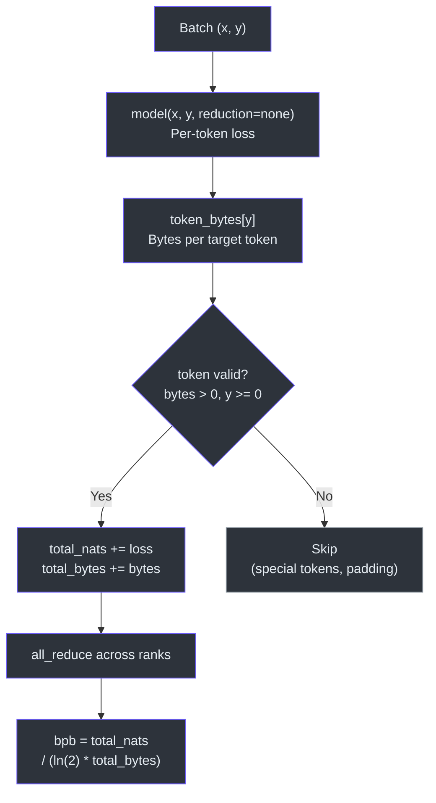
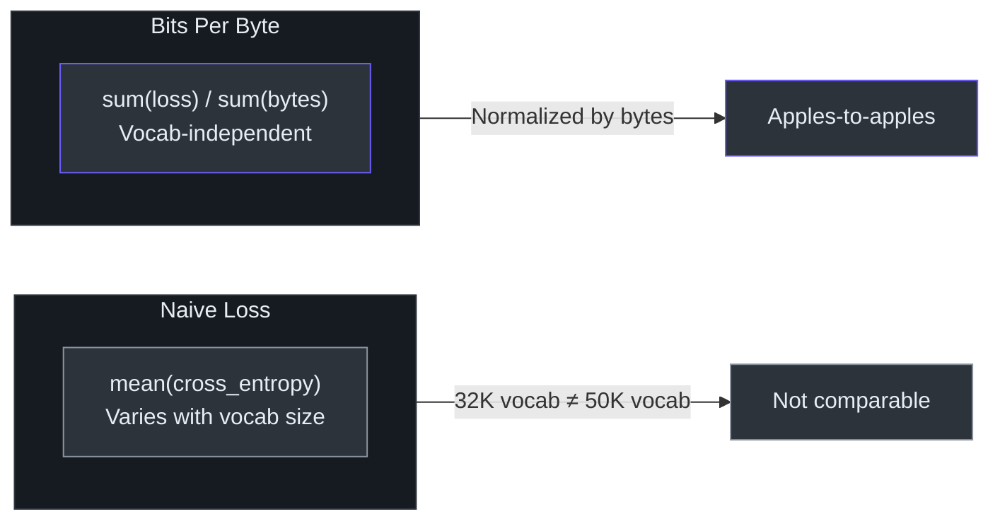

# Loss Evaluation (BPB)

Bits per byte (BPB) is a **tokenization-invariant** metric for evaluating language models. Unlike standard cross-entropy loss (which depends on vocabulary size and tokenization granularity), BPB normalizes by the number of raw bytes in the target text, making it possible to fairly compare models with different tokenizers.

> **Source:** [`nanochat/loss_eval.py`](../../nanochat/loss_eval.py)

---

## Formula

```
BPB = total_nats / (ln(2) × total_bytes)
```

Where:
- **total_nats** — sum of per-token cross-entropy losses (in nats, i.e., natural log units)
- **total_bytes** — sum of byte lengths of all target tokens
- **ln(2)** — converts nats to bits

If `total_bytes == 0`, the function returns `float('inf')`.

---

## The `token_bytes` Tensor

`evaluate_bpb` requires a pre-computed `token_bytes` tensor of shape `(vocab_size,)`:

| Token Type | `token_bytes` Value | Effect |
|---|---|---|
| Normal token (e.g., `"hello"`) | `5` (byte length) | Counted in both nats and bytes |
| Special token (e.g., `<\|bos\|>`) | `0` | Excluded from both nats and bytes |

This ensures special tokens don't distort the metric. The loss for a token with `token_bytes == 0` is multiplied by zero, effectively masking it out.

---

## Handling Masked Tokens

Some training setups use `ignore_index=-1` to mask certain target positions (e.g., prompt tokens during SFT). The function handles this with two code paths:

### Fast Path (no masked tokens)

```python
num_bytes2d = token_bytes[y]
total_nats += (loss2d * (num_bytes2d > 0)).sum()
total_bytes += num_bytes2d.sum()
```

### Safe Path (masked tokens present)

When any target token ID is negative:

```python
valid = y >= 0
y_safe = torch.where(valid, y, torch.zeros_like(y))
num_bytes2d = torch.where(valid, token_bytes[y_safe], torch.zeros_like(...))
```

This avoids indexing `token_bytes` with negative values (which would cause out-of-bounds errors). The validity check uses `y.int() < 0` because MPS does not support the `< 0` kernel for `int64`.

---

## Evaluation Loop



The function iterates over a fixed number of batches:

```python
for _ in range(steps):
    x, y = next(batch_iter)
    loss2d = model(x, y, loss_reduction='none')  # (B, T) per-token losses
    # accumulate total_nats and total_bytes
```

Key details:
- The model is called with `loss_reduction='none'` to get per-token losses instead of a scalar mean
- Both `loss2d` and `y` are flattened before processing

---

## Distributed Evaluation

When running with `torchrun`, partial sums are aggregated across all ranks:

```python
if world_size > 1:
    dist.all_reduce(total_nats, op=dist.ReduceOp.SUM)
    dist.all_reduce(total_bytes, op=dist.ReduceOp.SUM)
```

Each rank processes its own batches independently, then `total_nats` and `total_bytes` are summed before computing the final BPB. This ensures the metric is identical regardless of the number of GPUs.

---

## Why BPB Over Cross-Entropy?



| Metric | Depends on Vocab Size | Depends on Tokenizer | Comparable Across Models |
|---|---|---|---|
| Cross-entropy (nats/token) | ✅ Yes | ✅ Yes | ❌ No |
| Perplexity | ✅ Yes | ✅ Yes | ❌ No |
| **Bits per byte** | ❌ No | ❌ No | ✅ Yes |

A model with a larger vocabulary has shorter sequences (fewer tokens per text), so its per-token loss appears lower even if it isn't actually better. BPB eliminates this confound by normalizing to the fixed, universal unit of bytes.
