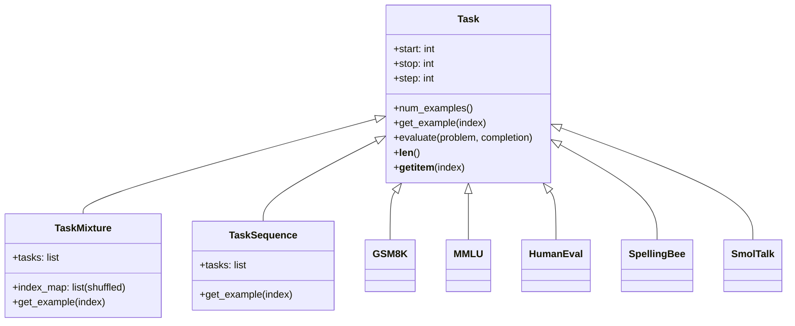
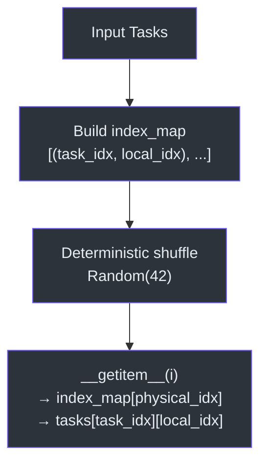

# Task Framework

The task framework provides a unified interface for datasets used in SFT training, RL reward computation, and evaluation. Every task produces **conversations** (lists of messages with roles) and optionally defines evaluation/reward functions.

> **Source:** [`tasks/common.py`](../../tasks/common.py), [`tasks/gsm8k.py`](../../tasks/gsm8k.py), [`tasks/spellingbee.py`](../../tasks/spellingbee.py), [`tasks/mmlu.py`](../../tasks/mmlu.py), [`tasks/arc.py`](../../tasks/arc.py), [`tasks/humaneval.py`](../../tasks/humaneval.py), [`tasks/smoltalk.py`](../../tasks/smoltalk.py)

---

## Base `Task` Class



All tasks inherit from `Task`, which provides lightweight logical slicing over a dataset:

```python
class Task:
    def __init__(self, start=0, stop=None, step=1):
        self.start = start
        self.stop = stop
        self.step = step
```

### Key Methods

| Method | Description |
|---|---|
| `num_examples()` | Total size of the underlying dataset |
| `get_example(index)` | Returns a conversation dict at the physical index |
| `__len__()` | Number of examples visible through the slice window |
| `__getitem__(index)` | Maps logical index → physical index via `start + index * step` |
| `evaluate(conversation, response)` | Returns 0 or 1 for correctness |
| `reward(conversation, response)` | Returns a float reward for RL |

### `eval_type` Property

Each task declares its evaluation type:
- **`'generative'`** — model generates free-form text, answer is extracted and compared
- **`'categorical'`** — model selects from fixed options (not currently used in built-in tasks, but supported by the interface)

---

## Task Composition

### `TaskMixture`

Combines multiple tasks into a single shuffled dataset for SFT training:

```python
mixture = TaskMixture([gsm8k_task, mmlu_task, spelling_task])
```



- Builds an `index_map` of all `(task_idx, local_idx)` pairs
- **Deterministically shuffles** with `random.Random(42)` so tasks are interleaved throughout training
- Oversampling trick: pass the same task multiple times to increase its weight

### `TaskSequence`

Concatenates tasks sequentially for curriculum training:

```python
sequence = TaskSequence([easy_task, hard_task])
```

Examples are served in order — all of `easy_task` first, then all of `hard_task`. Useful when training should progress through stages.

---

## Built-in Tasks

### GSM8K (Grade School Math)

- **Dataset:** `openai/gsm8k` from HuggingFace
- **Eval type:** `generative`
- **Format:** Math word problems with step-by-step solutions
- **Tool calls:** Solutions contain `<<expression=result>>` calculator annotations, parsed into `{"type": "python", "text": expr}` parts
- **Answer extraction:** `#### marker` regex — `re.compile(r"#### (\-?[0-9\.\,]+)")`
- **Reward:** Binary 0/1 based on exact match of extracted numerical answer

### SpellingBee (Letter Counting)

- **Dataset:** Procedurally generated from a 370K English word list
- **Eval type:** `generative`
- **Format:** "How many {letter} are in {word}?" with 50+ multilingual user message templates
- **Solution strategy:** Manual letter-by-letter counting + Python `.count()` verification
- **Tool calls:** Uses `python` and `python_output` parts for the verification step
- **Data augmentation:** Random quoting, casing, question marks, template selection
- **Train/test split:** Different random seeds (`TEST_RANDOM_SEED_OFFSET = 10_000_000`)

### SimpleSpelling

- **Dataset:** Same word list as SpellingBee, differently shuffled
- **Format:** "Spell the word: {word}" → "{word}:l,e,t,t,e,r,s"
- **Purpose:** Teaches token-to-character mapping, a prerequisite for letter counting

### MMLU (Massive Multitask Language Understanding)

- **Eval type:** `categorical`
- **Format:** Multiple choice questions across 57 academic subjects
- **Uses** `render_mc` helper for formatting

### ARC (AI2 Reasoning Challenge)

- **Subsets:** Easy and Challenge
- **Eval type:** `categorical`
- **Format:** Science multiple choice questions

### HumanEval (Code Generation)

- **Eval type:** `generative`
- **Format:** Python function completion problems
- **Evaluation:** Runs generated code in the sandboxed `execution.py` environment

### SmolTalk (Conversations)

- **Dataset:** Conversational data for general chat ability
- **Purpose:** Maintains general instruction-following during SFT

---

## Multiple Choice Rendering

The `render_mc` helper formats multiple choice questions with two critical design decisions:

```python
def render_mc(question, letters, choices):
    query = f"Multiple Choice question: {question}\n"
    query += "".join([f"- {choice}={letter}\n" for letter, choice in zip(letters, choices)])
    query += "\nRespond only with the letter of the correct answer."
```

1. **Letter after choice** (`- choice=A`) — smaller models bind better when the label follows the content
2. **No whitespace before letter** — the tokenizer produces different IDs for `" A"` vs `"A"`, and the assistant response is just the bare letter

---

## Reward Functions for RL

Both GSM8K and SpellingBee implement a `reward()` method that wraps `evaluate()`:

```python
def reward(self, conversation, assistant_response):
    is_correct = self.evaluate(conversation, assistant_response)
    return float(is_correct)
```

The `extract_answer` function uses the `#### marker` convention shared across tasks:

```python
GSM_RE = re.compile(r"#### (\-?[0-9\.\,]+)")
```

This extracts the final numerical answer, strips commas, and returns it for comparison. Both the ground truth (from the conversation) and the model's prediction are extracted with this same regex.

---

## Conversation Format

All tasks return conversations as dicts with this structure:

```python
{
    "messages": [
        {"role": "user", "content": "question text"},
        {"role": "assistant", "content": "answer text"}  # or list of parts
    ]
}
```

Assistant content can be either:
- A **string** (simple text response)
- A **list of parts** (for tool-use conversations):
  ```python
  [
      {"type": "text", "text": "Let me calculate..."},
      {"type": "python", "text": "2 + 2"},
      {"type": "python_output", "text": "4"},
      {"type": "text", "text": "The answer is 4."}
  ]
  ```
