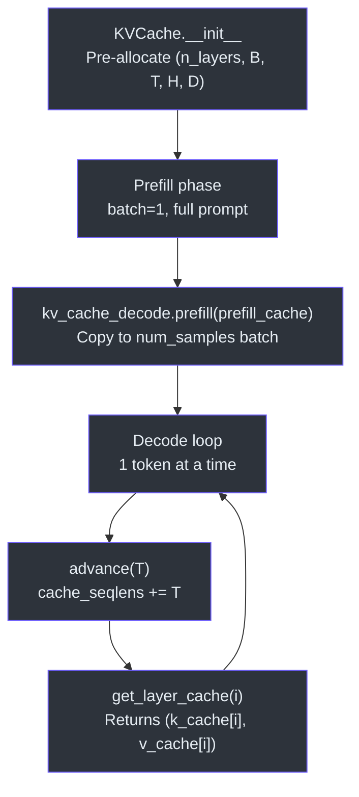
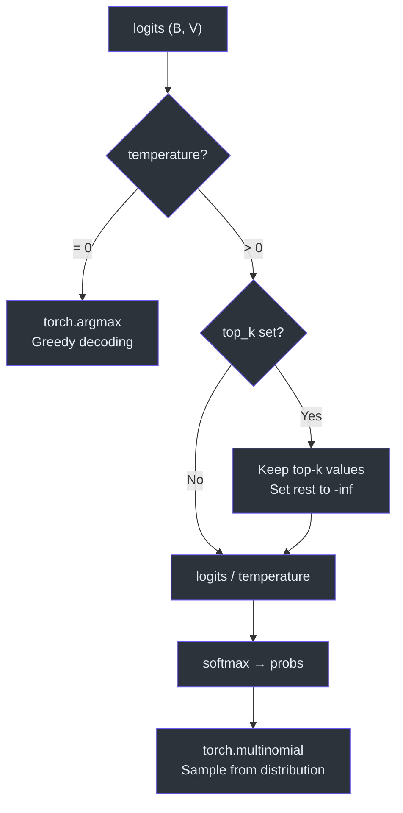
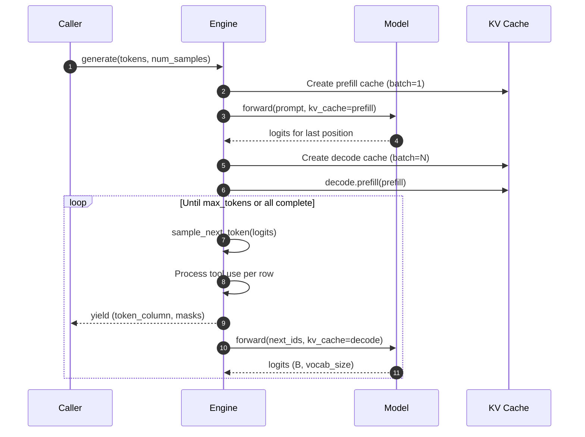

# Engine & KV Cache

The inference engine provides efficient batched generation with KV caching and integrated tool use. It operates purely on token IDs — all tokenization happens outside the engine.

> **Source:** [`nanochat/engine.py`](../../nanochat/engine.py)

---

## KVCache

The `KVCache` class pre-allocates key-value tensors for Flash Attention 3's `flash_attn_with_kvcache` API.

### Tensor Layout

```python
k_cache: (n_layers, B, T, H, D)
v_cache: (n_layers, B, T, H, D)
cache_seqlens: (B,)  # int32, current position per batch element
```

This is `(B, T, H, D)` per layer — note that FA3 uses a different layout than FA2's `(B, H, T, D)`. FA3 updates the cache **in-place** during attention computation.

### Key Methods

| Method | Description |
|---|---|
| `__init__(batch_size, num_heads, seq_len, head_dim, num_layers, device, dtype)` | Pre-allocates all cache tensors |
| `reset()` | Zeros `cache_seqlens` to reuse the cache |
| `get_pos()` | Returns current sequence position (assumes uniform across batch) |
| `get_layer_cache(layer_idx)` | Returns `(k_cache[layer], v_cache[layer])` views |
| `advance(num_tokens)` | Increments `cache_seqlens` by `num_tokens` |
| `prefill(other)` | Copies another cache's KV data into this one |

### Prefill + Clone Pattern

Generation uses a two-phase approach for efficient multi-sample generation:

1. **Prefill** (batch=1): Process the entire prompt in one forward pass, filling a small KV cache
2. **Clone** (batch=N): Create a larger KV cache and copy the prefilled data into all N batch positions

```python
kv_cache_prefill = KVCache(batch_size=1, seq_len=len(tokens), ...)
logits = model.forward(ids, kv_cache=kv_cache_prefill)

kv_cache_decode = KVCache(batch_size=num_samples, seq_len=kv_length_hint, ...)
kv_cache_decode.prefill(kv_cache_prefill)
del kv_cache_prefill  # free memory immediately
```



The decode cache is sized to `len(tokens) + max_tokens` when `max_tokens` is specified, otherwise to the model's full `sequence_len`.

---

## Token Sampling

The `sample_next_token` function handles temperature scaling and top-k filtering:

```python
def sample_next_token(logits, rng, temperature=1.0, top_k=None):
```

| Parameter | Behavior |
|---|---|
| `temperature=0.0` | Greedy decoding via `argmax` |
| `top_k > 0` | Keep only top-k logits, apply temperature, then sample |
| `top_k=None` or `0` | Full vocabulary sampling with temperature |

The function takes a `torch.Generator` for reproducible sampling via the `seed` parameter.



---

## RowState

Each sample/row in a batch has independent state tracked by a `RowState` object:

```python
class RowState:
    current_tokens: list      # Full token sequence for this row
    forced_tokens: deque      # Queue of tokens to force-inject (tool results)
    in_python_block: bool     # Inside a python_start...python_end block
    python_expr_tokens: list  # Accumulated tokens of current python expression
    completed: bool           # Row has hit assistant_end or BOS
```

The `forced_tokens` deque is the mechanism for injecting tool-use results back into the generation stream. When a calculator expression is evaluated, the result tokens are queued:

```python
state.forced_tokens.append(output_start)
state.forced_tokens.extend(result_tokens)
state.forced_tokens.append(output_end)
```

Forced tokens take priority over sampled tokens. The `token_masks` output distinguishes them: `0` for forced, `1` for sampled.

---

## `Engine.generate()` — Streaming Generation

The main generation method is a Python **generator** that yields token columns:

```python
def generate(self, tokens, num_samples=1, max_tokens=None, 
             temperature=1.0, top_k=None, seed=42):
    # yields (token_column, token_masks) tuples
```

### Generation Loop

```
1. Sample next_ids from logits         → (B, 1)
2. For each row:
   a. Pick token: forced (from deque) or sampled
   b. Append to current_tokens
   c. Check for assistant_end / BOS → mark completed
   d. Handle tool-use state machine (python_start/end)
3. Yield (token_column, token_masks)
4. Forward single-token step through model with KV cache
5. Repeat until max_tokens or all rows completed
```



### Stop Conditions

Generation stops when:
- `max_tokens` limit is reached, OR
- All rows have `completed == True` (hit `<|assistant_end|>` or BOS token)

---

## `Engine.generate_batch()` — Non-Streaming

A convenience wrapper that collects all generated tokens and returns the final sequences:

```python
def generate_batch(self, tokens, num_samples=1, **kwargs):
    # Returns: (results, masks)
    # results: list of token lists (one per sample)
    # masks: list of mask lists (0=forced, 1=sampled)
```

Terminal tokens (`assistant_end`, `bos`) are **not** included in the returned results.

---

## Tool Use State Machine

The engine implements inline calculator tool use via special token detection:

```
... normal tokens ... <|python_start|> expression tokens <|python_end|>
                      ↓ set in_python_block=True        ↓ evaluate expression
                      ↓ accumulate tokens                ↓ inject result:
                                                           <|output_start|> result <|output_end|>
```

See the [Tool Use & Code Execution](tool-use.md) page for details on expression evaluation and safety.

---

## dtype Handling

The engine currently inherits a repo-wide assumption:

```python
dtype = torch.bfloat16 if device.type == "cuda" else torch.float32
```

This is acknowledged as a hack in the source — the KV cache needs to know the dtype at allocation time, but there's no centralized dtype tracking across the codebase.
