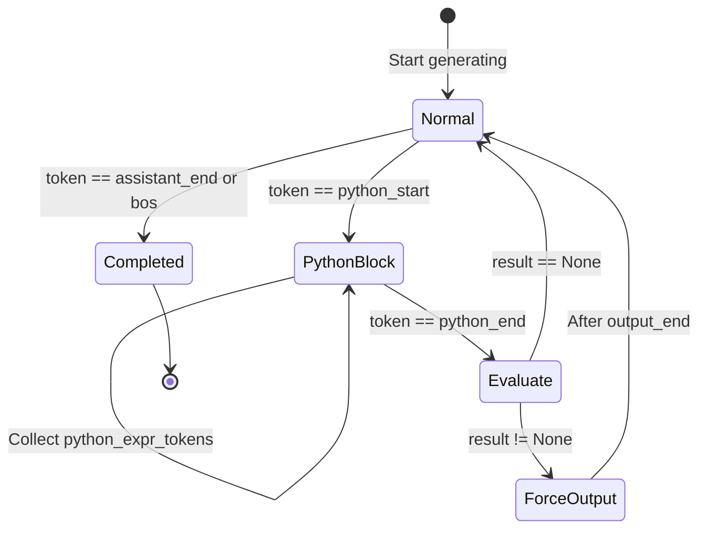
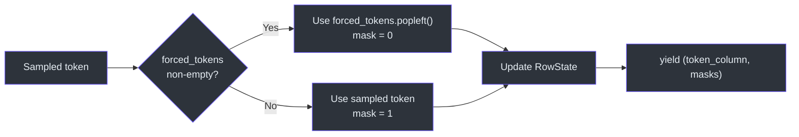
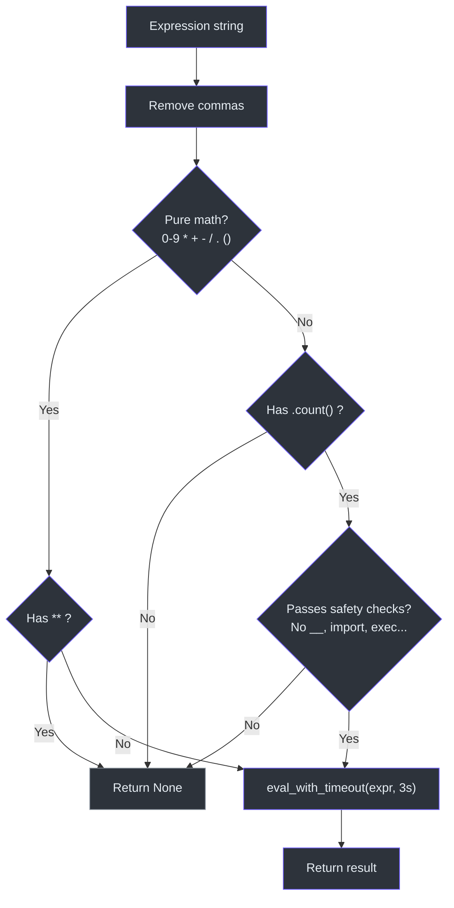

# Tool Use & Code Execution

Nanochat supports two levels of code execution: a lightweight **inline calculator** embedded in the generation engine, and a heavier **sandboxed executor** for running arbitrary Python code during evaluation.

> **Source:** [`nanochat/engine.py`](../../nanochat/engine.py) (lines 26–81), [`nanochat/execution.py`](../../nanochat/execution.py)

---

## Inline Calculator (engine.py)

The calculator tool is triggered by special tokens during generation. When the model emits `<|python_start|>`, the engine enters a capture mode, accumulates expression tokens, and evaluates the expression when `<|python_end|>` is encountered.

### State Machine

```
Normal generation
    │
    ▼  <|python_start|>
┌─────────────────────┐
│  Capture mode        │ ← accumulate tokens into python_expr_tokens
│  in_python_block=True│
└─────────────────────┘
    │  <|python_end|>
    ▼
Decode expression → use_calculator(expr)
    │
    ├─ result is not None → inject: <|output_start|> {result} <|output_end|>
    │
    └─ result is None → continue (no output injected)
```



Injected tokens are pushed into the `RowState.forced_tokens` deque and take priority over sampled tokens in subsequent generation steps.



### `eval_with_timeout`

All expressions are evaluated with a **3-second timeout** using `SIGALRM`:

```python
def eval_with_timeout(formula, max_time=3):
    with timeout(max_time, formula):
        return eval(formula, {"__builtins__": {}}, {})
```

The `eval` call uses `{"__builtins__": {}}` to disable all built-in functions, preventing access to `open`, `import`, `exec`, etc.

### `use_calculator`

The main entry point supports two categories of expressions:



#### 1. Math Expressions

Allowed characters: `0123456789*+-/.() ` (and commas, which are stripped).

```python
use_calculator("12/60")       # → 0.2
use_calculator("0.2 * 50")    # → 10.0
use_calculator("1,000 + 500") # → 1500 (commas removed)
```

The `**` (power) operator is explicitly disallowed to prevent resource exhaustion.

#### 2. String Operations

Currently limited to `.count()` method calls on string literals:

```python
use_calculator("'strawberry'.count('r')")  # → 3
```

Safety checks:
- Only alphanumeric characters, quotes, parens, dots, underscores, and spaces are allowed
- **Dangerous patterns** are blocked: `__`, `import`, `exec`, `eval`, `compile`, `open`, `file`, `input`, `globals`, `locals`, `vars`, `dir`, `getattr`, `setattr`, `delattr`, `hasattr`
- The expression must contain `.count(` to be accepted

---

## Sandboxed Execution (execution.py)

For evaluation tasks like HumanEval that require running arbitrary generated code, nanochat uses process-level sandboxing adapted from [OpenAI's HumanEval](https://github.com/openai/human-eval).

### `execute_code` API

```python
result = execute_code(
    code="print('hello world')",
    timeout=5.0,                       # seconds
    maximum_memory_bytes=256*1024*1024  # 256MB
)
# result.success → True
# result.stdout  → 'hello world\n'
```

Returns an `ExecutionResult` dataclass:

| Field | Type | Description |
|---|---|---|
| `success` | `bool` | Whether execution completed without errors |
| `stdout` | `str` | Captured standard output |
| `stderr` | `str` | Captured standard error |
| `error` | `Optional[str]` | Error message if execution failed |
| `timeout` | `bool` | Whether execution timed out |
| `memory_exceeded` | `bool` | Whether memory limit was hit |

### Process Isolation

Each execution runs in a **separate `multiprocessing.Process`**:

```python
p = multiprocessing.Process(target=_unsafe_execute, args=(...))
p.start()
p.join(timeout=timeout + 1)
if p.is_alive():
    p.kill()
```

The parent process uses `join(timeout + 1)` as a hard deadline, killing the subprocess if it doesn't finish. The subprocess itself uses `signal.ITIMER_REAL` for more precise timeout enforcement.

### Environment Setup

Inside the subprocess:
1. A **temporary directory** is created and made the working directory
2. stdout/stderr are **captured** via `io.StringIO` redirects
3. stdin is replaced with a **write-only stream** (reads raise `IOError`)
4. `reliability_guard` is applied to disable dangerous functions

### `reliability_guard`

This function **monkey-patches** Python's standard library to disable destructive operations:

#### Resource Limits (Linux only, skipped on macOS)

```python
resource.setrlimit(resource.RLIMIT_AS, (max_bytes, max_bytes))
resource.setrlimit(resource.RLIMIT_DATA, (max_bytes, max_bytes))
resource.setrlimit(resource.RLIMIT_STACK, (max_bytes, max_bytes))
```

#### Disabled Functions

| Module | Nullified Functions |
|---|---|
| `builtins` | `exit`, `quit` |
| `os` | `kill`, `system`, `putenv`, `remove`, `removedirs`, `rmdir`, `fork`, `forkpty`, `killpg`, `rename`, `renames`, `truncate`, `replace`, `unlink`, `fchmod`, `fchown`, `chmod`, `chown`, `chroot`, `lchflags`, `lchmod`, `lchown`, `getcwd`, `chdir`, `setuid`, `fchdir` |
| `shutil` | `rmtree`, `move`, `chown` |
| `subprocess` | `Popen` |
| `builtins` | `help` |
| `sys.modules` | `ipdb`, `joblib`, `resource`, `psutil`, `tkinter` (set to `None`) |

The `faulthandler` module is also disabled to prevent crash dumps.

> **Important:** Before applying `reliability_guard`, the subprocess saves references to `shutil.rmtree`, `os.rmdir`, `os.chdir`, and `os.unlink` — these are needed to clean up the temporary directory after execution.

### Security Limitations

The sandbox protects against **accidental** destructive behavior but is **not** hardened against adversarial code:

- Network access (sockets) is not blocked
- Python's `ctypes` could bypass restrictions
- No kernel-level isolation (no seccomp, containers, or VMs)

---

## Comparison

| Feature | Inline Calculator | Sandboxed Execution |
|---|---|---|
| **Use case** | Runtime tool calls during generation | Evaluation of generated code |
| **Scope** | Math expressions + `.count()` | Arbitrary Python code |
| **Isolation** | `eval()` with empty builtins | Separate process with resource limits |
| **Timeout** | 3 seconds (SIGALRM) | Configurable (default 5s, process kill) |
| **Memory limit** | None | 256MB (via `resource.setrlimit`) |
| **Integration** | Automatic via special tokens | Called explicitly by evaluation tasks |
