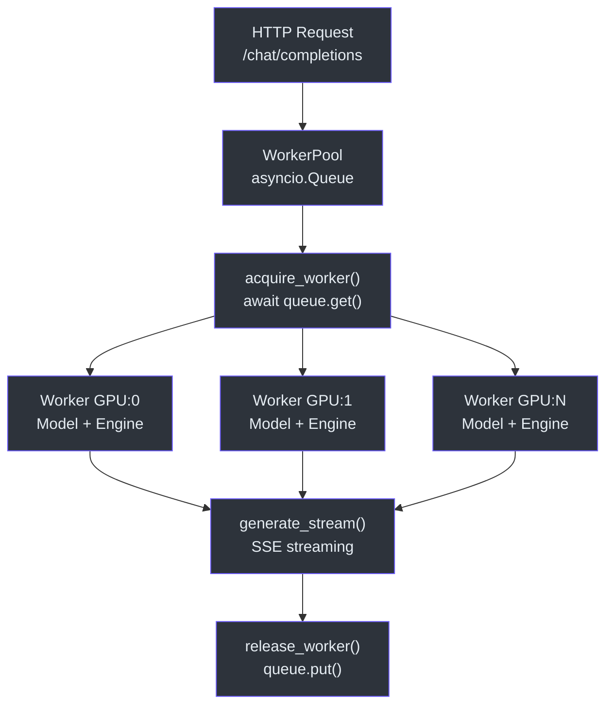
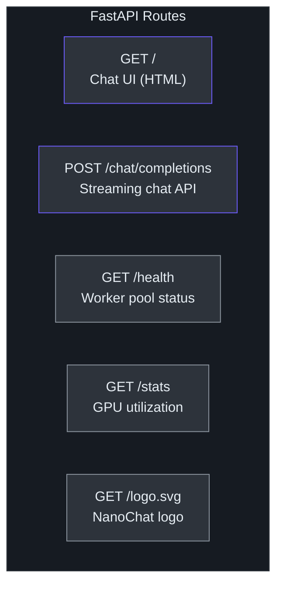
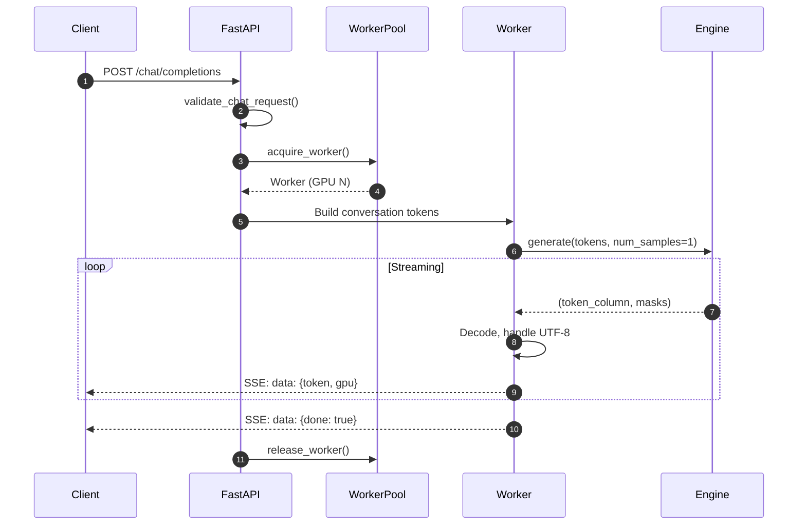

# Web Server

The web server provides a self-contained chat interface powered by FastAPI, with data parallelism across multiple GPUs via a worker pool.

> **Source:** [`scripts/chat_web.py`](../../scripts/chat_web.py), [`nanochat/ui.html`](../../nanochat/ui.html)

---

## Architecture

```
┌──────────────┐     POST /chat/completions      ┌─────────────┐
│              │ ──────────────────────────────▶  │ WorkerPool  │
│  Browser UI  │     SSE streaming response       │             │
│  (ui.html)   │ ◀──────────────────────────────  │  Worker 0   │──▶ GPU 0
│              │                                  │  Worker 1   │──▶ GPU 1
└──────────────┘                                  │  Worker N   │──▶ GPU N
                                                  └─────────────┘
```

### WorkerPool

The `WorkerPool` manages model replicas across GPUs using an `asyncio.Queue`:

```python
class WorkerPool:
    workers: List[Worker]
    available_workers: asyncio.Queue
```

- Each `Worker` holds an `Engine`, `tokenizer`, and `autocast_ctx` bound to a specific GPU
- Requests `acquire_worker()` from the queue (blocks if all busy)
- Workers are returned via `release_worker()` after streaming completes
- Non-CUDA devices (CPU, MPS) are limited to a single worker



---

## Endpoints

| Method | Path | Description |
|---|---|---|
| `GET` | `/` | Serves the built-in chat UI (HTML/CSS/JS from `nanochat/ui.html`) |
| `GET` | `/logo.svg` | Serves the NanoChat logo SVG |
| `POST` | `/chat/completions` | Chat completion API with SSE streaming |
| `GET` | `/health` | Health check: ready status, GPU count, available workers |
| `GET` | `/stats` | Worker pool statistics and per-GPU device info |



### Chat API

The `/chat/completions` endpoint accepts:

```python
class ChatRequest(BaseModel):
    messages: List[ChatMessage]     # role + content pairs
    temperature: Optional[float]    # default from CLI args
    max_tokens: Optional[int]       # default from CLI args
    top_k: Optional[int]            # default from CLI args
```

Responses are **Server-Sent Events** (SSE):

```
data: {"token": "Hello", "gpu": 0}
data: {"token": " world", "gpu": 0}
data: {"done": true}
```

### Conversation Tokenization

Messages are tokenized with special delimiter tokens:

```
<|bos|> <|user_start|> {user text} <|user_end|> <|assistant_start|> {assistant text} <|assistant_end|> ...
```

The final `<|assistant_start|>` is always appended to prompt the model's response.



---

## Abuse Prevention

The server enforces strict input validation to prevent misuse:

| Limit | Value |
|---|---|
| Max messages per request | 500 |
| Max characters per message | 8,000 |
| Max total conversation length | 32,000 chars |
| Temperature range | 0.0 – 2.0 |
| Top-k range | 0 – 200 (0 = full vocabulary) |
| Max tokens range | 1 – 4,096 |
| Valid roles | `user`, `assistant` |

All limits are enforced via `validate_chat_request()` before any model computation.

---

## UTF-8 Streaming

Token-by-token streaming can produce **incomplete multi-byte UTF-8 sequences** (e.g., partial emoji codepoints). The server handles this by accumulating tokens and only emitting text when it decodes cleanly:

```python
accumulated_tokens.append(token)
current_text = worker.tokenizer.decode(accumulated_tokens)

if not current_text.endswith('�'):        # no replacement chars
    new_text = current_text[len(last_clean_text):]
    if new_text:
        yield f"data: {json.dumps({'token': new_text})}\n\n"
        last_clean_text = current_text
```

This ensures clients never receive garbled Unicode. The `tokenizer.decode` operation is efficient (table lookup + string concat), so re-decoding the full accumulated sequence each step is acceptable.

---

## Chat UI

The server embeds a complete chat interface in `nanochat/ui.html` — a single HTML file with inline CSS and JavaScript. When served via the `GET /` endpoint, the API URL is rewritten to use the same origin:

```python
html_content = html_content.replace(
    "const API_URL = `http://${window.location.hostname}:8000`;",
    "const API_URL = '';"
)
```

---

## Launch

```bash
# Single GPU (default)
python -m scripts.chat_web

# 4 GPUs
python -m scripts.chat_web --num-gpus 4

# Custom settings
python -m scripts.chat_web -t 0.8 -k 50 -m 512 -p 8000
```

### CLI Arguments

| Flag | Default | Description |
|---|---|---|
| `-n`, `--num-gpus` | 1 | Number of GPUs for data parallelism |
| `-i`, `--source` | `sft` | Model source: `sft` or `rl` |
| `-t`, `--temperature` | 0.8 | Default generation temperature |
| `-k`, `--top-k` | 50 | Default top-k sampling |
| `-m`, `--max-tokens` | 512 | Default max tokens per response |
| `-g`, `--model-tag` | None | Specific model tag to load |
| `-s`, `--step` | None | Specific training step to load |
| `-p`, `--port` | 8000 | Server port |
| `-d`, `--dtype` | bfloat16 | Model precision: `float32` or `bfloat16` |
| `--host` | 0.0.0.0 | Bind address |
| `--device-type` | auto | Device: `cuda`, `cpu`, `mps`, or autodetect |

---

## Logging

All conversations are logged to the console at `INFO` level with timestamps:

```
2024-01-15 10:30:00 ====================
2024-01-15 10:30:00 [USER]: Hello!
2024-01-15 10:30:00 --------------------
2024-01-15 10:30:01 [ASSISTANT] (GPU 0): Hi there! How can I help?
2024-01-15 10:30:01 ====================
```
