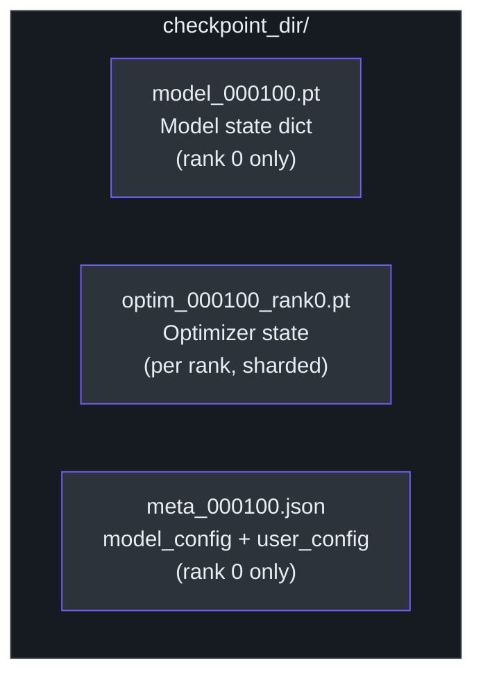
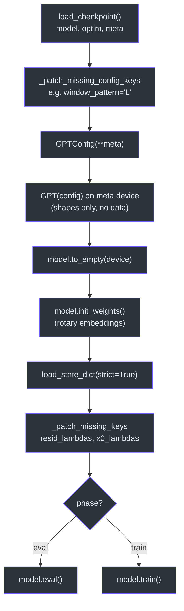
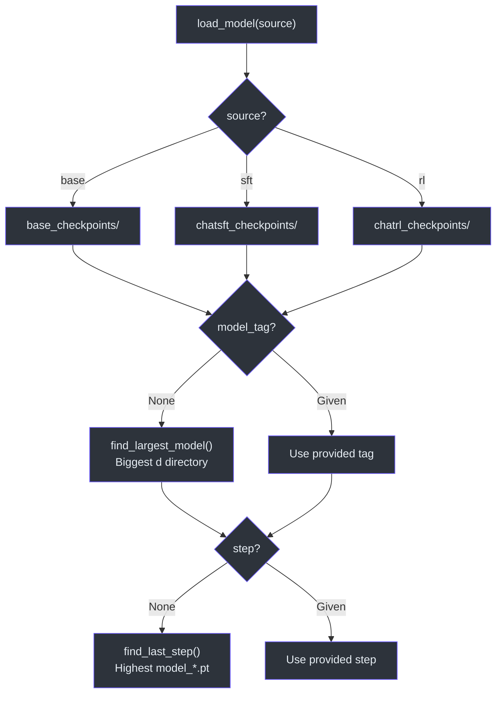

# Checkpoint Management

> How nanochat saves, loads, and reconstructs model checkpoints across training phases.
>
> **Source**: [`nanochat/checkpoint_manager.py`](../../nanochat/checkpoint_manager.py)

---

## Checkpoint File Layout

Each checkpoint step produces up to three files:

| File | Saved by | Contents |
|------|----------|----------|
| `model_NNNNNN.pt` | rank 0 | Full model `state_dict` |
| `meta_NNNNNN.json` | rank 0 | Model config, training metadata |
| `optim_NNNNNN_rankN.pt` | every rank | Per-rank optimizer shard (ZeRO-2 sharded state) |

The optimizer state is sharded across ranks, so **every rank saves its own** `optim_*_rankN.pt` file independently.



## Saving (`save_checkpoint`)

```
save_checkpoint(checkpoint_dir, step, model_data, optimizer_data, meta_data, rank=0)
```

- **Rank 0** creates the directory, saves `model_NNNNNN.pt` and `meta_NNNNNN.json`.
- **All ranks** save their optimizer shard to `optim_NNNNNN_rankN.pt` (if `optimizer_data` is not `None`).

## Loading (`load_checkpoint`)

```
load_checkpoint(checkpoint_dir, step, device, load_optimizer=False, rank=0)
```

Returns `(model_data, optimizer_data, meta_data)`. Optimizer loading is optional — inference paths skip it.

## Model Reconstruction (`build_model`)

`build_model(checkpoint_dir, step, device, phase)` reconstructs a full `GPT` model from a checkpoint. It handles several backward-compatibility concerns:

### Config Patching (`_patch_missing_config_keys`)

Old checkpoints may lack newer config keys. Currently patches:

- **`window_pattern`** → defaults to `"L"` (full context, no sliding window)

### Weight Patching (`_patch_missing_keys`)

Old checkpoints may lack newer parameters. Currently patches:

- **`resid_lambdas`** → `torch.ones(n_layer)` (identity residual scaling)
- **`x0_lambdas`** → `torch.zeros(n_layer)` (disabled)

### `torch.compile` Prefix Handling

Compiled models prepend `_orig_mod.` to all state dict keys. `build_model` strips this prefix:

```python
model_data = {k.removeprefix("_orig_mod."): v for k, v in model_data.items()}
```

### CPU/MPS Precision

On non-CUDA devices, `bfloat16` tensors are converted to `float32` since CPU and MPS lack efficient bf16 support.

### Reconstruction Flow

1. Load checkpoint via `load_checkpoint`
2. Convert bf16 → float32 if CPU/MPS
3. Strip `_orig_mod.` prefix
4. Patch config and weights for backward compatibility
5. Instantiate `GPT` on `meta` device, move to target device
6. Call `init_weights()` (needed for rotary embeddings), then `load_state_dict`
7. Set `model.train()` or `model.eval()` based on `phase`
8. Load tokenizer and verify vocab size matches



## Auto-Discovery

### `find_largest_model(checkpoints_dir)`

Selects the largest model tag from a checkpoints directory:

1. Parse `d<N>` tags (e.g., `d12`, `d24`) and pick the highest depth
2. Fallback: pick the most recently modified directory

### `find_last_step(checkpoint_dir)`

Globs `model_*.pt` files and returns the highest step number.

## Three Model Directories

The project organizes checkpoints by training phase under `~/.cache/nanochat/` (or `$NANOCHAT_BASE_DIR`):

| Directory | Phase | Written by |
|-----------|-------|------------|
| `base_checkpoints/` | Pre-training | `scripts/base_train.py` |
| `chatsft_checkpoints/` | Supervised fine-tuning | `scripts/chat_sft.py` |
| `chatrl_checkpoints/` | Reinforcement learning | `scripts/chat_rl.py` |

### Convenience Loaders

- **`load_model_from_dir(checkpoints_dir, device, phase, model_tag=None, step=None)`** — auto-discovers model tag and step if not provided
- **`load_model(source, ...)`** — wrapper that maps `"base"` / `"sft"` / `"rl"` to the correct directory


