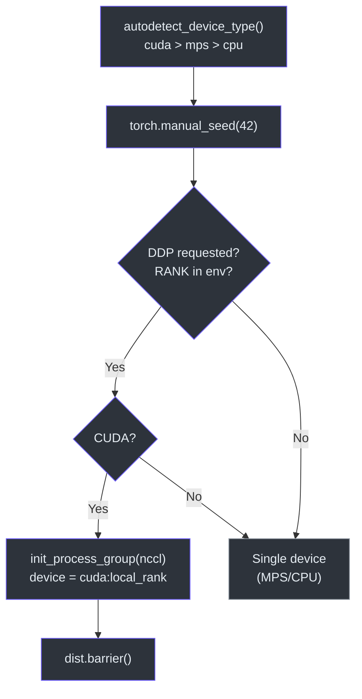
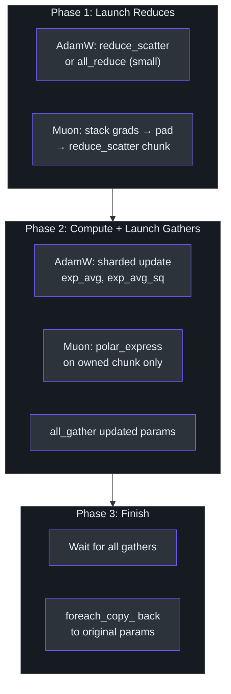

# Distributed Training

> How nanochat scales across multiple GPUs using DDP, gradient accumulation, and a custom distributed optimizer.
>
> **Sources**: [`nanochat/common.py`](../../nanochat/common.py), [`nanochat/optim.py`](../../nanochat/optim.py)

---

## Compute Initialization

### `compute_init(device_type)`

Sets up the device and distributed environment:

1. Sets global random seeds (`torch.manual_seed(42)`)
2. Enables TF32 precision on CUDA
3. If DDP is requested and device is CUDA:
   - Creates `torch.device("cuda", local_rank)`
   - Calls `dist.init_process_group(backend="nccl", device_id=device)`
   - Issues `dist.barrier()` to synchronize
4. Returns `(is_ddp, rank, local_rank, world_size, device)`



### `get_dist_info()`

Reads distributed config from environment variables set by `torchrun`:

- `RANK` — global rank
- `LOCAL_RANK` — rank within the node
- `WORLD_SIZE` — total number of processes

Returns `(True, rank, local_rank, world_size)` under DDP, or `(False, 0, 0, 1)` for single-GPU.

### `autodetect_device_type()`

Priority: **CUDA** → **MPS** → **CPU**.

## Gradient Accumulation

Training scripts compute gradient accumulation steps to reach the desired total batch size:

```python
tokens_per_fwdbwd = device_batch_size * seq_len          # tokens per GPU per forward-backward
world_tokens_per_fwdbwd = tokens_per_fwdbwd * world_size # tokens across all GPUs
grad_accum_steps = total_batch_size // world_tokens_per_fwdbwd
```

Each micro-step loss is divided by `grad_accum_steps` before `.backward()` to normalize gradients.

## Distributed Optimizer (`DistMuonAdamW`)

The `DistMuonAdamW` optimizer replaces PyTorch DDP with a custom communication strategy that overlaps gradient reduction with optimizer computation.

### 3-Phase Async Communication Pattern

```
Phase 1: Launch all async reduce ops
  └─ Kick off reduce_scatter / all_reduce for every param group
  └─ Don't wait — let NCCL ops run in background

Phase 2: Wait for reduces → compute updates → launch gathers
  └─ For each group: wait for its reduce, run optimizer step, launch all_gather
  └─ Earlier gathers overlap with later computes

Phase 3: Wait for gathers → copy back
  └─ Wait for all all_gather futures
  └─ Copy updated params back to original tensors (Muon groups)
```



### AdamW Communication (ZeRO-2 Style)

| Param size | Reduce | Optimizer state | Gather |
|------------|--------|-----------------|--------|
| Small (<1024 elements) | `all_reduce` (avg) | Replicated on all ranks | None needed |
| Large (≥1024 elements) | `reduce_scatter` | Sharded — each rank stores only its `1/N` slice of `exp_avg` and `exp_avg_sq` | `all_gather` updated slices |

Large params require `shape[0]` divisible by `world_size`.

### Muon Communication (Stacked + Chunked)

All params in a Muon group must share the same shape. The optimizer:

1. **Stacks** all `K` params into a single `(K, *shape)` tensor
2. **Pads** to `ceil(K/N) * N` if `K` doesn't divide evenly by world size
3. **`reduce_scatter`** the stacked gradients — each rank gets its `ceil(K/N)` chunk
4. Each rank computes the Muon update (momentum → Polar Express → variance reduction) **only for owned params**
5. **`all_gather`** the updated params back to all ranks
6. Copies from stacked buffer back to individual parameter tensors

Optimizer state (`momentum_buffer`, `second_momentum_buffer`) is sharded by chunk — each rank only stores state for the params it owns.


### Buffer Reuse

The `stacked_grads` buffer allocated for `reduce_scatter` input is reused as the `all_gather` output buffer, avoiding a second large allocation.

## Single-GPU Optimizer (`MuonAdamW`)

A non-distributed version used for single-GPU training, debugging, and testing. Same algorithmic steps (AdamW for small/1D params, Muon for 2D matrix params) without any communication.

## Cleanup

`compute_cleanup()` destroys the process group if DDP was initialized, called at script exit.
