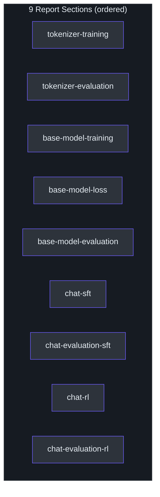
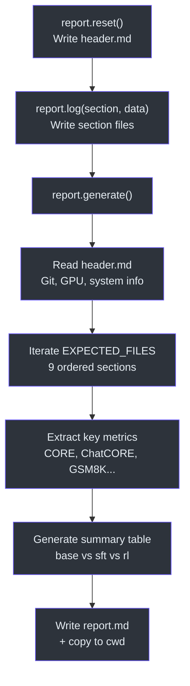

# Report Generation

> How nanochat produces training report cards that summarize environment, metrics, and results across all phases.
>
> **Source**: [`nanochat/report.py`](../../nanochat/report.py)

---

## Overview

The `Report` class collects markdown sections from each training phase and assembles them into a final `report.md` with a summary table. Only rank 0 writes to the report; all other ranks receive a `DummyReport` that silently discards calls.

## Report Sections

Sections are logged during training via `report.log(section_name, data)`. Each call writes a timestamped markdown file named by slugifying the section title. The expected sections in order:

| File | Phase |
|------|-------|
| `tokenizer-training.md` | Tokenizer training stats |
| `tokenizer-evaluation.md` | Tokenizer evaluation |
| `base-model-training.md` | Base model training config |
| `base-model-loss.md` | Base model loss curves |
| `base-model-evaluation.md` | Base model eval (CORE benchmark) |
| `chat-sft.md` | Supervised fine-tuning |
| `chat-evaluation-sft.md` | Chat eval after SFT (ARC, MMLU, GSM8K, HumanEval, ChatCORE) |
| `chat-rl.md` | Reinforcement learning |
| `chat-evaluation-rl.md` | Chat eval after RL (GSM8K) |



## Header Generation (`generate_header`)

Called during `report.reset()` to capture the environment snapshot:

### Git Information
- Branch, commit hash, dirty status, commit message

### Hardware
- Platform, CPU cores, memory, GPU count/names/VRAM, CUDA version
- Estimated hourly cost (rough Lambda Cloud rates for H100/A100/V100)

### Software
- Python version, PyTorch version

### Bloat Metrics
Counts lines, characters, files, and approximate tokens across git-tracked source files (`*.py`, `*.md`, `*.rs`, `*.html`, `*.toml`, `*.sh`). Also counts `uv.lock` lines as a dependency metric.

## Final Report Assembly (`report.generate`)

1. Writes the header (with run start timestamp)
2. Appends each section file in order, extracting timestamps for wall-clock tracking
3. Extracts key metrics from evaluation sections:
   - **Base**: `CORE`
   - **SFT**: `ARC-Easy`, `ARC-Challenge`, `MMLU`, `GSM8K`, `HumanEval`, `ChatCORE`
   - **RL**: `GSM8K`
4. Builds a summary table:

```
| Metric          | BASE     | SFT      | RL       |
|-----------------|----------|----------|----------|
| CORE            | 0.42     | -        | -        |
| ARC-Easy        | -        | 0.65     | -        |
| ...             | ...      | ...      | ...      |
```

5. Computes total wall clock time from header start timestamp to last non-RL section timestamp
6. Copies `report.md` to the current working directory for convenience



## `DummyReport`

A no-op stand-in used by non-rank-0 processes. Its `log()` and `reset()` methods do nothing, keeping report writes confined to a single rank without requiring conditional checks in training code.

## CLI Usage

```bash
# Reset report (clears sections, writes fresh header with environment snapshot)
python -m nanochat.report reset

# Generate final report from collected sections
python -m nanochat.report generate
```

Both commands use `get_report()` which routes to `Report` on rank 0 or `DummyReport` otherwise. The report directory is `~/.cache/nanochat/report/` (or `$NANOCHAT_BASE_DIR/report/`).
