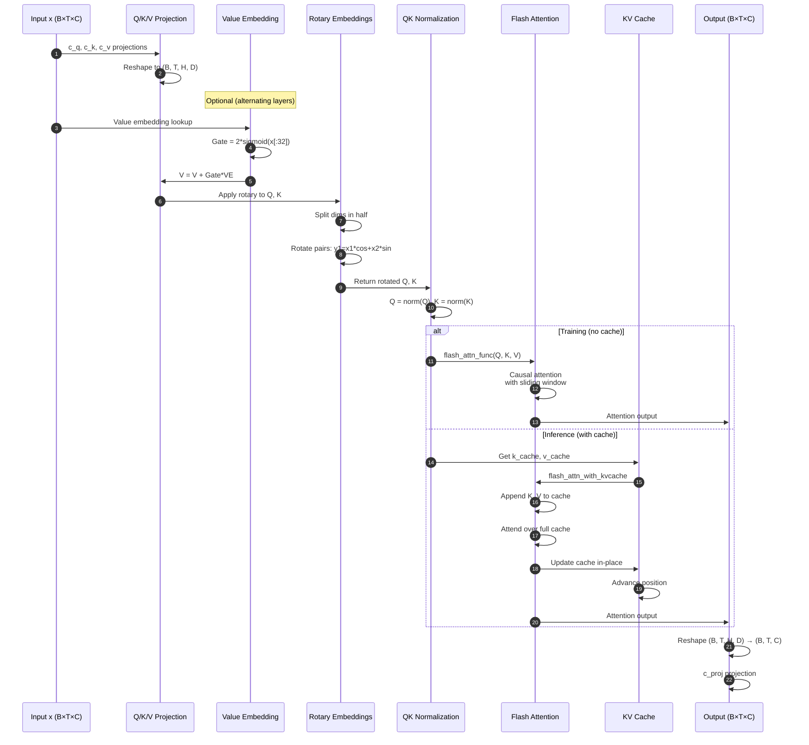
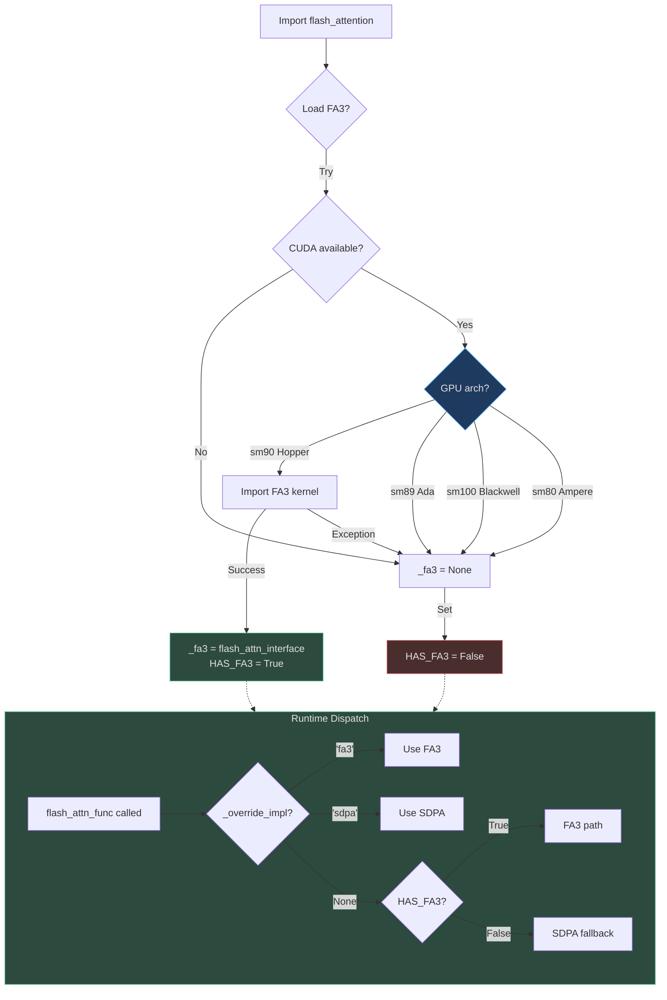
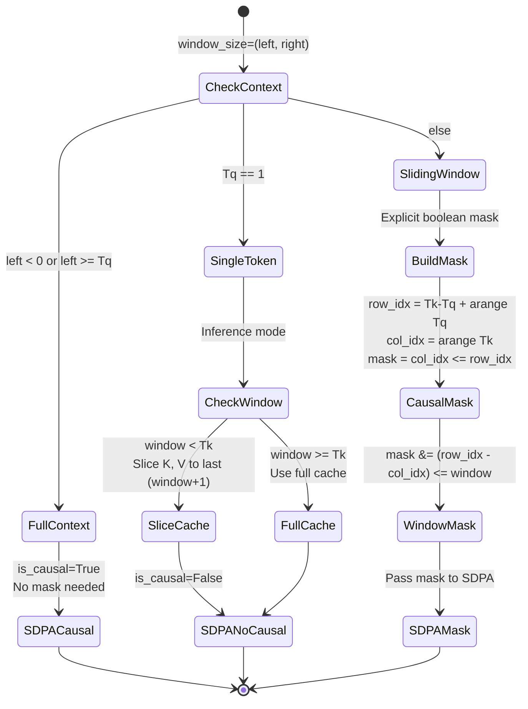
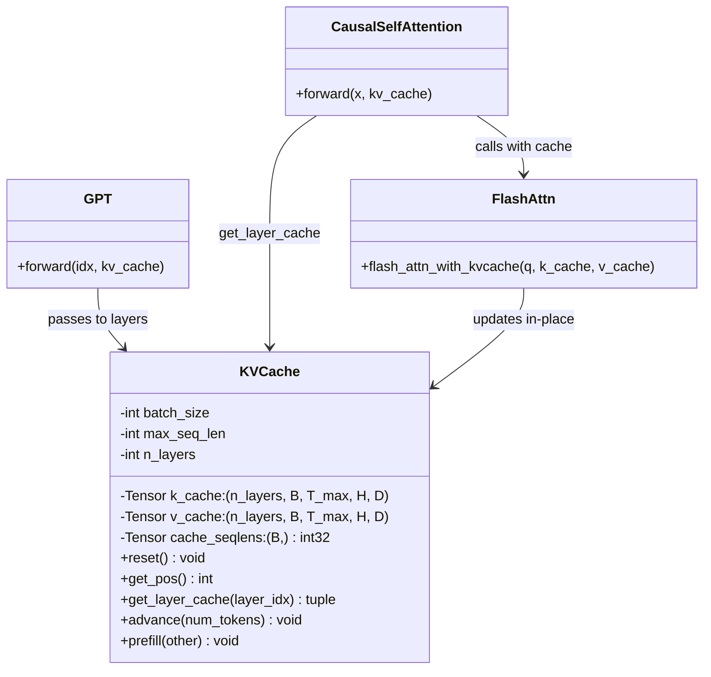
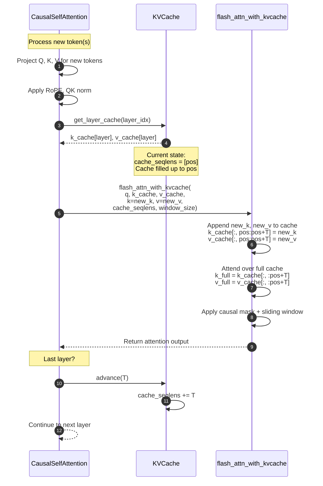
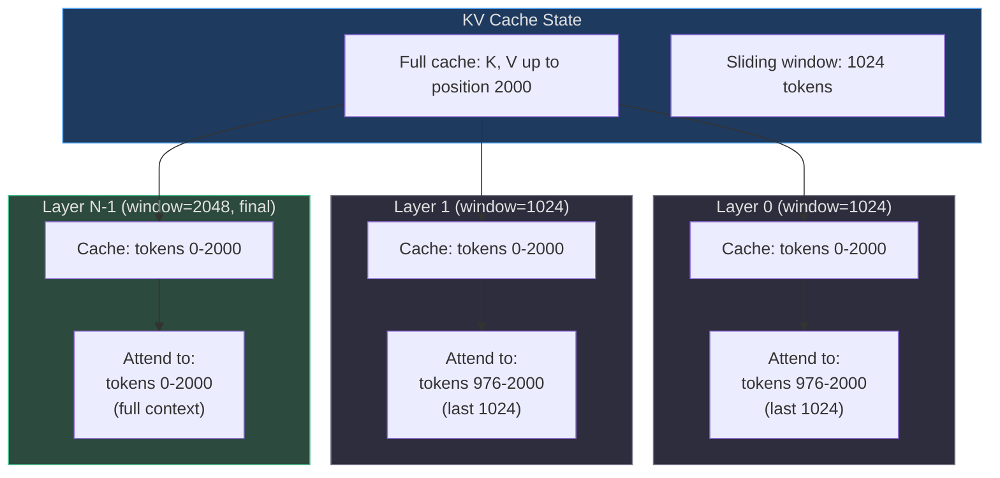
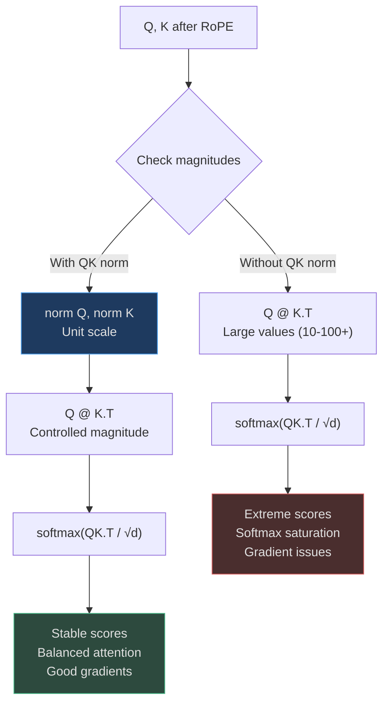
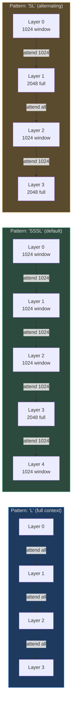

# Attention Mechanism

The attention mechanism in nanochat implements **causal self-attention** with modern optimizations: Flash Attention 3 on Hopper GPUs, PyTorch SDPA fallback for other hardware, rotary position embeddings, QK normalization, and efficient KV caching for inference.

## Why This Implementation?

The design prioritizes **hardware-agnostic efficiency**:

1. **Performance**: Flash Attention 3 on H100 (2x faster than bfloat16), automatic fallback to SDPA on other GPUs
2. **Flexibility**: Sliding window attention for long contexts, configurable per-layer
3. **Simplicity**: Unified interface abstracts FA3 vs SDPA, ~180 lines in [flash_attention.py](https://github.com/karpathy/nanochat/blob/master/nanochat/flash_attention.py#L1-L179)
4. **Inference**: Purpose-built KV cache for Flash Attention 3's in-place update API

The attention implementation in nanochat is **~70 lines** ([gpt.py:59-118](https://github.com/karpathy/nanochat/blob/master/nanochat/gpt.py#L59-L118)) thanks to the abstraction layer.

## Attention Overview

| Component | Purpose | Key Insight | Source |
|-----------|---------|-------------|--------|
| **Q/K/V Projections** | Transform input to query, key, value | Separate projections for GQA support | [gpt.py:69-71](https://github.com/karpathy/nanochat/blob/master/nanochat/gpt.py#L69-L71) |
| **RoPE** | Relative position encoding | Applied to Q and K before attention | [gpt.py:92-93](https://github.com/karpathy/nanochat/blob/master/nanochat/gpt.py#L92-L93) |
| **QK Norm** | Stabilize attention scores | Normalize Q and K after RoPE | [gpt.py:94](https://github.com/karpathy/nanochat/blob/master/nanochat/gpt.py#L94) |
| **Flash Attention** | Fused attention kernel | FA3 on Hopper, SDPA elsewhere | [gpt.py:96-110](https://github.com/karpathy/nanochat/blob/master/nanochat/gpt.py#L96-L110) |
| **KV Cache** | Inference optimization | In-place updates, position tracking | [engine.py:83-133](https://github.com/karpathy/nanochat/blob/master/nanochat/engine.py#L83-L133) |
| **Sliding Window** | Long context efficiency | Per-layer window sizes | [gpt.py:260-287](https://github.com/karpathy/nanochat/blob/master/nanochat/gpt.py#L260-L287) |

## Attention Forward Pass


<!-- Sources: nanochat/gpt.py:76-118 -->

## CausalSelfAttention Module

The `CausalSelfAttention` module handles all attention computation:

```mermaid
graph TB
    subgraph Initialization["__init__ (layer_idx, config)"]
        Config[GPTConfig] --> Heads["n_head = 6<br/>n_kv_head = 6<br/>head_dim = 128"]
        Heads --> Proj["Create projections:<br/>c_q, c_k, c_v, c_proj"]
        Heads --> VEGate{has_ve?}
        VEGate -->|Yes| CreateGate[ve_gate: Linear 32→n_kv_head]
        VEGate -->|No| NoGate[ve_gate = None]
    end
    
    subgraph Forward["forward(x, ve, cos_sin, window_size, kv_cache)"]
        X[Input x] --> QProj[Q = c_q x]
        X --> KProj[K = c_k x]
        X --> VProj[V = c_v x]
        
        VProj --> VECheck{ve exists?}
        VECheck -->|Yes| AddVE["V = V + gate*VE"]
        VECheck -->|No| KeepV[Keep V]
        
        QProj --> Reshape1["Reshape to<br/>(B, T, H, D)"]
        KProj --> Reshape1
        AddVE --> Reshape1
        KeepV --> Reshape1
        
        Reshape1 --> ApplyRoPE["apply_rotary_emb<br/>to Q, K"]
        ApplyRoPE --> QKNorm["Q = norm Q<br/>K = norm K"]
        
        QKNorm --> CacheCheck{kv_cache?}
        CacheCheck -->|None| Training["flash_attn_func<br/>(training)"]
        CacheCheck -->|Exists| Inference["flash_attn_with_kvcache<br/>(inference)"]
        
        Training --> Reshape2
        Inference --> Reshape2["Reshape<br/>(B, T, H, D) → (B, T, C)"]
        Reshape2 --> OutProj[c_proj projection]
    end
    
    style Initialization fill:#1e3a5f,stroke:#4a9eed,color:#e0e0e0
    style Forward fill:#2d4a3e,stroke:#4aba8a,color:#e0e0e0
    style Training fill:#2d4a3e,stroke:#4aba8a,color:#e0e0e0
    style Inference fill:#5a4a2e,stroke:#d4a84b,color:#e0e0e0
```


<!-- Sources: nanochat/gpt.py:59-118 -->

## Flash Attention 3 vs SDPA

The `flash_attention.py` module provides a **unified interface** that automatically uses the best available kernel:


<!-- Sources: nanochat/flash_attention.py:23-56 -->

**Why this architecture?**
- **Zero code changes**: Same API regardless of hardware
- **Optimal performance**: FA3 when available, SDPA elsewhere
- **Testability**: Override flag for unit tests
- **MPS/CPU support**: SDPA works on Apple Silicon and CPU

**Implementation** ([flash_attention.py:23-42](https://github.com/karpathy/nanochat/blob/master/nanochat/flash_attention.py#L23-L42)):

```python
def _load_flash_attention_3():
    if not torch.cuda.is_available():
        return None
    try:
        major, _ = torch.cuda.get_device_capability()
        # FA3 kernels are compiled for Hopper (sm90) only
        if major != 9:
            return None
        from kernels import get_kernel
        return get_kernel('varunneal/flash-attention-3').flash_attn_interface
    except Exception:
        return None
```

## Tensor Layout: (B, T, H, D) vs (B, H, T, D)

A critical implementation detail is **tensor layout**:

| Layout | Used By | Advantage | Source |
|--------|---------|-----------|--------|
| **(B, T, H, D)** | Flash Attention 3 | Native layout, no transpose | [flash_attention.py:99-120](https://github.com/karpathy/nanochat/blob/master/nanochat/flash_attention.py#L99-L120) |
| **(B, H, T, D)** | PyTorch SDPA | Standard PyTorch format | [flash_attention.py:114-120](https://github.com/karpathy/nanochat/blob/master/nanochat/flash_attention.py#L114-L120) |

**In nanochat**: All projections output **(B, T, H, D)** format, matching FA3. The SDPA fallback transposes internally:

```python
# SDPA fallback: transpose (B, T, H, D) -> (B, H, T, D)
q = q.transpose(1, 2)
k = k.transpose(1, 2)
v = v.transpose(1, 2)
y = F.scaled_dot_product_attention(q, k, v, is_causal=True)
return y.transpose(1, 2)  # back to (B, T, H, D)
```

## SDPA Sliding Window Implementation

PyTorch SDPA doesn't natively support sliding windows, so the fallback path uses **explicit masks**:


<!-- Sources: nanochat/flash_attention.py:61-94 -->

**Implementation** ([flash_attention.py:61-94](https://github.com/karpathy/nanochat/blob/master/nanochat/flash_attention.py#L61-L94)):

```python
def _sdpa_attention(q, k, v, window_size, enable_gqa):
    Tq = q.size(2)
    Tk = k.size(2)
    window = window_size[0]
    
    # Fast path: full context, same length
    if (window < 0 or window >= Tq) and Tq == Tk:
        return F.scaled_dot_product_attention(q, k, v, is_causal=True, enable_gqa=enable_gqa)
    
    # Inference: single token generation
    if Tq == 1:
        if window >= 0 and window < Tk:
            start = max(0, Tk - (window + 1))
            k = k[:, :, start:, :]
            v = v[:, :, start:, :]
        return F.scaled_dot_product_attention(q, k, v, is_causal=False, enable_gqa=enable_gqa)
    
    # Explicit mask for sliding window
    row_idx = (Tk - Tq) + torch.arange(Tq, device=device).unsqueeze(1)
    col_idx = torch.arange(Tk, device=device).unsqueeze(0)
    mask = col_idx <= row_idx  # causal
    if window >= 0 and window < Tk:
        mask = mask & ((row_idx - col_idx) <= window)  # sliding window
    return F.scaled_dot_product_attention(q, k, v, attn_mask=mask, enable_gqa=enable_gqa)
```

## KV Cache for Inference

The `KVCache` class manages cached key/value tensors for autoregressive generation:


<!-- Sources: nanochat/engine.py:83-133 -->

**Key design choices**:

1. **(B, T, H, D) layout**: Matches Flash Attention 3's native format
2. **In-place updates**: FA3 writes directly to cache tensors during `flash_attn_with_kvcache`
3. **Position tracking**: `cache_seqlens` tensor tracks current position per batch element (int32 for FA3)
4. **Prefill support**: Copy cache from batch=1 prefill to batch=N for multi-sample generation

**Cache lifecycle** ([engine.py:83-133](https://github.com/karpathy/nanochat/blob/master/nanochat/engine.py#L83-L133)):

```python
# 1. Initialization
kv_cache = KVCache(
    batch_size=1,
    num_heads=config.n_kv_head,  # Note: KV heads, not query heads
    seq_len=config.sequence_len,
    head_dim=config.n_embd // config.n_head,
    num_layers=config.n_layer,
    device=device,
    dtype=torch.bfloat16
)

# 2. Prefill: encode prompt once
logits = model.forward(prompt_tokens, kv_cache=kv_cache)
# kv_cache.cache_seqlens now equals len(prompt_tokens)

# 3. Generation loop
for _ in range(max_new_tokens):
    # Only process last token (others cached)
    next_logits = model.forward(last_token, kv_cache=kv_cache)
    # Cache automatically updated with new K, V
    # cache_seqlens advanced by 1
```

## Attention with KV Cache

During inference, the attention mechanism uses cached K/V to avoid recomputing attention for past tokens:


<!-- Sources: nanochat/gpt.py:102-113, nanochat/engine.py:83-133 -->

**Critical implementation detail** ([gpt.py:112-113](https://github.com/karpathy/nanochat/blob/master/nanochat/gpt.py#L112-L113)):

```python
# Advance position after last layer processes
if self.layer_idx == kv_cache.n_layers - 1:
    kv_cache.advance(T)
```

**Why advance only after the last layer?**
- All layers need to see the same `cache_seqlens` value
- Position tracking is per-sequence, not per-layer
- Advancing in the middle would break later layers' cache indexing

## Sliding Window with KV Cache

When using sliding windows during inference, the attention mechanism only attends to the **most recent N tokens**:


<!-- Sources: nanochat/gpt.py:96-110, nanochat/gpt.py:260-287 -->

**Memory efficiency**:
- Cache stores **all** past K/V tensors
- Attention kernel only **accesses** the sliding window subset
- No cache eviction or recomputation needed
- Trade-off: Memory for speed (stores unused tokens)

## QK Normalization

After applying rotary embeddings, Q and K are normalized using RMSNorm:

```python
q, k = apply_rotary_emb(q, cos, sin), apply_rotary_emb(k, cos, sin)
q, k = norm(q), norm(k)  # QK norm
```

**Why QK norm?**

| Problem | Solution | Benefit |
|---------|----------|---------|
| Attention score explosions | Normalize Q, K to unit scale | Stable attention weights |
| Gradient flow issues | Prevents extreme softmax outputs | Better training dynamics |
| Mixed precision | Reduces overflow risk in bf16 | Safer FP8/int8 quantization |


<!-- Sources: nanochat/gpt.py:94 -->

## Flash Attention 3 Performance

Flash Attention 3 achieves significant speedups on Hopper (H100) GPUs:

| Kernel | GPU | Data Type | Relative Speed | TFLOPS | Source |
|--------|-----|-----------|----------------|---------|--------|
| PyTorch SDPA | H100 | bfloat16 | 1.0x | ~500 | Baseline |
| Flash Attention 2 | H100 | bfloat16 | ~1.5x | ~750 | Previous gen |
| Flash Attention 3 | H100 | bfloat16 | ~2.0x | ~989 | [README.md:18-19](https://github.com/karpathy/nanochat/blob/master/README.md#L18-L19) |
| Flash Attention 3 | H100 | float8_e4m3fn | ~2.5x | ~1200+ | FP8 training |

**Why FA3 is faster**:
1. **Warp specialization**: Different warps handle different parts of attention (prologue, mainloop, epilogue)
2. **TMA (Tensor Memory Accelerator)**: Hardware-accelerated async data movement on Hopper
3. **FP8 support**: Native float8 accumulation for matrix multiply
4. **Reduced shared memory**: Optimized tile sizes for Hopper's 228KB shared memory

## Attention Pattern Visualization

Different sliding window patterns create different information flow:


<!-- Sources: nanochat/gpt.py:36-39, nanochat/gpt.py:260-287 -->

**Empirical observations**:
- **"SSSL"** (default): Good balance of speed and quality
- **"L"**: Best quality, highest memory/compute cost
- **"SL"**: Alternating provides hierarchical information flow
- Final layer always uses full context for final predictions

## References

- **Flash Attention**: [FlashAttention: Fast and Memory-Efficient Exact Attention](https://arxiv.org/abs/2205.14135)
- **Flash Attention 2**: [FlashAttention-2: Faster Attention with Better Parallelism](https://arxiv.org/abs/2307.08691)
- **Flash Attention 3**: [Flash Attention 3: Fast and Accurate Attention with Asynchrony and Low-precision](https://arxiv.org/abs/2407.08608)
- **Rotary Position Embeddings**: [RoFormer: Enhanced Transformer with Rotary Position Embedding](https://arxiv.org/abs/2104.09864)
- **QK Normalization**: [Transformers without Tears: Improving the Normalization of Self-Attention](https://arxiv.org/abs/1910.05895)
- **Grouped-Query Attention**: [GQA: Training Generalized Multi-Query Transformer Models](https://arxiv.org/abs/2305.13245)
- **PyTorch SDPA**: [scaled_dot_product_attention documentation](https://pytorch.org/docs/stable/generated/torch.nn.functional.scaled_dot_product_attention.html)
