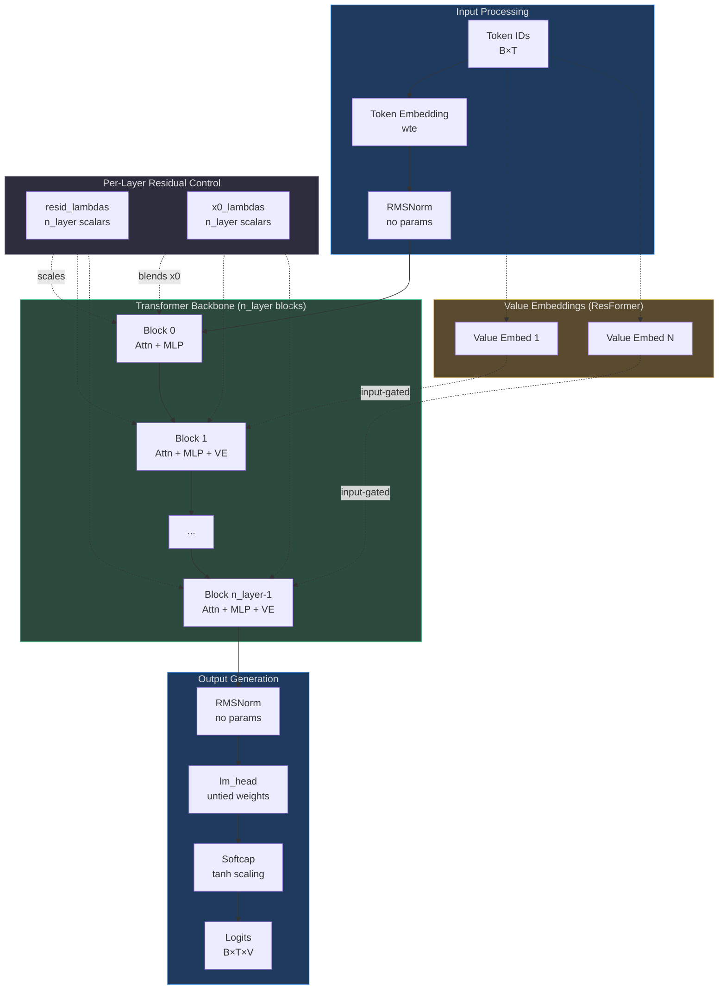
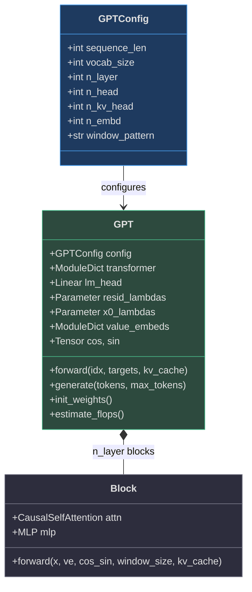
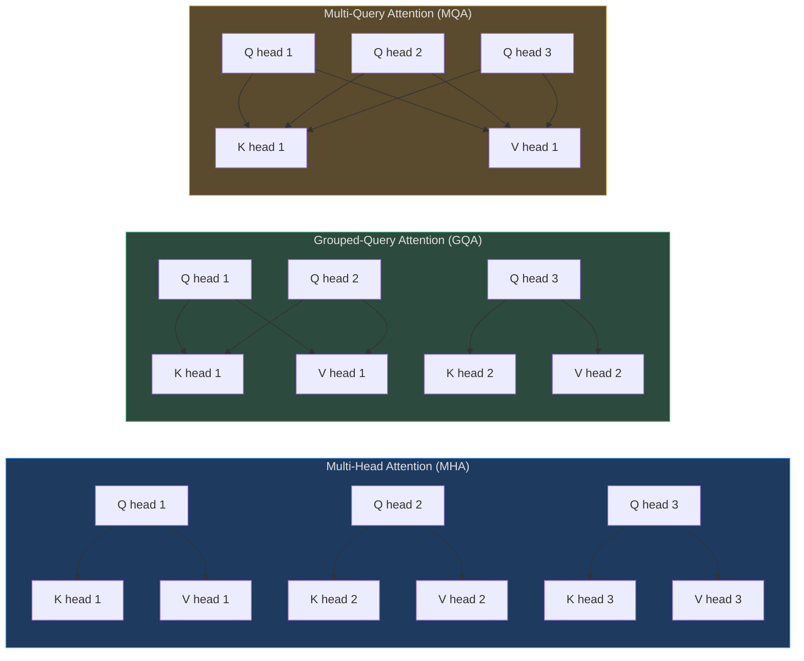
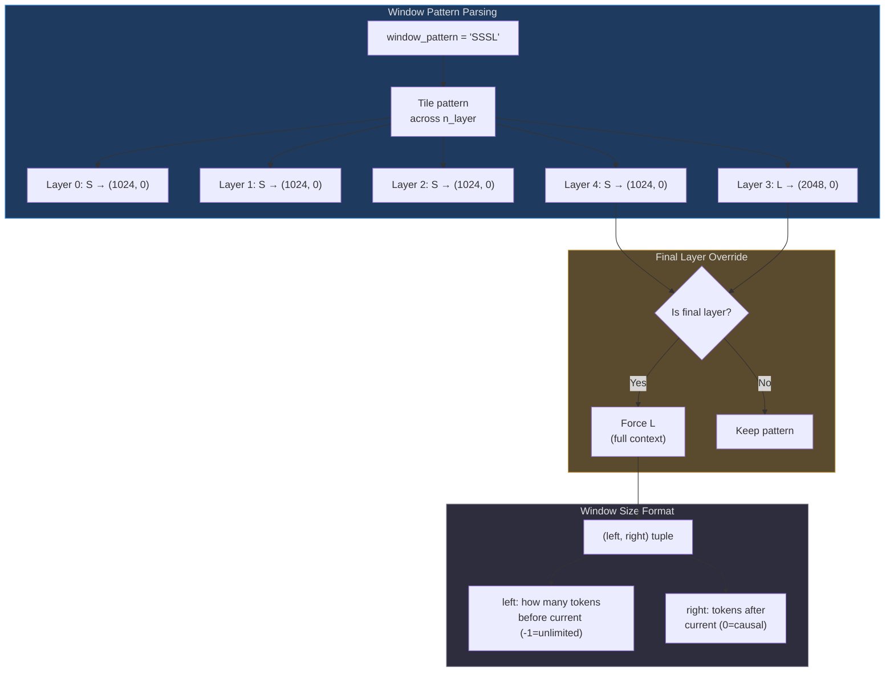
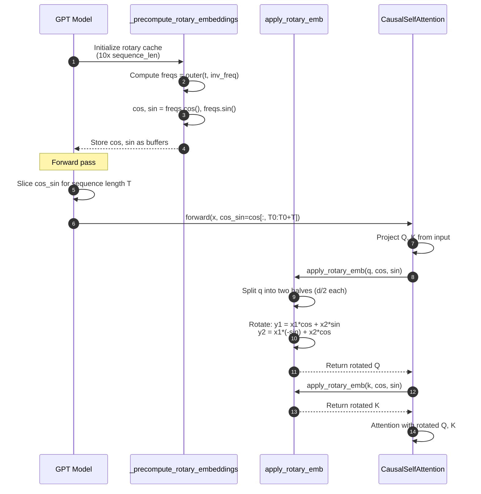

# GPT Transformer Model

The nanochat GPT implementation represents a **modernized, simplified Transformer architecture** optimized for efficient training at the GPT-2 scale (~100M parameters). Unlike vanilla GPT-2, this model incorporates architectural innovations from recent research while maintaining clarity and simplicity.

## Why This Architecture?

The design choices reflect a deliberate balance between **modern best practices** and **training efficiency**:

1. **Simplicity**: No positional embeddings (uses RoPE instead), no bias terms, no learnable normalization parameters
2. **Stability**: QK normalization prevents attention score explosions, ReLU² activation for better gradients
3. **Efficiency**: GQA reduces KV cache size for inference, sliding window attention scales to longer contexts
4. **Performance**: Untied embeddings, value embeddings (ResFormer), per-layer residual scalars

The architecture is implemented in [nanochat/gpt.py:146-424](https://github.com/karpathy/nanochat/blob/master/nanochat/gpt.py#L146-L424) in **~300 lines of PyTorch**.

## Architecture Overview

| Component | Implementation | Key Insight | Source |
|-----------|---------------|-------------|--------|
| **Embeddings** | Token embedding → RMSNorm → Transformer | Normalize embeddings before feeding to blocks | [gpt.py:400-402](https://github.com/karpathy/nanochat/blob/master/nanochat/gpt.py#L400-L402) |
| **Positional Encoding** | Rotary Embeddings (RoPE) | No learned positional embeddings, relative positions in attention | [gpt.py:51-57](https://github.com/karpathy/nanochat/blob/master/nanochat/gpt.py#L51-L57) |
| **Attention** | Grouped-Query Attention (GQA) with QK norm | Share K/V heads across query heads for efficiency | [gpt.py:59-118](https://github.com/karpathy/nanochat/blob/master/nanochat/gpt.py#L59-L118) |
| **Feedforward** | ReLU² MLP (4x expansion) | Squared ReLU for improved gradient flow | [gpt.py:121-131](https://github.com/karpathy/nanochat/blob/master/nanochat/gpt.py#L121-L131) |
| **Normalization** | RMSNorm (no learnable params) | Purely functional normalization | [gpt.py:42-44](https://github.com/karpathy/nanochat/blob/master/nanochat/gpt.py#L42-L44) |
| **Output** | Untied lm_head with softcap | Separate unembedding weights, logit capping | [gpt.py:167](https://github.com/karpathy/nanochat/blob/master/nanochat/gpt.py#L167), [gpt.py:410-414](https://github.com/karpathy/nanochat/blob/master/nanochat/gpt.py#L410-L414) |

## High-Level Architecture Diagram


<!-- Sources: nanochat/gpt.py:146-424 -->

## Configuration Dataclass

The model is configured via `GPTConfig`, a simple dataclass that defines all architectural hyperparameters:

| Parameter | Description | Typical Value | Source |
|-----------|-------------|---------------|--------|
| `sequence_len` | Maximum sequence length (context window) | 2048 | [gpt.py:30](https://github.com/karpathy/nanochat/blob/master/nanochat/gpt.py#L30) |
| `vocab_size` | Vocabulary size | 32768 | [gpt.py:31](https://github.com/karpathy/nanochat/blob/master/nanochat/gpt.py#L31) |
| `n_layer` | Number of Transformer blocks | 12 (d12), 26 (d26 GPT-2) | [gpt.py:32](https://github.com/karpathy/nanochat/blob/master/nanochat/gpt.py#L32) |
| `n_head` | Number of query heads | 6 | [gpt.py:33](https://github.com/karpathy/nanochat/blob/master/nanochat/gpt.py#L33) |
| `n_kv_head` | Number of key/value heads (GQA) | 6 (n_head for MHA) | [gpt.py:34](https://github.com/karpathy/nanochat/blob/master/nanochat/gpt.py#L34) |
| `n_embd` | Model dimension | 768 | [gpt.py:35](https://github.com/karpathy/nanochat/blob/master/nanochat/gpt.py#L35) |
| `window_pattern` | Sliding window pattern (L=long, S=short) | "SSSL" | [gpt.py:39](https://github.com/karpathy/nanochat/blob/master/nanochat/gpt.py#L39) |


<!-- Sources: nanochat/gpt.py:28-39, nanochat/gpt.py:146-424 -->

## Grouped-Query Attention (GQA)

GQA is a **hybrid between Multi-Head Attention (MHA) and Multi-Query Attention (MQA)**, balancing model quality and inference efficiency:

- **MHA**: Each query head has its own K/V heads (`n_kv_head = n_head`)
- **MQA**: All query heads share a single K/V head (`n_kv_head = 1`)
- **GQA**: Query heads are grouped, sharing K/V heads (`1 < n_kv_head ≤ n_head`)


<!-- Sources: nanochat/gpt.py:64-68 -->

**Implementation details** ([gpt.py:64-71](https://github.com/karpathy/nanochat/blob/master/nanochat/gpt.py#L64-L71)):

```python
# GQA constraint: n_kv_head divides n_head
assert self.n_kv_head <= self.n_head and self.n_head % self.n_kv_head == 0

# Q projection has n_head heads, K/V projections have n_kv_head heads
self.c_q = nn.Linear(self.n_embd, self.n_head * self.head_dim, bias=False)
self.c_k = nn.Linear(self.n_embd, self.n_kv_head * self.head_dim, bias=False)
self.c_v = nn.Linear(self.n_embd, self.n_kv_head * self.head_dim, bias=False)
```

**Why GQA?**
- **Inference speed**: KV cache size scales with `n_kv_head`, not `n_head` → smaller memory footprint
- **Quality**: Maintains most of MHA's representational power (unlike MQA)
- **Compatibility**: PyTorch's `enable_gqa=True` flag in SDPA handles head broadcasting automatically

## Sliding Window Attention

The `window_pattern` string controls which layers use **full context** (L) vs **sliding window** (S):

| Pattern | Meaning | Example (n_layer=4) | Effective Context |
|---------|---------|---------------------|-------------------|
| `"L"` | All layers use full context | L, L, L, L | 2048, 2048, 2048, 2048 |
| `"SL"` | Alternating short/long | S, L, S, L | 1024, 2048, 1024, 2048 |
| `"SSSL"` | Three short, one long (default) | S, S, S, L, S, S, S, L, ... | 1024, 1024, 1024, 2048 |


<!-- Sources: nanochat/gpt.py:260-287, nanochat/gpt.py:36-39 -->

**Implementation** ([gpt.py:260-287](https://github.com/karpathy/nanochat/blob/master/nanochat/gpt.py#L260-L287)):

```python
def _compute_window_sizes(self, config):
    pattern = config.window_pattern.upper()
    long_window = config.sequence_len  # 2048
    short_window = long_window // 2    # 1024
    
    char_to_window = {
        "L": (long_window, 0),   # (-1, 0) would be truly unlimited
        "S": (short_window, 0),
    }
    
    # Tile pattern across layers
    window_sizes = []
    for layer_idx in range(config.n_layer):
        char = pattern[layer_idx % len(pattern)]
        window_sizes.append(char_to_window[char])
    
    # Final layer always gets full context
    window_sizes[-1] = (long_window, 0)
    return window_sizes
```

**FLOPS impact**: Attention FLOPs scale with effective context length. The `estimate_flops()` method accounts for this when computing model FLOPs ([gpt.py:310-315](https://github.com/karpathy/nanochat/blob/master/nanochat/gpt.py#L310-L315)).

## Rotary Position Embeddings (RoPE)

Instead of learned positional embeddings, nanochat uses **Rotary Position Embeddings**, which encode relative positions by **rotating pairs of dimensions** in the Q and K vectors.


<!-- Sources: nanochat/gpt.py:51-57, nanochat/gpt.py:243-258, nanochat/gpt.py:91-93 -->

**Why RoPE?**
1. **Relative positions**: Attention scores depend on relative distance, not absolute positions
2. **Extrapolation**: Can handle longer sequences than trained on (with some degradation)
3. **No learned params**: Pure mathematical transformation, no training cost
4. **Efficient**: Precomputed, stored as non-persistent buffers

**Implementation details** ([gpt.py:51-57](https://github.com/karpathy/nanochat/blob/master/nanochat/gpt.py#L51-L57)):

```python
def apply_rotary_emb(x, cos, sin):
    assert x.ndim == 4  # (B, T, H, D)
    d = x.shape[3] // 2
    x1, x2 = x[..., :d], x[..., d:]  # split last dim in half
    y1 = x1 * cos + x2 * sin         # rotate pairs of dims
    y2 = x1 * (-sin) + x2 * cos
    return torch.cat([y1, y2], 3)
```

## Value Embeddings (ResFormer)

Every **alternating layer** (and always the final layer) includes a **value embedding** that mixes a learned token representation into the value projection:

```mermaid
graph TB
    subgraph ValueEmbedding["Value Embedding Mechanism"]
        Input[Input x<br/>B×T×C] --> VProj[V projection<br/>c_v]
        Input --> VEmbed[Value embedding<br/>vocab_size → n_kv_head*D]
        Input --> Gate[Input-dependent gate<br/>2*sigmoid]
        
        VProj --> V[V<br/>B×T×n_kv_head×D]
        VEmbed --> VE[VE<br/>B×T×n_kv_head×D]
        Gate --> G[G<br/>B×T×n_kv_head]
        
        V --> Mix[V + G * VE]
        VE --> Mix
        G --> Mix
        
        Mix --> Output[Gated value<br/>to attention]
    end
    
    subgraph LayerSelection["Which Layers Have VE?"]
        HasVE{has_ve(layer_idx, n_layer)}
        HasVE -->|Yes| VELayers["Alternating pattern<br/>aligned to final layer"]
        HasVE -->|No| NoVE["Standard V projection"]
        
        Example["Example: n_layer=12<br/>Layers with VE: 1, 3, 5, 7, 9, 11"]
    end
    
    style ValueEmbedding fill:#2d4a3e,stroke:#4aba8a,color:#e0e0e0
    style LayerSelection fill:#1e3a5f,stroke:#4a9eed,color:#e0e0e0
    style Example fill:#2d2d3d,stroke:#7a7a8a,color:#e0e0e0
```
<!-- Sources: nanochat/gpt.py:47-49, nanochat/gpt.py:73-74, nanochat/gpt.py:86-89 -->

**Why value embeddings?**
- Adds **direct token-level routing** into attention values
- Inspired by **ResFormer** architecture
- Gate range `(0, 2)` allows both suppression and amplification
- Only uses first 32 channels for gating to limit parameter cost

**Implementation** ([gpt.py:86-89](https://github.com/karpathy/nanochat/blob/master/nanochat/gpt.py#L86-L89)):

```python
if ve is not None:
    ve = ve.view(B, T, self.n_kv_head, self.head_dim)
    gate = 2 * torch.sigmoid(self.ve_gate(x[..., :self.ve_gate_channels]))  # (B, T, n_kv_head)
    v = v + gate.unsqueeze(-1) * ve
```

## RMSNorm Without Learnable Parameters

Unlike standard LayerNorm or RMSNorm, nanochat uses **purely functional RMSNorm** with no learnable scale/shift:

```python
def norm(x):
    # Purely functional rmsnorm with no learnable params
    return F.rms_norm(x, (x.size(-1),))
```

**Why no learnable params?**
1. **Stability**: Prevents instability from poor normalization parameter init
2. **Simplicity**: One less hyperparameter to tune (init scale, LR)
3. **Muon optimizer**: Works well with matrix-only parameter groups
4. **Empirical evidence**: Modern LLMs (e.g., Llama 3) use parameter-free norms

## Logit Softcap

The output logits are **capped to the range [-15, 15]** using a smooth tanh function before loss computation:

```python
softcap = 15
logits = softcap * torch.tanh(logits / softcap)
```

**Why softcap?**
- **Prevents extreme logits**: Outlier logits can cause training instability
- **Smooth gradients**: Tanh smoothly saturates vs hard clipping
- **Loss scale**: Keeps loss magnitudes manageable
- **Common in modern LLMs**: Gemma, Gemini, and others use softcapping

## Residual Connection Enhancements

nanochat adds **two sets of per-layer learnable scalars** that control residual connections:

| Parameter | Role | Init Value | Source |
|-----------|------|------------|--------|
| `resid_lambdas[i]` | Scales residual stream at layer i | 1.0 | [gpt.py:220](https://github.com/karpathy/nanochat/blob/master/nanochat/gpt.py#L220) |
| `x0_lambdas[i]` | Blends initial embedding x0 back in | 0.1 | [gpt.py:221](https://github.com/karpathy/nanochat/blob/master/nanochat/gpt.py#L221) |

**Forward pass** ([gpt.py:404-406](https://github.com/karpathy/nanochat/blob/master/nanochat/gpt.py#L404-L406)):

```python
x0 = x  # save initial normalized embedding
for i, block in enumerate(self.transformer.h):
    x = self.resid_lambdas[i] * x + self.x0_lambdas[i] * x0  # per-layer residual control
    x = block(x, ve, cos_sin, self.window_sizes[i], kv_cache)
```

```mermaid
stateDiagram-v2
    [*] --> x0: x0 = norm(wte(tokens))
    
    x0 --> Layer0: x = resid_λ[0]*x + x0_λ[0]*x0
    Layer0 --> Block0: block(x)
    Block0 --> Layer1: x = resid_λ[1]*x + x0_λ[1]*x0
    Layer1 --> Block1: block(x)
    Block1 --> LayerN: ...
    LayerN --> BlockN: x = resid_λ[N-1]*x + x0_λ[N-1]*x0<br/>block(x)
    
    BlockN --> Output: norm(x) → lm_head
    Output --> [*]
    
    note right of x0: Saved at start,<br/>blended back in<br/>at every layer
    note right of Layer0: resid_lambdas: init 1.0<br/>x0_lambdas: init 0.1
```
<!-- Sources: nanochat/gpt.py:220-221, nanochat/gpt.py:400-406 -->

**Why these scalars?**
- **Inspired by modded-nanogpt**: Empirically improves training dynamics
- **Separate optimizer treatment**: Scalars use AdamW with high LR (0.5), matrices use Muon
- **x0 shortcut**: Allows deep layers direct access to input embeddings

## Parameter Initialization

Weights are initialized carefully to balance training stability and convergence speed ([gpt.py:188-236](https://github.com/karpathy/nanochat/blob/master/nanochat/gpt.py#L188-L236)):

| Parameter Group | Init Strategy | Standard Deviation | Rationale |
|----------------|---------------|-------------------|-----------|
| Token embedding (`wte`) | Normal | 1.0 | Large scale for diversity |
| LM head (`lm_head`) | Normal | 0.001 | Very small to prevent extreme initial logits |
| Attention/MLP weights | Uniform | `1/√n_embd` | Variance-preserving init |
| Attention/MLP projections | Zeros | 0.0 | Residual paths start neutral |
| `resid_lambdas` | Constant | 1.0 | Standard residual connection |
| `x0_lambdas` | Constant | 0.1 | Small initial skip connection |
| Value embeddings | Uniform | `1/√n_embd` | Match c_v init |
| VE gates | Zeros | 0.0 | Gates start neutral (sigmoid(0)=0.5 → 2*0.5=1.0) |

## FLOPS Estimation

The model computes its own forward+backward FLOPS for training efficiency metrics ([gpt.py:292-317](https://github.com/karpathy/nanochat/blob/master/nanochat/gpt.py#L292-L317)):

```python
def estimate_flops(self):
    nparams = sum(p.numel() for p in self.parameters())
    # Exclude embeddings and scalars (not matmuls)
    nparams_exclude = (wte + value_embeds + resid_lambdas + x0_lambdas)
    
    # Matmul FLOPs: 6x per weight (2 forward, 4 backward)
    matmul_flops = 6 * (nparams - nparams_exclude)
    
    # Attention FLOPs: 12*h*q*effective_seq_len per layer
    # Account for sliding window reducing effective context
    attn_flops = sum(12 * n_head * head_dim * min(window, seq_len) 
                     for window in self.window_sizes)
    
    return matmul_flops + attn_flops
```

**Used for MFU calculation**: `MFU = achieved_FLOPS / peak_FLOPS = (model_flops * tokens_per_sec) / get_peak_flops(device)`

## Parameter Counting for Scaling Laws

Different scaling law papers count parameters differently. The `num_scaling_params()` method returns a detailed breakdown ([gpt.py:319-346](https://github.com/karpathy/nanochat/blob/master/nanochat/gpt.py#L319-L346)):

| Group | Included in Total | Kaplan et al. | Chinchilla |
|-------|-------------------|---------------|------------|
| `wte` (token embedding) | ✅ | ❌ | ✅ |
| `value_embeds` | ✅ | ❌ | ✅ |
| `lm_head` (unembedding) | ✅ | ❌ | ✅ |
| `transformer_matrices` (Q/K/V/MLP) | ✅ | ✅ | ✅ |
| `scalars` (resid/x0 lambdas) | ✅ | ❌ | ❌ |

## References

- **Rotary Position Embeddings**: [RoFormer: Enhanced Transformer with Rotary Position Embedding](https://arxiv.org/abs/2104.09864)
- **Grouped-Query Attention**: [GQA: Training Generalized Multi-Query Transformer Models](https://arxiv.org/abs/2305.13245)
- **ReLU² Activation**: [Primer: Searching for Efficient Transformers](https://arxiv.org/abs/2109.08668)
- **QK Normalization**: [Transformers without Tears](https://arxiv.org/abs/1910.05895)
- **Value Embeddings**: [ResFormer: Scaling ViTs with Multi-Resolution Training](https://arxiv.org/abs/2212.00776)
- **Chinchilla Scaling Laws**: [Training Compute-Optimal Large Language Models](https://arxiv.org/abs/2203.15556)
- **Logit Softcapping**: Used in Gemma/Gemini models
