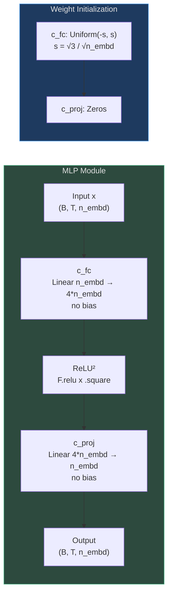
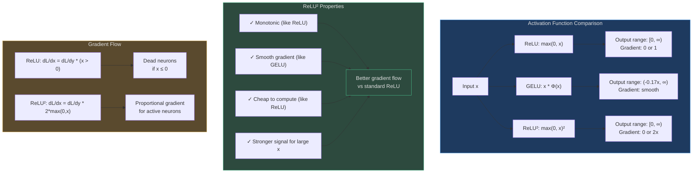
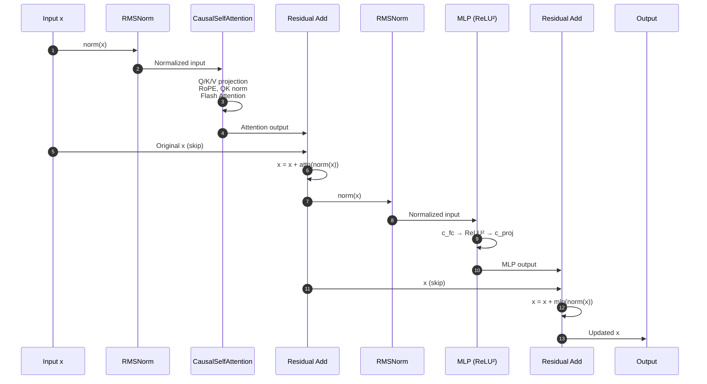
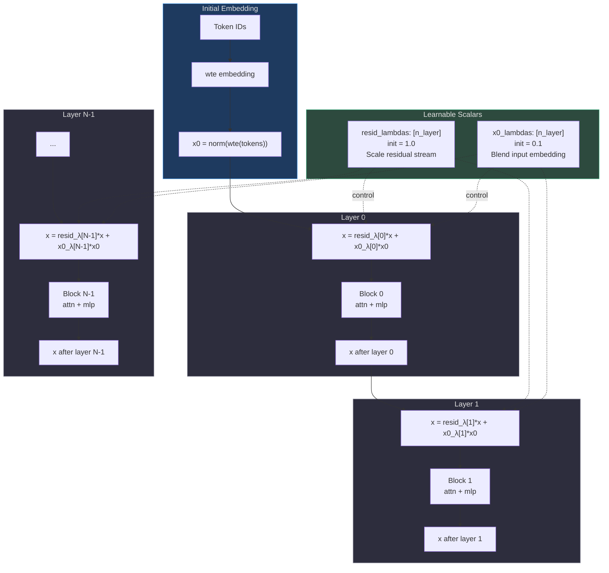
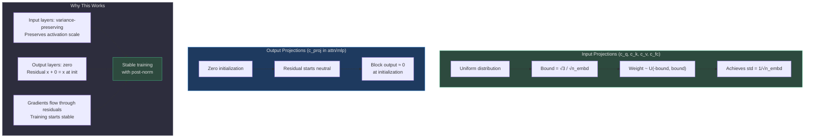
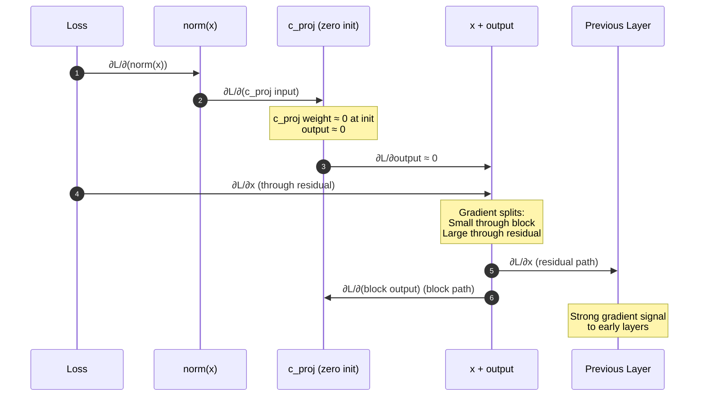

# MLP & Transformer Blocks

The nanochat Transformer block consists of two core components: **CausalSelfAttention** and **MLP (Multi-Layer Perceptron)**. Both use **post-normalization** with residual connections, and the model adds per-layer learnable scalars for fine-grained residual control.

## Why This Design?

The implementation prioritizes **simplicity and training stability**:

1. **ReLU² activation**: Squared ReLU in MLP for improved gradient flow over standard ReLU/GELU
2. **Post-norm residuals**: Simpler than pre-norm, works well with proper initialization
3. **Per-layer scalars**: Learnable multipliers for residual stream and input embedding skip connections
4. **No bias terms**: All linear layers use `bias=False` for efficiency
5. **Functional normalization**: RMSNorm with no learnable parameters

The MLP and Block implementations total **~30 lines** ([gpt.py:121-143](https://github.com/karpathy/nanochat/blob/master/nanochat/gpt.py#L121-L143)).

## Component Overview

| Component | Purpose | Key Feature | Source |
|-----------|---------|-------------|--------|
| **MLP** | Feed-forward transformation | ReLU² activation, 4x expansion ratio | [gpt.py:121-131](https://github.com/karpathy/nanochat/blob/master/nanochat/gpt.py#L121-L131) |
| **Block** | Single Transformer layer | Attention + MLP with residuals | [gpt.py:134-143](https://github.com/karpathy/nanochat/blob/master/nanochat/gpt.py#L134-L143) |
| **resid_lambdas** | Residual scaling | Per-layer multiplier for residual stream | [gpt.py:172](https://github.com/karpathy/nanochat/blob/master/nanochat/gpt.py#L172) |
| **x0_lambdas** | Input skip connection | Blends initial embedding back at each layer | [gpt.py:173](https://github.com/karpathy/nanochat/blob/master/nanochat/gpt.py#L173) |

## MLP Architecture

The MLP is a standard two-layer feed-forward network with ReLU² activation:


<!-- Sources: nanochat/gpt.py:121-131 -->

**Implementation** ([gpt.py:121-131](https://github.com/karpathy/nanochat/blob/master/nanochat/gpt.py#L121-L131)):

```python
class MLP(nn.Module):
    def __init__(self, config):
        super().__init__()
        self.c_fc = nn.Linear(config.n_embd, 4 * config.n_embd, bias=False)
        self.c_proj = nn.Linear(4 * config.n_embd, config.n_embd, bias=False)

    def forward(self, x):
        x = self.c_fc(x)
        x = F.relu(x).square()  # ReLU²
        x = self.c_proj(x)
        return x
```

## ReLU² Activation Function

The **squared ReLU** activation (`F.relu(x).square()`) replaces the traditional GELU or SiLU:


<!-- Sources: nanochat/gpt.py:129 -->

**Why ReLU²?**

| Aspect | ReLU | GELU | ReLU² |
|--------|------|------|-------|
| **Computation** | Trivial | Expensive (erf/tanh) | Cheap (one square) |
| **Gradient strength** | Binary (0 or 1) | Smooth, small | Proportional (0 or 2x) |
| **Dead neurons** | Common (x ≤ 0) | Rare | Rare |
| **Training stability** | Moderate | Good | Good |
| **Papers using it** | Universal (2012-2017) | GPT-2, BERT | Primer, PaLM |

**Empirical evidence**: The Primer paper ([arXiv:2109.08668](https://arxiv.org/abs/2109.08668)) found ReLU² matched or exceeded GELU performance with lower compute cost.

## Transformer Block Structure

Each Transformer block applies attention and MLP with post-normalization:


<!-- Sources: nanochat/gpt.py:140-142 -->

**Implementation** ([gpt.py:134-143](https://github.com/karpathy/nanochat/blob/master/nanochat/gpt.py#L134-L143)):

```python
class Block(nn.Module):
    def __init__(self, config, layer_idx):
        super().__init__()
        self.attn = CausalSelfAttention(config, layer_idx)
        self.mlp = MLP(config)

    def forward(self, x, ve, cos_sin, window_size, kv_cache):
        x = x + self.attn(norm(x), ve, cos_sin, window_size, kv_cache)
        x = x + self.mlp(norm(x))
        return x
```

**Post-norm vs Pre-norm**:

```mermaid
graph TB
    subgraph PostNorm["Post-Norm (nanochat)"]
        PN1[x] --> PNAttn["attn(norm(x))"]
        PN1 --> PNAdd1["+"]
        PNAttn --> PNAdd1
        PNAdd1 --> PN2[x']
        PN2 --> PNMLP["mlp(norm(x'))"]
        PN2 --> PNAdd2["+"]
        PNMLP --> PNAdd2
        PNAdd2 --> PNOut[x'']
    end
    
    subgraph PreNorm["Pre-Norm (GPT-2, BERT)"]
        PreN1[x] --> PreNorm1["norm(x)"]
        PreNorm1 --> PreAttn["attn"]
        PreN1 --> PreAdd1["+"]
        PreAttn --> PreAdd1
        PreAdd1 --> PreN2[x']
        PreN2 --> PreNorm2["norm(x')"]
        PreNorm2 --> PreMLP["mlp"]
        PreN2 --> PreAdd2["+"]
        PreMLP --> PreAdd2
        PreAdd2 --> PreOut[x'']
    end
    
    subgraph Comparison["Key Differences"]
        Diff1["Post-Norm: norm applied<br/>to residual stream"] --> Stable
        Diff2["Pre-Norm: norm applied<br/>before sublayer"] --> Training
        Stable["Requires careful init<br/>More stable with Muon"]
        Training["Easier to train<br/>Standard in 2018-2020"]
    end
    
    style PostNorm fill:#2d4a3e,stroke:#4aba8a,color:#e0e0e0
    style PreNorm fill:#1e3a5f,stroke:#4a9eed,color:#e0e0e0
    style Comparison fill:#2d2d3d,stroke:#7a7a8a,color:#e0e0e0
```


<!-- Sources: nanochat/gpt.py:140-142 -->

**Why post-norm in nanochat?**
1. **Muon optimizer**: Works better with post-norm (empirically)
2. **Simpler gradient flow**: Fewer normalization layers in backward pass
3. **Modern trend**: Recent models (e.g., modded-nanogpt) prefer post-norm
4. **Requires good init**: Zero-init on projection layers is critical

## Per-Layer Residual Control

The GPT model adds **learnable scalar multipliers** for fine-grained control of residual connections:


<!-- Sources: nanochat/gpt.py:172-173, nanochat/gpt.py:220-221, nanochat/gpt.py:400-406 -->

**Implementation** ([gpt.py:400-406](https://github.com/karpathy/nanochat/blob/master/nanochat/gpt.py#L400-L406)):

```python
x = self.transformer.wte(idx)  # token embedding
x = norm(x)
x0 = x  # save initial normalized embedding for x0 residual

for i, block in enumerate(self.transformer.h):
    # Per-layer residual control
    x = self.resid_lambdas[i] * x + self.x0_lambdas[i] * x0
    ve = self.value_embeds[str(i)](idx) if str(i) in self.value_embeds else None
    x = block(x, ve, cos_sin, self.window_sizes[i], kv_cache)
```

### resid_lambdas

**Purpose**: Scale the residual stream before entering each block.

| Init Value | Training Behavior | Effect |
|------------|-------------------|--------|
| 1.0 | Standard residual connection | Neutral starting point |
| Can decrease | Layer contributes less to output | Gradual information flow |
| Can increase | Layer amplifies signal | Stronger per-layer updates |

**Optimizer treatment** ([gpt.py:371](https://github.com/karpathy/nanochat/blob/master/nanochat/gpt.py#L371)):
```python
dict(kind='adamw', params=resid_params, lr=scalar_lr * 0.01, ...)
```
- Uses **AdamW** (not Muon) with very low LR (`0.01 * scalar_lr = 0.005`)
- Encourages slow adaptation of residual scales

### x0_lambdas

**Purpose**: Blend the initial embedding `x0` back into the residual stream at each layer.

| Init Value | Training Behavior | Effect |
|------------|-------------------|--------|
| 0.1 | Small skip connection to input | Mild shortcut for deep layers |
| Can increase | Stronger skip connection | More direct path to input |
| Can decrease | Weaker skip connection | Less reliance on embedding |

**Optimizer treatment** ([gpt.py:372](https://github.com/karpathy/nanochat/blob/master/nanochat/gpt.py#L372)):
```python
dict(kind='adamw', params=x0_params, lr=scalar_lr, betas=(0.96, 0.95), ...)
```
- Uses **AdamW** with full `scalar_lr=0.5`
- Higher `beta1=0.96` (vs 0.8 for other params) for slower momentum decay
- Allows x0 skip strength to adapt more freely

**Why x0 skip connections?**
1. **Deep network gradients**: Provides alternative gradient path to input
2. **Semantic preservation**: Deep layers can access original token semantics
3. **Inspired by DenseNet**: Skip connections from early layers to late layers
4. **Empirically helpful**: From modded-nanogpt experiments

## Block-Level Data Flow

```mermaid
flowchart TB
    subgraph Block["Single Transformer Block (forward pass)"]
        Start[Input: x, ve, cos_sin,<br/>window_size, kv_cache]
        
        Start --> PreAttn["Pre-Attention:<br/>attn_input = norm(x)"]
        PreAttn --> AttnProj["Q/K/V projection<br/>(B, T, H, D)"]
        AttnProj --> VEAdd{ve exists?}
        VEAdd -->|Yes| ApplyVE["V = V + gate*ve"]
        VEAdd -->|No| SkipVE[Keep V]
        ApplyVE --> RoPEQK
        SkipVE --> RoPEQK["Apply RoPE to Q, K<br/>QK norm"]
        
        RoPEQK --> CacheCheck{kv_cache?}
        CacheCheck -->|None| Training["Flash Attn<br/>(training)"]
        CacheCheck -->|Exists| Inference["Flash Attn<br/>(inference with cache)"]
        
        Training --> AttnOut[Attention output]
        Inference --> AttnOut
        
        AttnOut --> AttnProj2["c_proj projection"]
        AttnProj2 --> AttnResid["x = x + attn_out<br/>(residual add)"]
        
        AttnResid --> PreMLP["Pre-MLP:<br/>mlp_input = norm(x)"]
        PreMLP --> MLPfc["c_fc: n_embd → 4*n_embd"]
        MLPfc --> ReLU2["ReLU²"]
        ReLU2 --> MLPproj["c_proj: 4*n_embd → n_embd"]
        MLPproj --> MLPresid["x = x + mlp_out<br/>(residual add)"]
        
        MLPresid --> Output[Output: x]
    end
    
    style PreAttn fill:#1e3a5f,stroke:#4a9eed,color:#e0e0e0
    style PreMLP fill:#1e3a5f,stroke:#4a9eed,color:#e0e0e0
    style Training fill:#2d4a3e,stroke:#4aba8a,color:#e0e0e0
    style Inference fill:#5a4a2e,stroke:#d4a84b,color:#e0e0e0
    style AttnResid fill:#2d2d3d,stroke:#7a7a8a,color:#e0e0e0
    style MLPresid fill:#2d2d3d,stroke:#7a7a8a,color:#e0e0e0
```


<!-- Sources: nanochat/gpt.py:140-142 -->

## Weight Initialization Strategy

Careful initialization is critical for training stability with post-norm:


<!-- Sources: nanochat/gpt.py:208-217 -->

**Implementation** ([gpt.py:208-217](https://github.com/karpathy/nanochat/blob/master/nanochat/gpt.py#L208-L217)):

```python
# Uniform init with bound = sqrt(3) * std
s = 3**0.5 * n_embd**-0.5  # sqrt(3) / sqrt(n_embd)

for block in self.transformer.h:
    # Input projections: variance-preserving uniform
    torch.nn.init.uniform_(block.attn.c_q.weight, -s, s)
    torch.nn.init.uniform_(block.attn.c_k.weight, -s, s)
    torch.nn.init.uniform_(block.attn.c_v.weight, -s, s)
    torch.nn.init.uniform_(block.mlp.c_fc.weight, -s, s)
    
    # Output projections: zero init (residual starts neutral)
    torch.nn.init.zeros_(block.attn.c_proj.weight)
    torch.nn.init.zeros_(block.mlp.c_proj.weight)
```

**Why uniform instead of normal?**
- Uniform distribution with same std **avoids outliers**
- Normal distribution has long tails → rare but extreme weights
- Uniform is bounded → no initialization-time activation explosions
- Empirically: slightly better training stability (from modded-nanogpt)

## Gradient Flow Analysis

Post-norm with zero-init projections creates clean gradient paths:


<!-- Sources: nanochat/gpt.py:215-217 -->

**Key insight**: Zero-init projections mean:
1. At initialization, blocks contribute ≈0 to output
2. Gradients flow primarily through residual connections
3. Training starts stable, blocks gradually learn to contribute
4. Avoids "dead blocks" where gradients vanish

## Block Output Statistics

During training, the model learns to balance contributions from attention and MLP:

| Statistic | Expected Behavior | Source |
|-----------|-------------------|--------|
| Attention output norm | Increases from ~0 at init | c_proj zero init |
| MLP output norm | Increases from ~0 at init | c_proj zero init |
| Residual stream norm | Stays relatively constant | Normalization + residuals |
| resid_lambdas | Typically stays near 1.0 | Slow AdamW updates |
| x0_lambdas | May increase slightly (0.1 → 0.15) | Higher learning rate |

**Monitoring during training**: Track layer-wise activation norms to diagnose training issues:
- Sudden spikes → numerical instability
- Vanishing norms → dead layers
- Imbalanced norms → some layers dominating

## Comparison with Standard Transformers

| Aspect | nanochat | GPT-2 / BERT | Llama 3 |
|--------|----------|--------------|---------|
| **Norm placement** | Post-norm | Pre-norm | RMSNorm (pre-norm style) |
| **Activation** | ReLU² | GELU | SwiGLU |
| **Norm params** | None | Learnable γ, β | None (RMSNorm) |
| **Bias terms** | None | Yes | None |
| **Residual control** | Per-layer λ scalars | Standard add | Standard add |
| **x0 skip** | Yes | No | No |

## References

- **ReLU² Activation**: [Primer: Searching for Efficient Transformers for Language Modeling](https://arxiv.org/abs/2109.08668)
- **Post-Norm Residuals**: [On Layer Normalization in the Transformer Architecture](https://arxiv.org/abs/2002.04745)
- **Per-Layer Residuals**: Inspired by modded-nanogpt
- **Weight Initialization**: [Understanding the difficulty of training deep feedforward neural networks](http://proceedings.mlr.press/v9/glorot10a.html)
- **Skip Connections**: [Deep Residual Learning for Image Recognition](https://arxiv.org/abs/1512.03385)
- **DenseNet-style Skips**: [Densely Connected Convolutional Networks](https://arxiv.org/abs/1608.06993)
