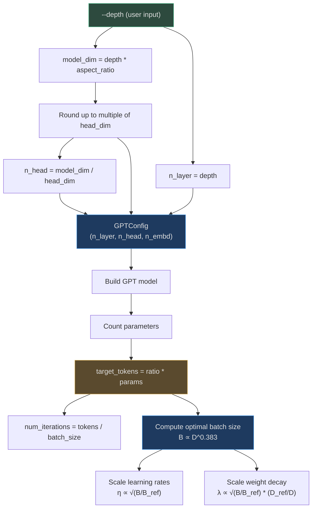
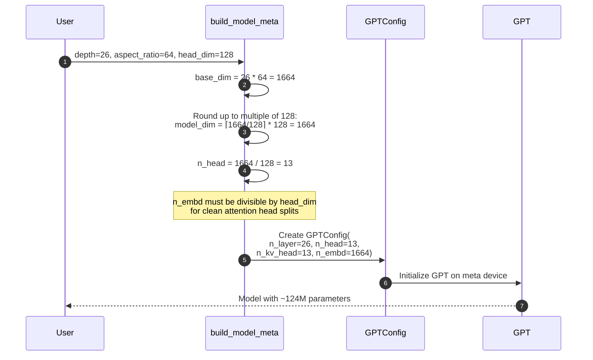
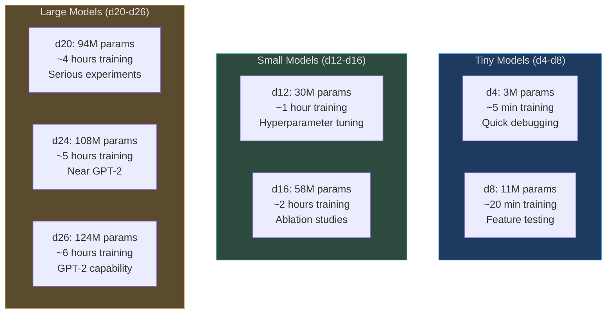
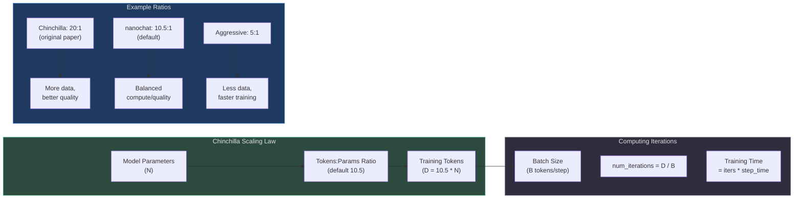
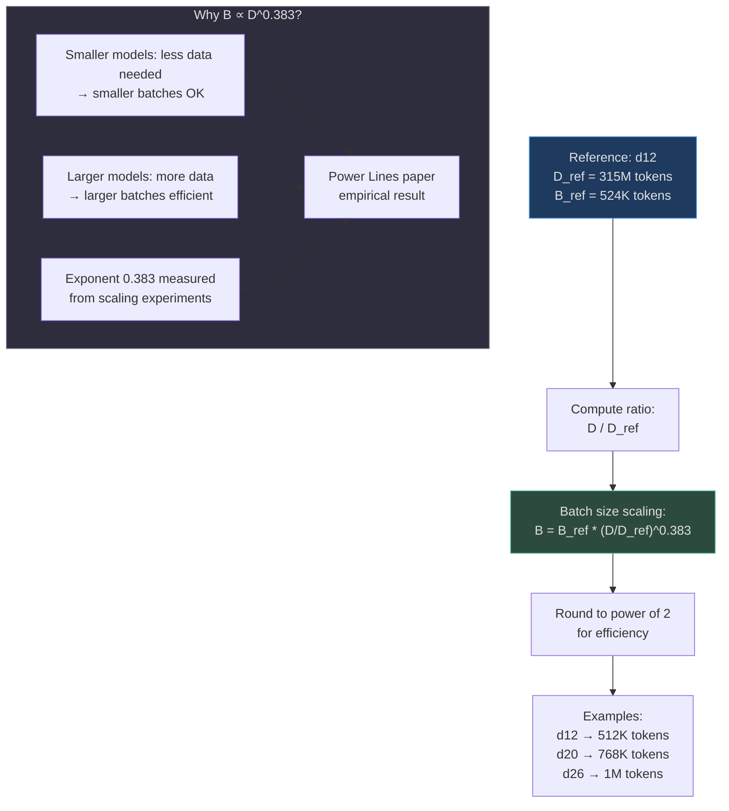
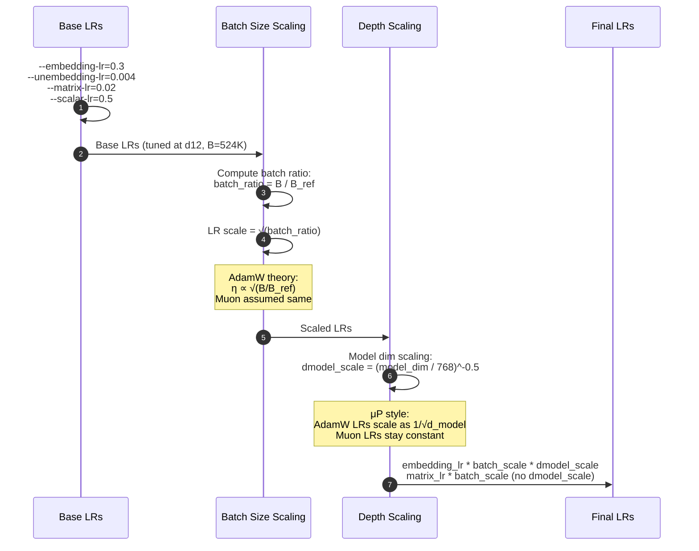
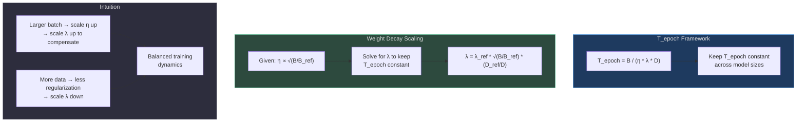
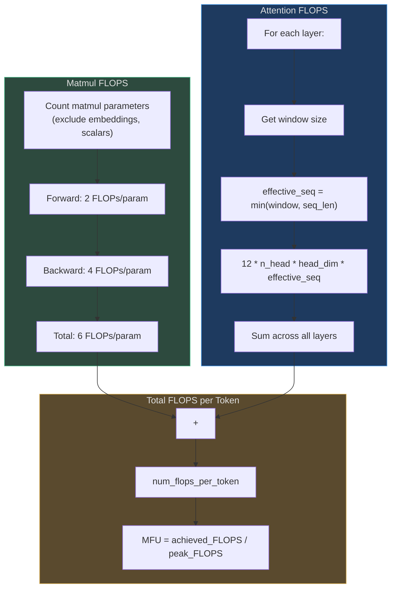
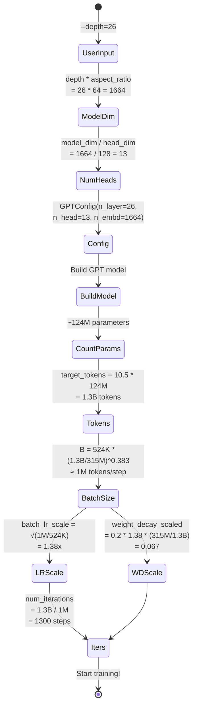
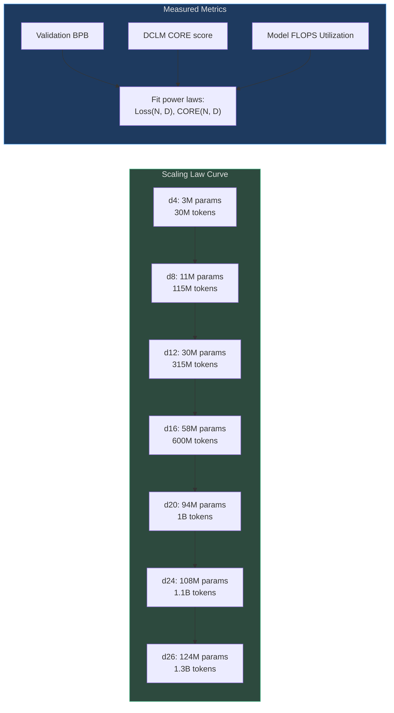

# Model Scaling & Configuration

nanochat implements a **single-dial scaling system** where adjusting `--depth` automatically computes all hyperparameters: model dimensions, number of heads, training horizon, batch size, learning rates, and weight decay. This design follows **μP (maximal update parametrization)** principles and **Chinchilla scaling laws** for compute-optimal training.

## Why This Design?

The single-dial approach provides **unprecedented simplicity**:

1. **One knob controls everything**: From GPT-1 scale (d12, ~30M params) to GPT-2 scale (d26, ~124M params)
2. **Compute-optimal by default**: Automatically maintains optimal tokens-to-parameters ratio (Chinchilla)
3. **Transfer hyperparameters**: Tune at d12, scale to d26 with μP-style LR adjustments
4. **No guesswork**: Batch size, LR, weight decay all computed from scaling laws
5. **Fast experimentation**: Sweep d=4,8,12,16,20,24 to generate scaling law data

The configuration system spans [scripts/base_train.py:40-80](https://github.com/karpathy/nanochat/blob/master/scripts/base_train.py#L40-L80) and [base_train.py:125-300](https://github.com/karpathy/nanochat/blob/master/scripts/base_train.py#L125-L300).

## Configuration Overview

| Parameter | Default | Purpose | Source |
|-----------|---------|---------|--------|
| `--depth` | 20 | Single complexity dial (model size) | [base_train.py:49](https://github.com/karpathy/nanochat/blob/master/scripts/base_train.py#L49) |
| `--aspect-ratio` | 64 | Multiplier for model_dim = depth * aspect_ratio | [base_train.py:50](https://github.com/karpathy/nanochat/blob/master/scripts/base_train.py#L50) |
| `--head-dim` | 128 | Target dimension per attention head | [base_train.py:51](https://github.com/karpathy/nanochat/blob/master/scripts/base_train.py#L51) |
| `--max-seq-len` | 2048 | Maximum context length | [base_train.py:52](https://github.com/karpathy/nanochat/blob/master/scripts/base_train.py#L52) |
| `--target-param-data-ratio` | 10.5 | Tokens per parameter (Chinchilla=20) | [base_train.py:57](https://github.com/karpathy/nanochat/blob/master/scripts/base_train.py#L57) |
| `--total-batch-size` | -1 (auto) | Total tokens per optimization step | [base_train.py:60](https://github.com/karpathy/nanochat/blob/master/scripts/base_train.py#L60) |

## The Depth Dial

The `--depth` parameter is the **single knob** that controls model size:


<!-- Sources: scripts/base_train.py:125-139, scripts/base_train.py:253-298 -->

## Model Dimension Calculation

The model dimension is computed from depth and aspect ratio, then rounded for clean head division:


<!-- Sources: scripts/base_train.py:125-139 -->

**Implementation** ([base_train.py:125-139](https://github.com/karpathy/nanochat/blob/master/scripts/base_train.py#L125-L139)):

```python
def build_model_meta(depth):
    # Model dim is nudged up to nearest multiple of head_dim for clean division
    base_dim = depth * args.aspect_ratio
    model_dim = ((base_dim + args.head_dim - 1) // args.head_dim) * args.head_dim
    num_heads = model_dim // args.head_dim
    
    config = GPTConfig(
        sequence_len=args.max_seq_len,
        vocab_size=vocab_size,
        n_layer=depth,
        n_head=num_heads,
        n_kv_head=num_heads,  # MHA (can be reduced for GQA)
        n_embd=model_dim,
        window_pattern=args.window_pattern,
    )
    
    with torch.device("meta"):
        model_meta = GPT(config)
    return model_meta
```

**Why round to `head_dim` multiple?**
- Flash Attention 3 requires `head_dim` divisible by 8
- Rounding ensures exact division: `n_embd = n_head * head_dim`
- Avoids fractional heads or dimension mismatches

## Model Scaling Examples

| Depth | Aspect Ratio | Model Dim | Heads | Layers | Parameters | Training Tokens | Description |
|-------|--------------|-----------|-------|--------|------------|----------------|-------------|
| **d4** | 64 | 256 | 2 | 4 | ~3M | ~30M | Tiny test model |
| **d8** | 64 | 512 | 4 | 8 | ~11M | ~115M | Small experiment |
| **d12** | 64 | 768 | 6 | 12 | ~30M | ~315M | GPT-1 scale (reference) |
| **d16** | 64 | 1024 | 8 | 16 | ~58M | ~600M | Medium scale |
| **d20** | 64 | 1280 | 10 | 20 | ~94M | ~1B | Large experiment |
| **d24** | 64 | 1536 | 12 | 24 | ~108M | ~1.1B | Near GPT-2 |
| **d26** | 64 | 1664 | 13 | 26 | ~124M | ~1.3B | GPT-2 capability |


<!-- Sources: README.md:58-68, README.md:78-79 -->

## Chinchilla Scaling Laws

The training horizon (number of tokens) is determined by **Chinchilla scaling laws**, which state that compute-optimal models maintain a fixed **tokens-to-parameters ratio**:


<!-- Sources: scripts/base_train.py:253-267 -->

**Implementation** ([base_train.py:253-267](https://github.com/karpathy/nanochat/blob/master/scripts/base_train.py#L253-267)):

```python
# Use scaling laws to determine optimal training horizon
def get_scaling_params(m):
    # transformer_matrices + lm_head gives cleanest scaling laws
    params_counts = m.num_scaling_params()
    scaling_params = params_counts['transformer_matrices'] + params_counts['lm_head']
    return scaling_params

num_scaling_params = get_scaling_params(model)
target_tokens = int(args.target_param_data_ratio * num_scaling_params)

# Reference model: d12 with optimal hyperparameters
d12_ref = build_model_meta(12)
D_REF = args.target_param_data_ratio * get_scaling_params(d12_ref)  # ~315M tokens
B_REF = 2**19  # 524,288 tokens per step (optimal at d12)
```

**Why not count all parameters?**
- Embeddings don't scale the same way as transformer matrices
- `transformer_matrices + lm_head` gives the cleanest scaling curves
- See `dev/LOG.md Jan 27, 2026` for empirical analysis

## Batch Size Scaling

Optimal batch size grows with model size following the **Power Lines** paper ([arXiv:2505.13738](https://arxiv.org/abs/2505.13738)):

$$
B_{\text{opt}} \propto D^{0.383}
$$

Where `D` is the training tokens and `B` is the batch size in tokens.


<!-- Sources: scripts/base_train.py:269-277 -->

**Implementation** ([base_train.py:269-277](https://github.com/karpathy/nanochat/blob/master/scripts/base_train.py#L269-L277)):

```python
total_batch_size = args.total_batch_size  # User override possible
if total_batch_size == -1:
    batch_size_ratio = target_tokens / D_REF
    predicted_batch_size = B_REF * batch_size_ratio ** 0.383
    # Round to nearest power of 2 for efficiency
    total_batch_size = 2 ** round(math.log2(predicted_batch_size))
    print0(f"Auto-computed optimal batch size: {total_batch_size:,} tokens")
```

## Learning Rate Scaling

Learning rates scale with batch size following **√ scaling** for AdamW and Muon:


<!-- Sources: scripts/base_train.py:279-287, scripts/base_train.py:361-363 -->

**Implementation** ([base_train.py:279-287](https://github.com/karpathy/nanochat/blob/master/scripts/base_train.py#L279-L287)):

```python
batch_lr_scale = 1.0
batch_ratio = total_batch_size / B_REF
if batch_ratio != 1.0:
    # AdamW: √ scaling is standard
    # Muon: assumed same scaling as AdamW
    batch_lr_scale = batch_ratio ** 0.5  # η ∝ √(B/B_ref)
    print0(f"Scaling LRs by {batch_lr_scale:.4f} for batch size {total_batch_size:,}")
```

**Model dimension scaling** ([base_train.py:361-363](https://github.com/karpathy/nanochat/blob/master/scripts/base_train.py#L361-L363)):

```python
# Scale AdamW LRs by ∝1/√dmodel (μP style)
dmodel_lr_scale = (model_dim / 768) ** -0.5
print0(f"Scaling AdamW LRs ∝1/√({model_dim}/768) = {dmodel_lr_scale:.6f}")
```

**Why different scaling for different optimizers?**

| Optimizer | Parameters | Batch Size Scaling | Depth Scaling | Rationale |
|-----------|-----------|-------------------|---------------|-----------|
| AdamW | Embeddings, scalars | √(B/B_ref) | 1/√d_model | Standard theory for adaptive optimizers |
| Muon | Transformer matrices | √(B/B_ref) | None | Matrix optimizer needs different μP |

## Weight Decay Scaling

Weight decay scales to maintain constant **T_epoch** (effective training epochs):


<!-- Sources: scripts/base_train.py:289-297 -->

**Implementation** ([base_train.py:289-297](https://github.com/karpathy/nanochat/blob/master/scripts/base_train.py#L289-L297)):

```python
# T_epoch framework: https://arxiv.org/abs/2405.13698
# T_epoch = B/(η·λ·D) should remain constant
# With η ∝ √(B/B_ref), derive: λ = λ_ref · √(B/B_ref) · (D_ref/D)

weight_decay_scaled = (
    args.weight_decay 
    * math.sqrt(total_batch_size / B_REF) 
    * (D_REF / target_tokens)
)
if weight_decay_scaled != args.weight_decay:
    print0(f"Scaling weight decay from {args.weight_decay:.6f} to {weight_decay_scaled:.6f}")
```

**Note**: This theory is developed for AdamW, but nanochat applies it to Muon as well (empirically works).

## FLOPS Estimation

The model computes its forward+backward FLOPS per token for MFU (Model FLOPS Utilization) tracking:


<!-- Sources: nanochat/gpt.py:292-317 -->

**Implementation** ([gpt.py:292-317](https://github.com/karpathy/nanochat/blob/master/nanochat/gpt.py#L292-L317)):

```python
def estimate_flops(self):
    nparams = sum(p.numel() for p in self.parameters())
    # Exclude non-matmul params
    value_embeds_numel = sum(ve.weight.numel() for ve in self.value_embeds.values())
    nparams_exclude = (
        self.transformer.wte.weight.numel() 
        + value_embeds_numel 
        + self.resid_lambdas.numel() 
        + self.x0_lambdas.numel()
    )
    
    # Matmul FLOPs: 6x per weight (2 forward, 4 backward)
    matmul_flops = 6 * (nparams - nparams_exclude)
    
    # Attention FLOPs: sum per layer, accounting for sliding window
    h, q, t = self.config.n_head, self.config.n_embd // self.config.n_head, self.config.sequence_len
    attn_flops = 0
    for window_size in self.window_sizes:
        window = window_size[0]  # (left, right) tuple
        effective_seq = t if window < 0 else min(window, t)
        attn_flops += 12 * h * q * effective_seq
    
    return matmul_flops + attn_flops
```

**MFU calculation**:
```python
# In training loop
mfu = (model_flops * tokens_per_sec) / get_peak_flops(device)
```

**Peak FLOPS** for common GPUs ([common.py:204-258](https://github.com/karpathy/nanochat/blob/master/nanochat/common.py#L204-L258)):

| GPU | BF16 Peak FLOPS | Source |
|-----|-----------------|--------|
| H100 (SXM) | 989 TFLOPS | [common.py:223](https://github.com/karpathy/nanochat/blob/master/nanochat/common.py#L223) |
| H100 (PCIe) | 756 TFLOPS | [common.py:222](https://github.com/karpathy/nanochat/blob/master/nanochat/common.py#L222) |
| A100 | 312 TFLOPS | [common.py:227](https://github.com/karpathy/nanochat/blob/master/nanochat/common.py#L227) |
| RTX 4090 | 165 TFLOPS | [common.py:245](https://github.com/karpathy/nanochat/blob/master/nanochat/common.py#L245) |

## Training Configuration Summary

Putting it all together, here's how a d26 model is configured:


<!-- Sources: scripts/base_train.py:125-298 -->

## Miniseries: Scaling Law Experiments

The `runs/miniseries.sh` script sweeps depth to generate scaling law data:

```bash
# Train models at d=4,6,8,10,12,14,16,18,20,22,24,26
for depth in 4 6 8 10 12 14 16 18 20 22 24 26; do
    python -m scripts.base_train --depth=$depth --run=miniseries_d${depth}
done
```

This generates a **compute-optimal frontier** where each model is trained for the optimal number of tokens given its size:


<!-- Sources: runs/miniseries.sh:1-30 (referenced in catalogue) -->

**Typical results** ([README.md:78-79](https://github.com/karpathy/nanochat/blob/master/README.md#L78-L79)):
- **d12**: ~0.89 BPB, ~0.18 CORE score, ~3-4 hours on 8xH100
- **d26**: ~0.745 BPB, ~0.26 CORE score, ~6-8 hours on 8xH100

## μP (Maximal Update Parametrization)

The hyperparameter transfer from d12 to larger models follows **μP principles**:

| Principle | nanochat Implementation | Effect |
|-----------|------------------------|--------|
| **Width scaling** | AdamW LRs scale as 1/√d_model | Stable gradients across widths |
| **Depth invariance** | All depths use same base LRs | Tune once at d12, transfer |
| **Batch size scaling** | LR ∝ √batch_size | Efficient large-batch training |
| **Output layer** | Separate `unembedding_lr` (0.004 vs 0.3) | Stabilizes logit scale |

**Reference**: [Tensor Programs V: Tuning Large Neural Networks via Zero-Shot Hyperparameter Transfer](https://arxiv.org/abs/2203.03466)

## Configuration Best Practices

| Scenario | Recommended Settings | Rationale |
|----------|---------------------|-----------|
| **Quick debugging** | `--depth=4` | 3M params, ~5 min training |
| **Hyperparameter tuning** | `--depth=12` | Reference model, fast iteration |
| **Ablation studies** | `--depth=12` or `--depth=16` | Manageable size, clear signal |
| **Production training** | `--depth=26` | GPT-2 capability, proven recipe |
| **Custom ratio** | `--target-param-data-ratio=20.0` | Chinchilla-optimal (more data) |
| **Fast experiments** | `--target-param-data-ratio=5.0` | Under-train for faster iteration |
| **Memory constrained** | `--device-batch-size=16` or `8` | Reduce per-GPU batch size |

## References

- **Chinchilla Scaling Laws**: [Training Compute-Optimal Large Language Models](https://arxiv.org/abs/2203.15556)
- **Power Lines (Batch Size Scaling)**: [Power Lines: Compute-Optimal Training Under Memory Constraints](https://arxiv.org/abs/2505.13738)
- **μP (Hyperparameter Transfer)**: [Tensor Programs V: Tuning Large Neural Networks via Zero-Shot Hyperparameter Transfer](https://arxiv.org/abs/2203.03466)
- **T_epoch Weight Decay**: [The AdamW Weight Decay Is Not Optimal](https://arxiv.org/abs/2405.13698)
- **LR Scaling for Large Batches**: [Accurate, Large Minibatch SGD: Training ImageNet in 1 Hour](https://arxiv.org/abs/1706.02677)
- **PaLM FLOPS Calculation**: [PaLM: Scaling Language Modeling with Pathways](https://arxiv.org/abs/2204.02311)
