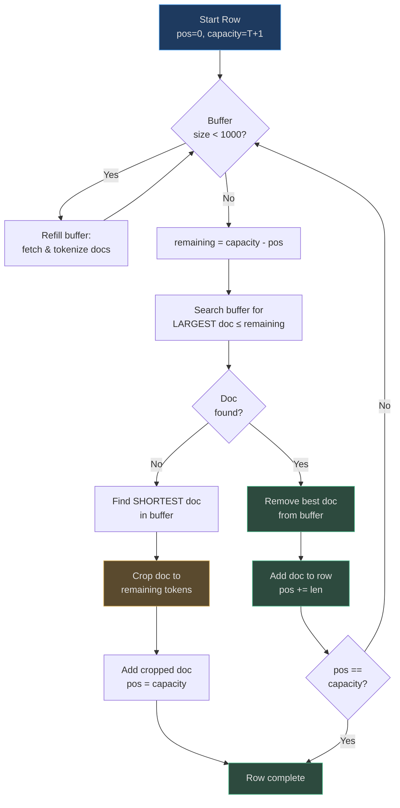
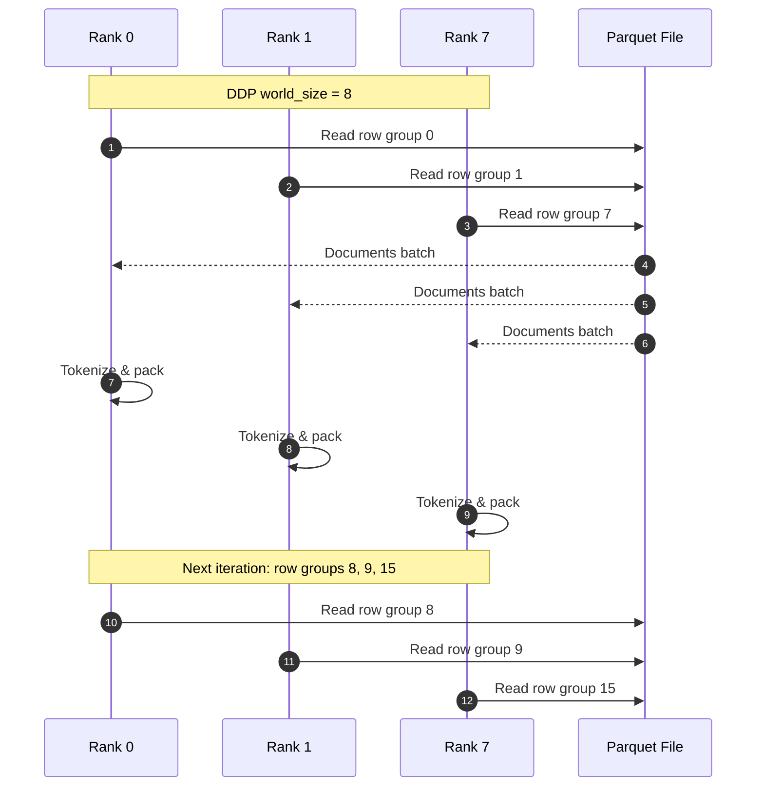
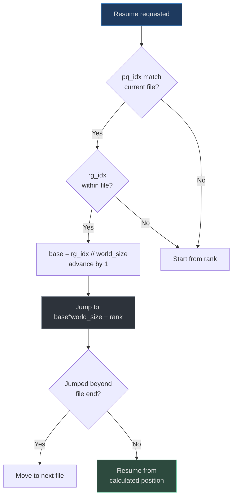
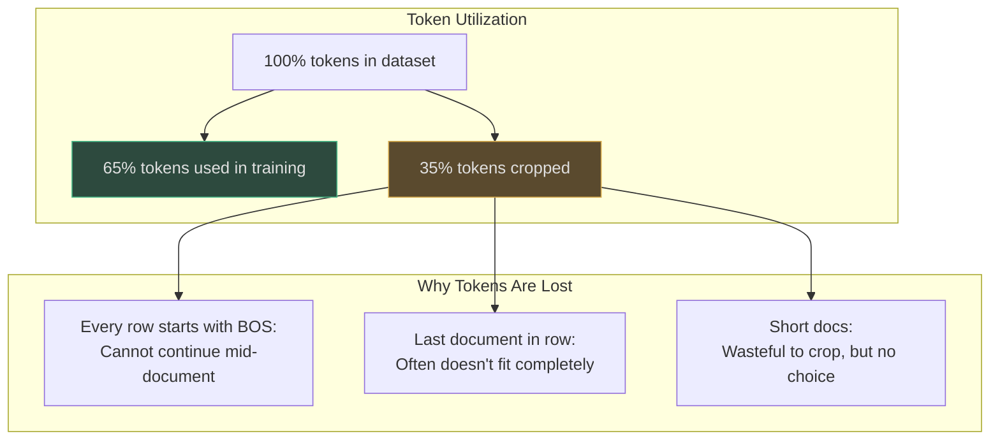

# BOS-Aligned Bestfit Dataloader

The nanochat dataloader implements a BOS-aligned bestfit packing algorithm that achieves 100% token utilization (no padding) while ensuring every training row starts with a Beginning-of-Sequence (BOS) token. This design prioritizes clean document boundaries for attention over perfect token efficiency.

## Why BOS Alignment?

BOS alignment solves the "attention confusion" problem in autoregressive training:

1. **Clear boundaries**: Every row begins with BOS, allowing the model to distinguish document starts from mid-document positions
2. **Full context**: Tokens can always attend back to BOS to see document boundaries, improving coherence
3. **Evaluation consistency**: Training rows match inference patterns (both start with BOS)
4. **Quality over quantity**: Loses ~35% of tokens to cropping, but eliminates confusing cross-document tokens

The trade-off: BOS alignment discards ~35% of tokens at T=2048, but the resulting training data has clearer structure and better document-level context.

## At-a-Glance

| Component | Implementation | Purpose | Source |
|-----------|---------------|---------|--------|
| **Algorithm** | BOS-aligned bestfit packing | Maximize utilization while preserving BOS | [dataloader.py:4-8](https://github.com/karpathy/nanochat/blob/master/nanochat/dataloader.py#L4-L8) |
| **Utilization** | 100% (no padding) | Every token position is trained on | [dataloader.py:8](https://github.com/karpathy/nanochat/blob/master/nanochat/dataloader.py#L8) |
| **Token Loss** | ~35% cropped at T=2048 | Documents trimmed to fit with BOS | [dataloader.py:8](https://github.com/karpathy/nanochat/blob/master/nanochat/dataloader.py#L8) |
| **DDP Sharding** | Row group level | Each rank reads different row groups | [dataloader.py:33-67](https://github.com/karpathy/nanochat/blob/master/nanochat/dataloader.py#L33-L67) |
| **Resumption** | Stateful checkpointing | Resume from (pq_idx, rg_idx, epoch) | [dataloader.py:39-45](https://github.com/karpathy/nanochat/blob/master/nanochat/dataloader.py#L39-L45) |
| **Buffer Size** | 1000 documents (default) | Enables bestfit search | [dataloader.py:77](https://github.com/karpathy/nanochat/blob/master/nanochat/dataloader.py#L77) |

## Dataloader Architecture

```mermaid
graph TB
    subgraph Input["Data Source"]
        PQ[Parquet Files<br>FineWeb-Edu]
        RG[Row Groups<br>~100K docs each]
    end
    
    subgraph Pipeline["Document Pipeline"]
        Batch[_document_batches()<br>Infinite iterator]
        Tok[Tokenizer<br>Batch encode]
        Buf[Document Buffer<br>~1000 docs]
    end
    
    subgraph Packing["Bestfit Packing"]
        Row[Empty Row<br>capacity = T+1]
        Find{Find largest doc<br>that fits?}
        Pack[Add doc to row]
        Crop[Crop doc to fill<br>remaining space]
        Done{Row full?}
    end
    
    subgraph Output["Training Batch"]
        X[Inputs: [B, T]]
        Y[Targets: [B, T]]
        State[State: pq_idx, rg_idx, epoch]
    end
    
    PQ --> RG
    RG --> Batch
    Batch --> Tok
    Tok --> Buf
    
    Buf --> Row
    Row --> Find
    Find -->|Yes| Pack
    Find -->|No| Crop
    Pack --> Done
    Crop --> Done
    Done -->|No| Find
    Done -->|Yes| X
    Done -->|Yes| Y
    Done -->|Yes| State
    
    style PQ fill:#1e3a5f,stroke:#4a9eed,color:#e0e0e0
    style Buf fill:#2d333b,stroke:#8b949e,color:#e0e0e0
    style Pack fill:#2d4a3e,stroke:#4aba8a,color:#e0e0e0
    style Crop fill:#5a4a2e,stroke:#d4a84b,color:#e0e0e0
    style X fill:#2d4a3e,stroke:#4aba8a,color:#e0e0e0
    style Y fill:#2d4a3e,stroke:#4aba8a,color:#e0e0e0
```

<!-- Sources: nanochat/dataloader.py:73-161 -->

## Bestfit Packing Algorithm

The bestfit algorithm minimizes token waste while maintaining BOS alignment:



<!-- Sources: nanochat/dataloader.py:121-160 -->

### Packing Logic

```python
# Core bestfit loop for a single row
row_capacity = T + 1  # e.g., 2049 for T=2048
pos = 0

while pos < row_capacity:
    remaining = row_capacity - pos
    
    # Find LARGEST document that fits entirely
    best_idx = -1
    best_len = 0
    for i, doc in enumerate(doc_buffer):
        if len(doc) <= remaining and len(doc) > best_len:
            best_idx = i
            best_len = len(doc)
    
    if best_idx >= 0:
        # Found a document that fits - add it entirely
        doc = doc_buffer.pop(best_idx)
        row[pos:pos+len(doc)] = doc
        pos += len(doc)
    else:
        # No document fits - crop shortest to fill remaining
        shortest_idx = min(range(len(doc_buffer)), 
                          key=lambda i: len(doc_buffer[i]))
        doc = doc_buffer.pop(shortest_idx)
        row[pos:pos+remaining] = doc[:remaining]  # CROP
        pos += remaining  # Row now full
```

Source: [dataloader.py:121-150](https://github.com/karpathy/nanochat/blob/master/nanochat/dataloader.py#L121-L150)

### Why Bestfit vs. Greedy?

| Strategy | Waste % | Search Cost | When to Use |
|----------|---------|-------------|-------------|
| **Greedy** (first fit) | ~40-45% | O(1) per doc | Small buffer, tight memory |
| **Bestfit** (largest fit) | ~35% | O(buffer_size) per position | Default, balanced |
| **Optimal** (dynamic programming) | ~30% | O(buffer_size²) | Research only |

Bestfit finds the sweet spot: 5-10% better utilization than greedy at minimal search cost.

## DDP Distributed Sharding

Each rank in DDP reads different row groups to ensure data parallelism without overlap:



<!-- Sources: nanochat/dataloader.py:33-67 -->

### Sharding Implementation

```python
def _document_batches(split, resume_state_dict, tokenizer_batch_size):
    """Infinite iterator with DDP sharding."""
    ddp, ddp_rank, ddp_local_rank, ddp_world_size = get_dist_info()
    
    parquet_paths = list_parquet_files()
    parquet_paths = parquet_paths[:-1] if split == "train" else parquet_paths[-1:]
    
    for pq_idx, filepath in enumerate(parquet_paths):
        pf = pq.ParquetFile(filepath)
        
        # Start from DDP rank, stride by world_size
        rg_idx = ddp_rank
        while rg_idx < pf.num_row_groups:
            rg = pf.read_row_group(rg_idx)
            batch = rg.column('text').to_pylist()
            yield batch, (pq_idx, rg_idx, epoch)
            rg_idx += ddp_world_size  # Next row group for this rank
```

Source: [dataloader.py:33-67](https://github.com/karpathy/nanochat/blob/master/nanochat/dataloader.py#L33-L67)

### Sharding Properties

| Property | Implementation | Benefit |
|----------|---------------|---------|
| **No overlap** | `rg_idx = rank + n*world_size` | Each rank sees unique data |
| **Load balance** | Row groups distributed evenly | No rank starves for data |
| **Deterministic** | Same rank always reads same row groups | Reproducible training |
| **Resume-safe** | Checkpoint includes (pq_idx, rg_idx) | Can resume at exact position |

## Stateful Resumption

The dataloader supports resuming from checkpoints:

```python
# Checkpoint state
state_dict = {
    "pq_idx": 42,      # Which parquet file
    "rg_idx": 128,     # Which row group within that file
    "epoch": 2,        # How many times we've cycled through data
}

# Resume training
train_loader = tokenizing_distributed_data_loader_with_state_bos_bestfit(
    tokenizer, B, T, split="train",
    resume_state_dict=state_dict
)
```

Source: [dataloader.py:39-45](https://github.com/karpathy/nanochat/blob/master/nanochat/dataloader.py#L39-L45)

### Resume Logic



<!-- Sources: nanochat/dataloader.py:52-59 -->

The resume logic ensures:
1. ✅ Never repeat data after resumption (advances by 1 row group)
2. ✅ Maintains DDP sharding pattern
3. ✅ Handles edge case of resuming near file boundary

## Memory Efficiency

The dataloader uses pre-allocated buffers to minimize memory allocations:

```python
# Pre-allocate buffers once (pinned memory for fast H2D transfer)
use_cuda = device == "cuda"
row_buffer = torch.empty((B, row_capacity), dtype=torch.long)
cpu_buffer = torch.empty(2 * B * T, dtype=torch.long, pin_memory=use_cuda)
gpu_buffer = torch.empty(2 * B * T, dtype=torch.long, device=device)

# Views into buffers (zero-copy)
cpu_inputs = cpu_buffer[:B * T].view(B, T)
cpu_targets = cpu_buffer[B * T:].view(B, T)
inputs = gpu_buffer[:B * T].view(B, T)
targets = gpu_buffer[B * T:].view(B, T)
```

Source: [dataloader.py:110-119](https://github.com/karpathy/nanochat/blob/master/nanochat/dataloader.py#L110-L119)

### Transfer Optimization

```mermaid
graph LR
    subgraph CPU["CPU Memory"]
        Row[row_buffer<br>[B, T+1]]
        Pin[cpu_buffer (pinned)<br>[2*B*T]]
    end
    
    subgraph Views["Zero-Copy Views"]
        In[cpu_inputs<br>[B, T]]
        Tgt[cpu_targets<br>[B, T]]
    end
    
    subgraph GPU["GPU Memory"]
        GPUBuf[gpu_buffer<br>[2*B*T]]
        X[inputs [B, T]]
        Y[targets [B, T]]
    end
    
    Row -->|copy_| In
    Row -->|copy_| Tgt
    Pin -->|Single H2D| GPUBuf
    GPUBuf -.->|view| X
    GPUBuf -.->|view| Y
    
    style Pin fill:#2d4a3e,stroke:#4aba8a,color:#e0e0e0
    style GPUBuf fill:#2d4a3e,stroke:#4aba8a,color:#e0e0e0
    style In fill:#2d333b,stroke:#8b949e,color:#e0e0e0
    style Tgt fill:#2d333b,stroke:#8b949e,color:#e0e0e0
```

<!-- Sources: nanochat/dataloader.py:110-160 -->

This design:
- ✅ Single GPU memory allocation (reused across batches)
- ✅ Pinned CPU memory for faster transfers
- ✅ Single H2D copy per batch (not per tensor)
- ✅ Zero-copy views (no data duplication)

## Token Loss Analysis

At T=2048, BOS alignment results in ~35% token loss to cropping:



<!-- Sources: nanochat/dataloader.py:8-13 -->

### Trade-off Analysis

| Approach | Token Utilization | Pros | Cons |
|----------|------------------|------|------|
| **BOS-aligned bestfit** (nanochat) | ~65% | Clean boundaries, full context | 35% token loss |
| **BOS-aligned greedy** | ~60% | Clean boundaries, simpler | 40% token loss |
| **Non-BOS packing** | ~100% | No token loss | Confusing cross-document attention |
| **BOS-aligned with padding** | ~65% active | Clean boundaries | Wastes compute on padding |

nanochat chose BOS-aligned bestfit as the best balance between data quality and efficiency ([dataloader.py:10-13](https://github.com/karpathy/nanochat/blob/master/nanochat/dataloader.py#L10-L13)).

## Comparison: Pretraining vs. SFT

The SFT dataloader uses the same bestfit algorithm but pads instead of cropping:

| Feature | Pretraining Loader | SFT Loader | Why Different? |
|---------|-------------------|------------|----------------|
| **Packing strategy** | Bestfit | Bestfit | Same algorithm |
| **When no doc fits** | **Crop** to fill | **Pad** to fill | SFT: never lose conversation tokens |
| **Padding token** | N/A | BOS (masked in targets) | Padding doesn't waste compute (masked) |
| **Token loss** | ~35% | 0% | SFT conversations are precious |
| **Buffer size** | 1000 docs | 100 convs | SFT has fewer examples |

Source: Pretraining ([dataloader.py:73-161](https://github.com/karpathy/nanochat/blob/master/nanochat/dataloader.py#L73-L161)), SFT ([chat_sft.py:127-233](https://github.com/karpathy/nanochat/blob/master/scripts/chat_sft.py#L127-L233))

### SFT Padding Mechanism

```python
# SFT: When no conversation fits, pad instead of crop
if best_idx >= 0:
    conv = conv_buffer.pop(best_idx)
    row.extend(conv)
else:
    # PAD with BOS tokens (not crop)
    content_len = len(row)
    row.extend([bos_token] * remaining)
    # Mask targets at padded positions (targets[i, content_len:] = -1)
```

This ensures no SFT conversation data is ever discarded ([chat_sft.py:190-196](https://github.com/karpathy/nanochat/blob/master/scripts/chat_sft.py#L190-L196)).

## Multi-Epoch Support

The dataloader cycles infinitely through the dataset:

```python
epoch = 1
while True:  # Infinite loop
    for pq_idx, filepath in enumerate(parquet_paths):
        pf = pq.ParquetFile(filepath)
        for rg_idx in range(ddp_rank, pf.num_row_groups, ddp_world_size):
            rg = pf.read_row_group(rg_idx)
            yield rg, (pq_idx, rg_idx, epoch)
    epoch += 1  # Increment after full pass
```

Source: [dataloader.py:46-70](https://github.com/karpathy/nanochat/blob/master/nanochat/dataloader.py#L46-L70)

This design:
- ✅ No need to manually restart dataloader
- ✅ Epoch counter tracked in state
- ✅ Can train for arbitrary number of steps

## Performance Characteristics

| Metric | Value | Note |
|--------|-------|------|
| **Throughput** | ~1.5M tokens/sec (8xH100) | Dominated by model compute, not dataloader |
| **Buffer refill time** | ~50ms for 1000 docs | Pipelined with GPU compute |
| **Tokenization** | ~200K docs/sec (8 threads) | tiktoken parallel encoding |
| **Bestfit search** | O(buffer_size) per position | ~1000 iterations to fill one row |
| **Memory overhead** | ~100MB per rank | Document buffer + pinned tensors |

The dataloader is never the bottleneck — GPU compute dominates at >95% of training time.

## References

- **BOS-aligned bestfit algorithm**: [dataloader.py:4-8](https://github.com/karpathy/nanochat/blob/master/nanochat/dataloader.py#L4-L8)
- **Packing implementation**: [dataloader.py:121-150](https://github.com/karpathy/nanochat/blob/master/nanochat/dataloader.py#L121-L150)
- **DDP sharding**: [dataloader.py:33-67](https://github.com/karpathy/nanochat/blob/master/nanochat/dataloader.py#L33-L67)
- **Stateful resumption**: [dataloader.py:39-45](https://github.com/karpathy/nanochat/blob/master/nanochat/dataloader.py#L39-L45)
- **Memory optimization**: [dataloader.py:110-119](https://github.com/karpathy/nanochat/blob/master/nanochat/dataloader.py#L110-L119)
- **SFT dataloader variant**: [scripts/chat_sft.py:127-233](https://github.com/karpathy/nanochat/blob/master/scripts/chat_sft.py#L127-L233)
