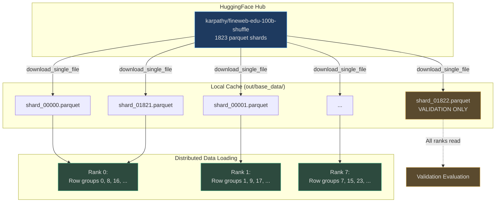
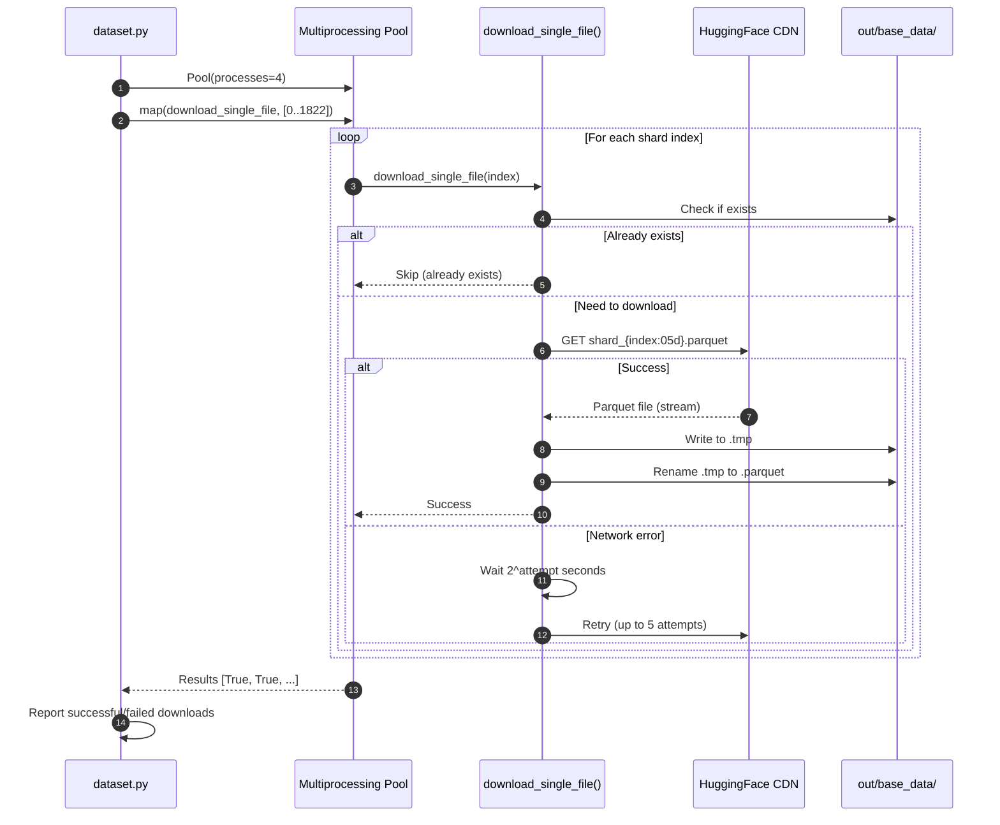
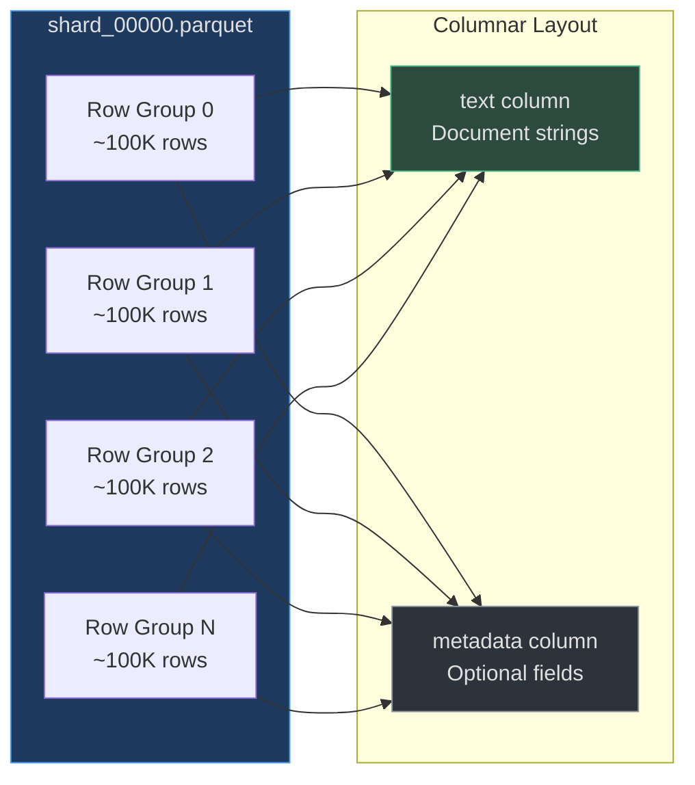
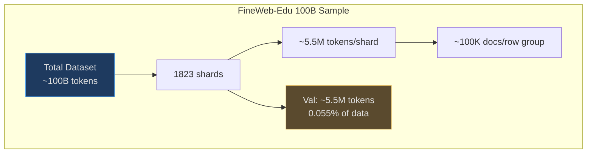
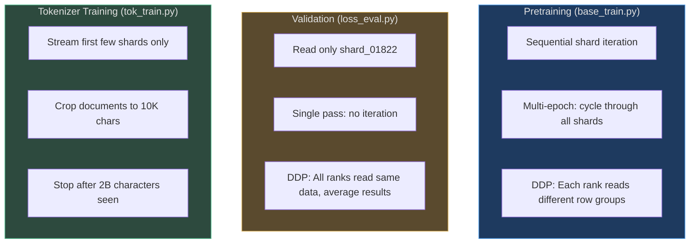

# Dataset Preparation

nanochat uses the FineWeb-Edu 100B token dataset for pretraining, a high-quality educational web corpus curated by HuggingFace. The dataset is hosted remotely and downloaded on-demand in parquet format, enabling streaming access without full local storage.

## Why FineWeb-Edu?

FineWeb-Edu solves the "data quality at scale" problem:

1. **Educational filtering**: Web pages scored by a classifier trained on education data, keeping only high-quality content
2. **Scale**: 100B tokens (after tokenization) provide sufficient data for GPT-2 capability training under Chinchilla scaling
3. **Accessibility**: Hosted on HuggingFace with parquet sharding for distributed training
4. **Pre-tokenized**: Documents are already cleaned and formatted, ready for BPE tokenization

The dataset enables training GPT-2 capability models (124M params, 10B tokens) for under $100 on commodity GPUs.

## At-a-Glance

| Component | Details | Purpose | Source |
|-----------|---------|---------|--------|
| **Dataset** | FineWeb-Edu 100B sample | High-quality educational web text | [dataset.py:23](https://github.com/karpathy/nanochat/blob/master/nanochat/dataset.py#L23) |
| **Format** | Parquet with columnar storage | Efficient random access and compression | [dataset.py:14](https://github.com/karpathy/nanochat/blob/master/nanochat/dataset.py#L14) |
| **Sharding** | 1823 shards (`shard_00000` to `shard_01822`) | Distributed training across GPUs | [dataset.py:24](https://github.com/karpathy/nanochat/blob/master/nanochat/dataset.py#L24) |
| **Download** | On-demand with backoff retry | Resilient to network failures | [dataset.py:60-109](https://github.com/karpathy/nanochat/blob/master/nanochat/dataset.py#L60-L109) |
| **Train/Val Split** | Last shard = val, all others = train | Simple deterministic split | [dataset.py:51](https://github.com/karpathy/nanochat/blob/master/nanochat/dataset.py#L51) |
| **Cache Location** | `out/base_data/` | Local parquet file cache | [dataset.py:27](https://github.com/karpathy/nanochat/blob/master/nanochat/dataset.py#L27) |

## Dataset Architecture



<!-- Sources: nanochat/dataset.py:23-28, nanochat/dataset.py:50-57 -->

## Download Process

The download mechanism handles network failures gracefully with exponential backoff:



<!-- Sources: nanochat/dataset.py:60-109, nanochat/dataset.py:112-128 -->

### Download Parameters

```python
# Exponential backoff configuration
max_attempts = 5                # Maximum retry attempts
wait_time = 2 ** attempt        # 2, 4, 8, 16, 32 seconds
chunk_size = 1024 * 1024        # 1MB chunks for streaming
timeout = 30                    # 30 second request timeout
```

Source: [dataset.py:75-103](https://github.com/karpathy/nanochat/blob/master/nanochat/dataset.py#L75-L103)

The download process:

1. **Check cache**: Skip if shard already exists locally ([dataset.py:66-68](https://github.com/karpathy/nanochat/blob/master/nanochat/dataset.py#L66-L68))
2. **Stream download**: Request parquet file with streaming enabled ([dataset.py:78](https://github.com/karpathy/nanochat/blob/master/nanochat/dataset.py#L78))
3. **Write to temp**: Stream chunks to `.tmp` file to avoid partial writes ([dataset.py:81-85](https://github.com/karpathy/nanochat/blob/master/nanochat/dataset.py#L81-L85))
4. **Atomic rename**: Move `.tmp` to `.parquet` only after complete download ([dataset.py:87](https://github.com/karpathy/nanochat/blob/master/nanochat/dataset.py#L87))
5. **Retry on failure**: Exponential backoff up to 5 attempts ([dataset.py:91-104](https://github.com/karpathy/nanochat/blob/master/nanochat/dataset.py#L91-L104))

## Parquet Format

Parquet is a columnar storage format optimized for analytics workloads:



<!-- Sources: nanochat/dataset.py:14, nanochat/dataset.py:53-56 -->

### Why Parquet?

| Feature | Benefit | Alternative | Trade-off |
|---------|---------|-------------|-----------|
| **Columnar storage** | Only read `text` column, skip metadata | Row formats read entire rows | Write complexity |
| **Compression** | ~5x smaller than plain text | Uncompressed text | Decompression CPU cost |
| **Row groups** | Random access to chunks of ~100K rows | Sequential-only formats | Memory overhead |
| **Distributed reads** | Each GPU reads different row groups | Shared file requires coordination | Storage duplication |
| **Schema enforcement** | Typed columns prevent data errors | Schemaless formats like JSONL | Less flexibility |

Source: [dataset.py:43-57](https://github.com/karpathy/nanochat/blob/master/nanochat/dataset.py#L43-L57)

## Data Iteration

The `parquets_iter_batched` function provides efficient streaming access:

```python
def parquets_iter_batched(split, start=0, step=1):
    """
    Yields batches of text from parquet files.
    
    Args:
        split: "train" or "val"
        start: Starting row group index (for DDP sharding)
        step: Row group stride (for DDP sharding)
    
    Yields:
        List[str]: Batch of document strings from one row group
    """
```

Source: [dataset.py:43-57](https://github.com/karpathy/nanochat/blob/master/nanochat/dataset.py#L43-L57)

### Row Group Access Pattern

```mermaid
flowchart TD
    Start[Start]
    Split{Split?}
    Files[Get parquet file list]
    Train[Use files[:-1]<br>Training shards]
    Val[Use files[-1:]<br>Validation shard]
    
    Loop[For each file]
    Open[Open ParquetFile]
    RG[For rg_idx in range<br>start, num_row_groups, step]
    Read[Read row group]
    Extract[Extract 'text' column]
    Yield[Yield texts batch]
    
    Start --> Split
    Split -->|train| Files
    Split -->|val| Files
    Files --> Train
    Files --> Val
    
    Train --> Loop
    Val --> Loop
    
    Loop --> Open
    Open --> RG
    RG --> Read
    Read --> Extract
    Extract --> Yield
    Yield --> RG
    RG -->|Done| Loop
    Loop -->|Done| End[End]
    
    style Start fill:#2d4a3e,stroke:#4aba8a,color:#e0e0e0
    style Train fill:#1e3a5f,stroke:#4a9eed,color:#e0e0e0
    style Val fill:#5a4a2e,stroke:#d4a84b,color:#e0e0e0
    style Yield fill:#2d4a3e,stroke:#4aba8a,color:#e0e0e0
```

<!-- Sources: nanochat/dataset.py:43-57 -->

### DDP Sharding Example

For 8 GPUs (`step=8`), each rank reads different row groups:

```python
# Rank 0 (start=0, step=8)
# Reads row groups: 0, 8, 16, 24, ...

# Rank 1 (start=1, step=8)
# Reads row groups: 1, 9, 17, 25, ...

# Rank 7 (start=7, step=8)
# Reads row groups: 7, 15, 23, 31, ...
```

This pattern ensures:
- **No overlap**: Each row group read by exactly one rank
- **Load balancing**: Row groups distributed evenly across ranks
- **Deterministic**: Same data split across runs with same rank configuration

Source: [dataset.py:54](https://github.com/karpathy/nanochat/blob/master/nanochat/dataset.py#L54)

## Train/Val Split

nanochat uses a simple, deterministic split:

| Split | Shards | Purpose | Usage |
|-------|--------|---------|-------|
| **Train** | `shard_00000` to `shard_01821` (1822 shards) | Language modeling pretraining | Iterated multiple epochs | 
| **Val** | `shard_01822` (1 shard only) | Unbiased loss evaluation | Evaluated once per checkpoint |

Source: [dataset.py:50-51](https://github.com/karpathy/nanochat/blob/master/nanochat/dataset.py#L50-L51)

This split strategy:
- ✅ **Deterministic**: Same split across all runs
- ✅ **Simple**: No random shuffling or hashing required
- ✅ **Fast**: No need to read all data to compute split
- ⚠️ **Imbalanced**: Val is only ~0.05% of data (but this is fine for validation)

## Dataset Statistics



<!-- Sources: nanochat/dataset.py:23-24 (constants), inferred from typical parquet sizing -->

### Storage Requirements

For a full GPT-2 speedrun (10B tokens):

```python
# Approximate storage calculation
shards_needed = 10_000_000_000 / 5_500_000  # ~1818 shards
parquet_size = 20 * 1024 * 1024             # ~20MB per shard (compressed)
total_storage = 1818 * 20                    # ~36 GB

# With compression, actual storage is lower
# FineWeb-Edu parquet shards average ~10-15MB each
actual_storage = 1818 * 12.5                 # ~22 GB for 10B tokens
```

nanochat downloads shards on-demand, so you only need storage for the shards you'll train on.

## Download Script Usage

```bash
# Download all shards (1823 files, ~23GB)
python -m nanochat.dataset

# Download first 100 shards only
python -m nanochat.dataset --num-files=100

# Use 8 parallel workers for faster download
python -m nanochat.dataset --num-workers=8

# Download specific number of shards needed for 10B token training
python -m nanochat.dataset --num-files=1820
```

Source: [dataset.py:112-128](https://github.com/karpathy/nanochat/blob/master/nanochat/dataset.py#L112-L128)

The script handles:
- ✅ Parallel downloads via multiprocessing
- ✅ Resume capability (skips existing files)
- ✅ Exponential backoff on failures
- ✅ Progress reporting

## Access Patterns

Different training stages access the dataset differently:



<!-- Sources: nanochat/dataset.py:43-57 (iterator), scripts/base_train.py:319 (usage), scripts/tok_train.py:28-43 (training) -->

| Stage | Shards Used | Iteration | Read Pattern | Source |
|-------|-------------|-----------|--------------|--------|
| **Tokenizer training** | First ~36 shards (~2B chars) | Single pass | Sequential, cropped docs | [tok_train.py:28-43](https://github.com/karpathy/nanochat/blob/master/scripts/tok_train.py#L28-L43) |
| **Pretraining** | shards 0-1821 (all train) | Multi-epoch | DDP sharded by row group | [base_train.py:319](https://github.com/karpathy/nanochat/blob/master/scripts/base_train.py#L319) |
| **Validation** | shard 1822 only | Single pass | DDP parallel, same data | [base_train.py:404](https://github.com/karpathy/nanochat/blob/master/scripts/base_train.py#L404) |

## Data Quality

FineWeb-Edu applies several quality filters:

1. **Education classifier**: ML model scores pages for educational value (threshold tuned for high precision)
2. **Deduplication**: Near-duplicate pages removed via MinHash LSH
3. **Language filtering**: Non-English pages removed
4. **Length filtering**: Very short pages (<200 chars) removed
5. **Quality heuristics**: Removed pages with high symbol-to-text ratio, ad-heavy content

The result is a cleaner, more educational corpus than raw Common Crawl, improving model capabilities at the same token count.

## References

- **FineWeb-Edu dataset**: [karpathy/fineweb-edu-100b-shuffle](https://huggingface.co/datasets/karpathy/fineweb-edu-100b-shuffle)
- **Download implementation**: [nanochat/dataset.py:60-109](https://github.com/karpathy/nanochat/blob/master/nanochat/dataset.py#L60-L109)
- **Parquet iteration**: [nanochat/dataset.py:43-57](https://github.com/karpathy/nanochat/blob/master/nanochat/dataset.py#L43-L57)
- **Train/val split**: [nanochat/dataset.py:50-51](https://github.com/karpathy/nanochat/blob/master/nanochat/dataset.py#L50-L51)
- **Storage location**: [nanochat/dataset.py:27](https://github.com/karpathy/nanochat/blob/master/nanochat/dataset.py#L27)
