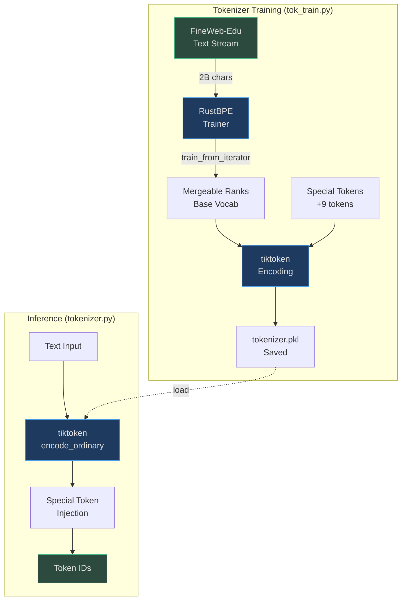
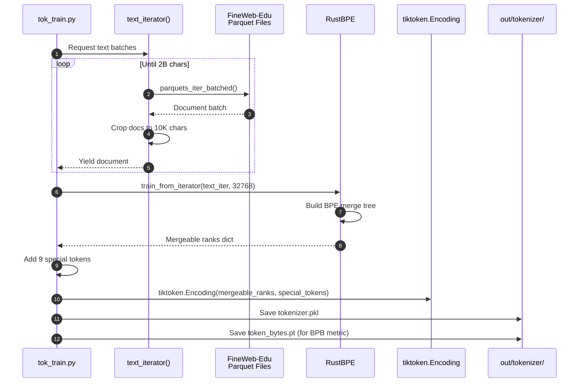
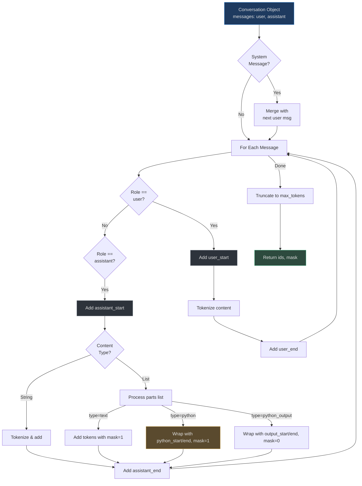
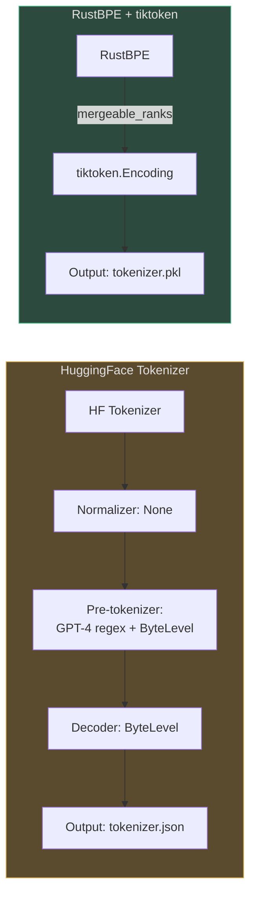

# BPE Tokenizer

nanochat implements a GPT-4-style Byte Pair Encoding (BPE) tokenizer designed for both pretraining and instruction tuning. The tokenizer uses RustBPE for efficient training and tiktoken for fast inference, with a custom split pattern optimized for smaller vocabulary sizes.

## Why This Tokenizer?

The tokenizer solves three critical problems:

1. **Training efficiency**: RustBPE trains on billions of tokens in minutes vs. hours with pure Python
2. **Inference speed**: tiktoken delivers 10x faster encoding than HuggingFace Tokenizers
3. **Chat capabilities**: Special tokens enable structured conversations, tool use, and multi-turn dialogue without format ambiguity

The split pattern deviation from GPT-4 (`\p{N}{1,2}` vs. `\p{N}{1,3}`) saves ~50 tokens in the 32K vocabulary by avoiding over-allocation to rare 3-digit number sequences.

## At-a-Glance

| Component | Implementation | Purpose | Source |
|-----------|---------------|---------|--------|
| **Training** | RustBPE | Fast BPE training on FineWeb-Edu | [tok_train.py:49](https://github.com/karpathy/nanochat/blob/master/scripts/tok_train.py#L49) |
| **Inference** | tiktoken | High-speed encoding for training/inference | [tokenizer.py:184-189](https://github.com/karpathy/nanochat/blob/master/nanochat/tokenizer.py#L184-L189) |
| **Fallback** | HuggingFace Tokenizer | Compatible alternative (slower) | [tokenizer.py:39-155](https://github.com/karpathy/nanochat/blob/master/nanochat/tokenizer.py#L39-L155) |
| **Special Tokens** | 9 tokens (BOS, user, assistant, python, output) | Chat formatting and tool integration | [tokenizer.py:13-25](https://github.com/karpathy/nanochat/blob/master/nanochat/tokenizer.py#L13-L25) |
| **Vocab Size** | 32,768 (2^15) | Optimal for nanochat scale | [tok_train.py:19](https://github.com/karpathy/nanochat/blob/master/scripts/tok_train.py#L19) |
| **Split Pattern** | `\p{N}{1,2}` (2-digit max) | Token-efficient number encoding | [tokenizer.py:30](https://github.com/karpathy/nanochat/blob/master/nanochat/tokenizer.py#L30) |

## Tokenizer Architecture



<!-- Sources: nanochat/tokenizer.py:163-190, scripts/tok_train.py:28-53 -->

## Special Tokens

nanochat defines 9 special tokens that structure conversations and enable tool use:

| Token | Purpose | When Used | Example | Source |
|-------|---------|-----------|---------|--------|
| `<\|bos\|>` | Document boundary | Start of every document/conversation | `<\|bos\|>Hello world` | [tokenizer.py:15](https://github.com/karpathy/nanochat/blob/master/nanochat/tokenizer.py#L15) |
| `<\|user_start\|>` | User message begin | Wraps user input | `<\|user_start\|>What is 2+2?<\|user_end\|>` | [tokenizer.py:17](https://github.com/karpathy/nanochat/blob/master/nanochat/tokenizer.py#L17) |
| `<\|user_end\|>` | User message end | Closes user input | Same as above | [tokenizer.py:18](https://github.com/karpathy/nanochat/blob/master/nanochat/tokenizer.py#L18) |
| `<\|assistant_start\|>` | Assistant message begin | Wraps assistant response | `<\|assistant_start\|>It's 4.<\|assistant_end\|>` | [tokenizer.py:19](https://github.com/karpathy/nanochat/blob/master/nanochat/tokenizer.py#L19) |
| `<\|assistant_end\|>` | Assistant message end | Closes assistant response | Same as above | [tokenizer.py:20](https://github.com/karpathy/nanochat/blob/master/nanochat/tokenizer.py#L20) |
| `<\|python_start\|>` | Tool invocation begin | Wraps calculator call | `<\|python_start\|>2+2<\|python_end\|>` | [tokenizer.py:21](https://github.com/karpathy/nanochat/blob/master/nanochat/tokenizer.py#L21) |
| `<\|python_end\|>` | Tool invocation end | Closes tool call | Same as above | [tokenizer.py:22](https://github.com/karpathy/nanochat/blob/master/nanochat/tokenizer.py#L22) |
| `<\|output_start\|>` | Tool output begin | Wraps tool result | `<\|output_start\|>4<\|output_end\|>` | [tokenizer.py:23](https://github.com/karpathy/nanochat/blob/master/nanochat/tokenizer.py#L23) |
| `<\|output_end\|>` | Tool output end | Closes tool output | Same as above | [tokenizer.py:24](https://github.com/karpathy/nanochat/blob/master/nanochat/tokenizer.py#L24) |

These tokens are added *after* BPE training as fixed IDs at the end of the vocabulary ([tokenizer.py:183](https://github.com/karpathy/nanochat/blob/master/nanochat/tokenizer.py#L183)).

## Split Pattern Engineering

The split pattern defines how text is broken into chunks before BPE merging:

```python
SPLIT_PATTERN = r"""'(?i:[sdmt]|ll|ve|re)|[^\r\n\p{L}\p{N}]?+\p{L}+|\p{N}{1,2}| ?[^\s\p{L}\p{N}]++[\r\n]*|\s*[\r\n]|\s+(?!\S)|\s+"""
```

### Pattern Breakdown

| Pattern Component | Matches | Why It Matters | Example |
|-------------------|---------|----------------|---------|
| `'(?i:[sdmt]\|ll\|ve\|re)` | Contractions | Treats "it's" as single unit | `it's` → `it` + `'s` |
| `[^\r\n\p{L}\p{N}]?+\p{L}+` | Word-like sequences | Alphabetic tokens with optional prefix | `hello` or `#hello` |
| **`\p{N}{1,2}`** | **1-2 digit numbers** | **Saves tokens vs. GPT-4's 3-digit max** | `42` = 1 token, not 2 |
| ` ?[^\s\p{L}\p{N}]++[\r\n]*` | Punctuation clusters | Groups symbols together | `!!!` = 1 token |
| `\s*[\r\n]` | Line breaks | Preserves document structure | Newlines preserved |
| `\s+(?!\S)` | Trailing whitespace | Handles end-of-line spaces | Trailing spaces |

**Key deviation from GPT-4**: Using `\p{N}{1,2}` instead of `\p{N}{1,3}` reduces vocab bloat for 32K vocabulary. At smaller scales, 3-digit numbers like "999" appear rarely, making dedicated tokens wasteful ([tokenizer.py:27-29](https://github.com/karpathy/nanochat/blob/master/nanochat/tokenizer.py#L27-L29)).

## Training Process



<!-- Sources: scripts/tok_train.py:28-91, nanochat/tokenizer.py:171-190 -->

### Training Parameters

```python
# Default training configuration
max_chars = 2_000_000_000  # 2 billion characters
doc_cap = 10_000           # Max 10K chars per document
vocab_size = 32768         # 2^15 tokens
```

The training process:

1. **Stream text**: Read FineWeb-Edu parquet files, crop documents to 10K chars ([tok_train.py:28-43](https://github.com/karpathy/nanochat/blob/master/scripts/tok_train.py#L28-L43))
2. **Train BPE**: RustBPE builds merge tree from 2B characters in ~2 minutes ([tok_train.py:48-52](https://github.com/karpathy/nanochat/blob/master/scripts/tok_train.py#L48-L52))
3. **Build tiktoken**: Convert mergeable ranks to tiktoken Encoding ([tokenizer.py:184-189](https://github.com/karpathy/nanochat/blob/master/nanochat/tokenizer.py#L184-L189))
4. **Save artifacts**: Pickle the encoding and save token byte counts ([tok_train.py:58-91](https://github.com/karpathy/nanochat/blob/master/scripts/tok_train.py#L58-L91))

The token byte counts (`token_bytes.pt`) map each token ID to its UTF-8 byte length, enabling vocab-size-invariant loss measurement via bits-per-byte.

## Conversation Rendering

The `render_conversation()` method converts structured conversation objects into token sequences for training:



<!-- Sources: nanochat/tokenizer.py:266-350 -->

### Mask Generation

The mask indicates which tokens the model trains on:

| Token Source | Mask Value | Trained? | Reason |
|--------------|------------|----------|--------|
| BOS token | 0 | ❌ | Document delimiter, not content |
| User message | 0 | ❌ | Input prompt, not prediction target |
| Assistant text | 1 | ✅ | Model learns to generate |
| Python tool call | 1 | ✅ | Model learns to invoke tools |
| Python output | 0 | ❌ | Generated by tool, not model |
| Special tokens (start/end) | 0 for user, 1 for assistant | Mixed | Train on assistant boundaries only |

Source: [tokenizer.py:275-345](https://github.com/karpathy/nanochat/blob/master/nanochat/tokenizer.py#L275-L345)

## Example: GSM8K Tokenization

GSM8K problems use calculator tool calls. Here's how a conversation renders:

```python
conversation = {
    "messages": [
        {"role": "user", "content": "What is 2+2?"},
        {"role": "assistant", "content": [
            {"type": "text", "text": "Let me calculate that."},
            {"type": "python", "text": "2+2"},
            {"type": "python_output", "text": "4"},
            {"type": "text", "text": "The answer is 4."}
        ]}
    ]
}

# Rendered token sequence:
# <|bos|> <|user_start|> What is 2+2? <|user_end|> 
# <|assistant_start|> Let me calculate that. 
# <|python_start|> 2+2 <|python_end|> 
# <|output_start|> 4 <|output_end|> 
# The answer is 4. <|assistant_end|>

# Corresponding mask (1 = train, 0 = ignore):
# 0 0 [0 0 0 0 0] 0 
# 0 [1 1 1 1] 
# 1 [1] 1 
# 0 [0] 0 
# [1 1 1 1] 1
```

Source: [tokenizer.py:266-350](https://github.com/karpathy/nanochat/blob/master/nanochat/tokenizer.py#L266-L350), [gsm8k.py:59-76](https://github.com/karpathy/nanochat/blob/master/tasks/gsm8k.py#L59-L76)

## Implementation Comparison



<!-- Sources: nanochat/tokenizer.py:39-155 (HF), nanochat/tokenizer.py:163-265 (RustBPE) -->

| Feature | HuggingFace Tokenizer | RustBPE + tiktoken | Winner |
|---------|----------------------|-------------------|--------|
| **Training speed** | ~30 min (2B chars) | ~2 min (2B chars) | 🏆 RustBPE |
| **Inference speed** | ~100K tok/sec | ~1M tok/sec | 🏆 tiktoken |
| **Memory usage** | Higher (Python objects) | Lower (native Rust) | 🏆 tiktoken |
| **Dependencies** | tokenizers package | rustbpe + tiktoken | Tie |
| **Compatibility** | Industry standard | OpenAI standard | Tie |
| **Use case** | Development, debugging | Production training | Both |

nanochat includes both implementations but defaults to RustBPE+tiktoken for performance ([tokenizer.py:390-395](https://github.com/karpathy/nanochat/blob/master/nanochat/tokenizer.py#L390-L395)).

## Token Bytes Calculation

The `token_bytes.pt` file maps token IDs to UTF-8 byte counts for bits-per-byte (BPB) loss calculation:

```python
# For each token in vocab
for token_id in range(vocab_size):
    token_str = tokenizer.decode([token_id])
    if token_str in special_tokens:
        token_bytes.append(0)  # Special tokens don't count
    else:
        token_bytes.append(len(token_str.encode("utf-8")))
```

Source: [tok_train.py:76-90](https://github.com/karpathy/nanochat/blob/master/scripts/tok_train.py#L76-L90)

This enables vocab-size-invariant loss:

```
BPB = log2(perplexity) / avg_bytes_per_token
```

A 32K vocab tokenizer and a 50K vocab tokenizer can be fairly compared using BPB, whereas cross-entropy loss would favor larger vocabularies.

## References

- **RustBPE library**: High-performance BPE training in Rust
- **tiktoken**: OpenAI's fast BPE tokenizer (used in GPT-4)
- **Split pattern source**: [tokenizer.py:30](https://github.com/karpathy/nanochat/blob/master/nanochat/tokenizer.py#L30)
- **Special tokens**: [tokenizer.py:13-25](https://github.com/karpathy/nanochat/blob/master/nanochat/tokenizer.py#L13-L25)
- **Conversation rendering**: [tokenizer.py:266-350](https://github.com/karpathy/nanochat/blob/master/nanochat/tokenizer.py#L266-L350)
- **Training script**: [scripts/tok_train.py](https://github.com/karpathy/nanochat/blob/master/scripts/tok_train.py)
