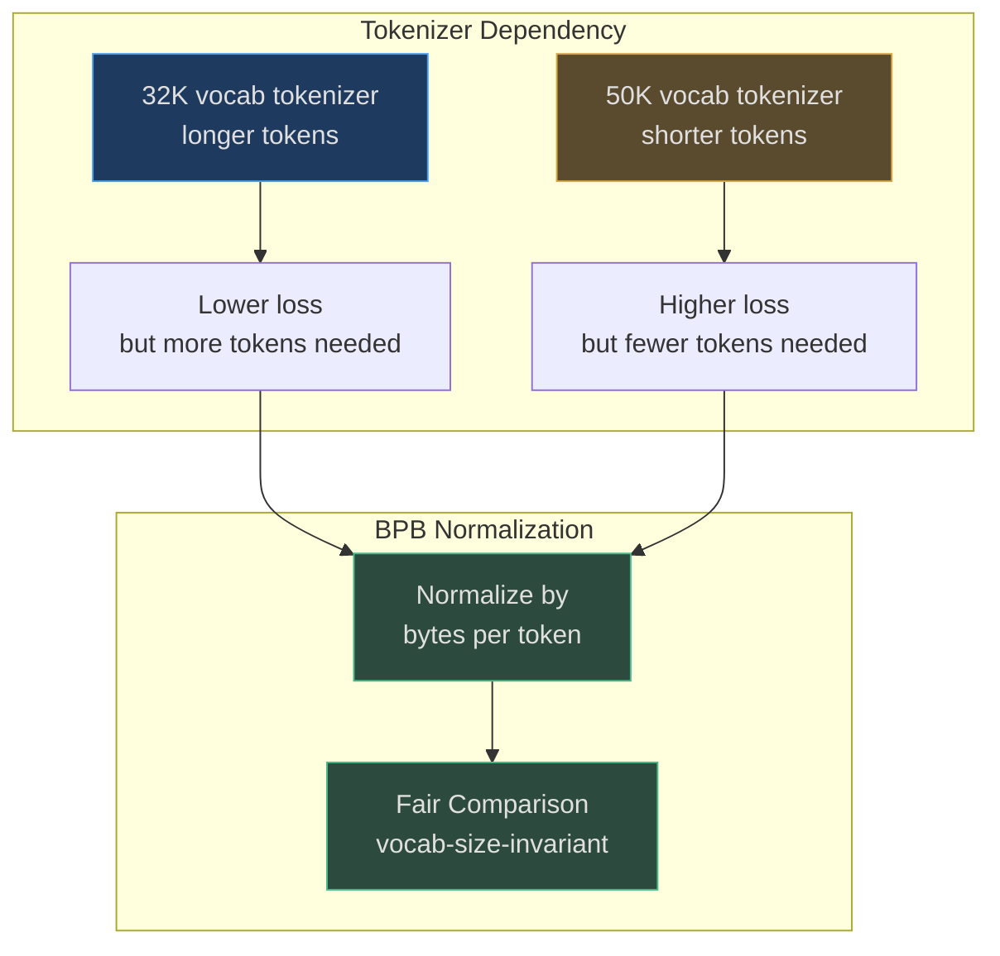
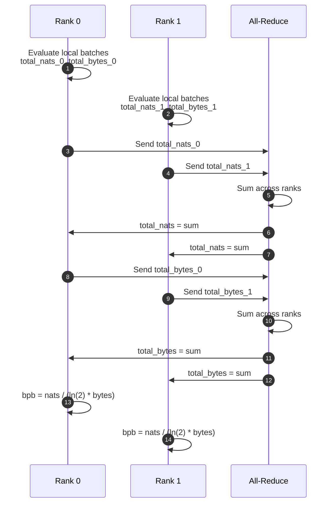

# Bits Per Byte (BPB) Metric

**Bits per byte (BPB)** is nanochat's vocab-size-invariant loss metric that normalizes cross-entropy loss by the average byte length of target tokens. This allows **fair comparison** between models with different tokenizers (e.g., 32K vocab vs 50K vocab) by measuring loss in information-theoretic units rather than per-token.

## Formula

```
BPB = log₂(perplexity) / avg_bytes_per_token
    = (cross_entropy_loss / ln(2)) * (1 / avg_bytes_per_token)
```

<!-- Source: nanochat/loss_eval.py:1-20 -->

| Component | Description | Source |
|---|---|---|---|
| **Cross-entropy loss** | Standard language modeling loss (nats) | Model forward pass |
| **ln(2) conversion** | Convert nats to bits | [nanochat/loss_eval.py:64](https://github.com/karpathy/nanochat/blob/master/nanochat/loss_eval.py#L64) |
| **avg_bytes_per_token** | Weighted average bytes per token in batch | [nanochat/tokenizer.py:50-70](https://github.com/karpathy/nanochat/blob/master/nanochat/tokenizer.py#L50-L70) |

## Why BPB?



<!-- Sources: nanochat/loss_eval.py:10-15 -->

## Implementation

```python
@torch.no_grad()
def evaluate_bpb(model, batches, steps, token_bytes):
    total_nats = torch.tensor(0.0, dtype=torch.float32, device=model.get_device())
    total_bytes = torch.tensor(0, dtype=torch.int64, device=model.get_device())
    
    for _ in range(steps):
        x, y = next(iter(batches))
        loss2d = model(x, y, loss_reduction='none')  # (B, T)
        num_bytes2d = token_bytes[y]  # (B, T)
        
        # Only count tokens with num_bytes > 0 (exclude special tokens)
        total_nats += (loss2d * (num_bytes2d > 0)).sum()
        total_bytes += num_bytes2d.sum()
    
    # All-reduce across ranks
    if world_size > 1:
        dist.all_reduce(total_nats, op=dist.ReduceOp.SUM)
        dist.all_reduce(total_bytes, op=dist.ReduceOp.SUM)
    
    bpb = total_nats.item() / (math.log(2) * total_bytes.item())
    return bpb
```

<!-- Source: nanochat/loss_eval.py:8-66 -->

### Special Token Masking

The `token_bytes` tensor marks special tokens (like `<|bos|>`) with **0 bytes**, excluding them from the metric:

```python
token_bytes = get_token_bytes(device=device)  # Shape: (vocab_size,)
token_bytes[special_token_ids] = 0  # Mask specials
```

<!-- Source: nanochat/tokenizer.py:50-70 -->

### Evaluation Budget

Default: `--eval-tokens 40*524288` = ~20M tokens ([scripts/base_train.py:74](https://github.com/karpathy/nanochat/blob/master/scripts/base_train.py#L74))

Typical val_bpb for GPT-2 capability: **~0.745** ([README.md:18-19](https://github.com/karpathy/nanochat/blob/master/README.md#L18-L19))

## Distributed Evaluation



<!-- Sources: nanochat/loss_eval.py:54-65 -->

## References

- [nanochat/loss_eval.py](https://github.com/karpathy/nanochat/blob/master/nanochat/loss_eval.py) — BPB implementation
- [scripts/base_train.py:73-74](https://github.com/karpathy/nanochat/blob/master/scripts/base_train.py#L73-L74) — Evaluation frequency and budget
