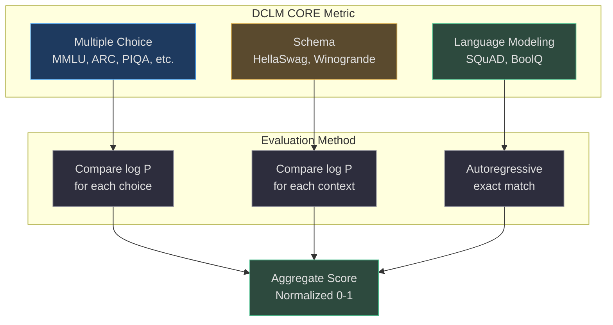
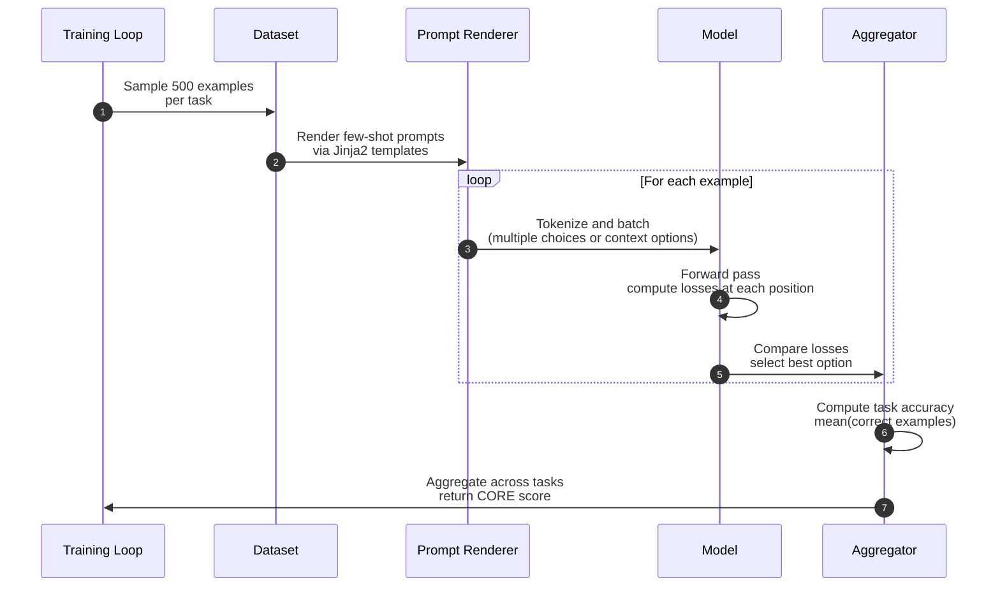
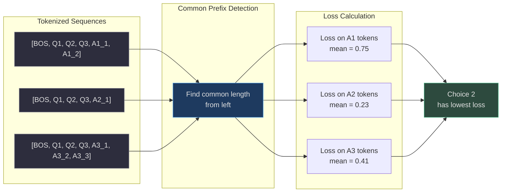
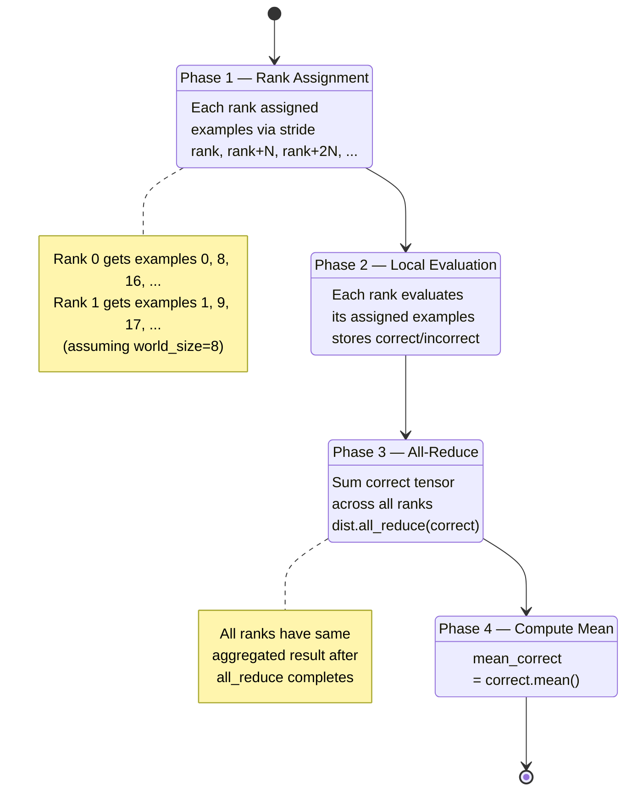

# DCLM CORE Metric

The **DCLM CORE** metric is nanochat's primary evaluation signal during pretraining — an aggregate score combining performance across 15+ diverse tasks including MMLU, ARC, HellaSwag, PIQA, Winogrande, OpenBookQA, and BoolQ. Introduced in the [DCLM paper (arxiv:2406.11794)](https://arxiv.org/abs/2406.11794), CORE provides a single number that captures general language understanding capability.

## Overview

CORE evaluation runs every `--core-metric-every` steps (default 2000) during training, computing accuracy on a fixed budget of examples per task (default 500). Each task is rendered with few-shot prompts via Jinja2 templates, then evaluated by comparing log-likelihoods (for multiple-choice/schema tasks) or autoregressive predictions (for language modeling tasks).

## At-a-Glance Summary

| Component | Description | Source |
|---|---|---|
| **Task Types** | Multiple choice, schema (context options), language modeling | [nanochat/core_eval.py:16-84](https://github.com/karpathy/nanochat/blob/master/nanochat/core_eval.py#L16-L84) |
| **Evaluation Budget** | 500 examples per task (configurable via `--core-metric-max-per-task`) | [scripts/base_train.py:76](https://github.com/karpathy/nanochat/blob/master/scripts/base_train.py#L76) |
| **Prompt Rendering** | Jinja2 templates with few-shot examples | [nanochat/core_eval.py:17-84](https://github.com/karpathy/nanochat/blob/master/nanochat/core_eval.py#L17-L84) |
| **Distributed Eval** | Each rank evaluates subset, results all-reduced | [nanochat/core_eval.py:244-262](https://github.com/karpathy/nanochat/blob/master/nanochat/core_eval.py#L244-L262) |
| **GPT-2 Baseline** | CORE = 0.256525 (target for d26 speedrun) | [README.md:21](https://github.com/karpathy/nanochat/blob/master/README.md#L21) |

## Task Categories



<!-- Sources: nanochat/core_eval.py:1-6, nanochat/core_eval.py:184-241 -->

### Multiple Choice Tasks

Questions with fixed answer options. Model predicts by selecting the choice with **lowest average loss** across its tokens:

| Task | Description | Example | Source |
|---|---|---|---|
| **MMLU** | Massive Multitask Language Understanding (57 subjects) | "What is the capital of France? A) London B) Paris C) Berlin D) Madrid" | [nanochat/core_eval.py:184-186](https://github.com/karpathy/nanochat/blob/master/nanochat/core_eval.py#L184-L186) |
| **ARC** | AI2 Reasoning Challenge (science questions) | "Which process is responsible for changing liquid water into water vapor? A) condensation B) evaporation C) precipitation" | [nanochat/core_eval.py:184-186](https://github.com/karpathy/nanochat/blob/master/nanochat/core_eval.py#L184-L186) |
| **PIQA** | Physical Interaction QA | "To separate egg whites from yolk: A) Crack into bowl, use shell to scoop yolk B) Crack into cup, suck yolk with bottle" | [nanochat/core_eval.py:184-186](https://github.com/karpathy/nanochat/blob/master/nanochat/core_eval.py#L184-L186) |

### Schema Tasks

Context options that lead to the same continuation. Model predicts by selecting the context with **lowest loss** on the continuation:

| Task | Description | Method | Source |
|---|---|---|---|
| **HellaSwag** | Sentence completion with plausible distractors | Pick context that best predicts continuation | [nanochat/core_eval.py:36-54](https://github.com/karpathy/nanochat/blob/master/nanochat/core_eval.py#L36-L54) |
| **Winogrande** | Pronoun disambiguation | Pick context where pronoun reference is clearest | [nanochat/core_eval.py:36-54](https://github.com/karpathy/nanochat/blob/master/nanochat/core_eval.py#L36-L54) |

### Language Modeling Tasks

Predict continuation tokens autoregressively and check for **exact match**:

| Task | Description | Evaluation | Source |
|---|---|---|---|
| **SQuAD** | Reading comprehension | All continuation tokens must match gold answer | [nanochat/core_eval.py:224-231](https://github.com/karpathy/nanochat/blob/master/nanochat/core_eval.py#L224-L231) |
| **BoolQ** | Yes/no questions about passages | Autoregressive prediction must match "Yes" or "No" | [nanochat/core_eval.py:224-231](https://github.com/karpathy/nanochat/blob/master/nanochat/core_eval.py#L224-L231) |

## Evaluation Flow



<!-- Sources: nanochat/core_eval.py:167-262 -->

### Few-Shot Prompting

Tasks use **0-shot or few-shot examples** rendered via Jinja2 templates with a continuation delimiter (typically empty string or newline):

```python
def render_prompts_mc(item, continuation_delimiter, fewshot_examples=None):
    template_str = """

{{ example.query }}{{ continuation_delimiter }}{{ example.choices[example.gold] }}


{{ item.query }}{{ continuation_delimiter }}{{ choice }}""".strip()
    template = Template(template_str)
    prompts = [template.render(choice=choice, ...) for choice in item['choices']]
    return prompts
```

<!-- Source: nanochat/core_eval.py:17-33 -->

The number of few-shot examples is **task-specific metadata** stored in the evaluation bundle ([nanochat/core_eval.py:172-173](https://github.com/karpathy/nanochat/blob/master/nanochat/core_eval.py#L172-L173)).

## Sequence Batching

### Multiple Choice

All choices share the same **question prefix** — identify where the common prefix ends and each choice begins:



<!-- Sources: nanochat/core_eval.py:113-120, nanochat/core_eval.py:233-237 -->

### Schema Tasks

All contexts share the same **continuation suffix** — identify where the common suffix begins:

```python
def batch_sequences_schema(tokenizer, prompts):
    tokens = tokenizer(prompts, prepend=tokenizer.get_bos_token_id())
    suffix_length = find_common_length(tokens, direction='right')
    end_indices = [len(x) for x in tokens]
    start_indices = [ei - suffix_length for ei in end_indices]
    return tokens, start_indices, end_indices
```

<!-- Source: nanochat/core_eval.py:123-130 -->

### Language Modeling

Two prompts: without continuation and with continuation. Only the **with** version is batched:

```python
def batch_sequences_lm(tokenizer, prompts):
    tokens = tokenizer(prompts, prepend=tokenizer.get_bos_token_id())
    tokens_without, tokens_with = tokens
    start_idx, end_idx = len(tokens_without), len(tokens_with)
    return [tokens_with], [start_idx], [end_idx]
```

<!-- Source: nanochat/core_eval.py:133-142 -->

## Distributed Evaluation



<!-- Sources: nanochat/core_eval.py:244-262 -->

Each rank evaluates `len(data) / world_size` examples in parallel, avoiding redundant computation. The `correct` tensor is initialized to zeros on all ranks, filled in by assigned examples, then summed via `all_reduce` to produce the final accuracy.

## Truncation for Long Contexts

Models with limited context length (e.g., GPT-2's 1024 tokens) **crop from the left** when prompts exceed `max_seq_len`:

```python
if len(tokens) > max_tokens:
    num_to_crop = len(tokens) - max_tokens
    tokens = tokens[-max_tokens:]  # Take last max_tokens
    start_idx -= num_to_crop       # Shift start index
    end_idx -= num_to_crop          # Shift end index
```

<!-- Source: nanochat/core_eval.py:199-213 -->

This preserves the **continuation** (which is typically at the end) while dropping earlier context.

## Typical CORE Scores

| Model | Parameters | Training Tokens | CORE Score | Source |
|---|---|---|---|---|
| GPT-2 baseline | ~124M (d26) | 10B | 0.256525 | [README.md:21](https://github.com/karpathy/nanochat/blob/master/README.md#L21) |
| nanochat d26 | ~124M | 10B | ~0.2602 | [README.md:19](https://github.com/karpathy/nanochat/blob/master/README.md#L19) |
| nanochat d12 (GPT-1 sized) | ~50M | ~5B | ~0.21 (estimated) | Inference |

The **~0.26 CORE score** represents GPT-2 capability — sufficient for basic language understanding and reasoning, though far below modern large models (GPT-3, GPT-4, Claude, etc.).

## References

- [DCLM paper (arxiv:2406.11794)](https://arxiv.org/abs/2406.11794) — CORE metric definition and benchmark suite
- [nanochat/core_eval.py](https://github.com/karpathy/nanochat/blob/master/nanochat/core_eval.py) — Complete implementation
- [scripts/base_eval.py](https://github.com/karpathy/nanochat/blob/master/scripts/base_eval.py) — Standalone evaluation script
- [eval_bundle.zip](https://karpathy-public.s3.us-west-2.amazonaws.com/eval_bundle.zip) — Pre-packaged task datasets
