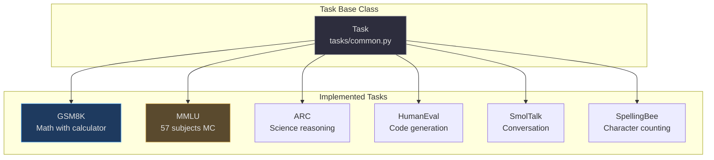
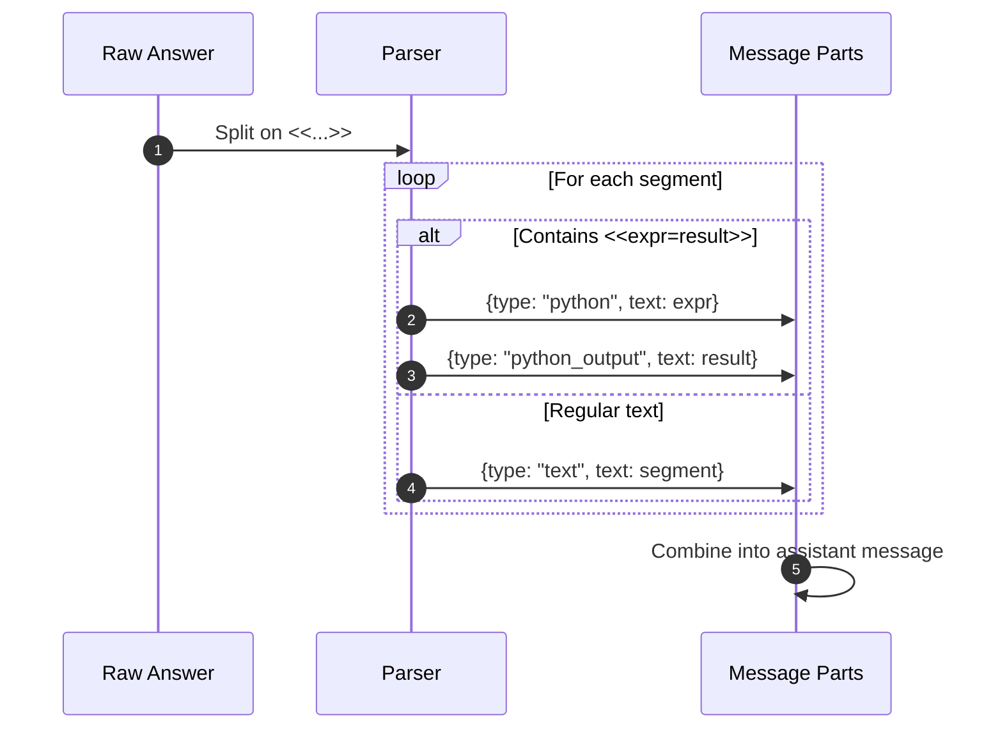

# Individual Task Evaluations

nanochat implements several standard LLM evaluation tasks through a unified `Task` base class interface. Each task wraps a HuggingFace dataset and provides methods for fetching examples, rendering conversations with tool use, and computing evaluation metrics. Tasks are used during both SFT training (as data sources) and RL training (as reward signals).

## Task Interface Summary

| Method | Purpose | Returns | Source |
|---|---|---|---|
| `num_examples()` | Total dataset size | int | [tasks/common.py:29](https://github.com/karpathy/nanochat/blob/master/tasks/common.py#L29) |
| `get_example(idx)` | Fetch single conversation | dict with "messages" | [tasks/common.py:32](https://github.com/karpathy/nanochat/blob/master/tasks/common.py#L32) |
| `eval_type` | "generative" or "categorical" | str | [tasks/common.py:24-27](https://github.com/karpathy/nanochat/blob/master/tasks/common.py#L24-L27) |
| `evaluate(conv, response)` | Score completion | 0 or 1 (int) | [tasks/common.py:50](https://github.com/karpathy/nanochat/blob/master/tasks/common.py#L50) |



<!-- Sources: tasks/common.py:10-52 -->

## GSM8K: Grade School Math

[GSM8K](https://huggingface.co/datasets/openai/gsm8k) contains 8.5K grade school math problems with calculator tool calls marked with `<<expr=result>>` tags.

### Example

**Question**: Weng earns $12 an hour for babysitting. Yesterday, she just did 50 minutes of babysitting. How much did she earn?

**Answer**:
```
Weng earns 12/60 = $<<12/60=0.2>>0.2 per minute.
Working 50 minutes, she earned 0.2 x 50 = $<<0.2*50=10>>10.
#### 10
```

### Tool Call Parsing



<!-- Sources: tasks/gsm8k.py:52-85 -->

Evaluation extracts the number after `####` and compares ([tasks/gsm8k.py:22-34](https://github.com/karpathy/nanochat/blob/master/tasks/gsm8k.py#L22-L34)).

## MMLU & ARC

Both use 4-choice multiple choice with **letter-after-choice** formatting:

```
Multiple Choice question: What is the capital of France?
- Paris=A
- London=B
- Berlin=C
- Madrid=D

Respond only with the letter of the correct answer.
```

<!-- Source: tasks/common.py:112-131 -->

- **MMLU**: 57 subjects across STEM, humanities, social sciences ([tasks/mmlu.py](https://github.com/karpathy/nanochat/blob/master/tasks/mmlu.py))
- **ARC**: Science reasoning at elementary/middle school levels ([tasks/arc.py](https://github.com/karpathy/nanochat/blob/master/tasks/arc.py))

## TaskMixture for SFT

```python
mixture = TaskMixture([
    GSM8K("main", "train"),
    MMLU("all", "auxiliary_train"),
    SmolTalk("train"),
    SpellingBee("train")
])
```

The mixture **deterministically shuffles** all examples with `seed=42` to ensure even task distribution ([tasks/common.py:54-87](https://github.com/karpathy/nanochat/blob/master/tasks/common.py#L54-L87)).

## References

- [tasks/](https://github.com/karpathy/nanochat/tree/master/tasks) — Task implementations
- [GSM8K dataset](https://huggingface.co/datasets/openai/gsm8k)
- [MMLU dataset](https://huggingface.co/datasets/cais/mmlu)
