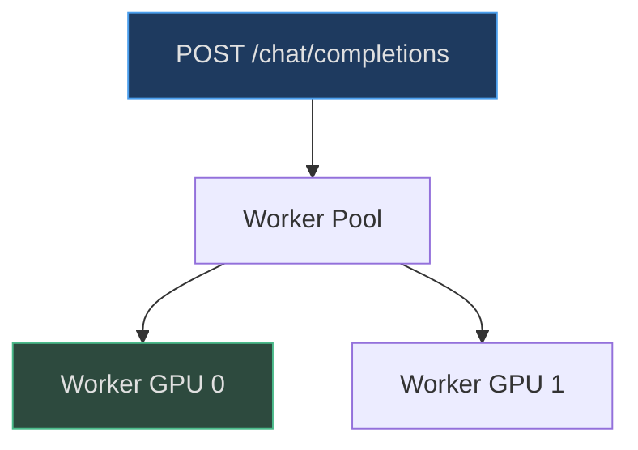

# Chat UI & Web Server

FastAPI-based web server with data-parallel serving across multiple GPUs.

## Architecture



<!-- Sources: scripts/chat_web.py:1-31 -->

## Abuse Prevention

| Limit | Value | Source |
|---|---|---|
| Max messages | 500 | [scripts/chat_web.py:53](https://github.com/karpathy/nanochat/blob/master/scripts/chat_web.py#L53) |
| Max message length | 8,000 chars | [scripts/chat_web.py:54](https://github.com/karpathy/nanochat/blob/master/scripts/chat_web.py#L54) |
| Temperature | 0.0 - 2.0 | [scripts/chat_web.py:56-57](https://github.com/karpathy/nanochat/blob/master/scripts/chat_web.py#L56-L57) |

## Launch

```bash
python -m scripts.chat_web --num-gpus 4
```

## References

- [scripts/chat_web.py](https://github.com/karpathy/nanochat/blob/master/scripts/chat_web.py)
