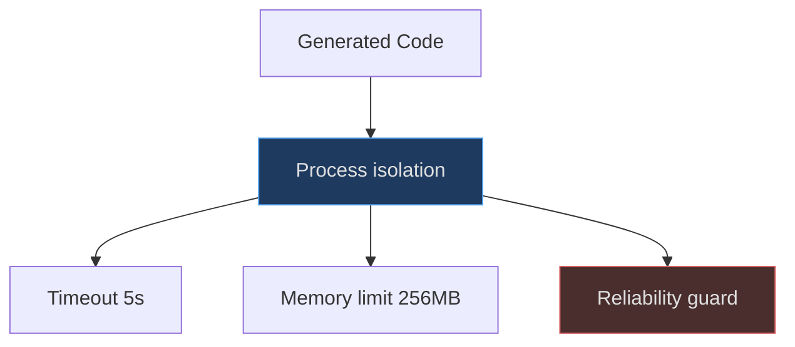

# Sandboxed Code Execution

Safe execution for model-generated code with process isolation, timeouts, and memory limits.

## Safety Layers



<!-- Sources: nanochat/execution.py:1-22 -->

## Blocked Functions

| Category | Functions | Source |
|---|---|---|
| File system | `os.remove`, `shutil.rmtree` | [nanochat/execution.py:164-191](https://github.com/karpathy/nanochat/blob/master/nanochat/execution.py#L164-L191) |
| Process | `os.system`, `subprocess.Popen` | [nanochat/execution.py:162-201](https://github.com/karpathy/nanochat/blob/master/nanochat/execution.py#L162-L201) |

## Usage

```python
from nanochat.execution import execute_code

result = execute_code("print('hello')", timeout=5.0)
print(result.success, result.stdout)
```

## Limitations

**Not a true security sandbox** — protects against accidents, not adversarial code ([nanochat/execution.py:14-22](https://github.com/karpathy/nanochat/blob/master/nanochat/execution.py#L14-L22)).

## References

- [nanochat/execution.py](https://github.com/karpathy/nanochat/blob/master/nanochat/execution.py)
