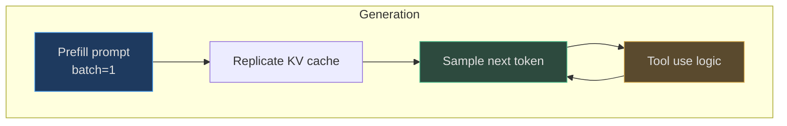
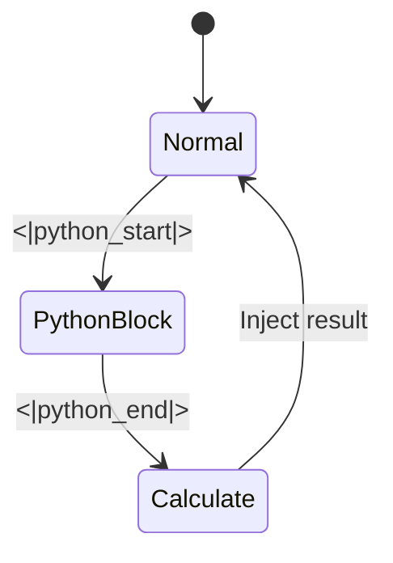

# Inference Engine

The `Engine` class provides efficient batch generation with KV cache reuse, tool use via calculator, and streaming output.

## Components

| Component | Purpose | Source |
|---|---|---|
| **KVCache** | Past key/value tensors in FA3 BHLD layout | [nanochat/engine.py:83-133](https://github.com/karpathy/nanochat/blob/master/nanochat/engine.py#L83-L133) |
| **RowState** | Per-row state (tokens, forced tokens, tool use) | [nanochat/engine.py:155-163](https://github.com/karpathy/nanochat/blob/master/nanochat/engine.py#L155-L163) |
| **Calculator** | Safe eval with timeout | [nanochat/engine.py:26-81](https://github.com/karpathy/nanochat/blob/master/nanochat/engine.py#L26-L81) |

<!-- Sources: nanochat/engine.py:171-276 -->

## Tool State Machine

<!-- Sources: nanochat/engine.py:252-267 -->

Calculator supports math and `.count()` with 3-second timeout ([nanochat/engine.py:47-80](https://github.com/karpathy/nanochat/blob/master/nanochat/engine.py#L47-L80)).

## References

- [nanochat/engine.py](https://github.com/karpathy/nanochat/blob/master/nanochat/engine.py)
