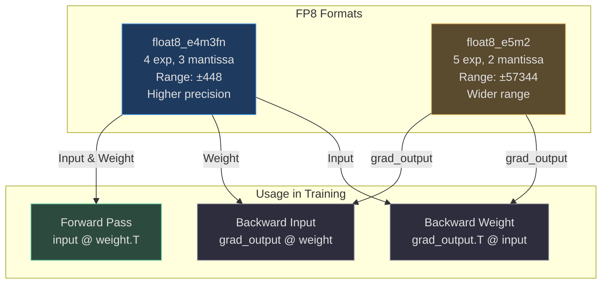
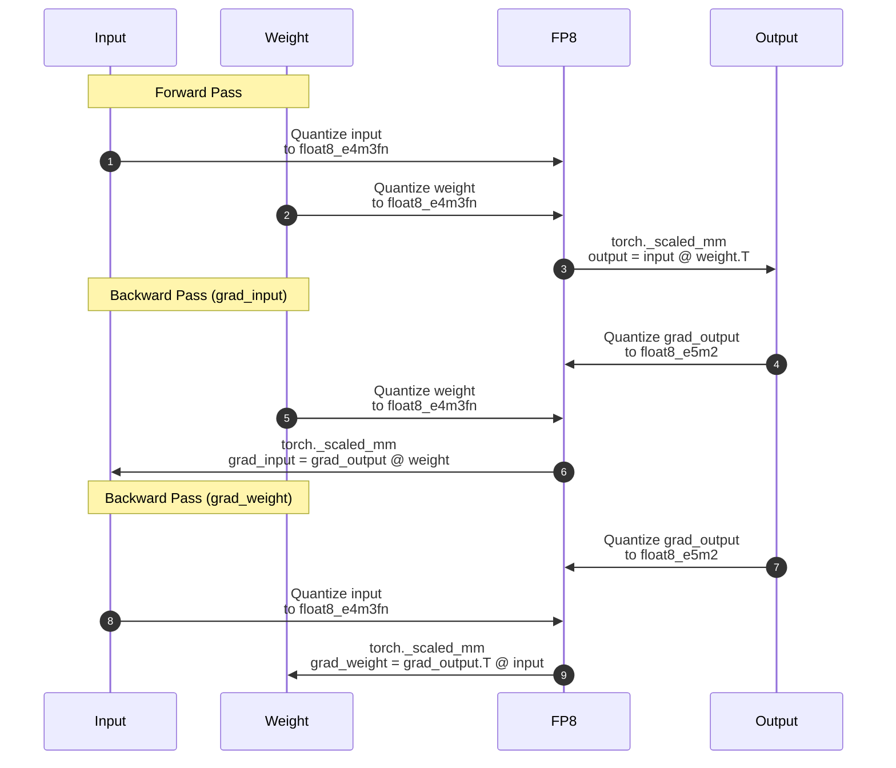
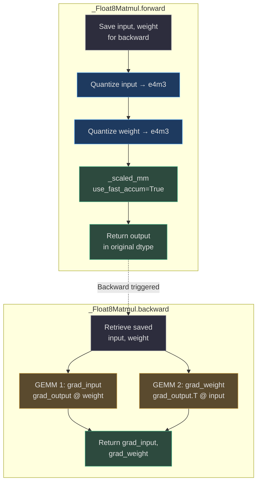
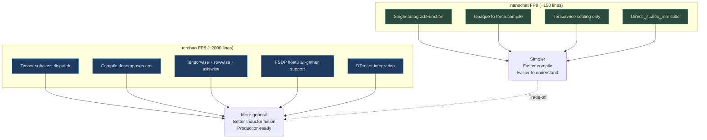

# FP8 Training

nanochat includes a **minimal FP8 training implementation** (~150 lines) that achieves ~2× speedup over bfloat16 on H100+ GPUs by using the `torch._scaled_mm` cuBLAS FP8 matmul kernel. The implementation supports only **tensorwise dynamic scaling** (one scale per tensor), trading off torchao's full generality for simplicity and transparency.

## Overview

FP8 (8-bit floating point) training uses two FP8 formats: `float8_e4m3fn` (4-bit exponent, 3-bit mantissa) for weights and activations, and `float8_e5m2` (5-bit exponent, 2-bit mantissa) for gradients. Each tensor is dynamically scaled at runtime to fit the FP8 range, then quantized and passed to the cuBLAS FP8 matmul kernel which is approximately **2× faster than bfloat16** matmuls on Hopper (H100) GPUs.

## At-a-Glance Summary

| Component | Description | Source |
|---|---|---|
| **FP8 dtypes** | `float8_e4m3fn` (weights/activations), `float8_e5m2` (gradients) | [nanochat/fp8.py:24-30](https://github.com/karpathy/nanochat/blob/master/nanochat/fp8.py#L24-L30) |
| **Scaling** | Tensorwise dynamic: `scale = FP8_MAX / max(\|tensor\|)` | [nanochat/fp8.py:79-105](https://github.com/karpathy/nanochat/blob/master/nanochat/fp8.py#L79-L105) |
| **Matmul kernel** | `torch._scaled_mm` (cuBLAS FP8 GEMM, ~2× faster than bf16) | [nanochat/fp8.py:144-154](https://github.com/karpathy/nanochat/blob/master/nanochat/fp8.py#L144-L154) |
| **Float8Linear** | Drop-in replacement for `nn.Linear` with FP8 compute | [nanochat/fp8.py:199-220](https://github.com/karpathy/nanochat/blob/master/nanochat/fp8.py#L199-L220) |
| **Autograd** | Custom `_Float8Matmul` function for 3 FP8 GEMMs per Linear layer | [nanochat/fp8.py:122-197](https://github.com/karpathy/nanochat/blob/master/nanochat/fp8.py#L122-L197) |

## FP8 Data Types

FP8 training uses **two different 8-bit floating-point formats** to balance precision and range:

| Format | Exponent Bits | Mantissa Bits | Range | Used For | Source |
|---|---|---|---|---|---|
| `float8_e4m3fn` | 4 | 3 | [-448, 448] | Weights, activations (forward) | [nanochat/fp8.py:27-28](https://github.com/karpathy/nanochat/blob/master/nanochat/fp8.py#L27-L28) |
| `float8_e5m2` | 5 | 2 | [-57344, 57344] | Gradients (backward) | [nanochat/fp8.py:29-30](https://github.com/karpathy/nanochat/blob/master/nanochat/fp8.py#L29-L30) |

**Rationale**: Activations and weights have relatively small magnitudes and benefit from higher precision (more mantissa bits). Gradients can have large outliers and need wider dynamic range (more exponent bits).



<!-- Sources: nanochat/fp8.py:24-30, nanochat/fp8.py:137-194 -->

## Tensorwise Dynamic Scaling

Each tensor is **quantized independently** at runtime using a single scalar scale computed from the tensor's max absolute value:

```python
@torch.no_grad()
def _to_fp8(x, fp8_dtype):
    fp8_max = torch.finfo(fp8_dtype).max
    amax = x.float().abs().max()
    scale = fp8_max / amax.double().clamp(min=EPS)
    scale = scale.float()
    x_scaled = x.float() * scale
    x_clamped = x_scaled.clamp(-fp8_max, fp8_max)
    x_fp8 = x_clamped.to(fp8_dtype)
    inv_scale = scale.reciprocal()
    return x_fp8, inv_scale
```

<!-- Source: nanochat/fp8.py:79-105 -->

The inverse scale is returned because `torch._scaled_mm` expects the **dequantization scale** (it multiplies by `inv_scale` during the matmul to convert FP8 values back to the original range).

### Why Tensorwise?

| Recipe | Scales | Speed | Accuracy | Complexity |
|---|---|---|---|---|
| **Tensorwise** | 1 per tensor | Fast (cuBLAS) | Good | Simple |
| **Rowwise** | 1 per row | Slower (CUTLASS) | Better | Complex |

nanochat chooses **tensorwise** because:
1. **Hardware support**: cuBLAS has native FP8 matmul with tensorwise scaling
2. **Simplicity**: Single scalar per tensor, no shape constraints
3. **Speed**: ~2× faster than bfloat16 on H100
4. **Sufficient accuracy**: Tensorwise scaling is good enough for pretraining at nanochat's scale

## Three FP8 Matmuls Per Linear Layer

A standard Linear layer performs **one matmul in forward** and **two in backward**. FP8 training wraps all three with quantization:



<!-- Sources: nanochat/fp8.py:10-13, nanochat/fp8.py:132-197 -->

Each matmul independently re-quantizes its operands to FP8 — we don't reuse the forward's FP8 tensors in backward because:
1. The backward might want different precision
2. Saving FP8 tensors would lose information (can't reconstruct full-precision)
3. Independent quantization is simpler and more robust

## torch._scaled_mm Kernel

The cuBLAS FP8 matmul kernel requires specific memory layouts:

| Operand | Required Layout | How to Achieve | Source |
|---|---|---|---|
| **A (first arg)** | Row-major (contiguous) | Natural for most tensors | [nanochat/fp8.py:33-34](https://github.com/karpathy/nanochat/blob/master/nanochat/fp8.py#L33-L34) |
| **B (second arg)** | Column-major | `_to_col_major(B)` or use `B.t()` if B is contiguous | [nanochat/fp8.py:35-38](https://github.com/karpathy/nanochat/blob/master/nanochat/fp8.py#L35-L38) |

```python
def _to_col_major(x):
    """Rearrange a 2D tensor's memory to column-major layout."""
    return x.t().contiguous().t()
```

<!-- Source: nanochat/fp8.py:108-116 -->

The trick: transpose → contiguous → transpose back. The middle `.contiguous()` forces a copy in transposed order, so the result has column-major strides.

### _scaled_mm Parameters

```python
output = torch._scaled_mm(
    A_fp8,                  # [M, K] row-major
    B_fp8,                  # [K, N] column-major
    scale_a=inv_scale_a,    # Dequantize A
    scale_b=inv_scale_b,    # Dequantize B
    out_dtype=torch.bfloat16,  # Output precision
    use_fast_accum=True,    # Fast but slightly less accurate accumulation
)
```

<!-- Source: nanochat/fp8.py:144-154 -->

`use_fast_accum=True` accumulates dot products in lower precision for speed. nanochat uses `True` in forward and `False` in backward for more precise gradients ([nanochat/fp8.py:150-153](https://github.com/karpathy/nanochat/blob/master/nanochat/fp8.py#L150-L153), [nanochat/fp8.py:174-176](https://github.com/karpathy/nanochat/blob/master/nanochat/fp8.py#L174-L176)).

## Custom Autograd Function



<!-- Sources: nanochat/fp8.py:122-197 -->

The autograd function is marked with `@torch._dynamo.allow_in_graph` so torch.compile treats it as an **opaque operation** rather than decomposing into individual ops ([nanochat/fp8.py:122](https://github.com/karpathy/nanochat/blob/master/nanochat/fp8.py#L122)).

## Float8Linear: Drop-In Replacement

`Float8Linear` is a subclass of `nn.Linear` that overrides the forward method to use FP8 compute:

```python
class Float8Linear(nn.Linear):
    def forward(self, input):
        if torch.is_autocast_enabled():
            input = input.to(torch.get_autocast_gpu_dtype())
        orig_shape = input.shape
        input_2d = input.reshape(-1, orig_shape[-1])
        output = _Float8Matmul.apply(input_2d, self.weight)
        output = output.reshape(*orig_shape[:-1], output.shape[-1])
        if self.bias is not None:
            output = output + self.bias.to(output.dtype)
        return output
```

<!-- Source: nanochat/fp8.py:199-220 -->

**Key details**:
- Weights and biases remain in their original dtype (e.g., bfloat16)
- Only the matmul is performed in FP8
- Batch dimensions are flattened to 2D for `_scaled_mm`, then reshaped back

### Converting a Model to FP8

```python
from nanochat.fp8 import Float8LinearConfig, convert_to_float8_training

config = Float8LinearConfig.from_recipe_name("tensorwise")
convert_to_float8_training(model, config=config, module_filter_fn=None)
```

<!-- Source: nanochat/fp8.py:249-272 -->

The `convert_to_float8_training` function walks the module tree and swaps each `nn.Linear` with `Float8Linear`, **sharing the original weight and bias tensors** (no copies, no extra memory).

### Module Filter

The optional `module_filter_fn` allows skipping certain layers:

```python
def filter_fn(module, fqn):
    # Skip if dimensions not divisible by 16 (hardware requirement)
    return module.in_features % 16 == 0 and module.out_features % 16 == 0

convert_to_float8_training(model, module_filter_fn=filter_fn)
```

<!-- Source: nanochat/fp8.py:258-262 -->

## nanochat vs torchao



<!-- Sources: nanochat/fp8.py:1-10, nanochat/fp8.py:40-69 -->

### nanochat Approach

- **~150 lines** of straightforward code
- Single `_Float8Matmul` autograd function
- torch.compile sees it as one opaque node
- Tensorwise scaling only (sufficient for nanochat's scale)
- No fancy features (FSDP, DTensor, rowwise)

### torchao Approach

- **~2000 lines** with extensive features
- `Float8TrainingTensor` subclass with `__torch_dispatch__`
- torch.compile decomposes the subclass and sees every op
- Supports tensorwise, rowwise, axiswise scaling
- FSDP float8 all-gather, DTensor, production hardening

**Trade-off**: nanochat's simpler approach is **easier to understand and modify**, while torchao's tensor subclass allows **better Inductor fusion** (e.g., fusing the `amax` computation with the preceding activation function). Both call the same `_scaled_mm` kernel, so the GPU matmul is identical.

## Speedup Results

| Configuration | Time (GPT-2 speedrun) | Speedup vs BF16 | Source |
|---|---|---|---|
| **BF16** (baseline) | 2.91 hours | 1.0× | [README.md:18](https://github.com/karpathy/nanochat/blob/master/README.md#L18) |
| **FP8 tensorwise** | 2.76 hours | 1.05× | [README.md:19](https://github.com/karpathy/nanochat/blob/master/README.md#L19) |

The **~5% end-to-end speedup** may seem modest, but the matmul itself is ~2× faster — the difference is that matmuls are only part of the total training time (the rest is spent on normalization, attention overhead, data loading, etc.).

### When to Use FP8

FP8 training is **only beneficial on H100+ GPUs** with Hopper architecture (`sm90`) that have native FP8 tensor cores:

| GPU Architecture | FP8 Support | Recommendation |
|---|---|---|
| **Hopper** (H100, H200) | Native FP8 tensor cores | Use FP8 for ~2× matmul speedup |
| **Ada** (RTX 4090, L40S) | No native FP8 | Stick with BF16 |
| **Ampere** (A100, RTX 3090) | No native FP8 | Stick with BF16 |
| **Blackwell** (B100, B200) | Native FP8 (future) | Use FP8 when available |

Enable FP8 with `--fp8 --fp8-recipe tensorwise` ([scripts/base_train.py:46-47](https://github.com/karpathy/nanochat/blob/master/scripts/base_train.py#L46-L47)).

## Numerical Considerations

### Float64 for Scale Computation

The scale is computed in `float64` to ensure **consistent numerics between torch.compile and eager mode**:

```python
scale = fp8_max / amax.double().clamp(min=EPS)
scale = scale.float()
```

<!-- Source: nanochat/fp8.py:95-96 -->

Without the upcast to double, compile and eager can diverge due to subtle floating-point rounding differences. torchao does the same upcast for consistency ([nanochat/fp8.py:90-96](https://github.com/karpathy/nanochat/blob/master/nanochat/fp8.py#L90-L96)).

### Saturation Clamping

Before casting to FP8, the scaled tensor is **clamped** to prevent overflow:

```python
x_scaled = x.float() * scale
x_clamped = x_scaled.clamp(-fp8_max, fp8_max)
x_fp8 = x_clamped.to(fp8_dtype)
```

<!-- Source: nanochat/fp8.py:99-101 -->

PyTorch's default behavior is to **wrap** on overflow (not saturate), so clamping is necessary to avoid catastrophic errors.

## Layout Requirements Recap

```mermaid
graph LR
    subgraph Input["Input (A)"]
        A[Shape: [M, K]<br/>Layout: Row-major<br/>Strides: (K, 1)]
    end
    
    subgraph Weight["Weight (B)"]
        B[Shape: [K, N]<br/>Layout: Column-major<br/>Strides: (1, K)]
    end
    
    subgraph Matmul["_scaled_mm"]
        MM[A @ B<br/>cuBLAS FP8 GEMM]
    end
    
    A --> MM
    B --> MM
    MM --> O[Output: [M, N]<br/>dtype: bfloat16]
    
    style A fill:#1e3a5f,stroke:#4a9eed,color:#e0e0e0
    style B fill:#5a4a2e,stroke:#d4a84b,color:#e0e0e0
    style MM fill:#2d4a3e,stroke:#4aba8a,color:#e0e0e0
    style O fill:#2d4a3e,stroke:#4aba8a,color:#e0e0e0
```

<!-- Sources: nanochat/fp8.py:33-38, nanochat/fp8.py:108-116 -->

For the forward pass, `weight.t()` naturally provides column-major layout (no copy needed). For backward passes, we use `_to_col_major()` to explicitly rearrange memory.

## References

- [PyTorch FP8 training tutorial](https://pytorch.org/blog/fp8-training/) — Official PyTorch guide
- [torchao Float8 training](https://github.com/pytorch/ao/tree/main/torchao/float8) — Full-featured implementation
- [nanochat/fp8.py](https://github.com/karpathy/nanochat/blob/master/nanochat/fp8.py) — Minimal ~150 line implementation
- [NVIDIA Hopper FP8 whitepaper](https://resources.nvidia.com/en-us-tensor-core) — Hardware details
- [scripts/base_train.py](https://github.com/karpathy/nanochat/blob/master/scripts/base_train.py) — Usage example with `--fp8` flag
