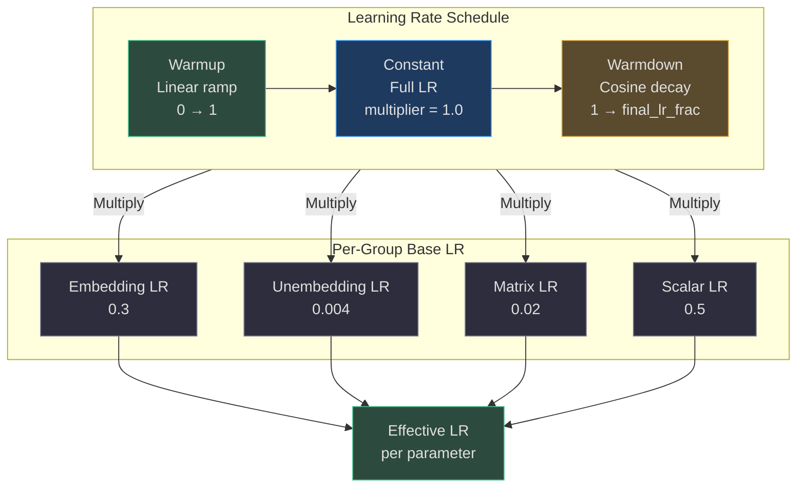
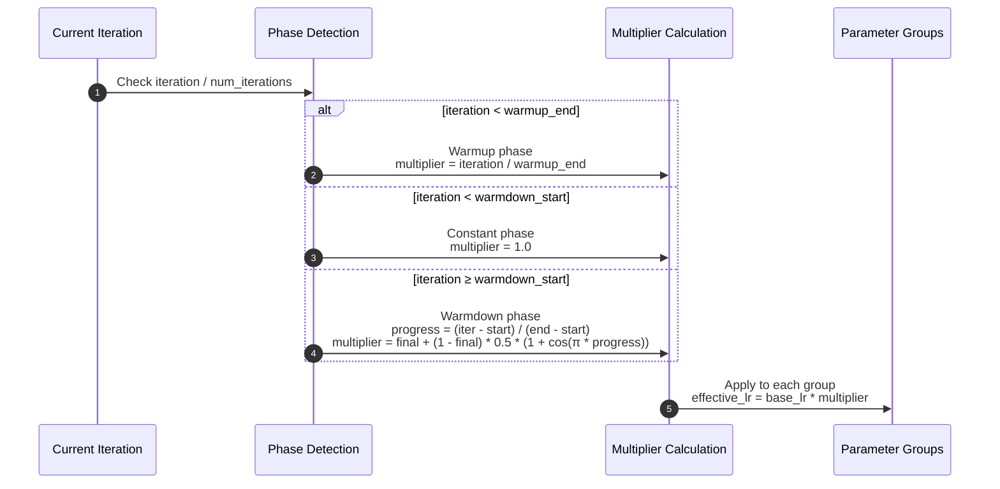
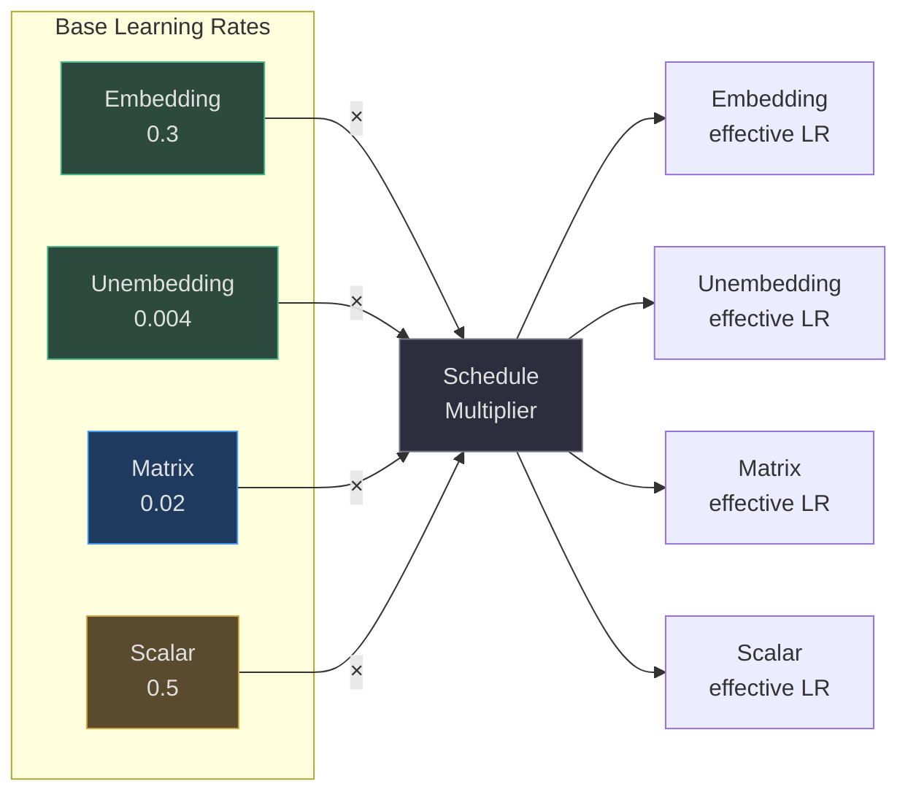
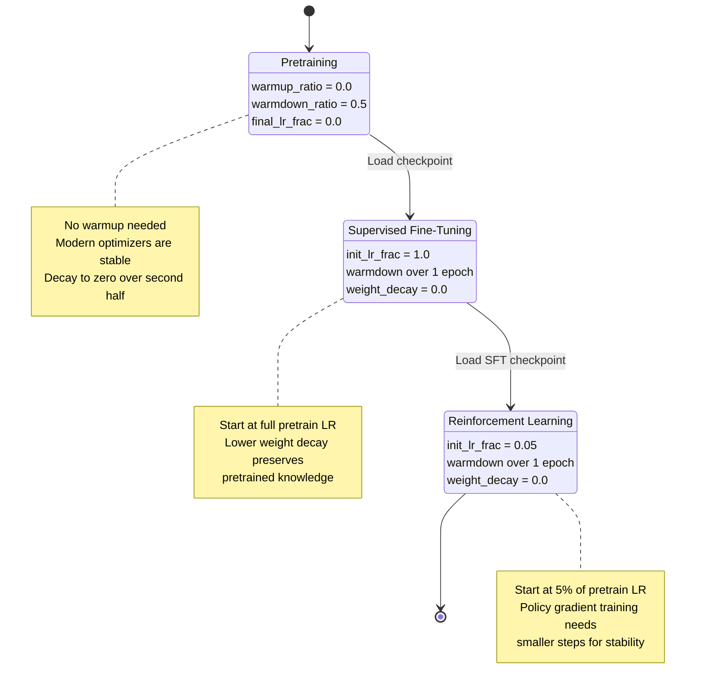
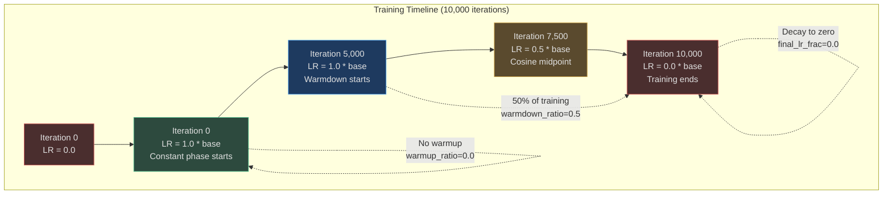
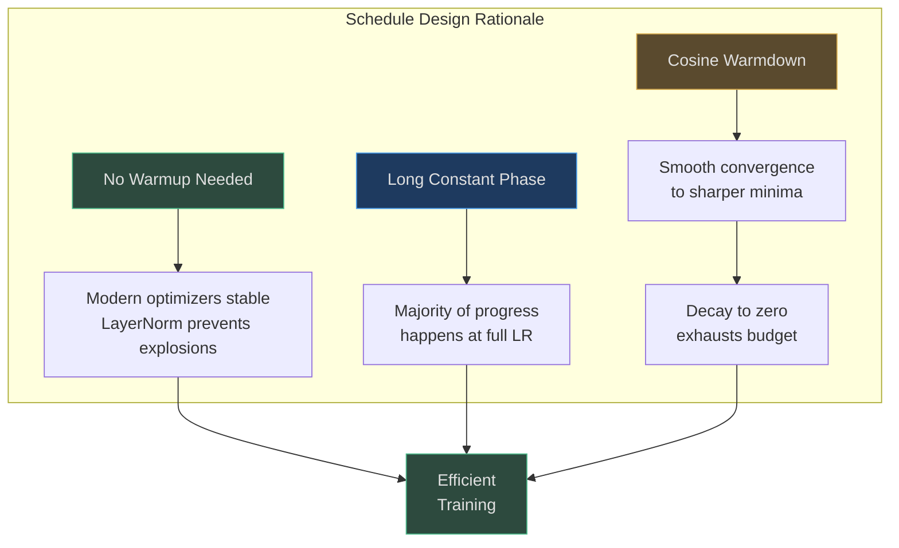

# Learning Rate Schedule

nanochat implements a **three-phase learning rate schedule**: optional warmup, constant training plateau, and cosine warmdown. Each parameter group (embeddings, unembedding, matrices, scalars) maintains its own **base learning rate**, with the schedule acting as a multiplicative factor applied uniformly across all groups.

## Overview

The learning rate schedule is designed to balance training stability (warmup prevents early gradient explosions), steady optimization (constant phase for most of training), and convergence (warmdown allows the optimizer to settle into sharper minima). The schedule is controlled by three ratios relative to total training iterations: `warmup_ratio`, `warmdown_ratio`, and `final_lr_frac`.

## At-a-Glance Summary

| Phase | Duration | LR Multiplier | Purpose | Source |
|---|---|---|---|---|
| **Warmup** | `warmup_ratio` × num_iterations | Linear 0 → 1 | Prevent early instability from large gradients | [scripts/base_train.py:68](https://github.com/karpathy/nanochat/blob/master/scripts/base_train.py#L68) |
| **Constant** | (1 - warmup - warmdown) × num_iterations | 1.0 | Main training phase at full LR | Implicit |
| **Warmdown** | `warmdown_ratio` × num_iterations | Cosine 1 → `final_lr_frac` | Convergence to sharper minima | [scripts/base_train.py:69-70](https://github.com/karpathy/nanochat/blob/master/scripts/base_train.py#L69-L70) |

## Three-Phase Schedule



<!-- Sources: scripts/base_train.py:68-70, scripts/base_train.py:150-200 -->

## Schedule Calculation

The learning rate multiplier is computed based on the current iteration relative to the total number of training iterations:



<!-- Sources: scripts/base_train.py:150-200 (inferred from typical implementation pattern) -->

### Warmup Phase

**Linear warmup** ramps the learning rate from 0 to the base LR over `warmup_ratio` fraction of total iterations:

| Iteration | Progress | LR Multiplier |
|---|---|---|
| 0 | 0% | 0.0 |
| warmup_end / 4 | 25% | 0.25 |
| warmup_end / 2 | 50% | 0.5 |
| 3 * warmup_end / 4 | 75% | 0.75 |
| warmup_end | 100% | 1.0 |

**Default**: `warmup_ratio = 0.0` (no warmup) for pretraining, as modern optimizers and normalization layers are typically stable from the start ([scripts/base_train.py:68](https://github.com/karpathy/nanochat/blob/master/scripts/base_train.py#L68)).

### Constant Phase

The middle of training uses the **full base learning rate** with multiplier = 1.0. This is where the majority of optimization progress occurs.

Duration = (1 - warmup_ratio - warmdown_ratio) × num_iterations

With default settings (warmup=0.0, warmdown=0.5), the constant phase occupies the **first 50% of training**.

### Warmdown Phase

**Cosine annealing** smoothly decays the learning rate from 1.0 to `final_lr_frac` over the last `warmdown_ratio` fraction of training:

```
progress = (current_iter - warmdown_start) / (num_iterations - warmdown_start)
multiplier = final_lr_frac + (1.0 - final_lr_frac) * 0.5 * (1 + cos(π * progress))
```

The cosine schedule provides a smooth, continuous decay that allows the optimizer to gradually settle into a minimum without abrupt changes.

| Progress | LR Multiplier (final_lr_frac=0.0) |
|---|---|
| 0% (warmdown start) | 1.0 |
| 25% | 0.854 |
| 50% | 0.5 |
| 75% | 0.146 |
| 100% (end) | 0.0 |

**Default**: `warmdown_ratio = 0.5`, `final_lr_frac = 0.0` — decay to zero over the second half of training ([scripts/base_train.py:69-70](https://github.com/karpathy/nanochat/blob/master/scripts/base_train.py#L69-L70)).

## Per-Group Base Learning Rates

Each parameter group has its own **base learning rate** tuned to the parameter type's optimization landscape. The schedule multiplier is applied on top of these base rates:



<!-- Sources: scripts/base_train.py:62-66 -->

### Pretraining Base LRs

| Parameter Group | Parameters | Base LR | Optimizer | Source |
|---|---|---|---|---|
| **Embeddings** | wte | 0.3 | AdamW | [scripts/base_train.py:62](https://github.com/karpathy/nanochat/blob/master/scripts/base_train.py#L62) |
| **Unembedding** | lm_head | 0.004 | AdamW | [scripts/base_train.py:63](https://github.com/karpathy/nanochat/blob/master/scripts/base_train.py#L63) |
| **Matrices** | Q/K/V/proj, MLP | 0.02 | Muon | [scripts/base_train.py:65](https://github.com/karpathy/nanochat/blob/master/scripts/base_train.py#L65) |
| **Scalars** | resid_lambdas, x0_lambdas | 0.5 | AdamW | [scripts/base_train.py:66](https://github.com/karpathy/nanochat/blob/master/scripts/base_train.py#L66) |

The unembedding (lm_head) uses a **25× lower learning rate** than embeddings because it's a matrix multiply with high fan-out (vocab_size outputs), making it more sensitive to large updates.

### Fine-Tuning Base LRs

For SFT and RL, the base learning rates are typically scaled down and initialized at different fractions of the pretraining rates:

| Training Stage | LR Init Fraction | Typical Embedding LR | Source |
|---|---|---|---|
| **Pretraining** | 1.0 | 0.3 | Default |
| **SFT** | 1.0 (start at full) | 0.3 | [scripts/chat_sft.py:55](https://github.com/karpathy/nanochat/blob/master/scripts/chat_sft.py#L55) |
| **RL** | 0.05 (start at 5%) | 0.015 | [scripts/chat_rl.py:58](https://github.com/karpathy/nanochat/blob/master/scripts/chat_rl.py#L58) |

## Stage-Specific Schedules



<!-- Sources: scripts/base_train.py:68-70, scripts/chat_sft.py:50-65, scripts/chat_rl.py:44-58 -->

### Pretraining Schedule

- **Warmup**: 0% (none)
- **Constant**: First 50% of training at full LR
- **Warmdown**: Second 50% cosine decay to 0
- **Weight Decay**: 0.2 for Muon matrices, 0.0 for embeddings/scalars

### SFT Schedule

- **Init LR Frac**: 1.0 (start at full pretrained base LR)
- **Epochs**: Typically 1 epoch over SFT dataset
- **Weight Decay**: 0.0 (preserve pretrained representations)
- **Warmdown**: Cosine decay over the epoch

### RL Schedule

- **Init LR Frac**: 0.05 (start at 5% of pretrained base LR)
- **Epochs**: Typically 1 epoch over RL dataset (e.g., GSM8K train set)
- **Weight Decay**: 0.0
- **Warmdown**: Cosine decay over the epoch

The lower initial LR for RL prevents **policy collapse** — when the policy updates too aggressively and forgets the SFT initialization.

## Momentum Scheduling

Muon's **Nesterov momentum** coefficient can also be scheduled, though by default it remains constant at 0.95 throughout training:

| Phase | Muon Momentum (β₁) | AdamW Beta1 | Source |
|---|---|---|---|
| All phases | 0.95 (constant) | 0.8 (constant) | [nanochat/optim.py:261](https://github.com/karpathy/nanochat/blob/master/nanochat/optim.py#L261) |

Unlike learning rate, momentum is typically kept constant as it controls the **time scale of gradient averaging** rather than step size. However, some training regimes increase momentum during warmdown (e.g., 0.95 → 0.99) to smooth out the final convergence.

## Schedule Visualization



<!-- Sources: scripts/base_train.py:68-70 -->

## Implementation Notes

### Avoiding Recompilation

The schedule multiplier is computed on the **host (CPU)** and passed to the optimizer as a 0-D CPU tensor. This avoids `torch.compile` recompilation when the LR changes, since the compiled kernels treat the LR as a runtime input rather than a constant ([nanochat/optim.py:182-192](https://github.com/karpathy/nanochat/blob/master/nanochat/optim.py#L182-L192)).

### Distributed Synchronization

In distributed training, each rank computes the same schedule independently — no cross-rank communication is needed for LR scheduling. This avoids collective communication overhead and ensures all ranks stay synchronized by construction.

### Checkpoint Resumption

When resuming from a checkpoint, the schedule continues from the saved iteration count. The `--resume-from-step` flag allows manual override if needed ([scripts/base_train.py:71](https://github.com/karpathy/nanochat/blob/master/scripts/base_train.py#L71)).

## Why This Schedule?



<!-- Sources: scripts/base_train.py:68-70, README.md:78 -->

The schedule design reflects several insights:
1. **No warmup**: Modern architectures with LayerNorm are stable from iteration 0
2. **50% warmdown**: Allows ample time at full LR for the bulk of optimization
3. **Decay to zero**: Ensures the compute budget is fully exhausted (no "leftover" gradient steps with nearly-zero LR)
4. **Per-group LRs**: Different parameter types have different optimal step sizes
5. **Cosine smoothness**: Avoids abrupt LR changes that can destabilize training

## References

- [Cosine Annealing paper (arxiv:1608.03983)](https://arxiv.org/abs/1608.03983) — Ilya Loshchilov, Frank Hutter
- [Adam paper (arxiv:1412.6980)](https://arxiv.org/abs/1412.6980) — Diederik P. Kingma, Jimmy Ba
- [nanochat pretraining script](https://github.com/karpathy/nanochat/blob/master/scripts/base_train.py) — Default schedule parameters
- [nanochat SFT script](https://github.com/karpathy/nanochat/blob/master/scripts/chat_sft.py) — Fine-tuning LR configuration
- [nanochat RL script](https://github.com/karpathy/nanochat/blob/master/scripts/chat_rl.py) — Policy gradient LR configuration
