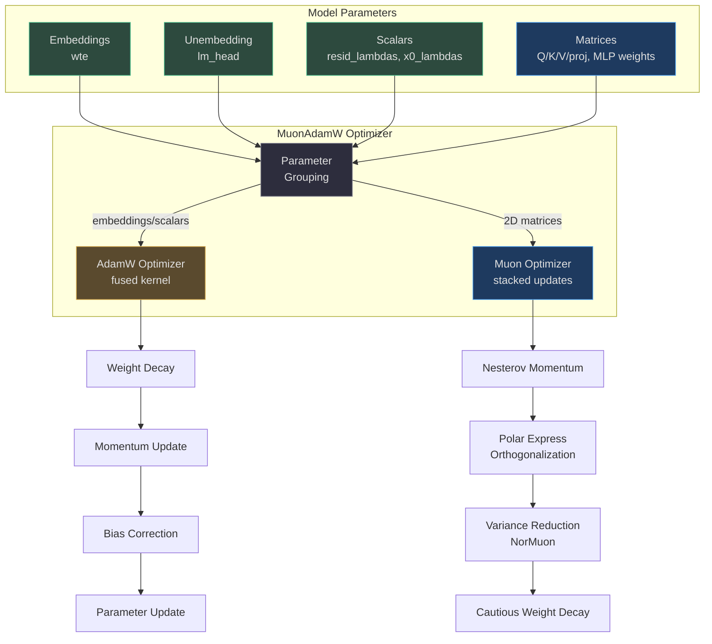
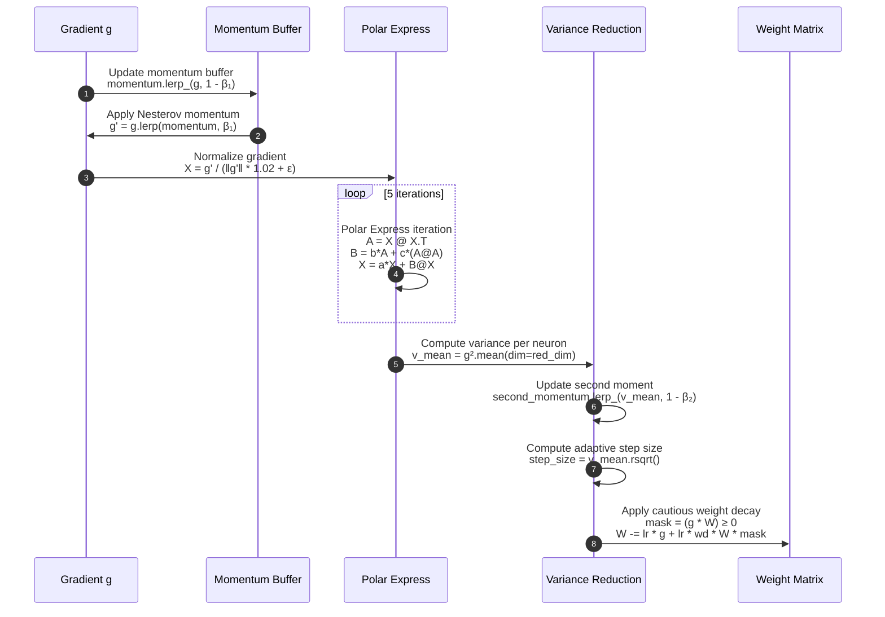
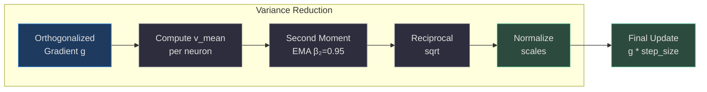
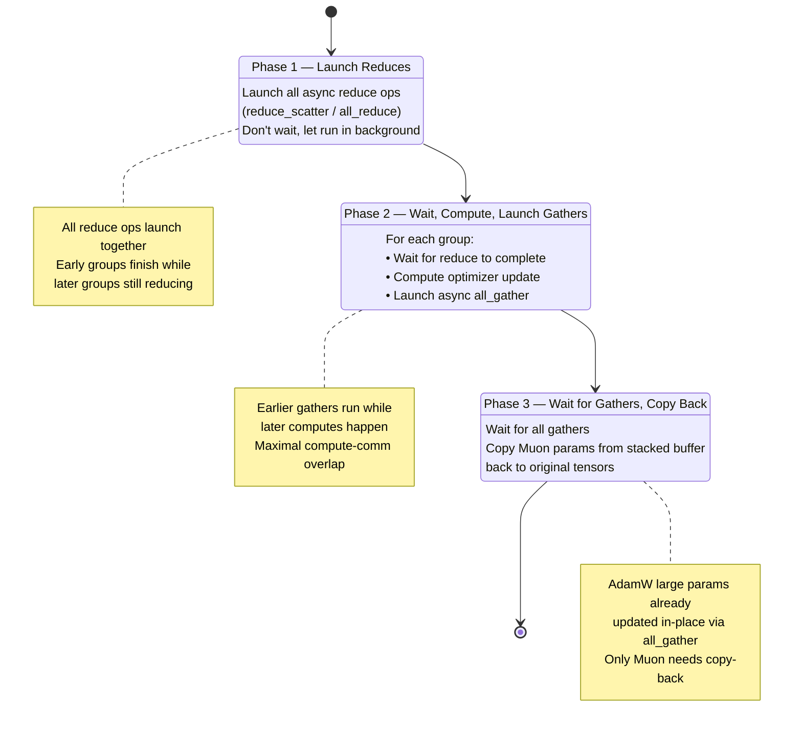
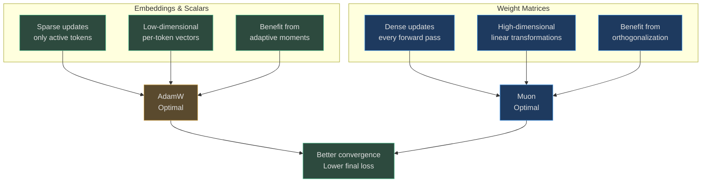

# Mixed Muon/AdamW Optimizer

nanochat employs a **hybrid optimizer architecture** that applies different optimization algorithms to different parameter groups based on their geometric properties. Matrix parameters (attention projections, MLP weights) are optimized with **Muon** — a Newton-Schulz orthogonalization-based optimizer adapted from [modded-nanogpt](https://github.com/KellerJordan/modded-nanogpt) — while embeddings and scalar parameters use traditional **AdamW**.

## Overview

The mixed optimizer exploits the mathematical insight that weight matrices in neural networks benefit from orthogonalization-based updates (which preserve gradients better through deep networks), while embeddings and scalar parameters prefer adaptive moment estimation. Two implementations exist: `MuonAdamW` for single-GPU training and `DistMuonAdamW` for distributed multi-GPU training with overlapped communication and ZeRO-2 style state sharding.

## At-a-Glance Summary

| Component | Algorithm | Parameter Types | Key Feature | Source |
|---|---|---|---|---|
| **AdamW** | Adaptive moments + decoupled weight decay | Embeddings, unembeddings, scalars | Fused single-kernel step via `torch.compile` | [nanochat/optim.py:20-50](https://github.com/karpathy/nanochat/blob/master/nanochat/optim.py#L20-L50) |
| **Muon** | Momentum → Polar Express → Variance Reduction | Q/K/V/proj, MLP weights (2D matrices) | Stacked parameter updates, NorMuon scaling | [nanochat/optim.py:90-147](https://github.com/karpathy/nanochat/blob/master/nanochat/optim.py#L90-L147) |
| **DistMuonAdamW** | Mixed AdamW + Muon with async comms | All parameters (sharded by group) | ZeRO-2 reduce_scatter + all_gather overlap | [nanochat/optim.py:297-534](https://github.com/karpathy/nanochat/blob/master/nanochat/optim.py#L297-L534) |
| **Polar Express** | 5-iteration orthogonalization | Muon gradient orthogonalization | Alternative to Newton-Schulz with better convergence | [nanochat/optim.py:80-127](https://github.com/karpathy/nanochat/blob/master/nanochat/optim.py#L80-L127) |

## Architecture



<!-- Sources: nanochat/optim.py:1-292 -->

## AdamW Implementation

### Fused Single-Kernel Step

nanochat's AdamW uses a **fully fused update kernel** marked with `@torch.compile(dynamic=False, fullgraph=True)` to eliminate Python overhead between operations. The entire update — weight decay, momentum, bias correction, and parameter update — executes as a single compiled graph:

```python
@torch.compile(dynamic=False, fullgraph=True)
def adamw_step_fused(
    p: Tensor, grad: Tensor, exp_avg: Tensor, exp_avg_sq: Tensor,
    step_t: Tensor, lr_t: Tensor, beta1_t: Tensor, beta2_t: Tensor,
    eps_t: Tensor, wd_t: Tensor
) -> None:
    # Weight decay (decoupled, applied before the update)
    p.mul_(1 - lr_t * wd_t)
    # Update running averages (lerp_ is cleaner and fuses well)
    exp_avg.lerp_(grad, 1 - beta1_t)
    exp_avg_sq.lerp_(grad.square(), 1 - beta2_t)
    # Bias corrections
    bias1 = 1 - beta1_t ** step_t
    bias2 = 1 - beta2_t ** step_t
    # Compute update and apply
    denom = (exp_avg_sq / bias2).sqrt() + eps_t
    step_size = lr_t / bias1
    p.add_(exp_avg / denom, alpha=-step_size)
```

<!-- Source: nanochat/optim.py:20-49 -->

All hyperparameters are passed as **0-D CPU tensors** to avoid recompilation when values change ([nanochat/optim.py:182-192](https://github.com/karpathy/nanochat/blob/master/nanochat/optim.py#L182-L192)). This design ensures that the compiled kernel remains valid across different learning rates, betas, and weight decay values without triggering Dynamo recompilation.

### Default Hyperparameters

| Parameter Group | Learning Rate | Weight Decay | Beta1 | Beta2 | Source |
|---|---|---|---|---|---|
| **Embeddings** (wte) | 0.3 | 0.0 (SFT/RL) / 0.2 (pretrain) | 0.8 | 0.95 | [scripts/base_train.py:62](https://github.com/karpathy/nanochat/blob/master/scripts/base_train.py#L62) |
| **Unembedding** (lm_head) | 0.004 | 0.0 (SFT/RL) / 0.2 (pretrain) | 0.8 | 0.95 | [scripts/base_train.py:63](https://github.com/karpathy/nanochat/blob/master/scripts/base_train.py#L63) |
| **Scalars** (lambdas) | 0.5 | 0.0 | 0.8 | 0.95 | [scripts/base_train.py:66](https://github.com/karpathy/nanochat/blob/master/scripts/base_train.py#L66) |

## Muon Optimizer

### Polar Express Orthogonalization

Muon replaces standard SGD's gradient with the **nearest orthogonal matrix** to the gradient, computed via the **Polar Express** iterative method — an alternative to Newton-Schulz with potentially better convergence properties (see [arxiv:2505.16932](https://arxiv.org/pdf/2505.16932)):



<!-- Sources: nanochat/optim.py:90-147 -->

The **cautious weight decay** on line 7 only applies weight decay when the gradient and parameter have the same sign, preventing over-regularization ([nanochat/optim.py:142-146](https://github.com/karpathy/nanochat/blob/master/nanochat/optim.py#L142-L146)).

### Polar Express Coefficients

The 5-iteration Polar Express uses precomputed polynomial coefficients optimized for `num_iters=5`, `safety_factor=2e-2`, and `cushion=2` ([nanochat/optim.py:80-88](https://github.com/karpathy/nanochat/blob/master/nanochat/optim.py#L80-L88)):

| Iteration | a | b | c |
|---|---|---|---|
| 1 | 8.157 | -22.483 | 15.879 |
| 2 | 4.043 | -2.809 | 0.500 |
| 3 | 3.892 | -2.772 | 0.506 |
| 4 | 3.286 | -2.368 | 0.464 |
| 5 | 2.347 | -1.710 | 0.423 |

Each iteration computes:
- **A** = X @ X^T (Gram matrix)
- **B** = b·A + c·(A @ A) (cubic correction)
- **X** = a·X + B @ X (orthogonalization step)

The implementation handles both tall and wide matrices efficiently by choosing the smaller Gram matrix dimension ([nanochat/optim.py:117-126](https://github.com/karpathy/nanochat/blob/master/nanochat/optim.py#L117-L126)).

### NorMuon Variance Reduction

After orthogonalization, Muon applies **per-neuron adaptive scaling** (NorMuon) to normalize update magnitudes across neurons, which otherwise have non-uniform scales after orthogonalization. This is a factored second-moment estimator that tracks variance either per-row or per-column depending on matrix shape:



<!-- Sources: nanochat/optim.py:129-140 -->

The reduction dimension (`red_dim`) is chosen based on matrix aspect ratio: `-1` (per-column) if tall (rows > cols), `-2` (per-row) if wide ([nanochat/optim.py:254](https://github.com/karpathy/nanochat/blob/master/nanochat/optim.py#L254)).

### Learning Rate Scaling

Muon applies a **shape-dependent learning rate multiplier** to account for the fact that wider matrices have more directions to average over:

```python
lr_effective = lr * max(1.0, shape[-2] / shape[-1])**0.5
```

<!-- Source: nanochat/optim.py:263 -->

This ensures that square matrices get the base learning rate, while wide matrices get a boost proportional to sqrt(width/height).

## Distributed Communication (DistMuonAdamW)

### ZeRO-2 Style Sharding

`DistMuonAdamW` shards optimizer state across ranks to reduce memory usage (ZeRO-2 style):

| Parameter Type | Gradient Communication | Update | State Sharding | Parameter Synchronization |
|---|---|---|---|---|
| **Small AdamW** (<1024 elements) | `all_reduce` (average) | Full param on each rank | Replicated | N/A (already in sync) |
| **Large AdamW** (≥1024 elements) | `reduce_scatter` (average) | Only rank's slice | Sharded by dim 0 | `all_gather` after update |
| **Muon** (stacked matrices) | `reduce_scatter` (stacked) | Only rank's chunk | Sharded by stack index | `all_gather` after update |

### Three-Phase Async Communication

The distributed optimizer uses a **3-phase async structure** to maximize overlap between communication and computation:



<!-- Sources: nanochat/optim.py:309-323, nanochat/optim.py:507-533 -->

### Buffer Reuse for Muon

For Muon groups, the implementation reuses the **same buffer** for both reduce_scatter input (stacked grads) and all_gather output (stacked params), saving memory since these operations don't overlap ([nanochat/optim.py:343-346](https://github.com/karpathy/nanochat/blob/master/nanochat/optim.py#L343-L346)):

```mermaid
graph TB
    subgraph Buffer["Single Allocated Buffer"]
        B[stacked_grads / stacked_params<br/>Shape: (padded_num_params, *shape)]
    end
    
    RS[reduce_scatter]
    GC[grad_chunk<br/>per rank]
    PC[param_chunk<br/>per rank]
    AG[all_gather]
    
    B -->|Input| RS
    RS --> GC
    GC -->|Muon Update| PC
    PC -->|Output buffer| AG
    AG -->|Reuse buffer| B
    
    style B fill:#1e3a5f,stroke:#4a9eed,color:#e0e0e0
    style RS fill:#5a4a2e,stroke:#d4a84b,color:#e0e0e0
    style AG fill:#2d4a3e,stroke:#4aba8a,color:#e0e0e0
    style GC fill:#2d2d3d,stroke:#7a7a8a,color:#e0e0e0
    style PC fill:#2d2d3d,stroke:#7a7a8a,color:#e0e0e0
```

<!-- Sources: nanochat/optim.py:395-406, nanochat/optim.py:495-497 -->

## Hyperparameter Defaults

### Pretraining

| Group | Parameter | Default Value | Source |
|---|---|---|---|
| AdamW (embeddings) | lr | 0.3 | [scripts/base_train.py:62](https://github.com/karpathy/nanochat/blob/master/scripts/base_train.py#L62) |
| AdamW (unembedding) | lr | 0.004 | [scripts/base_train.py:63](https://github.com/karpathy/nanochat/blob/master/scripts/base_train.py#L63) |
| AdamW (scalars) | lr | 0.5 | [scripts/base_train.py:66](https://github.com/karpathy/nanochat/blob/master/scripts/base_train.py#L66) |
| Muon (matrices) | lr | 0.02 | [scripts/base_train.py:65](https://github.com/karpathy/nanochat/blob/master/scripts/base_train.py#L65) |
| Muon (matrices) | weight_decay | 0.2 (cautious) | [scripts/base_train.py:64](https://github.com/karpathy/nanochat/blob/master/scripts/base_train.py#L64) |
| AdamW (all) | beta1 | 0.8 | [scripts/base_train.py:67](https://github.com/karpathy/nanochat/blob/master/scripts/base_train.py#L67) |
| AdamW (all) | beta2 | 0.95 | [scripts/base_train.py:68](https://github.com/karpathy/nanochat/blob/master/scripts/base_train.py#L68) |
| Muon (all) | momentum | 0.95 | [nanochat/optim.py:261](https://github.com/karpathy/nanochat/blob/master/nanochat/optim.py#L261) |
| Muon (all) | beta2 | 0.95 (variance reduction) | [nanochat/optim.py:262](https://github.com/karpathy/nanochat/blob/master/nanochat/optim.py#L262) |
| Muon (all) | ns_steps | 5 (Polar Express iterations) | [nanochat/optim.py:276](https://github.com/karpathy/nanochat/blob/master/nanochat/optim.py#L276) |

## Why Mixed Optimizer?



<!-- Sources: nanochat/optim.py:1-8, nanochat/optim.py:166-169 -->

The mixed approach exploits the **geometric structure** of different parameter types:
- **Embeddings** receive sparse gradient signals (only from active tokens) and benefit from per-parameter adaptive learning rates
- **Weight matrices** receive dense gradients and benefit from orthogonalization which preserves gradient norms through deep networks
- **Scalars** (like residual lambdas) have unique optimization landscapes that respond well to high learning rates with adaptive moments

## References

- [modded-nanogpt](https://github.com/KellerJordan/modded-nanogpt) — Original Muon implementation by Keller Jordan
- [Polar Express paper (arxiv:2505.16932)](https://arxiv.org/pdf/2505.16932) — Noah Amsel, David Persson, Christopher Musco, Robert M. Gower
- [NorMuon paper (arxiv:2510.05491)](https://arxiv.org/pdf/2510.05491) — Variance reduction for Muon
- [AdamW paper (arxiv:1711.05101)](https://arxiv.org/abs/1711.05101) — Ilya Loshchilov, Frank Hutter
- [nanochat/optim.py](https://github.com/karpathy/nanochat/blob/master/nanochat/optim.py) — Complete implementation with both single-GPU and distributed versions
