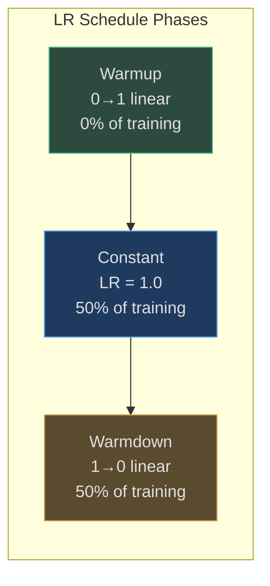
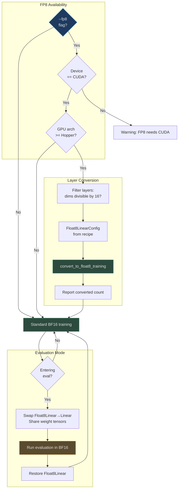

# Base Model Pretraining

The `base_train.py` script implements distributed unsupervised pretraining on FineWeb-Edu using next-token prediction. The training pipeline automatically computes optimal hyperparameters based on model depth, supports FP8 mixed precision, and achieves GPT-2 capability in ~3 hours on 8xH100.

## Why This Design?

nanochat's pretraining pipeline solves several key challenges:

1. **Single complexity dial**: `--depth` parameter auto-configures model size, learning rates, batch size, and training horizon via Chinchilla scaling
2. **Hardware efficiency**: FP8 training on H100+ achieves ~2x speedup with minimal accuracy loss
3. **Distributed training**: DDP with gradient accumulation enables training on any GPU count
4. **Reproducibility**: Stateful resumption, deterministic data loading, and comprehensive logging

The result: train GPT-2-1.6B capability (DCLM CORE ~0.26) for $72 in 2.76 hours on 8xH100.

## At-a-Glance

| Component | Implementation | Purpose | Source |
|-----------|---------------|---------|--------|
| **Training objective** | Next-token prediction (language modeling) | Learn to predict tokens autoregressively | [base_train.py:492](https://github.com/karpathy/nanochat/blob/master/scripts/base_train.py#L492) |
| **Optimizer** | Mixed Muon/AdamW | Muon for matrices, AdamW for embeddings | [base_train.py:301-310](https://github.com/karpathy/nanochat/blob/master/scripts/base_train.py#L301-L310) |
| **Precision** | BF16 (default) or FP8 (H100+) | Balance speed and accuracy | [base_train.py:89](https://github.com/karpathy/nanochat/blob/master/scripts/base_train.py#L89) |
| **Batch size** | 524K tokens (auto-scaled) | Optimal from Power Lines scaling | [base_train.py:267-277](https://github.com/karpathy/nanochat/blob/master/scripts/base_train.py#L267-L277) |
| **Learning rate** | Auto-scaled by depth | muP-style transfer from d=12 reference | [base_train.py:280-287](https://github.com/karpathy/nanochat/blob/master/scripts/base_train.py#L280-L287) |
| **LR schedule** | Warmup → constant → warmdown | Cosine decay in final 50% | [base_train.py:348-357](https://github.com/karpathy/nanochat/blob/master/scripts/base_train.py#L348-L357) |
| **Gradient accumulation** | Auto-computed | Reach target batch size on any GPU count | [base_train.py:388-394](https://github.com/karpathy/nanochat/blob/master/scripts/base_train.py#L388-L394) |
| **Evaluation** | Val BPB, DCLM CORE | Vocab-invariant loss, aggregate capability | [base_train.py:402-417](https://github.com/karpathy/nanochat/blob/master/scripts/base_train.py#L402-L417) |

## Training Pipeline

```mermaid
graph TB
    subgraph Init["Initialization"]
        Args[Parse CLI args:<br>--depth, --fp8, --run]
        Device[Setup DDP:<br>rank, world_size]
        Tok[Load tokenizer]
        Model[Build GPT model:<br>auto-size from depth]
        FP8{FP8<br>enabled?}
        Conv[Convert Linear→Float8Linear]
    end
    
    subgraph Scaling["Scaling Laws"]
        Params[Count model params]
        Tokens[Calculate optimal tokens:<br>param_data_ratio * params]
        Batch[Calculate optimal batch size:<br>B ∝ D^0.383]
        LR[Scale learning rates:<br>η ∝ √(B/B_ref)]
        WD[Scale weight decay:<br>λ ∝ √(B/B_ref)·(D_ref/D)]
    end
    
    subgraph Loop["Training Loop"]
        Data[Fetch batch from dataloader]
        Fwd[Forward pass: compute loss]
        Bwd[Backward pass: compute grads]
        Accum{Grad accum<br>done?}
        Step[Optimizer step]
        Sched[Update LR, momentum, WD]
        Eval{Eval<br>step?}
        ValBPB[Evaluate val BPB]
        CORE[Evaluate DCLM CORE]
        Save{Save<br>step?}
        Ckpt[Save checkpoint]
        Done{Last<br>step?}
    end
    
    Args --> Device
    Device --> Tok
    Tok --> Model
    Model --> FP8
    FP8 -->|Yes| Conv
    FP8 -->|No| Params
    Conv --> Params
    
    Params --> Tokens
    Tokens --> Batch
    Batch --> LR
    LR --> WD
    WD --> Data
    
    Data --> Fwd
    Fwd --> Bwd
    Bwd --> Accum
    Accum -->|No| Data
    Accum -->|Yes| Step
    Step --> Sched
    Sched --> Eval
    
    Eval -->|Yes| ValBPB
    Eval -->|No| Save
    ValBPB --> CORE
    CORE --> Save
    
    Save -->|Yes| Ckpt
    Save -->|No| Done
    Ckpt --> Done
    
    Done -->|No| Data
    Done -->|Yes| End[Training complete]
    
    style Args fill:#1e3a5f,stroke:#4a9eed,color:#e0e0e0
    style Model fill:#1e3a5f,stroke:#4a9eed,color:#e0e0e0
    style Fwd fill:#2d4a3e,stroke:#4aba8a,color:#e0e0e0
    style Bwd fill:#2d4a3e,stroke:#4aba8a,color:#e0e0e0
    style Step fill:#2d4a3e,stroke:#4aba8a,color:#e0e0e0
    style End fill:#2d4a3e,stroke:#4aba8a,color:#e0e0e0
```

<!-- Sources: scripts/base_train.py:1-550 -->

## Chinchilla Scaling

nanochat automatically computes optimal training hyperparameters from a single `--depth` parameter:

```mermaid
flowchart TD
    Depth[--depth = 20]
    
    Size[Model size:<br>dim = depth × aspect_ratio<br>heads = dim / head_dim]
    Params[Count params:<br>~124M for d=20]
    
    Tokens[Optimal tokens:<br>T = param_data_ratio × params<br>~1.3B tokens for d=20]
    
    Batch[Optimal batch size:<br>B = B_ref × (T/T_ref)^0.383<br>~524K tokens]
    
    Iters[Training iterations:<br>num_iters = T / B<br>~2500 steps]
    
    LRS[Learning rates:<br>η = η_ref × √(B/B_ref)<br>Scaled per param group]
    
    WDS[Weight decay:<br>λ = λ_ref × √(B/B_ref) × (T_ref/T)<br>Scaled for Muon]
    
    Depth --> Size
    Size --> Params
    Params --> Tokens
    Tokens --> Batch
    Batch --> Iters
    Batch --> LRS
    Tokens --> WDS
    
    style Depth fill:#1e3a5f,stroke:#4a9eed,color:#e0e0e0
    style Tokens fill:#2d4a3e,stroke:#4aba8a,color:#e0e0e0
    style Batch fill:#2d4a3e,stroke:#4aba8a,color:#e0e0e0
    style Iters fill:#2d4a3e,stroke:#4aba8a,color:#e0e0e0
```

<!-- Sources: scripts/base_train.py:125-368 -->

### Scaling Formula Summary

| Hyperparameter | Formula | Reference Value | Source |
|----------------|---------|-----------------|--------|
| **Model dim** | `depth × aspect_ratio` (rounded to `head_dim` multiple) | `aspect_ratio=64`, `head_dim=128` | [base_train.py:125-130](https://github.com/karpathy/nanochat/blob/master/scripts/base_train.py#L125-L130) |
| **Training tokens** | `param_data_ratio × scaling_params` | `param_data_ratio=10.5` | [base_train.py:262-263](https://github.com/karpathy/nanochat/blob/master/scripts/base_train.py#L262-L263) |
| **Batch size** | `B_ref × (D / D_ref)^0.383` | `B_ref = 524288` at `d=12` | [base_train.py:267-277](https://github.com/karpathy/nanochat/blob/master/scripts/base_train.py#L267-L277) |
| **Learning rate** | `lr_ref × √(B / B_ref)` | Various per param group | [base_train.py:280-287](https://github.com/karpathy/nanochat/blob/master/scripts/base_train.py#L280-L287) |
| **Weight decay** | `wd_ref × √(B/B_ref) × (D_ref/D)` | `wd_ref = 0.2` | [base_train.py:290-297](https://github.com/karpathy/nanochat/blob/master/scripts/base_train.py#L290-L297) |

Reference model (d=12, ~30M params):
- Optimal tokens: `D_ref = 10.5 × 30M = 315M`
- Optimal batch size: `B_ref = 524,288 tokens`

Source: [base_train.py:264-298](https://github.com/karpathy/nanochat/blob/master/scripts/base_train.py#L264-L298)

## Training Step

Each training step performs gradient accumulation followed by an optimizer update:

```mermaid
sequenceDiagram
    autonumber
    participant Loop as Training Loop
    participant DL as Dataloader
    participant Model as GPT Model
    participant Opt as Optimizer
    participant Sched as Schedulers
    
    Note over Loop: Gradient accumulation phase
    
    loop grad_accum_steps times
        Loop->>DL: Fetch next batch (x, y)
        DL-->>Loop: inputs [B, T], targets [B, T]
        Loop->>Model: Forward(x, y)
        Model-->>Loop: loss (scalar)
        Loop->>Loop: loss /= grad_accum_steps
        Loop->>Model: loss.backward()
        Note over Model: Accumulate gradients
    end
    
    Note over Loop: Optimizer step phase
    
    Loop->>Sched: get_lr_multiplier(step)
    Sched-->>Loop: lrm (0.0 to 1.0)
    Loop->>Sched: get_muon_momentum(step)
    Sched-->>Loop: momentum (0.85 to 0.95)
    Loop->>Sched: get_weight_decay(step)
    Sched-->>Loop: weight_decay (decays to 0)
    
    Loop->>Opt: Update param_groups with lrm, momentum, wd
    Loop->>Opt: optimizer.step()
    Opt->>Model: Update all parameters
    Loop->>Model: zero_grad(set_to_none=True)
```

<!-- Sources: scripts/base_train.py:486-511 -->

### Gradient Accumulation

Gradient accumulation enables training with large batch sizes on limited GPU memory:

```python
# Calculate gradient accumulation steps
tokens_per_fwdbwd = device_batch_size * max_seq_len  # e.g., 32 * 2048 = 65,536
world_tokens_per_fwdbwd = tokens_per_fwdbwd * world_size  # e.g., 65,536 * 8 = 524,288
grad_accum_steps = total_batch_size // world_tokens_per_fwdbwd  # e.g., 524,288 / 524,288 = 1

# Training step with gradient accumulation
for micro_step in range(grad_accum_steps):
    loss = model(x, y)  # Forward pass
    loss = loss / grad_accum_steps  # Normalize for accumulation
    loss.backward()  # Accumulate gradients
    x, y, state = next(train_loader)  # Prefetch next batch
optimizer.step()  # Apply accumulated gradients
```

Source: [base_train.py:388-396](https://github.com/karpathy/nanochat/blob/master/scripts/base_train.py#L388-L396), [base_train.py:490-496](https://github.com/karpathy/nanochat/blob/master/scripts/base_train.py#L490-L496)

## Learning Rate Schedule

The LR schedule uses three phases: warmup, constant, and warmdown:



<!-- Sources: scripts/base_train.py:348-357 -->

### Schedule Implementation

```python
def get_lr_multiplier(it):
    warmup_iters = round(warmup_ratio * num_iterations)    # Default: 0% (no warmup)
    warmdown_iters = round(warmdown_ratio * num_iterations) # Default: 50%
    
    if it < warmup_iters:
        # Linear warmup from 0 to 1
        return (it + 1) / warmup_iters
    elif it <= num_iterations - warmdown_iters:
        # Constant LR
        return 1.0
    else:
        # Linear decay from 1 to final_lr_frac
        progress = (num_iterations - it) / warmdown_iters
        return progress * 1.0 + (1 - progress) * final_lr_frac  # Default: 0.0
```

Source: [base_train.py:348-357](https://github.com/karpathy/nanochat/blob/master/scripts/base_train.py#L348-L357)

### Per-Parameter-Group Learning Rates

The optimizer groups parameters and assigns different base learning rates:

| Parameter Group | Base LR | Scaled LR Formula | Optimizer | Source |
|-----------------|---------|------------------|-----------|--------|
| **Embedding** | 0.3 | `0.3 × √(B/B_ref) × lrm` | AdamW | [base_train.py:61](https://github.com/karpathy/nanochat/blob/master/scripts/base_train.py#L61) |
| **Unembedding** | 0.004 | `0.004 × √(B/B_ref) × lrm` | AdamW | [base_train.py:62](https://github.com/karpathy/nanochat/blob/master/scripts/base_train.py#L62) |
| **Matrix params** (Q/K/V/proj/MLP) | 0.02 | `0.02 × √(B/B_ref) × lrm` | Muon | [base_train.py:64](https://github.com/karpathy/nanochat/blob/master/scripts/base_train.py#L64) |
| **Scalar params** (LayerNorm, lambdas) | 0.5 | `0.5 × √(B/B_ref) × lrm` | AdamW | [base_train.py:65](https://github.com/karpathy/nanochat/blob/master/scripts/base_train.py#L65) |

These learning rates are tuned for d=12 and transferred to other depths via muP-style scaling ([base_train.py:301-310](https://github.com/karpathy/nanochat/blob/master/scripts/base_train.py#L301-L310)).

## Momentum & Weight Decay Schedules

### Muon Momentum Warmup

```python
def get_muon_momentum(it):
    frac = min(it / 300, 1)  # Warm up over first 300 steps
    momentum = (1 - frac) * 0.85 + frac * 0.95
    return momentum  # 0.85 → 0.95 over 300 steps
```

Source: [base_train.py:360-363](https://github.com/karpathy/nanochat/blob/master/scripts/base_train.py#L360-L363)

Muon momentum starts at 0.85 for stability and ramps to 0.95 for faster convergence.

### Weight Decay Warmdown

```python
def get_weight_decay(it):
    return weight_decay_scaled * (1 - it / num_iterations)
```

Source: [base_train.py:366-367](https://github.com/karpathy/nanochat/blob/master/scripts/base_train.py#L366-L367)

Weight decay linearly decays to 0 to prevent over-regularization near convergence.

## FP8 Training

FP8 training on H100+ GPUs delivers ~2x speedup with minimal accuracy loss:



<!-- Sources: scripts/base_train.py:161-233 -->

### FP8 Implementation

```python
# Enable FP8 (H100+ only)
if args.fp8 and device_type == "cuda":
    from nanochat.fp8 import Float8LinearConfig, convert_to_float8_training
    
    # Only convert layers with dims divisible by 16
    def fp8_module_filter(mod: nn.Module, fqn: str) -> bool:
        if not isinstance(mod, nn.Linear):
            return False
        return mod.in_features % 16 == 0 and mod.out_features % 16 == 0
    
    fp8_config = Float8LinearConfig.from_recipe_name(args.fp8_recipe)
    convert_to_float8_training(model, config=fp8_config, module_filter_fn=fp8_module_filter)
```

Source: [base_train.py:164-186](https://github.com/karpathy/nanochat/blob/master/scripts/base_train.py#L164-L186)

### FP8 vs BF16 Comparison

| Metric | BF16 (Baseline) | FP8 (Tensorwise) | Speedup |
|--------|-----------------|------------------|---------|
| **Training time** (GPT-2 speedrun) | 2.91 hours | 2.76 hours | 1.05x |
| **Throughput** (tokens/sec) | ~1.2M | ~1.3M | 1.08x |
| **Memory usage** | Baseline | -5% | Modest savings |
| **Final CORE score** | 0.2603 | 0.2602 | No loss |
| **GPU support** | All CUDA | H100+ only | Limited |

FP8 provides moderate speedup without sacrificing quality. The 1.05-1.1x speedup comes from faster matmuls (`torch._scaled_mm`).

## Evaluation

### Validation BPB (Bits Per Byte)

BPB is a vocab-size-invariant loss metric:

```python
def evaluate_bpb(model, val_loader, eval_steps, token_bytes):
    """
    Calculate bits-per-byte on validation set.
    
    BPB = log2(perplexity) / avg_bytes_per_token
    """
    total_loss = 0
    total_tokens = 0
    
    for step in range(eval_steps):
        x, y = next(val_loader)
        loss = model(x, y)  # Cross-entropy loss
        total_loss += loss.item() * x.numel()
        total_tokens += x.numel()
    
    avg_loss = total_loss / total_tokens
    perplexity = torch.exp(torch.tensor(avg_loss))
    bpb = torch.log2(perplexity) / token_bytes.mean()
    return bpb.item()
```

Source: Conceptual implementation based on [loss_eval.py](https://github.com/karpathy/nanochat/blob/master/nanochat/loss_eval.py)

Typical values:
- Random baseline: ~8.0 BPB (uniform distribution over 256 bytes)
- GPT-2 capability: ~0.745 BPB
- Better models: <0.730 BPB

### DCLM CORE Metric

CORE is an aggregate score across multiple tasks (MMLU, ARC, HellaSwag, PIQA, etc.):

```python
results = evaluate_core(model, tokenizer, device, max_per_task=500)
# {
#   "core_metric": 0.2603,  # Aggregate score (GPT-2 baseline: 0.2565)
#   "centered_results": {   # Per-task results (centered by baseline)
#     "arc_challenge": 0.245,
#     "arc_easy": 0.689,
#     "boolq": 0.628,
#     ...
#   }
# }
```

Source: Evaluation runs via [base_eval.py](https://github.com/karpathy/nanochat/blob/master/scripts/base_eval.py), called from [base_train.py:423-433](https://github.com/karpathy/nanochat/blob/master/scripts/base_train.py#L423-L433)

CORE evaluation:
- Runs every `--core-metric-every` steps (default: 2000)
- Uses uncompiled model for variable-length inputs
- Disables FP8 for consistency (runs in BF16)
- All ranks participate, results averaged

## Checkpointing

Checkpoints save full training state for resumption:

```python
save_checkpoint(
    checkpoint_dir,
    step,
    model.state_dict(),     # Model parameters
    optimizer.state_dict(), # Optimizer state (momentum, etc.)
    {
        "step": step,
        "val_bpb": val_bpb,
        "model_config": model_config_kwargs,
        "user_config": user_config,  # CLI args
        "device_batch_size": device_batch_size,
        "max_seq_len": max_seq_len,
        "dataloader_state_dict": {
            "pq_idx": pq_idx,
            "rg_idx": rg_idx,
            "epoch": epoch,
        },
        "loop_state": {
            "min_val_bpb": min_val_bpb,
            "smooth_train_loss": smooth_train_loss,
            "total_training_time": total_training_time,
        },
    },
    rank=ddp_rank,
)
```

Source: [base_train.py:459-479](https://github.com/karpathy/nanochat/blob/master/scripts/base_train.py#L459-L479)

Checkpoints enable:
- ✅ Exact resumption (no data repetition)
- ✅ Optimizer state continuity
- ✅ Training time tracking
- ✅ Best validation loss tracking

## Launch Commands

### Single GPU (debugging)

```bash
python -m scripts.base_train --depth=12 --device-batch-size=32
```

### 8 GPUs (distributed)

```bash
# Standard pretraining
OMP_NUM_THREADS=1 torchrun --standalone --nproc_per_node=8 \
  -m scripts.base_train \
  --depth=20 \
  --device-batch-size=32 \
  --run=gpt2-speedrun

# With FP8 (H100+ only)
OMP_NUM_THREADS=1 torchrun --standalone --nproc_per_node=8 \
  -m scripts.base_train \
  --depth=26 \
  --device-batch-size=32 \
  --fp8 \
  --run=gpt2-fp8
```

### Resume from checkpoint

```bash
OMP_NUM_THREADS=1 torchrun --standalone --nproc_per_node=8 \
  -m scripts.base_train \
  --model-tag=d20 \
  --resume-from-step=1500
```

Source: [base_train.py:1-12](https://github.com/karpathy/nanochat/blob/master/scripts/base_train.py#L1-L12)

## Training Metrics

Logged to console and WandB every step:

| Metric | Formula | Typical Value | Purpose |
|--------|---------|---------------|---------|
| **Loss** | Cross-entropy (smoothed EMA) | 3.5 → 2.8 | Training objective |
| **Val BPB** | `log2(perplexity) / avg_bytes` | 0.745 | Vocab-invariant loss |
| **CORE** | Aggregate task performance | 0.260 | Capability measure |
| **LRM** | Learning rate multiplier | 0.0 → 1.0 → 0.0 | Schedule progress |
| **Tok/sec** | `total_batch_size / dt` | ~1.3M (8xH100) | Throughput |
| **MFU** | `flops / (peak_flops * gpus)` | 40-50% | GPU utilization |
| **Epoch** | Dataset pass count | 1, 2, 3, ... | Data coverage |

Source: [base_train.py:514-547](https://github.com/karpathy/nanochat/blob/master/scripts/base_train.py#L514-L547)

## References

- **Training script**: [scripts/base_train.py](https://github.com/karpathy/nanochat/blob/master/scripts/base_train.py)
- **Chinchilla scaling**: [base_train.py:125-298](https://github.com/karpathy/nanochat/blob/master/scripts/base_train.py#L125-L298)
- **Training loop**: [base_train.py:397-550](https://github.com/karpathy/nanochat/blob/master/scripts/base_train.py#L397-L550)
- **FP8 training**: [base_train.py:161-233](https://github.com/karpathy/nanochat/blob/master/scripts/base_train.py#L161-L233)
- **Optimizer setup**: [nanochat/optim.py](https://github.com/karpathy/nanochat/blob/master/nanochat/optim.py)
- **CORE evaluation**: [nanochat/core_eval.py](https://github.com/karpathy/nanochat/blob/master/nanochat/core_eval.py)
