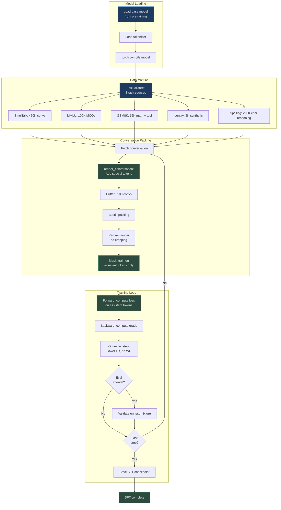
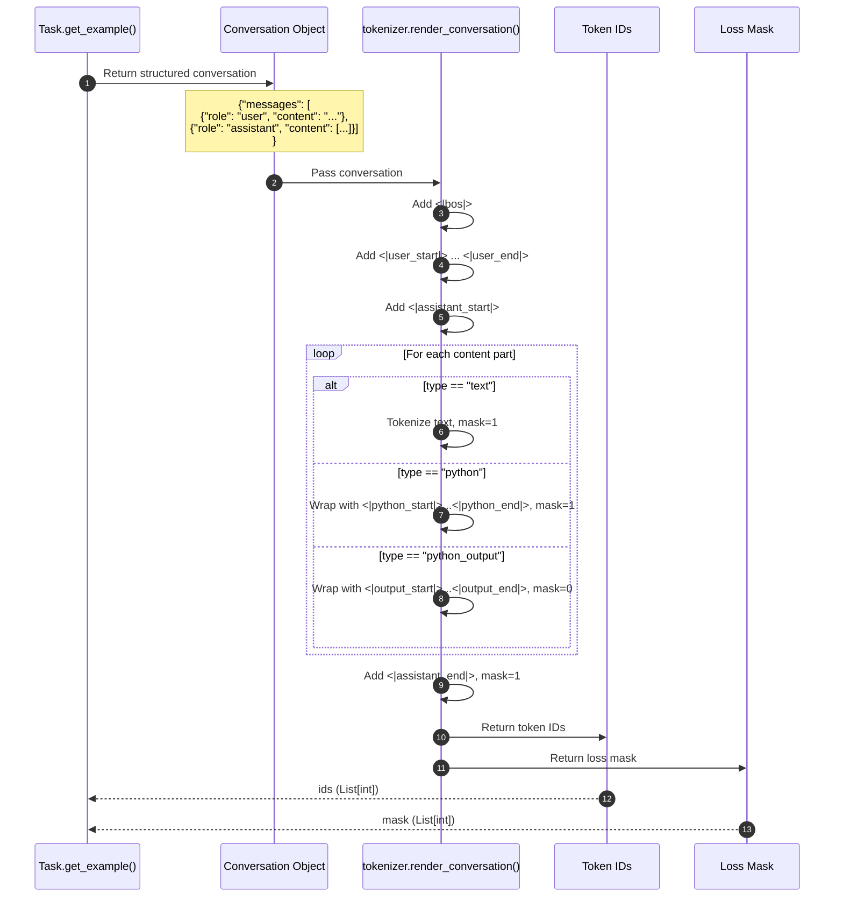

# Supervised Fine-Tuning (SFT)

The `chat_sft.py` script fine-tunes a pretrained base model on a mixture of instructional tasks, teaching the model to follow conversational formats, answer questions, solve math problems, and use tools. SFT transforms a raw language model into an assistant capable of structured interactions.

## Why SFT?

SFT solves the "alignment gap" between pretraining and deployment:

1. **Conversational ability**: Teaches the model to respond in user/assistant format with special tokens
2. **Task mixing**: Combines reasoning (GSM8K), knowledge (MMLU), dialogue (SmolTalk), and tool use (calculator)
3. **Instruction following**: Learns to interpret user intent and generate helpful responses
4. **Tool integration**: Embeds calculator calls in `<|python_start|>...<|python_end|>` tags during generation

The result: a pretrained base model becomes a chat-capable assistant that can solve grade-school math, answer multiple-choice questions, and maintain coherent conversations.

## At-a-Glance

| Component | Implementation | Purpose | Source |
|-----------|---------------|---------|--------|
| **Base model** | Load from pretraining checkpoint | Start from pretrained LM | [chat_sft.py:79](https://github.com/karpathy/nanochat/blob/master/scripts/chat_sft.py#L79) |
| **Task mixture** | GSM8K, MMLU, SmolTalk, SpellingBee, CustomJSON | Multi-capability training | [chat_sft.py:106-115](https://github.com/karpathy/nanochat/blob/master/scripts/chat_sft.py#L106-L115) |
| **Training objective** | Cross-entropy on assistant tokens only | Learn to generate responses | [chat_sft.py:320](https://github.com/karpathy/nanochat/blob/master/scripts/chat_sft.py#L320) |
| **Loss masking** | User tokens = ignore_index (-1) | Train on outputs only | [chat_sft.py:229-231](https://github.com/karpathy/nanochat/blob/master/scripts/chat_sft.py#L229-L231) |
| **Learning rate** | Lower than pretraining (init_lr_frac=1.0) | Preserve pretrained knowledge | [chat_sft.py:55](https://github.com/karpathy/nanochat/blob/master/scripts/chat_sft.py#L55) |
| **Weight decay** | 0.0 (no regularization) | Avoid forgetting base capabilities | [chat_sft.py:54](https://github.com/karpathy/nanochat/blob/master/scripts/chat_sft.py#L54) |
| **Packing** | Bestfit with padding (no cropping) | Never discard conversation data | [chat_sft.py:127-233](https://github.com/karpathy/nanochat/blob/master/scripts/chat_sft.py#L127-L233) |
| **Epochs** | 1 epoch (default) or until --num-iterations | Prevent overfitting on small SFT set | [chat_sft.py:45](https://github.com/karpathy/nanochat/blob/master/scripts/chat_sft.py#L45) |

## SFT Pipeline



<!-- Sources: scripts/chat_sft.py:1-389 -->

## Task Mixture

SFT trains on 8 data sources with different sampling weights:

```mermaid
graph TB
    subgraph Mix["TaskMixture (856K total)"]
        ST[SmolTalk train:<br>460K conversations<br>General dialogue]
        MMLU[MMLU auxiliary:<br>100K multiple choice<br>Knowledge + reasoning]
        GSM1[GSM8K main:<br>8K math problems<br>Tool use]
        GSM2[GSM8K main:<br>+8K math (2nd epoch)<br>Emphasize tool learning]
        ID1[CustomJSON identity:<br>1K conversations<br>Assistant identity]
        ID2[CustomJSON identity:<br>+1K (2nd epoch)<br>Reinforce identity]
        Simp[SimpleSpelling:<br>200K examples<br>Basic spelling]
        Bee[SpellingBee:<br>80K examples<br>Character counting]
    end
    
    Mix --> ST
    Mix --> MMLU
    Mix --> GSM1
    Mix --> GSM2
    Mix --> ID1
    Mix --> ID2
    Mix --> Simp
    Mix --> Bee
    
    style Mix fill:#1e3a5f,stroke:#4a9eed,color:#e0e0e0
    style GSM1 fill:#2d4a3e,stroke:#4aba8a,color:#e0e0e0
    style GSM2 fill:#2d4a3e,stroke:#4aba8a,color:#e0e0e0
    style ID1 fill:#5a4a2e,stroke:#d4a84b,color:#e0e0e0
    style ID2 fill:#5a4a2e,stroke:#d4a84b,color:#e0e0e0
```

<!-- Sources: scripts/chat_sft.py:106-115 -->

### Task Details

| Task | Size | Purpose | Key Features | Source |
|------|------|---------|--------------|--------|
| **SmolTalk** | 460K | General conversation | Diverse personas, topics, styles | [chat_sft.py:107](https://github.com/karpathy/nanochat/blob/master/scripts/chat_sft.py#L107) |
| **MMLU auxiliary** | 100K | Multiple choice QA | ARC, MC_TEST, OBQA, RACE | [chat_sft.py:108](https://github.com/karpathy/nanochat/blob/master/scripts/chat_sft.py#L108) |
| **GSM8K** | 16K (2 epochs) | Math + tool use | Calculator calls with `<\|python_start\|>` tags | [chat_sft.py:109-110](https://github.com/karpathy/nanochat/blob/master/scripts/chat_sft.py#L109-L110) |
| **Identity** | 2K (2 epochs) | Assistant behavior | Synthetic conversations about model identity | [chat_sft.py:111-112](https://github.com/karpathy/nanochat/blob/master/scripts/chat_sft.py#L111-L112) |
| **SimpleSpelling** | 200K | Basic spelling | "Spell the word 'apple'" | [chat_sft.py:113](https://github.com/karpathy/nanochat/blob/master/scripts/chat_sft.py#L113) |
| **SpellingBee** | 80K | Character reasoning | "How many 'r' in 'strawberry'?" | [chat_sft.py:114](https://github.com/karpathy/nanochat/blob/master/scripts/chat_sft.py#L114) |

**Total: ~856K training examples**

The mixture emphasizes:
- **Breadth**: Covers conversation, reasoning, knowledge, and tool use
- **Tool use**: 2 epochs of GSM8K ensure strong calculator integration
- **Identity**: 2 epochs teach the model to identify as a helpful assistant

## Conversation Rendering

SFT uses the tokenizer's `render_conversation()` to format dialogues:



<!-- Sources: nanochat/tokenizer.py:266-350, scripts/chat_sft.py:155-156 -->

### Loss Masking

The mask ensures only assistant-generated tokens contribute to loss:

```python
# Render conversation into tokens and mask
ids, mask = tokenizer.render_conversation(conversation)

# Example mask values:
# ids:  [bos, user_start, 'What', 'is', '2+2?', user_end, 
#        assistant_start, 'Let', 'me', 'calculate', '.', assistant_end]
# mask: [0,   0,          0,      0,    0,       0,
#        0,               1,     1,    1,          1,   1]

# In training:
targets = ids[1:]  # Shift for autoregressive prediction
targets[mask[1:] == 0] = -1  # Mask non-assistant tokens (ignore_index)
loss = F.cross_entropy(logits.view(-1, vocab_size), targets.view(-1), ignore_index=-1)
```

Source: Conceptual implementation based on [chat_sft.py:229-231](https://github.com/karpathy/nanochat/blob/master/scripts/chat_sft.py#L229-L231)

## Bestfit Packing with Padding

Unlike pretraining, SFT never crops conversations:

```mermaid
flowchart TD
    Start[Start row: pos=0]
    Check{Buffer<br>size < 100?}
    Refill[Fetch & render<br>conversations]
    
    Calc[remaining = capacity - pos]
    Search[Find LARGEST conv ≤ remaining]
    
    Found{Conv<br>found?}
    Add[Pop conv from buffer<br>Add to row]
    Update[pos += len(conv)]
    
    Pad[Pad with BOS tokens<br>to fill row]
    MaskPad[Mask padded positions:<br>targets[content_len:] = -1]
    
    Full{pos ==<br>capacity?}
    Done[Row complete]
    
    Start --> Check
    Check -->|Yes| Refill
    Check -->|No| Calc
    Refill --> Check
    
    Calc --> Search
    Search --> Found
    
    Found -->|Yes| Add
    Add --> Update
    Update --> Full
    
    Found -->|No| Pad
    Pad --> MaskPad
    MaskPad --> Done
    
    Full -->|No| Check
    Full -->|Yes| Done
    
    style Start fill:#1e3a5f,stroke:#4a9eed,color:#e0e0e0
    style Add fill:#2d4a3e,stroke:#4aba8a,color:#e0e0e0
    style Pad fill:#5a4a2e,stroke:#d4a84b,color:#e0e0e0
    style MaskPad fill:#5a4a2e,stroke:#d4a84b,color:#e0e0e0
    style Done fill:#2d4a3e,stroke:#4aba8a,color:#e0e0e0
```

<!-- Sources: scripts/chat_sft.py:127-233 -->

### Padding vs. Cropping

| Approach | Token Loss | Compute Waste | Use Case |
|----------|-----------|---------------|----------|
| **Cropping** (pretraining) | ~35% | 0% | Abundant data, speed matters |
| **Padding** (SFT) | 0% | ~10-15% | Precious data, can't lose conversations |

SFT padding:
- ✅ Never loses conversation data
- ✅ Padded positions ignored in loss (targets = -1)
- ⚠️ Slight compute waste on padding tokens (but better than data loss)

Source: [chat_sft.py:190-203](https://github.com/karpathy/nanochat/blob/master/scripts/chat_sft.py#L190-L203)

## Hyperparameter Differences from Pretraining

| Hyperparameter | Pretraining | SFT | Reason |
|----------------|-------------|-----|--------|
| **Learning rate** | Scaled by depth | Same as pretraining × `init_lr_frac=1.0` | Start at full LR, no warmup needed |
| **Weight decay** | 0.2 (Muon params) | 0.0 (all params) | Avoid forgetting pretrained knowledge |
| **LR schedule** | Warmup 0% → constant → warmdown 50% | Constant 80% → warmdown 20% | Shorter training, preserve base |
| **Batch size** | ~524K tokens | 524K tokens (same) | Same optimal batch size |
| **Epochs** | Multiple (until convergence) | 1 epoch (typical) | Small SFT set, prevent overfitting |

Source: [chat_sft.py:51-70](https://github.com/karpathy/nanochat/blob/master/scripts/chat_sft.py#L51-L70), [chat_sft.py:96-101](https://github.com/karpathy/nanochat/blob/master/scripts/chat_sft.py#L96-L101), [chat_sft.py:240-242](https://github.com/karpathy/nanochat/blob/master/scripts/chat_sft.py#L240-L242)

### Learning Rate Schedule

```python
def get_lr_multiplier(progress):
    # First 80% of training: no decay
    # Last 20%: linear decay to 0
    return 1 if progress < 0.8 else 1 - (progress - 0.8) / 0.2
```

Source: [chat_sft.py:240-242](https://github.com/karpathy/nanochat/blob/master/scripts/chat_sft.py#L240-L242)

This schedule:
- Keeps LR constant for most of training (preserve pretraining)
- Decays only in final 20% (smoothly converge)
- No warmup (model already trained)

## Tool Use Example: GSM8K

GSM8K conversations include calculator tool calls:

```python
# Example GSM8K conversation
conversation = {
    "messages": [
        {
            "role": "user",
            "content": "Weng earns $12 an hour. She did 50 minutes of work. How much did she earn?"
        },
        {
            "role": "assistant",
            "content": [
                {"type": "text", "text": "Weng earns 12/60 = $"},
                {"type": "python", "text": "12/60"},
                {"type": "python_output", "text": "0.2"},
                {"type": "text", "text": "0.2 per minute. Working 50 minutes, she earned 0.2 x 50 = $"},
                {"type": "python", "text": "0.2*50"},
                {"type": "python_output", "text": "10"},
                {"type": "text", "text": "10."},
                {"type": "text", "text": "#### 10"}
            ]
        }
    ]
}

# Rendered token sequence:
# <|bos|> <|user_start|> Weng earns ... <|user_end|>
# <|assistant_start|> Weng earns 12/60 = $
# <|python_start|> 12/60 <|python_end|>
# <|output_start|> 0.2 <|output_end|>
# 0.2 per minute. Working 50 minutes, she earned 0.2 x 50 = $
# <|python_start|> 0.2*50 <|python_end|>
# <|output_start|> 10 <|output_end|>
# 10. #### 10 <|assistant_end|>
```

Source: [tasks/gsm8k.py:52-85](https://github.com/karpathy/nanochat/blob/master/tasks/gsm8k.py#L52-L85)

### Mask Pattern for Tool Use

```
Token:  <|bos|> <|user_start|> Weng ... <|user_end|> <|assistant_start|> Weng ...
Mask:   0       0               0   ... 0            0                  1    ...

Token:  <|python_start|> 12/60 <|python_end|> <|output_start|> 0.2 <|output_end|>
Mask:   1                1      1              0                0    0

Token:  0.2 per minute ... <|assistant_end|>
Mask:   1   1   1      ... 1
```

The model trains on:
- ✅ Text before tool call (mask=1)
- ✅ Tool invocation (`<|python_start|> 12/60 <|python_end|>`, mask=1)
- ❌ Tool output (`<|output_start|> 0.2 <|output_end|>`, mask=0)

This teaches the model to invoke the calculator but not to predict tool outputs (which come from the actual tool).

## Training Loop

```mermaid
sequenceDiagram
    autonumber
    participant Loop as Training Loop
    participant DL as SFT Dataloader
    participant Model as GPT Model
    participant Opt as Optimizer
    
    Note over Loop: Training iteration
    
    loop grad_accum_steps
        Loop->>DL: next(train_loader)
        DL-->>Loop: inputs [B, T], targets [B, T] (masked)
        Loop->>Model: Forward(inputs, targets)
        Model-->>Loop: loss (only on assistant tokens)
        Loop->>Model: loss.backward()
    end
    
    Loop->>Loop: lrm = get_lr_multiplier(progress)
    Loop->>Opt: Update LRs with lrm
    Loop->>Opt: optimizer.step()
    Loop->>Model: zero_grad()
    
    Note over Loop: Check stopping condition
    
    alt Last step or epoch complete
        Loop->>Model: Evaluate val BPB
        Loop->>Loop: Save SFT checkpoint
        Loop->>Loop: Break
    end
```

<!-- Sources: scripts/chat_sft.py:252-365 -->

### Stopping Criteria

SFT stops when:

1. **Explicit iteration limit**: `--num-iterations` reached ([chat_sft.py:45](https://github.com/karpathy/nanochat/blob/master/scripts/chat_sft.py#L45))
2. **Epoch complete**: Consumed all training data ([chat_sft.py:206-219](https://github.com/karpathy/nanochat/blob/master/scripts/chat_sft.py#L206-L219))

Progress tracking:
```python
# Track progress through dataset
consumed = ddp_rank  # Start offset for this rank
consumed += ddp_world_size  # Each rank consumes different examples

if consumed >= dataset_size:
    last_step = True  # Signal end of epoch
```

Source: [chat_sft.py:146-219](https://github.com/karpathy/nanochat/blob/master/scripts/chat_sft.py#L146-L219)

## Validation

SFT evaluates on a held-out test mixture:

```python
val_dataset = TaskMixture([
    SmolTalk(split="test"),          # 24K rows
    MMLU(subset="all", split="test", stop=5200),  # 5.2K rows (matched ratio)
    GSM8K(subset="main", split="test", stop=420), # 420 rows (matched ratio)
])  # Total: ~39K rows
```

Source: [chat_sft.py:116-120](https://github.com/karpathy/nanochat/blob/master/scripts/chat_sft.py#L116-L120)

The validation set:
- Uses test splits (no data leakage)
- Matches training task proportions
- Evaluates bits-per-byte (BPB) on held-out data

## Launch Commands

### Single GPU

```bash
python -m scripts.chat_sft --model-tag=d20 --model-step=2500
```

### 8 GPUs (distributed)

```bash
OMP_NUM_THREADS=1 torchrun --standalone --nproc_per_node=8 \
  -m scripts.chat_sft \
  --model-tag=d20 \
  --model-step=2500 \
  --device-batch-size=16 \
  --run=sft-d20
```

### Custom SFT dataset

```bash
# Edit identity_conversations.jsonl with custom conversations
python -m scripts.chat_sft \
  --model-tag=d20 \
  --num-iterations=1000 \
  --init-lr-frac=0.5
```

Source: [chat_sft.py:1-10](https://github.com/karpathy/nanochat/blob/master/scripts/chat_sft.py#L1-L10)

## Typical Training Time

For a d=20 model (~124M params) on 8xH100:

| Stage | Time | Steps | Tokens |
|-------|------|-------|--------|
| **Pretraining** | 2.76 hours | ~2500 | 10B |
| **SFT** | ~15 minutes | ~1600 | 840M |
| **Total** | ~3 hours | ~4100 | ~11B |

SFT is ~10x faster than pretraining due to smaller dataset size.

## Output

SFT saves a checkpoint to `out/chatsft_checkpoints/<model_tag>/`:

```python
checkpoint_dir = os.path.join(base_dir, "chatsft_checkpoints", output_dirname)
save_checkpoint(
    checkpoint_dir,
    step,
    model.state_dict(),
    optimizer.state_dict(),
    {
        "step": step,
        "val_bpb": val_bpb,
        "model_config": {...},
        "user_config": {...},
    }
)
```

Source: [chat_sft.py:286-308](https://github.com/karpathy/nanochat/blob/master/scripts/chat_sft.py#L286-L308)

This checkpoint can be loaded for:
- Chat interfaces (CLI, web UI)
- Reinforcement learning (RL) stage
- Evaluation on downstream tasks

## References

- **SFT script**: [scripts/chat_sft.py](https://github.com/karpathy/nanochat/blob/master/scripts/chat_sft.py)
- **Task mixture**: [chat_sft.py:106-120](https://github.com/karpathy/nanochat/blob/master/scripts/chat_sft.py#L106-L120)
- **Conversation rendering**: [nanochat/tokenizer.py:266-350](https://github.com/karpathy/nanochat/blob/master/nanochat/tokenizer.py#L266-L350)
- **Bestfit packing**: [chat_sft.py:127-233](https://github.com/karpathy/nanochat/blob/master/scripts/chat_sft.py#L127-L233)
- **GSM8K tool use**: [tasks/gsm8k.py:52-85](https://github.com/karpathy/nanochat/blob/master/tasks/gsm8k.py#L52-L85)
- **Task implementations**: [tasks/](https://github.com/karpathy/nanochat/blob/master/tasks/)
