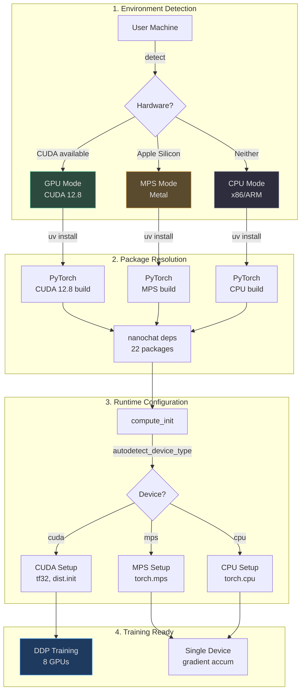
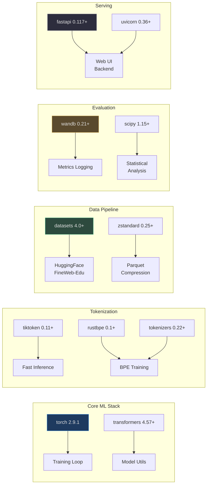
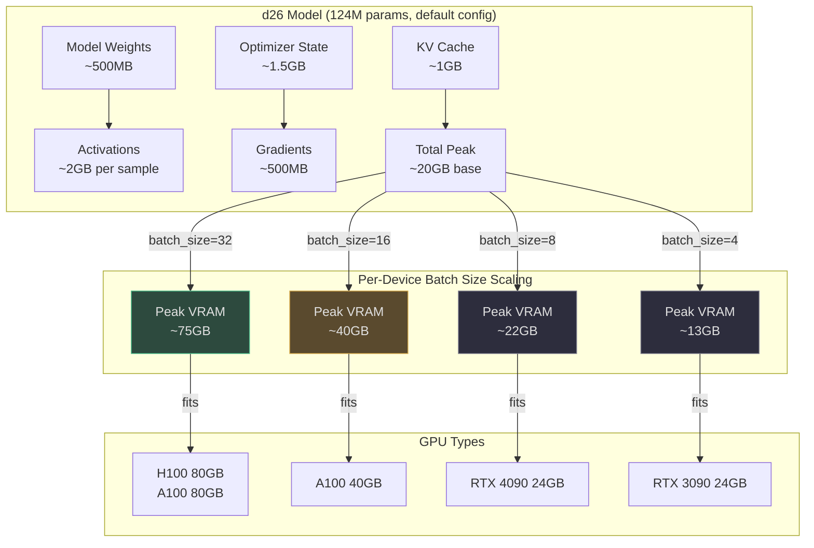
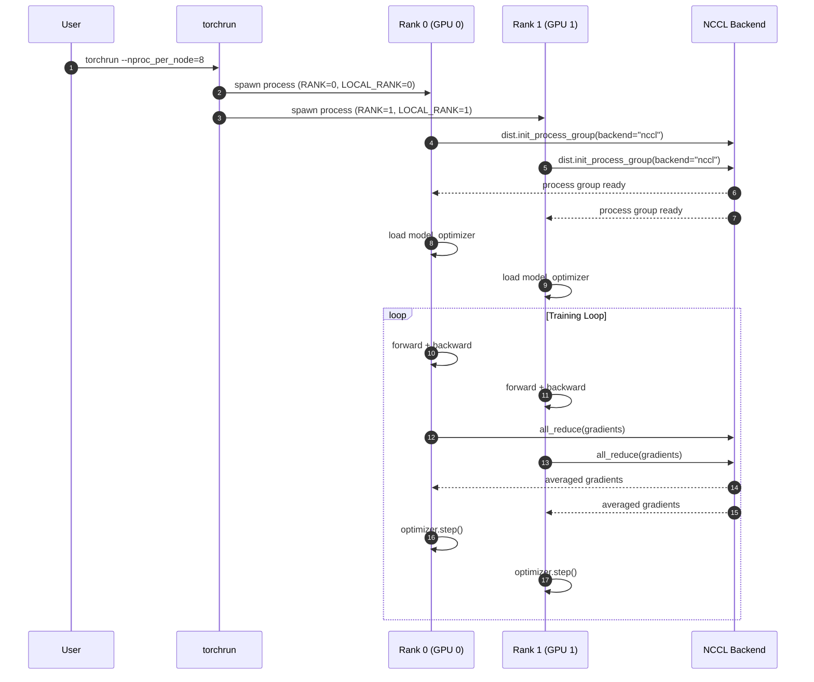
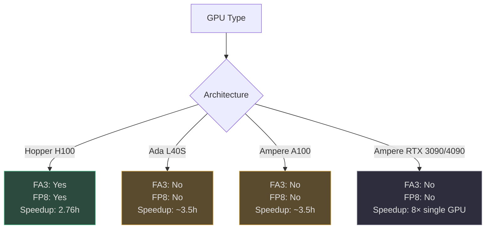
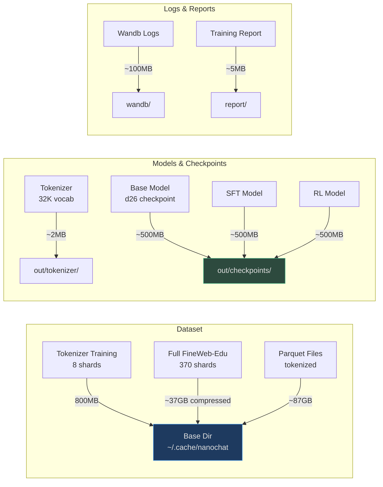

# Installation & Environment Setup

## Why Installation Matters

nanochat is designed to run anywhere PyTorch runs — from 8×H100 GPU clusters to single A100s to Apple Silicon Macbooks. The installation process is streamlined through **uv** (a fast Python package manager) and auto-detects your hardware capabilities to configure the appropriate PyTorch build ([nanochat/common.py:142-151](https://github.com/karpathy/nanochat/blob/master/nanochat/common.py#L142-L151)). This section covers hardware requirements, dependency installation, and platform-specific configurations.

## At-a-Glance: System Requirements

| Component | Minimum | Recommended | Speedrun (GPT-2) | Source |
|-----------|---------|-------------|------------------|--------|
| **GPUs** | 1× GPU (8GB VRAM) | 8× A100 (80GB) | 8× H100 (80GB) | [README.md:51-53](https://github.com/karpathy/nanochat/blob/master/README.md#L51-L53) |
| **Training Time** | ~22 hours (1 GPU) | ~3.5 hours (8×A100) | ~2.76 hours (8×H100) | [README.md:19](https://github.com/karpathy/nanochat/blob/master/README.md#L19) |
| **Storage** | 5GB (tokenizer) | 50GB (partial dataset) | 120GB (full dataset + checkpoints) | [runs/speedrun.sh:52-60](https://github.com/karpathy/nanochat/blob/master/runs/speedrun.sh#L52-L60) |
| **Python** | 3.10+ | 3.11+ | 3.11+ | [pyproject.toml:6](https://github.com/karpathy/nanochat/blob/master/pyproject.toml#L6) |
| **PyTorch** | 2.9.1+ | 2.9.1+ (CUDA 12.8) | 2.9.1+ (CUDA 12.8) | [pyproject.toml:22](https://github.com/karpathy/nanochat/blob/master/pyproject.toml#L22) |

## Installation Architecture

The following diagram shows how nanochat's installation system auto-configures based on your hardware:



<!-- Sources: pyproject.toml:1-75, nanochat/common.py:142-189, runs/speedrun.sh:19-28 -->

## Step 1: Install uv Package Manager

nanochat uses **uv** for fast, reproducible Python environment management ([runs/speedrun.sh:22](https://github.com/karpathy/nanochat/blob/master/runs/speedrun.sh#L22)):

```bash
# Install uv (if not already installed)
curl -LsSf https://astral.sh/uv/install.sh | sh

# Verify installation
uv --version
```

**Why uv?**
- **10-100× faster** than pip for dependency resolution
- **Reproducible**: Uses `uv.lock` for exact version pinning
- **Isolated**: Each project gets its own `.venv` without polluting global Python
- **PyTorch index support**: Automatically fetches CUDA-specific wheels

Reference: [runs/speedrun.sh:21-22](https://github.com/karpathy/nanochat/blob/master/runs/speedrun.sh#L21-L22)

## Step 2: Clone Repository and Install Dependencies

```bash
# Clone the repository
git clone https://github.com/karpathy/nanochat.git
cd nanochat

# Create virtual environment (automatically uses Python 3.10+)
uv venv

# Install dependencies for GPU (CUDA 12.8)
uv sync --extra gpu

# OR for CPU-only systems
uv sync --extra cpu

# Activate the virtual environment
source .venv/bin/activate
```

Reference: [runs/speedrun.sh:23-28](https://github.com/karpathy/nanochat/blob/master/runs/speedrun.sh#L23-L28)

## Dependencies Overview

nanochat has **22 core dependencies** defined in `pyproject.toml` ([pyproject.toml:7-27](https://github.com/karpathy/nanochat/blob/master/pyproject.toml#L7-L27)):



<!-- Sources: pyproject.toml:7-27 -->

**Key dependency groups:**

| Package | Purpose | Why It's Needed | Source |
|---------|---------|-----------------|--------|
| `torch==2.9.1` | Core ML framework | Training, inference, autograd | [pyproject.toml:22](https://github.com/karpathy/nanochat/blob/master/pyproject.toml#L22) |
| `tiktoken>=0.11.0` | Fast tokenization | BPE encoding/decoding (10× faster than HF) | [pyproject.toml:20](https://github.com/karpathy/nanochat/blob/master/pyproject.toml#L20) |
| `rustbpe>=0.1.0` | BPE training | Trains tokenizer from scratch | [pyproject.toml:16](https://github.com/karpathy/nanochat/blob/master/pyproject.toml#L16) |
| `datasets>=4.0.0` | Data loading | Streams FineWeb-Edu from HuggingFace | [pyproject.toml:8](https://github.com/karpathy/nanochat/blob/master/pyproject.toml#L8) |
| `wandb>=0.21.3` | Experiment tracking | Logs loss, CORE metric, MFU, throughput | [pyproject.toml:25](https://github.com/karpathy/nanochat/blob/master/pyproject.toml#L25) |
| `fastapi>=0.117.1` | Web framework | Serves chat UI and streaming API | [pyproject.toml:9](https://github.com/karpathy/nanochat/blob/master/pyproject.toml#L9) |

## Step 3: Verify Installation

Test that your environment is correctly configured:

```bash
# Check device detection
python -c "from nanochat.common import autodetect_device_type; print(autodetect_device_type())"
# Expected output: "cuda" | "mps" | "cpu"

# Verify PyTorch GPU access (if CUDA available)
python -c "import torch; print(f'CUDA: {torch.cuda.is_available()}, Devices: {torch.cuda.device_count()}')"
# Expected output: CUDA: True, Devices: 8 (or your GPU count)

# Check Flash Attention 3 availability (H100+ only)
python -c "from nanochat.flash_attention import HAS_FA3; print(f'Flash Attention 3: {HAS_FA3}')"
# Expected output: Flash Attention 3: True (on H100+) or False (fallback to SDPA)
```

Reference: [nanochat/common.py:142-151](https://github.com/karpathy/nanochat/blob/master/nanochat/common.py#L142-L151), [nanochat/flash_attention.py:23-42](https://github.com/karpathy/nanochat/blob/master/nanochat/flash_attention.py#L23-L42)

## Hardware Requirements Deep Dive

### GPU Memory Scaling

The following chart shows how batch size and model depth interact with VRAM:



<!-- Sources: scripts/base_train.py:59, README.md:53 -->

**If you OOM (Out of Memory):**

```bash
# Reduce per-device batch size (default: 32)
torchrun --standalone --nproc_per_node=8 -m scripts.base_train -- --device-batch-size=16

# For 24GB cards (RTX 3090, 4090), use batch_size=8 or 4
torchrun --standalone --nproc_per_node=8 -m scripts.base_train -- --device-batch-size=8
```

Reference: [README.md:53](https://github.com/karpathy/nanochat/blob/master/README.md#L53), [scripts/base_train.py:59](https://github.com/karpathy/nanochat/blob/master/scripts/base_train.py#L59)

### Multi-GPU Setup (DDP)

nanochat uses **PyTorch Distributed Data Parallel (DDP)** for multi-GPU training ([nanochat/common.py:176-181](https://github.com/karpathy/nanochat/blob/master/nanochat/common.py#L176-L181)):



<!-- Sources: nanochat/common.py:116-141, nanochat/common.py:176-181, scripts/base_train.py:7-8 -->

**Environment variables set by `torchrun`:**
- `RANK`: Global rank (0 to world_size-1)
- `LOCAL_RANK`: GPU index on this node (0 to 7 for 8-GPU node)
- `WORLD_SIZE`: Total number of processes (usually = number of GPUs)

Detection logic: [nanochat/common.py:116-122](https://github.com/karpathy/nanochat/blob/master/nanochat/common.py#L116-L122)

### Single GPU Training

If you only have one GPU, omit `torchrun` — nanochat will **automatically switch to gradient accumulation** to maintain the same total batch size ([README.md:52](https://github.com/karpathy/nanochat/blob/master/README.md#L52)):

```bash
# Single GPU (takes 8× longer but produces identical results)
python -m scripts.base_train -- --depth=26 --device-batch-size=16
```

Gradient accumulation: Updates are accumulated for `world_size` micro-batches before optimizer step, maintaining effective batch size.

## Platform-Specific Configuration

### CUDA (H100, A100, RTX)

**Auto-configured optimizations** ([nanochat/common.py:172-173](https://github.com/karpathy/nanochat/blob/master/nanochat/common.py#L172-L173)):
- **TF32 matmuls**: `torch.backends.fp32_precision = "tf32"` (uses tensor cores for FP32)
- **FP8 training**: Available on H100+ with `--fp8` flag
- **Flash Attention 3**: Automatic on H100 (sm90), falls back to SDPA on Ada/Ampere

**GPU-specific notes:**



<!-- Sources: nanochat/common.py:204-259, nanochat/flash_attention.py:23-42, README.md:51 -->

### Apple Silicon (MPS)

**MPS device configuration** ([nanochat/common.py:146-147](https://github.com/karpathy/nanochat/blob/master/nanochat/common.py#L146-L147)):
- Automatically detected if `torch.backends.mps.is_available()`
- **No DDP support** — single device only
- **Smaller models required** — see [runs/runcpu.sh](https://github.com/karpathy/nanochat/blob/master/runs/runcpu.sh#L1-L20) for example config

```bash
# Example: d4 model (10M params) on M1/M2 Macbook
python -m scripts.base_train -- \
    --depth=4 \
    --max-seq-len=512 \
    --device-batch-size=1 \
    --eval-tokens=512 \
    --core-metric-every=-1 \
    --total-batch-size=512 \
    --num-iterations=20
```

**MPS limitations:**
- No bfloat16 support (uses float32)
- Slower than CUDA (CPU fallback for unsupported ops)
- Limited VRAM (shared with system RAM)

### CPU-Only

**CPU training** ([nanochat/common.py:148-149](https://github.com/karpathy/nanochat/blob/master/nanochat/common.py#L148-L149)):
- Automatically selected if no GPU available
- **10-100× slower** than GPU
- Good for debugging and small experiments

```bash
# Install CPU-only PyTorch (saves ~3GB download)
uv sync --extra cpu

# Example: Tiny model for testing
python -m scripts.base_train -- \
    --depth=4 \
    --max-seq-len=256 \
    --device-batch-size=1 \
    --total-batch-size=256 \
    --num-iterations=10
```

## Storage Requirements



<!-- Sources: runs/speedrun.sh:52-60, nanochat/common.py:50-59 -->

**Total storage for full speedrun:** ~120GB
- Dataset: ~87GB
- Checkpoints: ~1.5GB (base + SFT + RL)
- Tokenizer: ~2MB
- Logs: ~100MB

## Environment Variables

Key environment variables used by nanochat:

| Variable | Purpose | Default | Source |
|----------|---------|---------|--------|
| `NANOCHAT_BASE_DIR` | Base directory for artifacts | `~/.cache/nanochat` | [nanochat/common.py:52](https://github.com/karpathy/nanochat/blob/master/nanochat/common.py#L52) |
| `OMP_NUM_THREADS` | OpenMP thread count | (auto) | [runs/speedrun.sh:14](https://github.com/karpathy/nanochat/blob/master/runs/speedrun.sh#L14) |
| `PYTORCH_ALLOC_CONF` | PyTorch allocator config | `expandable_segments:True` | [scripts/base_train.py:15](https://github.com/karpathy/nanochat/blob/master/scripts/base_train.py#L15) |
| `WANDB_RUN` | Wandb run name | `dummy` (disabled) | [runs/speedrun.sh:37-40](https://github.com/karpathy/nanochat/blob/master/runs/speedrun.sh#L37-L40) |

Set these in your shell or in the training script:

```bash
# Example: Custom base directory
export NANOCHAT_BASE_DIR=/mnt/ssd/nanochat
export OMP_NUM_THREADS=1
export WANDB_RUN=my-experiment

bash runs/speedrun.sh
```

## Troubleshooting

### "CUDA out of memory" Error

**Solution:** Reduce `--device-batch-size` ([scripts/base_train.py:59](https://github.com/karpathy/nanochat/blob/master/scripts/base_train.py#L59))

```bash
# Try halving batch size until it fits
torchrun --standalone --nproc_per_node=8 -m scripts.base_train -- --device-batch-size=16
```

### "No module named 'nanochat'" Error

**Solution:** Ensure virtual environment is activated

```bash
source .venv/bin/activate
```

### Flash Attention 3 Not Available on H100

**Check:** CUDA version and PyTorch installation

```bash
python -c "import torch; print(torch.version.cuda)"
# Should output: 12.8 or higher

python -c "from nanochat.flash_attention import HAS_FA3; print(HAS_FA3)"
# Should output: True on H100
```

If False, reinstall PyTorch with CUDA 12.8:

```bash
uv sync --extra gpu --reinstall
```

### Slow Dataset Download

**Solution:** Download in background, start with small dataset

```bash
# Download 8 shards first (enough for tokenizer training)
python -m nanochat.dataset -n 8

# Then download remaining in background
python -m nanochat.dataset -n 370 &
```

Reference: [runs/speedrun.sh:56-61](https://github.com/karpathy/nanochat/blob/master/runs/speedrun.sh#L56-L61)

## Next Steps

Once installation is complete, proceed to the [Speedrun Walkthrough](./speedrun-walkthrough.md) to train your first GPT-2 capability model.

## References

- [pyproject.toml:1-75](https://github.com/karpathy/nanochat/blob/master/pyproject.toml#L1-L75) — Dependencies and package configuration
- [nanochat/common.py:142-189](https://github.com/karpathy/nanochat/blob/master/nanochat/common.py#L142-L189) — Device detection and compute initialization
- [runs/speedrun.sh:19-28](https://github.com/karpathy/nanochat/blob/master/runs/speedrun.sh#L19-L28) — Installation script example
- [README.md:51-55](https://github.com/karpathy/nanochat/blob/master/README.md#L51-L55) — Hardware requirements
- [nanochat/flash_attention.py:1-50](https://github.com/karpathy/nanochat/blob/master/nanochat/flash_attention.py#L1-L50) — Flash Attention 3 detection
