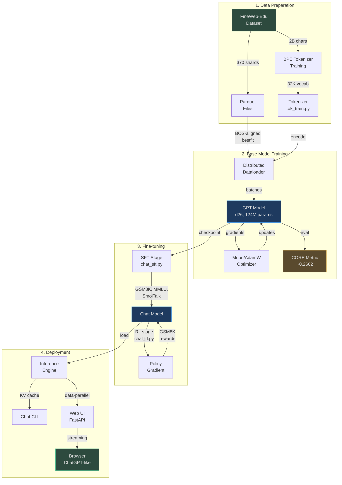
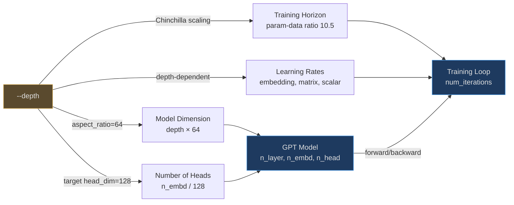
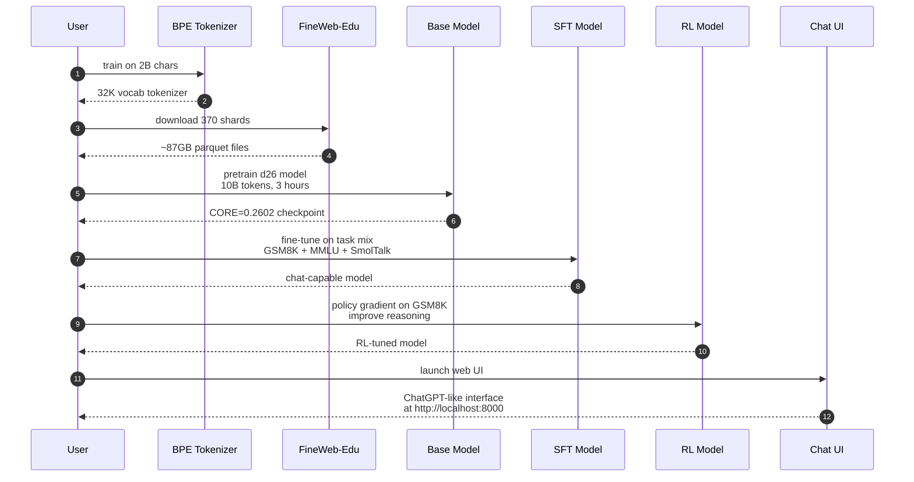
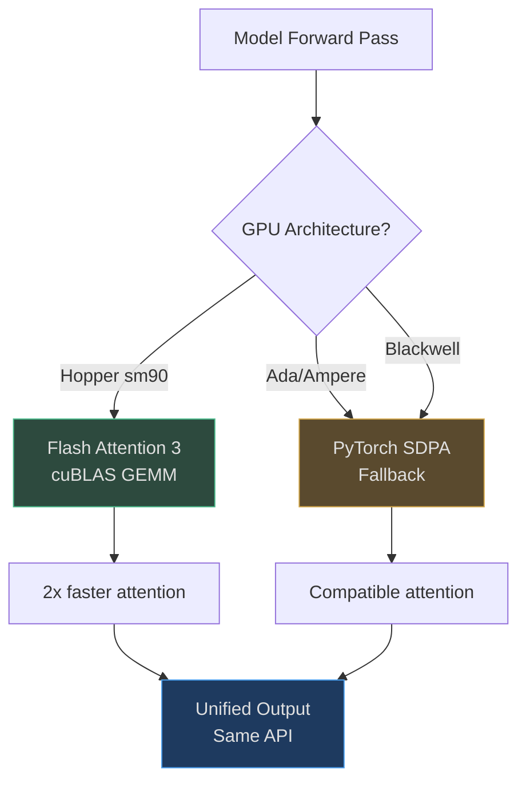
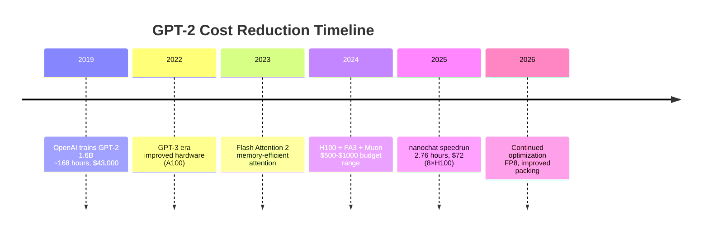

# Overview

## Why nanochat Exists

nanochat is a minimal experimental harness for training full-stack LLMs from scratch — covering tokenization, pretraining, supervised fine-tuning (SFT), reinforcement learning (RL), evaluation, and deployment. Built on the philosophy that accessibility is not just about cost but also cognitive complexity, nanochat removes the "framework sprawl" and provides a single, cohesive, readable, maximally-forkable baseline that runs end-to-end on budgets under $1,000.

The project's defining moment is the **GPT-2 speedrun**: training a model to GPT-2 1.6B capability (DCLM CORE score > 0.256525) in approximately **2.76 hours on 8×H100 GPUs for ~$72** ([README.md:19](https://github.com/karpathy/nanochat/blob/master/README.md#L19)). In 2019, the original GPT-2 training cost approximately **$43,000** ([README.md:21](https://github.com/karpathy/nanochat/blob/master/README.md#L21)). Seven years of hardware and algorithmic improvements have made GPT-2 capability accessible to individual researchers and small teams.

## At-a-Glance: What nanochat Provides

| Component | Description | Key File | Source |
|-----------|-------------|----------|--------|
| **Tokenizer** | GPT-4-style BPE with 32K vocab, special tokens for chat/tool use | `nanochat/tokenizer.py` | [nanochat/tokenizer.py:1-30](https://github.com/karpathy/nanochat/blob/master/nanochat/tokenizer.py#L1-L30) |
| **Data Pipeline** | BOS-aligned bestfit packing dataloader with 100% utilization | `nanochat/dataloader.py` | [nanochat/dataloader.py:1-13](https://github.com/karpathy/nanochat/blob/master/nanochat/dataloader.py#L1-L13) |
| **Model Architecture** | GPT with RoPE, QK norm, ReLU², GQA, sliding window attention | `nanochat/gpt.py` | [nanochat/gpt.py:1-13](https://github.com/karpathy/nanochat/blob/master/nanochat/gpt.py#L1-L13) |
| **Pretraining** | FineWeb-Edu + mixed Muon/AdamW optimizer + FP8 support | `scripts/base_train.py` | [scripts/base_train.py:1-12](https://github.com/karpathy/nanochat/blob/master/scripts/base_train.py#L1-L12) |
| **SFT** | Task mixture (GSM8K, MMLU, SmolTalk) with chat formatting | `scripts/chat_sft.py` | [scripts/chat_sft.py:1-12](https://github.com/karpathy/nanochat/blob/master/scripts/chat_sft.py#L1-L12) |
| **RL** | Simplified GRPO (REINFORCE) on GSM8K for reasoning | `scripts/chat_rl.py` | [scripts/chat_rl.py:1-10](https://github.com/karpathy/nanochat/blob/master/scripts/chat_rl.py#L1-L10) |
| **Evaluation** | DCLM CORE metric, bits-per-byte loss, task-specific evals | `nanochat/core_eval.py` | [nanochat/core_eval.py:1-6](https://github.com/karpathy/nanochat/blob/master/nanochat/core_eval.py#L1-L6) |
| **Inference** | KV cache engine with tool use support (calculator) | `nanochat/engine.py` | [nanochat/engine.py:1-13](https://github.com/karpathy/nanochat/blob/master/nanochat/engine.py#L1-L13) |
| **Chat UI** | FastAPI-based ChatGPT-like web interface | `scripts/chat_web.py` | [scripts/chat_web.py:1-23](https://github.com/karpathy/nanochat/blob/master/scripts/chat_web.py#L1-L23) |

## System Architecture

The following diagram shows how nanochat's components fit together from raw text to deployed chatbot:

<!-- Sources: README.md:1-50, runs/speedrun.sh:1-98, nanochat/dataloader.py:1-80, scripts/base_train.py:1-100, scripts/chat_sft.py:1-80, nanochat/engine.py:1-100, scripts/chat_web.py:1-80 -->

## The Single Complexity Dial: `--depth`

nanochat's defining design principle is **one dial controls everything**. Instead of exposing dozens of hyperparameters, you set `--depth` (the number of Transformer layers) and nanochat auto-computes:

- Model width (embedding dimension)
- Number of attention heads
- Learning rates for each parameter group
- Training horizon (number of iterations)
- Weight decay values

This "compute-optimal by default" philosophy ensures that every model in the nanochat miniseries is properly scaled ([README.md:78](https://github.com/karpathy/nanochat/blob/master/README.md#L78)).

<!-- Sources: scripts/base_train.py:49-70, README.md:78-79 -->

**Example depths and their characteristics:**

| Depth | Model Size | Training Time (8×H100) | Capability | Use Case | Source |
|-------|-----------|------------------------|------------|----------|--------|
| d=4 | ~10M params | ~2 minutes | Toy model | Debugging, CPU/MPS testing | [runs/runcpu.sh:1-20](https://github.com/karpathy/nanochat/blob/master/runs/runcpu.sh#L1-L20) |
| d=12 | ~45M params | ~5 minutes | GPT-1 grade | Quick experiments | [README.md:58-68](https://github.com/karpathy/nanochat/blob/master/README.md#L58-L68) |
| d=20 | ~85M params | ~1.5 hours | Mini GPT | Research prototypes | [runs/speedrun.sh:73](https://github.com/karpathy/nanochat/blob/master/runs/speedrun.sh#L73) |
| d=26 | ~124M params | ~2.76 hours | GPT-2 grade | Production baseline | [README.md:19](https://github.com/karpathy/nanochat/blob/master/README.md#L19) |

Implementation reference: [scripts/base_train.py:50-57](https://github.com/karpathy/nanochat/blob/master/scripts/base_train.py#L50-L57) computes `model_dim = depth * aspect_ratio` and auto-derives all downstream hyperparameters.

## Training Pipeline Stages

nanochat implements a complete LLM training pipeline in four distinct stages:

<!-- Sources: runs/speedrun.sh:49-98, scripts/tok_train.py:1-50, scripts/base_train.py:1-100, scripts/chat_sft.py:1-80, scripts/chat_rl.py:1-80, scripts/chat_web.py:1-80 -->

Each stage is isolated and checkpointed, allowing you to skip stages or experiment with alternatives (e.g., different SFT datasets, alternative optimizers).

## Key Features and Innovations

### 1. Flash Attention 3 Integration

nanochat automatically detects GPU architecture and uses **Flash Attention 3** on Hopper (H100+) GPUs, falling back to PyTorch SDPA on older architectures ([nanochat/flash_attention.py:23-42](https://github.com/karpathy/nanochat/blob/master/nanochat/flash_attention.py#L23-L42)):

<!-- Sources: nanochat/flash_attention.py:1-50, nanochat/gpt.py:25-26, nanochat/gpt.py:96-100 -->

### 2. FP8 Training Support

On H100+ GPUs, nanochat supports **float8 mixed precision training** with tensorwise dynamic scaling, achieving ~2x speedup over bfloat16 ([nanochat/fp8.py:1-50](https://github.com/karpathy/nanochat/blob/master/nanochat/fp8.py#L1-L50)):

- Forward: `input @ weight.T` in FP8
- Backward input: `grad_output @ weight` in FP8  
- Backward weight: `grad_output.T @ input` in FP8

The implementation is **~150 lines vs torchao's ~2000 lines**, focusing on tensorwise scaling only ([README.md:18-19](https://github.com/karpathy/nanochat/blob/master/README.md#L18-L19)).

### 3. Mixed Muon/AdamW Optimizer

nanochat uses a **combined optimizer** that applies different algorithms to different parameter types ([nanochat/optim.py:100-150](https://github.com/karpathy/nanochat/blob/master/nanochat/optim.py#L100-L150)):

- **Muon**: Matrix parameters (Q/K/V projections, MLP weights) with Newton-Schulz orthogonalization
- **AdamW**: Embeddings, unembedding, scalars

This hybrid approach combines Muon's fast convergence on weight matrices with AdamW's stability for embeddings.

### 4. BOS-Aligned Bestfit Packing

The dataloader ensures **every sequence starts with a BOS token** and uses best-fit packing to maximize utilization ([nanochat/dataloader.py:4-13](https://github.com/karpathy/nanochat/blob/master/nanochat/dataloader.py#L4-L13)):

- **100% utilization** (no padding tokens)
- **~35% cropping** at sequence length 2048
- **Clear document boundaries** for attention

Trade-off: Loses 35% of tokens to cropping but ensures every token can attend back to a BOS marker, improving contextual coherence.

## Design Philosophy: Hackability Over Configurability

nanochat is explicitly **not** an exhaustively configurable LLM framework. There are:

- **No giant configuration objects**
- **No model factories**
- **No if-then-else monsters**

Instead, nanochat provides a single, cohesive, minimal, maximally-forkable "strong baseline" ([README.md:152-154](https://github.com/karpathy/nanochat/blob/master/README.md#L152-L154)). If you need custom behavior, you fork and modify — the entire codebase is designed to be **read, understood, and changed** by a single engineer in an afternoon.

## Historical Context: From $43k to $72

<!-- Sources: README.md:21, README.md:19 -->

The 600× cost reduction is due to:
1. **Hardware**: V100 → A100 → H100 (3 generations, ~10× FLOPS/$ improvement)
2. **Algorithms**: Flash Attention, Muon optimizer, FP8 quantization
3. **Training efficiency**: Better learning rate schedules, data packing, warmup/warmdown
4. **Scaling laws**: Chinchilla insights → smaller models trained longer

## References

- [README.md:1-183](https://github.com/karpathy/nanochat/blob/master/README.md#L1-L183) — Full project README with leaderboard and guides
- [runs/speedrun.sh:1-98](https://github.com/karpathy/nanochat/blob/master/runs/speedrun.sh#L1-L98) — Reference training script for GPT-2 speedrun
- [nanochat/gpt.py:1-100](https://github.com/karpathy/nanochat/blob/master/nanochat/gpt.py#L1-L100) — Core GPT model implementation
- [scripts/base_train.py:1-100](https://github.com/karpathy/nanochat/blob/master/scripts/base_train.py#L1-L100) — Base model pretraining logic
- [nanochat/common.py:1-259](https://github.com/karpathy/nanochat/blob/master/nanochat/common.py#L1-L259) — Device detection and distributed setup
