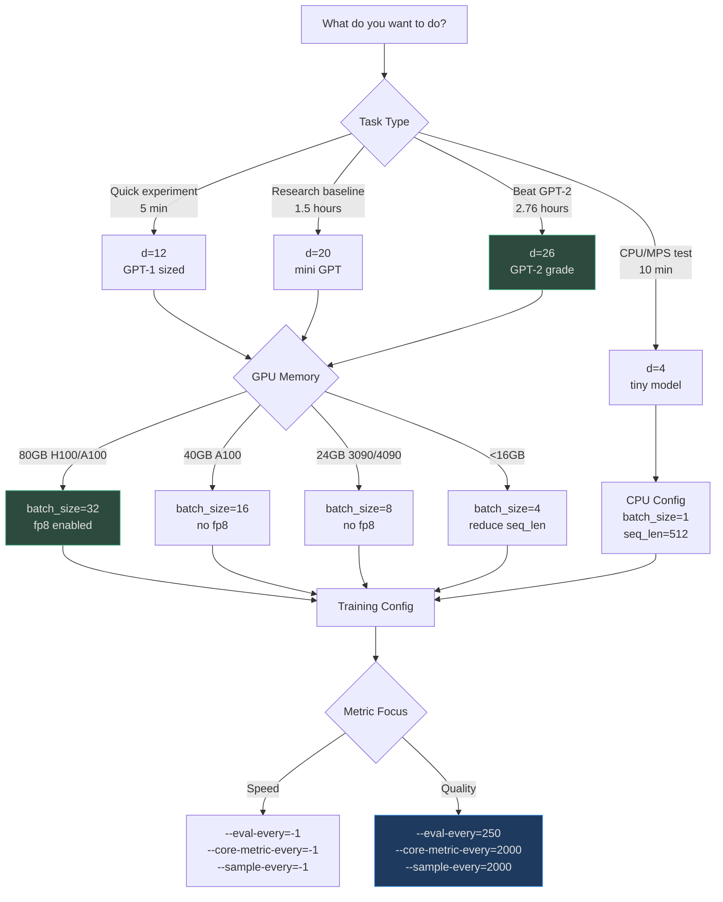
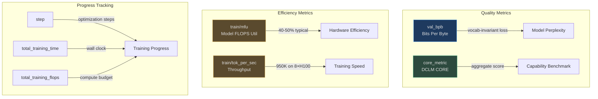
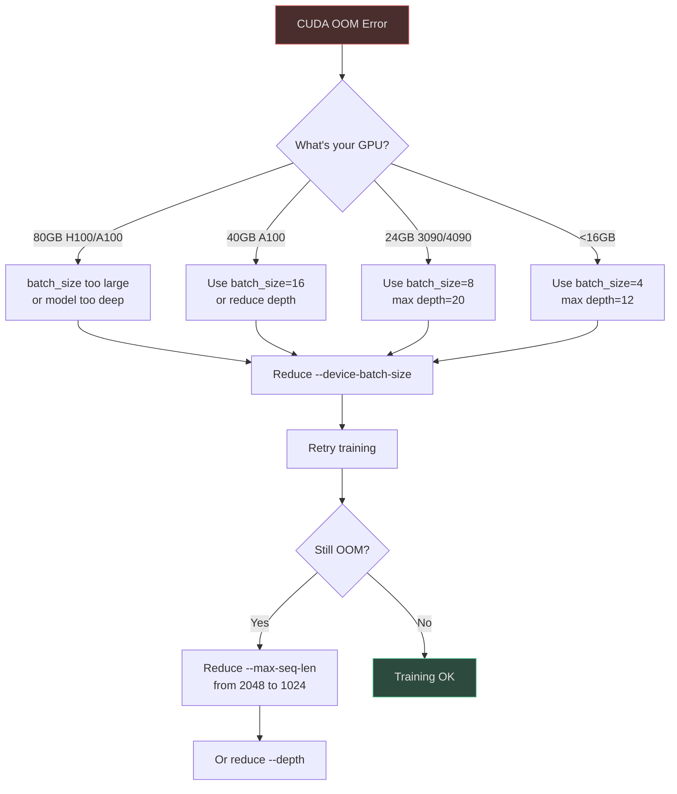
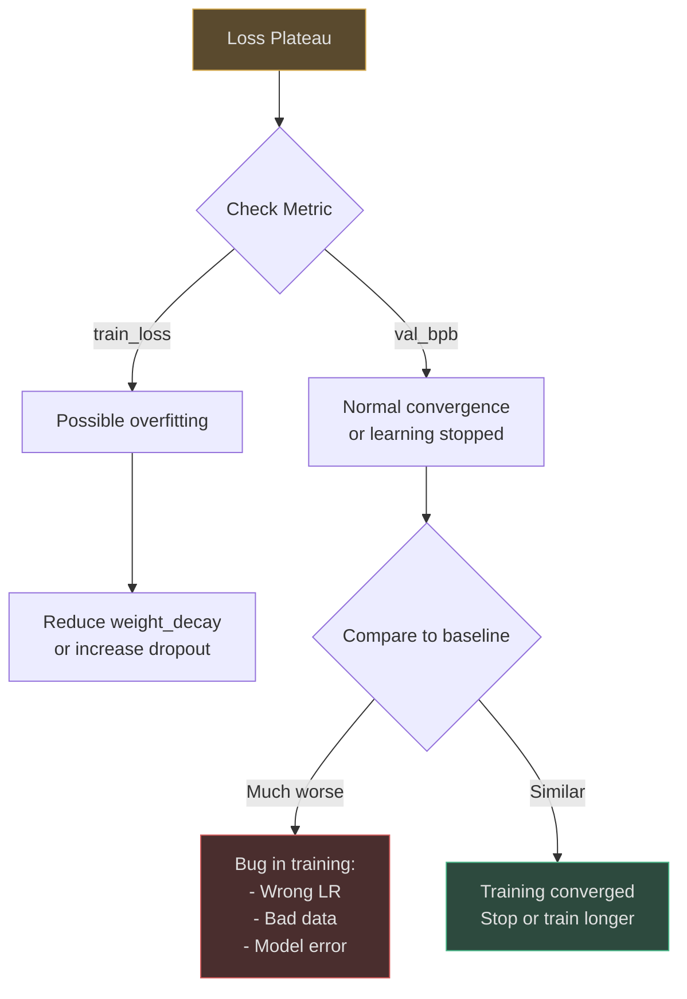

# Quick Reference

## Why This Reference Exists

This page serves as a **rapid-lookup guide** for nanochat's most common operations — from launching quick experiments to monitoring training to debugging failures. Unlike the detailed walkthrough, this reference assumes you're already familiar with the basics and need quick answers to "how do I X?" questions.

## At-a-Glance: Common Tasks

| Task | Command | Duration | Source |
|------|---------|----------|--------|
| **Quick experiment (d12)** | `torchrun --nproc_per_node=8 -m scripts.base_train -- --depth=12 --run=d12` | ~5 min | [README.md:58-68](https://github.com/karpathy/nanochat/blob/master/README.md#L58-L68) |
| **Full speedrun (d26)** | `bash runs/speedrun.sh` | ~2.76 hours | [runs/speedrun.sh:1](https://github.com/karpathy/nanochat/blob/master/runs/speedrun.sh#L1) |
| **Evaluate CORE metric** | `torchrun --nproc_per_node=8 -m scripts.base_eval` | ~10 min | [scripts/base_eval.py:1-30](https://github.com/karpathy/nanochat/blob/master/scripts/base_eval.py#L1-L30) |
| **Chat via CLI** | `python -m scripts.chat_cli -p "Why is the sky blue?"` | Instant | [scripts/chat_cli.py:1-30](https://github.com/karpathy/nanochat/blob/master/scripts/chat_cli.py#L1-L30) |
| **Launch web UI** | `python -m scripts.chat_web --num-gpus 4` | Instant | [scripts/chat_web.py:1-15](https://github.com/karpathy/nanochat/blob/master/scripts/chat_web.py#L1-L15) |
| **Train tokenizer** | `python -m scripts.tok_train` | ~3 min | [scripts/tok_train.py:1-50](https://github.com/karpathy/nanochat/blob/master/scripts/tok_train.py#L1-L50) |
| **Run SFT** | `torchrun --nproc_per_node=8 -m scripts.chat_sft` | ~10 min | [scripts/chat_sft.py:1-12](https://github.com/karpathy/nanochat/blob/master/scripts/chat_sft.py#L1-L12) |
| **Run RL** | `torchrun --nproc_per_node=8 -m scripts.chat_rl` | ~15 min | [scripts/chat_rl.py:1-17](https://github.com/karpathy/nanochat/blob/master/scripts/chat_rl.py#L1-L17) |

## Command Reference by Stage

### Tokenizer Training

```bash
# Default: 32K vocab, 2B chars
python -m scripts.tok_train

# Custom vocab size
python -m scripts.tok_train --vocab-size=16384

# Evaluate tokenizer compression
python -m scripts.tok_eval
```

**Key parameters** ([scripts/tok_train.py:17-23](https://github.com/karpathy/nanochat/blob/master/scripts/tok_train.py#L17-L23)):
- `--vocab-size`: Vocabulary size (default: 32768)
- `--max-chars`: Characters to train on (default: 2,000,000,000)
- `--doc-cap`: Max chars per document (default: 10,000)

### Base Model Training

```bash
# Full 8-GPU training
OMP_NUM_THREADS=1 torchrun --standalone --nproc_per_node=8 -m scripts.base_train -- \
    --depth=26 \
    --device-batch-size=16 \
    --fp8 \
    --run=my-run

# Quick d12 experiment (5 min)
OMP_NUM_THREADS=1 torchrun --standalone --nproc_per_node=8 -m scripts.base_train -- \
    --depth=12 \
    --run=d12 \
    --core-metric-every=999999 \
    --sample-every=-1 \
    --save-every=-1

# Single GPU (8× slower)
python -m scripts.base_train -- --depth=26 --device-batch-size=16

# CPU/MPS (tiny model)
python -m scripts.base_train -- \
    --depth=4 \
    --max-seq-len=512 \
    --device-batch-size=1 \
    --total-batch-size=512 \
    --num-iterations=20
```

**Key parameters** ([scripts/base_train.py:40-81](https://github.com/karpathy/nanochat/blob/master/scripts/base_train.py#L40-L81)):
- `--depth`: Number of layers (4-32, controls model size)
- `--device-batch-size`: Per-GPU batch size (default: 32)
- `--fp8`: Enable FP8 training (H100+ only)
- `--run`: Wandb run name (`dummy` disables logging)
- `--eval-every`: Evaluate validation loss every N steps (default: 250)
- `--core-metric-every`: Evaluate CORE metric every N steps (default: 2000)
- `--save-every`: Save checkpoint every N steps (default: -1, only at end)

### Evaluation

```bash
# Evaluate base model (CORE + BPB + samples)
torchrun --standalone --nproc_per_node=8 -m scripts.base_eval

# Evaluate specific checkpoint
torchrun --standalone --nproc_per_node=8 -m scripts.base_eval -- \
    --model-tag=my-model \
    --model-step=10000

# Evaluate chat model
torchrun --standalone --nproc_per_node=8 -m scripts.chat_eval -- -i sft
```

### Chat Interfaces

```bash
# CLI chat (non-interactive)
python -m scripts.chat_cli -p "Write a haiku about neural networks."

# CLI chat (interactive)
python -m scripts.chat_cli

# Web UI (single GPU)
python -m scripts.chat_web

# Web UI (4 GPUs, data-parallel serving)
python -m scripts.chat_web --num-gpus 4 --port 8000

# Load specific checkpoint
python -m scripts.chat_web -i rl --model-tag=my-model --step=5000
```

**Web UI parameters** ([scripts/chat_web.py:63-75](https://github.com/karpathy/nanochat/blob/master/scripts/chat_web.py#L63-L75)):
- `-n, --num-gpus`: Number of GPUs for data-parallel serving (default: 1)
- `-i, --source`: Model source: `sft` or `rl` (default: `sft`)
- `-t, --temperature`: Default generation temperature (default: 0.8)
- `-k, --top-k`: Default top-k sampling (default: 50)
- `-p, --port`: Server port (default: 8000)

## Hyperparameter Decision Tree



<!-- Sources: scripts/base_train.py:40-81, README.md:58-68, runs/runcpu.sh:1-20 -->

## Key Hyperparameters Reference

### Model Architecture

| Parameter | Range | Default | Effect | Source |
|-----------|-------|---------|--------|--------|
| `--depth` | 4-32 | 20 | Number of Transformer layers. Controls model size. | [scripts/base_train.py:49](https://github.com/karpathy/nanochat/blob/master/scripts/base_train.py#L49) |
| `--aspect-ratio` | 32-128 | 64 | Width multiplier: `model_dim = depth × aspect_ratio` | [scripts/base_train.py:50](https://github.com/karpathy/nanochat/blob/master/scripts/base_train.py#L50) |
| `--head-dim` | 64-256 | 128 | Target dimension per attention head. Higher = fewer heads. | [scripts/base_train.py:51](https://github.com/karpathy/nanochat/blob/master/scripts/base_train.py#L51) |
| `--max-seq-len` | 512-4096 | 2048 | Maximum context length (tokens). Higher = more VRAM. | [scripts/base_train.py:52](https://github.com/karpathy/nanochat/blob/master/scripts/base_train.py#L52) |
| `--window-pattern` | "L", "SL", "SSSL" | "SSSL" | Sliding window attention pattern. L=full, S=half context. | [scripts/base_train.py:53](https://github.com/karpathy/nanochat/blob/master/scripts/base_train.py#L53) |

### Training Horizon

| Parameter | Range | Default | Effect | Source |
|-----------|-------|---------|--------|--------|
| `--num-iterations` | 1-50000 | -1 (auto) | Explicit training steps. Overrides other horizon settings. | [scripts/base_train.py:55](https://github.com/karpathy/nanochat/blob/master/scripts/base_train.py#L55) |
| `--target-flops` | 1e18-1e21 | -1 (disabled) | Train until reaching target FLOPs. | [scripts/base_train.py:56](https://github.com/karpathy/nanochat/blob/master/scripts/base_train.py#L56) |
| `--target-param-data-ratio` | 5-20 | 10.5 | Chinchilla scaling: tokens per parameter. | [scripts/base_train.py:57](https://github.com/karpathy/nanochat/blob/master/scripts/base_train.py#L57) |

**How to choose:**
- **Quick experiment:** `--num-iterations=1000` (explicit control)
- **Compute-optimal:** `--target-param-data-ratio=10.5` (Chinchilla sweet spot)
- **Overtrain:** `--target-param-data-ratio=12` (better quality, longer training)

### Optimization

| Parameter | Range | Default | Effect | Source |
|-----------|-------|---------|--------|--------|
| `--device-batch-size` | 1-64 | 32 | Samples per GPU per step. Reduce if OOM. | [scripts/base_train.py:59](https://github.com/karpathy/nanochat/blob/master/scripts/base_train.py#L59) |
| `--total-batch-size` | 512-2M | -1 (auto) | Total tokens per optimization step across all GPUs. | [scripts/base_train.py:60](https://github.com/karpathy/nanochat/blob/master/scripts/base_train.py#L60) |
| `--embedding-lr` | 0.01-1.0 | 0.3 | AdamW learning rate for embeddings. | [scripts/base_train.py:61](https://github.com/karpathy/nanochat/blob/master/scripts/base_train.py#L61) |
| `--matrix-lr` | 0.001-0.1 | 0.02 | Muon learning rate for weight matrices (Q/K/V, MLP). | [scripts/base_train.py:64](https://github.com/karpathy/nanochat/blob/master/scripts/base_train.py#L64) |
| `--weight-decay` | 0.0-0.5 | 0.2 | L2 regularization for Muon parameters. | [scripts/base_train.py:63](https://github.com/karpathy/nanochat/blob/master/scripts/base_train.py#L63) |

### Learning Rate Schedule

| Parameter | Range | Default | Effect | Source |
|-----------|-------|---------|--------|--------|
| `--warmup-ratio` | 0.0-0.3 | 0.0 | Fraction of training for LR warmup. 0 = no warmup. | [scripts/base_train.py:68](https://github.com/karpathy/nanochat/blob/master/scripts/base_train.py#L68) |
| `--warmdown-ratio` | 0.0-1.0 | 0.5 | Fraction of training for LR decay. 0.5 = second half. | [scripts/base_train.py:69](https://github.com/karpathy/nanochat/blob/master/scripts/base_train.py#L69) |
| `--final-lr-frac` | 0.0-1.0 | 0.0 | Final LR as fraction of initial. 0 = decay to zero. | [scripts/base_train.py:70](https://github.com/karpathy/nanochat/blob/master/scripts/base_train.py#L70) |

**Typical schedules:**
- **Pretraining:** `warmup=0.0, warmdown=0.5, final=0.0` (no warmup, decay second half)
- **SFT:** `warmup=0.0, warmdown=0.2, final=0.1` (less aggressive decay)
- **RL:** `warmup=0.05, warmdown=0.3, final=0.05` (gentle warmup and decay)

## Metric Reference

### Primary Metrics



<!-- Sources: README.md:71-75, nanochat/loss_eval.py:1-40, nanochat/core_eval.py:1-6 -->

### Validation Bits Per Byte (BPB)

**What it is:** Vocab-size-invariant loss metric computed as `log2(perplexity) / avg_bytes_per_token` ([nanochat/loss_eval.py:10-20](https://github.com/karpathy/nanochat/blob/master/nanochat/loss_eval.py#L10-L20)).

**Why it matters:** Allows fair comparison between models with different tokenizers (e.g., 32K vocab vs 50K vocab).

**Typical values:**
- d12 (GPT-1 grade): ~0.82 BPB
- d20 (mini GPT): ~0.77 BPB
- d26 (GPT-2 grade): ~0.746 BPB

**How to interpret:**
- **Lower is better** (less surprised by validation data)
- Should decrease monotonically during training
- Plateau indicates training has converged

### DCLM CORE Metric

**What it is:** Aggregate benchmark from DCLM paper combining multiple-choice, schema, and language modeling tasks ([nanochat/core_eval.py:1-6](https://github.com/karpathy/nanochat/blob/master/nanochat/core_eval.py#L1-L6)).

**Tasks included:** MMLU, ARC-Easy, ARC-Challenge, HellaSwag, PIQA, Winogrande, OpenBookQA, BoolQ, SQUAD, and more.

**Target values:**
- GPT-2 (1.6B, 2019): 0.256525
- nanochat d26: 0.2602 (beats GPT-2)

**How to interpret:**
- **Higher is better** (normalized aggregate score)
- Small improvements (0.001-0.005) are significant
- Variance between runs: ±0.003

### Model FLOPS Utilization (MFU)

**What it is:** Ratio of achieved FLOPS to theoretical peak FLOPS of your GPU ([nanochat/common.py:204-259](https://github.com/karpathy/nanochat/blob/master/nanochat/common.py#L204-L259)).

**Typical values:**
- 40-50%: Good (nanochat default)
- 30-40%: Acceptable (CPU bottleneck or small batches)
- <30%: Poor (check for issues)

**How to improve:**
- Enable FP8 training (`--fp8`)
- Increase batch size (`--device-batch-size`)
- Reduce evaluation frequency (`--eval-every`)
- Use Flash Attention 3 (automatic on H100)

## Troubleshooting Guide

### "CUDA out of memory" Errors



<!-- Sources: README.md:53, scripts/base_train.py:59 -->

**Solution steps:**
1. Reduce `--device-batch-size` by half: `32 → 16 → 8 → 4`
2. If still OOM, reduce `--max-seq-len`: `2048 → 1024 → 512`
3. If still OOM, reduce `--depth`: `26 → 20 → 12`

### "Training slower than expected"

**Checklist:**
- [ ] FP8 enabled? (`--fp8` on H100+ only)
- [ ] Flash Attention 3 active? `python -c "from nanochat.flash_attention import HAS_FA3; print(HAS_FA3)"`
- [ ] MFU > 35%? Check wandb `train/mfu` metric
- [ ] Throughput > 700K tok/sec? Check `train/tok_per_sec`
- [ ] Using all GPUs? Verify `ddp_world_size` in logs

**Common causes:**
- **CPU bottleneck:** Increase `--device-batch-size` to keep GPUs fed
- **Eval overhead:** Reduce `--eval-every` and `--core-metric-every`
- **Network latency:** Ensure fast storage for dataset (local SSD > NFS)

### "Loss not decreasing"



<!-- Sources: scripts/base_train.py:61-70 -->

**Debugging steps:**
1. **Check train vs val loss:**
   - Train ↓, Val ↓ → Normal
   - Train ↓, Val → → Overfitting (increase regularization)
   - Train →, Val → → Learning stopped (check LR schedule)

2. **Verify data quality:**
   ```bash
   # Check dataloader samples
   python -c "from nanochat.dataloader import *; loader = tokenizing_distributed_data_loader_bos_bestfit(...); print(next(loader))"
   ```

3. **Compare to baseline:**
   - d12 should reach ~0.82 BPB in 5 min
   - d26 should reach ~0.746 BPB in 2.5 hours

### "CORE metric not evaluating"

**Symptoms:** CORE metric shows as 0.0 or never logged.

**Causes:**
- Evaluation skipped: Check `--core-metric-every` (default: 2000 steps)
- Evaluation too slow: Check `--core-metric-max-per-task` (default: 500)
- Task data missing: Ensure HuggingFace datasets can download

**Solutions:**
```bash
# Force CORE evaluation on current checkpoint
torchrun --standalone --nproc_per_node=8 -m scripts.base_eval

# Reduce eval budget for faster runs
torchrun --standalone --nproc_per_node=8 -m scripts.base_train -- \
    --core-metric-every=1000 \
    --core-metric-max-per-task=100
```

### "Flash Attention 3 not available"

**Check GPU architecture:**
```bash
python -c "import torch; print(torch.cuda.get_device_properties(0))"
# Look for "compute_capability: major=9, minor=0" (sm90 = Hopper H100)
```

**Expected behavior:**
- **H100 (sm90):** Flash Attention 3 enabled
- **Ada/Ampere (sm86/sm80):** Falls back to PyTorch SDPA (still fast)
- **No performance impact** — fallback is automatic

Reference: [nanochat/flash_attention.py:23-42](https://github.com/karpathy/nanochat/blob/master/nanochat/flash_attention.py#L23-L42)

### "Wandb not logging"

**Causes:**
- `--run=dummy` (logging disabled by default)
- Not logged in: `wandb login`
- Network issues: Check firewall/proxy

**Solutions:**
```bash
# Enable wandb logging
export WANDB_RUN=my-experiment
bash runs/speedrun.sh

# Or inline
torchrun --standalone --nproc_per_node=8 -m scripts.base_train -- --run=my-experiment
```

Reference: [runs/speedrun.sh:37-40](https://github.com/karpathy/nanochat/blob/master/runs/speedrun.sh#L37-L40)

## Performance Benchmarks

### Training Speed by GPU

| GPU | 8× Node tok/sec | MFU | Speedrun Time | Cost | Source |
|-----|-----------------|-----|---------------|------|--------|
| H100 (80GB) | ~950K | 45% | 2.76 hours | $72 | [README.md:19](https://github.com/karpathy/nanochat/blob/master/README.md#L19) |
| A100 (80GB) | ~750K | 38% | ~3.5 hours | $90 | [README.md:51](https://github.com/karpathy/nanochat/blob/master/README.md#L51) |
| A100 (40GB) | ~700K | 36% | ~3.6 hours | $85 | Estimated |
| RTX 4090 (24GB) | ~180K | N/A | ~15 hours (1 GPU) | N/A | Estimated |

### Memory Usage by Model Size

| Depth | Params | Min VRAM (batch_size=1) | Optimal VRAM (batch_size=32) | Source |
|-------|--------|-------------------------|------------------------------|--------|
| d=4 | ~10M | ~2GB | ~8GB | [runs/runcpu.sh:1-20](https://github.com/karpathy/nanochat/blob/master/runs/runcpu.sh#L1-L20) |
| d=12 | ~45M | ~6GB | ~24GB | [README.md:58-68](https://github.com/karpathy/nanochat/blob/master/README.md#L58-L68) |
| d=20 | ~85M | ~10GB | ~40GB | Estimated |
| d=26 | ~124M | ~15GB | ~75GB | [runs/speedrun.sh:73](https://github.com/karpathy/nanochat/blob/master/runs/speedrun.sh#L73) |

## Common Use Cases

### Quick Experimentation (5 min runs)

```bash
# d12 model, minimal eval, wandb logging
OMP_NUM_THREADS=1 torchrun --standalone --nproc_per_node=8 -m scripts.base_train -- \
    --depth=12 \
    --run="d12-experiment" \
    --core-metric-every=999999 \
    --sample-every=-1 \
    --save-every=-1
```

**When to use:** Testing code changes, hyperparameter tuning, debugging.

### Full Speedrun (2.76 hours)

```bash
# Complete pipeline: tokenizer + pretraining + SFT
WANDB_RUN=my-speedrun bash runs/speedrun.sh
```

**When to use:** Training a production-quality GPT-2 capability model.

### Miniseries Sweep (Multiple Models)

```bash
# Train d4, d8, d12, d16, d20, d24 for scaling laws
bash runs/miniseries.sh
```

**When to use:** Research on scaling laws, ablation studies.

Reference: [runs/miniseries.sh:1-30](https://github.com/karpathy/nanochat/blob/master/runs/miniseries.sh#L1-L30)

### Resume from Checkpoint

```bash
# Resume pretraining from step 10000
torchrun --standalone --nproc_per_node=8 -m scripts.base_train -- \
    --depth=26 \
    --resume-from-step=10000 \
    --model-tag=my-model
```

Reference: [scripts/base_train.py:71](https://github.com/karpathy/nanochat/blob/master/scripts/base_train.py#L71)

### Evaluate Existing Checkpoint

```bash
# CORE metric only
torchrun --standalone --nproc_per_node=8 -m scripts.base_eval -- \
    --model-tag=my-model \
    --model-step=final

# Validation BPB only
python -m nanochat.loss_eval --model-tag=my-model
```

## File Locations Reference

| Artifact | Default Location | Override | Source |
|----------|------------------|----------|--------|
| **Base directory** | `~/.cache/nanochat/` | `$NANOCHAT_BASE_DIR` | [nanochat/common.py:50-59](https://github.com/karpathy/nanochat/blob/master/nanochat/common.py#L50-L59) |
| **Dataset** | `~/.cache/nanochat/data/` | N/A | [nanochat/dataset.py:1-30](https://github.com/karpathy/nanochat/blob/master/nanochat/dataset.py#L1-L30) |
| **Tokenizer** | `~/.cache/nanochat/tokenizer/` | N/A | [scripts/tok_train.py:56-58](https://github.com/karpathy/nanochat/blob/master/scripts/tok_train.py#L56-L58) |
| **Checkpoints** | `~/.cache/nanochat/checkpoints/` | `--model-tag` | [nanochat/checkpoint_manager.py:1-50](https://github.com/karpathy/nanochat/blob/master/nanochat/checkpoint_manager.py#L1-L50) |
| **Wandb logs** | `./wandb/` | `$WANDB_DIR` | Wandb default |
| **Training report** | `~/.cache/nanochat/report/` | N/A | [nanochat/report.py:1-50](https://github.com/karpathy/nanochat/blob/master/nanochat/report.py#L1-50) |

## Environment Variables

| Variable | Purpose | Default | Source |
|----------|---------|---------|--------|
| `NANOCHAT_BASE_DIR` | Base directory for all artifacts | `~/.cache/nanochat` | [nanochat/common.py:52](https://github.com/karpathy/nanochat/blob/master/nanochat/common.py#L52) |
| `OMP_NUM_THREADS` | OpenMP parallelism (set to 1 for DDP) | (auto) | [runs/speedrun.sh:14](https://github.com/karpathy/nanochat/blob/master/runs/speedrun.sh#L14) |
| `PYTORCH_ALLOC_CONF` | PyTorch allocator config | `expandable_segments:True` | [scripts/base_train.py:15](https://github.com/karpathy/nanochat/blob/master/scripts/base_train.py#L15) |
| `WANDB_RUN` | Wandb run name (`dummy` = disabled) | `dummy` | [runs/speedrun.sh:39](https://github.com/karpathy/nanochat/blob/master/runs/speedrun.sh#L39) |
| `CUDA_VISIBLE_DEVICES` | Restrict visible GPUs | (all) | Standard PyTorch |

## Next Steps

- **Deep Dive:** Explore [Architecture](../deep-dive/architecture/gpt-model.md) for model details
- **Customize:** See [Guide: infusing identity](https://github.com/karpathy/nanochat/discussions/139) for personality tuning
- **Research:** Read [Beating GPT-2 for $100](https://github.com/karpathy/nanochat/discussions/481) for insights

## References

- [README.md:56-93](https://github.com/karpathy/nanochat/blob/master/README.md#L56-L93) — Getting started and research workflows
- [scripts/base_train.py:40-81](https://github.com/karpathy/nanochat/blob/master/scripts/base_train.py#L40-L81) — Training hyperparameters
- [nanochat/common.py:142-189](https://github.com/karpathy/nanochat/blob/master/nanochat/common.py#L142-L189) — Device detection and configuration
- [runs/speedrun.sh:1-98](https://github.com/karpathy/nanochat/blob/master/runs/speedrun.sh#L1-L98) — Complete training pipeline
- [nanochat/loss_eval.py:1-40](https://github.com/karpathy/nanochat/blob/master/nanochat/loss_eval.py#L1-L40) — BPB metric computation
- [nanochat/core_eval.py:1-80](https://github.com/karpathy/nanochat/blob/master/nanochat/core_eval.py#L1-L80) — CORE metric evaluation
