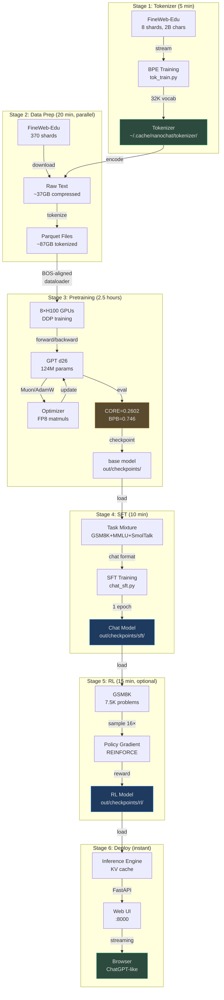
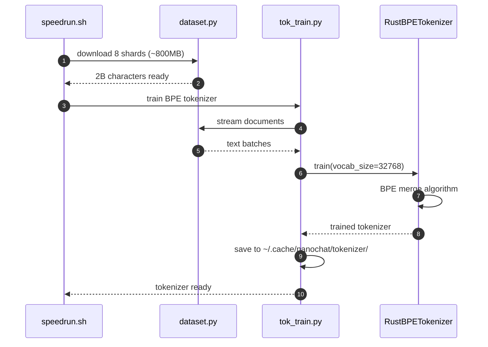
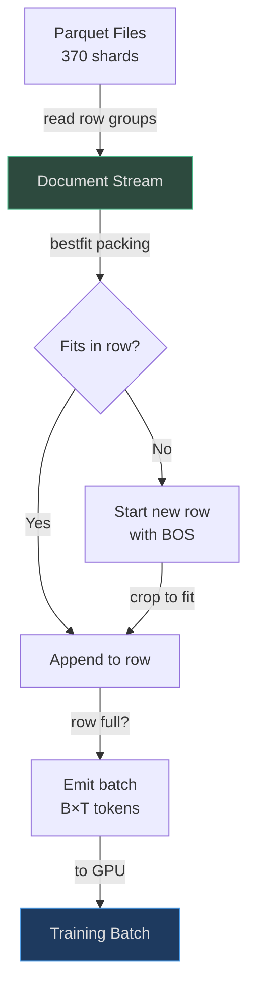
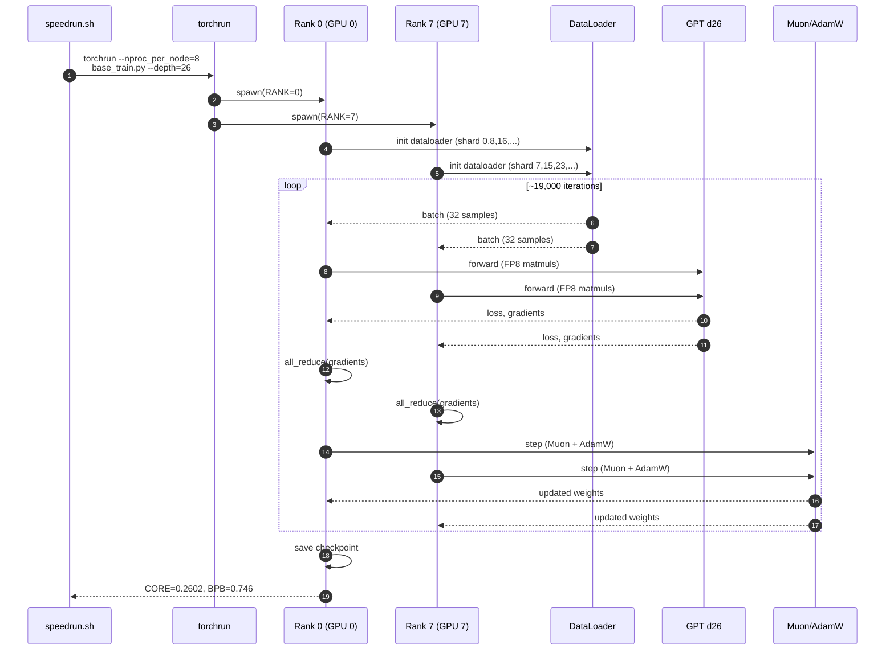
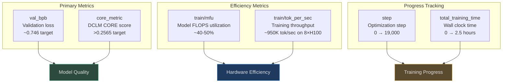
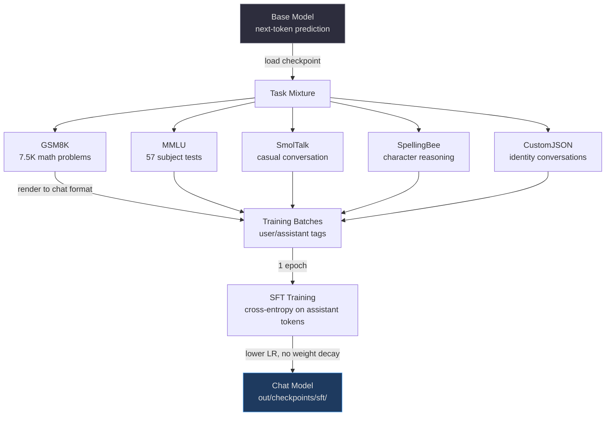
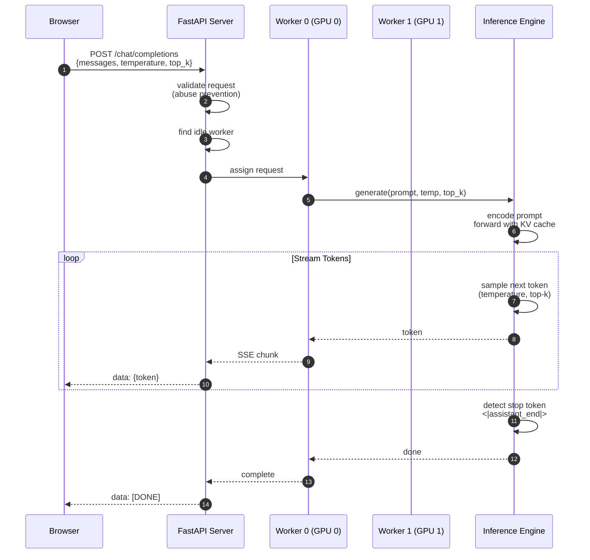

# GPT-2 Speedrun Walkthrough

## Why This Walkthrough Exists

The **GPT-2 speedrun** is nanochat's defining achievement: training a model to GPT-2 1.6B capability (DCLM CORE score > 0.256525) in **~2.76 hours on 8×H100 GPUs for $72** ([README.md:19](https://github.com/karpathy/nanochat/blob/master/README.md#L19)). This walkthrough traces the exact steps executed by `runs/speedrun.sh`, from tokenizer training to chatting with your model in a web UI.

The entire pipeline is **self-contained in a single 98-line shell script** ([runs/speedrun.sh:1-98](https://github.com/karpathy/nanochat/blob/master/runs/speedrun.sh#L1-L98)) — no hidden configuration files, no model registries, no framework magic.

## At-a-Glance: Speedrun Pipeline

| Stage | Duration | Output | Metrics | Source |
|-------|----------|--------|---------|--------|
| **1. Tokenizer** | ~5 min | 32K vocab BPE | Compression ratio | [scripts/tok_train.py:1-50](https://github.com/karpathy/nanochat/blob/master/scripts/tok_train.py#L1-L50) |
| **2. Data Prep** | ~20 min | 370 parquet shards (~87GB) | 10B tokens | [nanochat/dataset.py:1-50](https://github.com/karpathy/nanochat/blob/master/nanochat/dataset.py#L1-L50) |
| **3. Pretraining** | ~2.5 hours | d26 base model (124M) | CORE=0.2602, BPB=0.746 | [scripts/base_train.py:1-100](https://github.com/karpathy/nanochat/blob/master/scripts/base_train.py#L1-L100) |
| **4. SFT** | ~10 min | Chat-capable model | Task accuracy | [scripts/chat_sft.py:1-80](https://github.com/karpathy/nanochat/blob/master/scripts/chat_sft.py#L1-L80) |
| **5. RL (Optional)** | ~15 min | Policy-tuned model | GSM8K pass@16 | [scripts/chat_rl.py:1-80](https://github.com/karpathy/nanochat/blob/master/scripts/chat_rl.py#L1-L80) |
| **6. Deploy** | Instant | Web UI server | Streaming chat | [scripts/chat_web.py:1-80](https://github.com/karpathy/nanochat/blob/master/scripts/chat_web.py#L1-L80) |

**Total time:** ~2.76 hours (pretraining dominates)  
**Total cost:** $72 @ $26/hr for 8×H100 (Lambda pricing)

## Complete Pipeline Architecture



<!-- Sources: runs/speedrun.sh:1-98, scripts/tok_train.py:1-80, scripts/base_train.py:1-100, scripts/chat_sft.py:1-80, scripts/chat_rl.py:1-80, scripts/chat_web.py:1-80 -->

## Launching the Speedrun

The simplest way to run the entire pipeline:

```bash
# Clone and install (if not already done)
git clone https://github.com/karpathy/nanochat.git
cd nanochat
uv venv && uv sync --extra gpu && source .venv/bin/activate

# Launch speedrun in a screen session (takes ~3 hours)
screen -L -Logfile runs/speedrun.log -S speedrun bash runs/speedrun.sh

# Detach with Ctrl+A, D
# Reattach later with: screen -r speedrun
```

Reference: [runs/speedrun.sh:6-11](https://github.com/karpathy/nanochat/blob/master/runs/speedrun.sh#L6-L11)

**With wandb logging** (recommended for tracking metrics):

```bash
# First-time setup
wandb login

# Launch with wandb
WANDB_RUN=my-speedrun screen -L -Logfile runs/speedrun.log -S speedrun bash runs/speedrun.sh
```

Reference: [runs/speedrun.sh:32-40](https://github.com/karpathy/nanochat/blob/master/runs/speedrun.sh#L32-L40)

## Stage 1: Tokenizer Training

### What Happens



<!-- Sources: runs/speedrun.sh:49-65, scripts/tok_train.py:1-80, nanochat/dataset.py:1-50, nanochat/tokenizer.py:1-80 -->

### Command Breakdown

```bash
# Download first 8 shards (~800MB, enough for tokenizer training)
python -m nanochat.dataset -n 8

# Start downloading remaining 362 shards in background (~36GB)
python -m nanochat.dataset -n 370 &
DATASET_DOWNLOAD_PID=$!

# Train tokenizer on 2B characters
python -m scripts.tok_train

# Evaluate tokenizer (compression ratio, token distribution)
python -m scripts.tok_eval
```

Reference: [runs/speedrun.sh:51-65](https://github.com/karpathy/nanochat/blob/master/runs/speedrun.sh#L51-L65)

### Key Parameters

| Parameter | Value | Why | Source |
|-----------|-------|-----|--------|
| `vocab_size` | 32,768 (2^15) | Optimal for ~100M param models | [scripts/tok_train.py:19](https://github.com/karpathy/nanochat/blob/master/scripts/tok_train.py#L19) |
| `max_chars` | 2,000,000,000 | Representative sample of FineWeb-Edu | [scripts/tok_train.py:17](https://github.com/karpathy/nanochat/blob/master/scripts/tok_train.py#L17) |
| `doc_cap` | 10,000 | Crop long docs for balanced distribution | [scripts/tok_train.py:18](https://github.com/karpathy/nanochat/blob/master/scripts/tok_train.py#L18) |

**Special tokens** ([nanochat/tokenizer.py:13-25](https://github.com/karpathy/nanochat/blob/master/nanochat/tokenizer.py#L13-L25)):
- `<|bos|>` — Beginning of sequence (every document starts with this)
- `<|user_start|>`, `<|user_end|>` — User messages in chat
- `<|assistant_start|>`, `<|assistant_end|>` — Assistant responses
- `<|python_start|>`, `<|python_end|>` — Tool invocation (calculator)
- `<|output_start|>`, `<|output_end|>` — Tool output

### Output

Tokenizer saved to `~/.cache/nanochat/tokenizer/`:
- `tokenizer.json` — HuggingFace format (for training)
- `tokenizer.rustbpe` — RustBPE format (for tiktoken inference)
- `token_bytes.pt` — Token→byte count mapping (for BPB metric)

## Stage 2: Data Preparation

### What Happens

The script downloads **370 parquet shards** (~87GB tokenized) from FineWeb-Edu. This happens **in the background** while the tokenizer trains ([runs/speedrun.sh:60-70](https://github.com/karpathy/nanochat/blob/master/runs/speedrun.sh#L60-L70)).

**Dataset details:**
- **Source:** FineWeb-Edu 10B sample (educational web text)
- **Format:** Parquet files with tokenized sequences
- **Sharding:** 370 files, ~250MB compressed each
- **Train/val split:** Last file reserved for validation

Reference: [nanochat/dataloader.py:36-37](https://github.com/karpathy/nanochat/blob/master/nanochat/dataloader.py#L36-L37)

### Download Progress

```bash
# Wait for background download to complete
wait $DATASET_DOWNLOAD_PID
```

Reference: [runs/speedrun.sh:69-70](https://github.com/karpathy/nanochat/blob/master/runs/speedrun.sh#L69-L70)

### BOS-Aligned Dataloader

nanochat uses a custom dataloader that ensures **every sequence starts with `<|bos|>`** ([nanochat/dataloader.py:4-13](https://github.com/karpathy/nanochat/blob/master/nanochat/dataloader.py#L4-L13)):



<!-- Sources: nanochat/dataloader.py:1-80 -->

**Trade-off:** ~35% of tokens cropped at sequence length 2048, but ensures clear document boundaries for attention.

## Stage 3: Base Model Pretraining

### What Happens

This is the **most expensive stage** (~2.5 hours, ~$65 of the $72 total cost). The script trains a d26 GPT model (124M parameters) on 10B tokens using:
- **8×H100 GPUs** in DDP mode
- **Mixed Muon/AdamW optimizer**
- **FP8 training** for 2× speedup
- **Flash Attention 3** (Hopper-optimized)



<!-- Sources: runs/speedrun.sh:73, scripts/base_train.py:1-100, nanochat/dataloader.py:1-80, nanochat/gpt.py:1-100, nanochat/optim.py:1-150 -->

### Command Breakdown

```bash
# Train d26 base model (124M params) with FP8
torchrun --standalone --nproc_per_node=8 -m scripts.base_train -- \
    --depth=26 \
    --target-param-data-ratio=8.25 \
    --device-batch-size=16 \
    --fp8 \
    --run=$WANDB_RUN

# Evaluate final model: CORE metric, BPB, samples
torchrun --standalone --nproc_per_node=8 -m scripts.base_eval -- \
    --device-batch-size=16
```

Reference: [runs/speedrun.sh:73-75](https://github.com/karpathy/nanochat/blob/master/runs/speedrun.sh#L73-L75)

### Key Hyperparameters

| Parameter | Value | Purpose | Source |
|-----------|-------|---------|--------|
| `--depth` | 26 | Sets model size (n_layer=26, n_embd=1664, n_head=13) | [scripts/base_train.py:49-51](https://github.com/karpathy/nanochat/blob/master/scripts/base_train.py#L49-L51) |
| `--target-param-data-ratio` | 8.25 | Chinchilla scaling: 8.25 tokens per parameter | [scripts/base_train.py:57](https://github.com/karpathy/nanochat/blob/master/scripts/base_train.py#L57) |
| `--device-batch-size` | 16 | Per-GPU batch size (256 samples total across 8 GPUs) | [scripts/base_train.py:59](https://github.com/karpathy/nanochat/blob/master/scripts/base_train.py#L59) |
| `--fp8` | enabled | Use float8 matmuls (2× speedup on H100) | [scripts/base_train.py:46](https://github.com/karpathy/nanochat/blob/master/scripts/base_train.py#L46) |
| `--embedding-lr` | 0.3 | AdamW LR for embeddings | [scripts/base_train.py:61](https://github.com/karpathy/nanochat/blob/master/scripts/base_train.py#L61) |
| `--matrix-lr` | 0.02 | Muon LR for weight matrices | [scripts/base_train.py:64](https://github.com/karpathy/nanochat/blob/master/scripts/base_train.py#L64) |

**Automatically computed:**
- Model dimension: `26 × 64 = 1664`
- Number of heads: `1664 / 128 = 13`
- Training iterations: `~19,000` (for 10B tokens)
- Total batch size: `8 GPUs × 16 samples × 2048 tokens = 262,144 tokens/step`

### Training Progress Monitoring

Key metrics to watch in wandb ([README.md:71-75](https://github.com/karpathy/nanochat/blob/master/README.md#L71-L75)):



<!-- Sources: README.md:71-75, scripts/base_train.py:73-78 -->

### Expected Results

After ~2.5 hours:
- **CORE metric:** 0.2602 (exceeds GPT-2's 0.256525) ([README.md:19](https://github.com/karpathy/nanochat/blob/master/README.md#L19))
- **Validation BPB:** 0.746 (bits per byte)
- **Checkpoint saved:** `out/checkpoints/<model_tag>/final.pt`

## Stage 4: Supervised Fine-Tuning (SFT)

### What Happens

SFT teaches the base model to:
1. **Follow chat format** (user/assistant messages)
2. **Use tools** (calculator for math)
3. **Answer multiple-choice questions** (MMLU)
4. **Solve math problems** (GSM8K)
5. **Converse naturally** (SmolTalk)



<!-- Sources: scripts/chat_sft.py:26-31, tasks/common.py:54-87, scripts/chat_sft.py:1-80 -->

### Command Breakdown

```bash
# Download synthetic identity conversations (optional personality)
curl -L -o $NANOCHAT_BASE_DIR/identity_conversations.jsonl \
    https://karpathy-public.s3.us-west-2.amazonaws.com/identity_conversations.jsonl

# Run SFT on task mixture
torchrun --standalone --nproc_per_node=8 -m scripts.chat_sft -- \
    --device-batch-size=16 \
    --run=$WANDB_RUN

# Evaluate SFT model on tasks
torchrun --standalone --nproc_per_node=8 -m scripts.chat_eval -- -i sft
```

Reference: [runs/speedrun.sh:80-86](https://github.com/karpathy/nanochat/blob/master/runs/speedrun.sh#L80-L86)

### Task Mixture Composition

| Task | Examples | Purpose | Special Tokens | Source |
|------|----------|---------|----------------|--------|
| GSM8K | 7,473 | Grade school math with calculator | `<|python_start|>`, `<|output_start|>` | [tasks/gsm8k.py:1-60](https://github.com/karpathy/nanochat/blob/master/tasks/gsm8k.py#L1-L60) |
| MMLU | ~14K | Multiple choice (57 subjects) | Standard chat format | [tasks/mmlu.py:1-50](https://github.com/karpathy/nanochat/blob/master/tasks/mmlu.py#L1-L50) |
| SmolTalk | ~10K | Casual conversation | Standard chat format | [tasks/smoltalk.py:1-50](https://github.com/karpathy/nanochat/blob/master/tasks/smoltalk.py#L1-L50) |
| SpellingBee | Generated | Character counting (e.g., "r" in "strawberry") | `<|python_start|>` | [tasks/spellingbee.py:1-50](https://github.com/karpathy/nanochat/blob/master/tasks/spellingbee.py#L1-L50) |
| CustomJSON | 50 | Identity/personality | Standard chat format | [tasks/customjson.py:1-50](https://github.com/karpathy/nanochat/blob/master/tasks/customjson.py#L1-L50) |

### Conversation Rendering

Example GSM8K problem with tool use ([tasks/gsm8k.py:55-80](https://github.com/karpathy/nanochat/blob/master/tasks/gsm8k.py#L55-L80)):

```
<|bos|><|user_start|>
Janet's ducks lay 16 eggs per day. She eats three for breakfast every morning and bakes muffins for her friends every day with four. How much money does she make every day at the farmers' market?
<|user_end|><|assistant_start|>
Janet gets 16 eggs per day. She eats 3 and uses 4 for baking, so she has:
<|python_start|>16 - 3 - 4<|python_end|><|output_start|>9<|output_end|>
She sells 9 eggs at $2 each:
<|python_start|>9 * 2<|python_end|><|output_start|>18<|output_end|>
#### 18
<|assistant_end|>
```

The model learns to:
1. Recognize when to invoke `<|python_start|>`
2. Parse `<|output_start|>` results
3. Chain reasoning with tool outputs

## Stage 5: Reinforcement Learning (Optional)

### What Happens

RL improves reasoning on GSM8K via **simplified GRPO** (essentially REINFORCE) ([scripts/chat_rl.py:4-10](https://github.com/karpathy/nanochat/blob/master/scripts/chat_rl.py#L4-L10)):

1. Sample 16 completions per problem at temperature 1.0
2. Evaluate each completion: reward = 1 if correct, 0 otherwise
3. Compute token-level advantages: `advantage = reward - mean(reward)`
4. Policy gradient: `loss = -advantage * log_prob(token)`

**Simplifications vs. PPO:**
- **No KL penalty** (no reference model needed)
- **No ratio clipping** (on-policy, so no importance sampling)
- **Token-level normalization** (not sequence-level z-score)

```mermaid
graph TB
    subgraph "RL Training Loop"
        A[SFT Model] -->|load| B[GSM8K Problem]
        B -->|sample 16× completions<br>temperature=1.0| C[Rollout 1:<br>correct answer]
        B --> D[Rollout 2:<br>wrong answer]
        B --> E[...]
        B --> F[Rollout 16:<br>correct answer]
        
        C -->|reward=1| G[Compute Advantages<br>r - mean_r]
        D -->|reward=0| G
        E -->|various| G
        F -->|reward=1| G
        
        G -->|token-level| H[Policy Gradient<br>-advantage × log_prob]
        H -->|backprop| I[Update Model]
        I -->|next problem| B
    end
    
    subgraph "Evaluation"
        I -->|every 60 steps| J[Evaluate Pass@k<br>400 test problems]
        J -->|pass@1, pass@4, pass@16| K[Monitor Performance]
    end
    
    style C fill:#2d4a3e,stroke:#4aba8a,color:#e0e0e0
    style D fill:#4a2e2e,stroke:#d45b5b,color:#e0e0e0
    style F fill:#2d4a3e,stroke:#4aba8a,color:#e0e0e0
    style K fill:#1e3a5f,stroke:#4a9eed,color:#e0e0e0
```

<!-- Sources: scripts/chat_rl.py:1-80, tasks/gsm8k.py:22-34 -->

### Command

```bash
# RL training on GSM8K (optional, improves math reasoning)
torchrun --standalone --nproc_per_node=8 -m scripts.chat_rl -- \
    --device-batch-size=8 \
    --run=$WANDB_RUN
```

Note: RL is **not included in the default speedrun.sh** but can be added for improved GSM8K performance.

### Expected Results

- **Pass@1:** Increases from ~30% (SFT) to ~40% (RL)
- **Pass@16:** Increases from ~60% (SFT) to ~75% (RL)

## Stage 6: Deploy & Chat

### Launching the Web UI

```bash
# Activate venv
source .venv/bin/activate

# Launch web server (single GPU)
python -m scripts.chat_web

# OR with multiple GPUs for higher throughput
python -m scripts.chat_web --num-gpus 4
```

Reference: [scripts/chat_web.py:10-14](https://github.com/karpathy/nanochat/blob/master/scripts/chat_web.py#L10-L14)

**Access the UI:**
- Local: `http://localhost:8000`
- Cloud node: `http://<public-ip>:8000` (ensure firewall allows port 8000)

### Web UI Architecture



<!-- Sources: scripts/chat_web.py:40-80, scripts/chat_web.py:100-150, nanochat/engine.py:1-100 -->

### Chat Features

| Feature | Description | Source |
|---------|-------------|--------|
| **Streaming responses** | Token-by-token generation via SSE | [scripts/chat_web.py:100-150](https://github.com/karpathy/nanochat/blob/master/scripts/chat_web.py#L100-L150) |
| **Tool use** | Calculator for math expressions and `.count()` | [nanochat/engine.py:47-80](https://github.com/karpathy/nanochat/blob/master/nanochat/engine.py#L47-L80) |
| **KV caching** | Efficient prompt reuse for multi-turn conversations | [nanochat/engine.py:83-100](https://github.com/karpathy/nanochat/blob/master/nanochat/engine.py#L83-L100) |
| **Temperature/top-k** | Adjustable sampling parameters | [scripts/chat_web.py:66-67](https://github.com/karpathy/nanochat/blob/master/scripts/chat_web.py#L66-L67) |
| **Multi-GPU** | Data-parallel serving across GPUs | [scripts/chat_web.py:64](https://github.com/karpathy/nanochat/blob/master/scripts/chat_web.py#L64) |

### Example Prompts to Try

**Math with calculator:**
```
How many days until my birthday if it's July 15th and today is April 3rd?
```

**Character counting:**
```
How many times does the letter 'r' appear in the word "strawberry"?
```

**Creative writing:**
```
Write a short poem about training neural networks.
```

**Knowledge questions:**
```
Why is the sky blue? Explain in simple terms.
```

## Monitoring & Debugging

### Check Training Progress

```bash
# Attach to running speedrun
screen -r speedrun

# View logs
tail -f runs/speedrun.log

# Check wandb (if enabled)
open https://wandb.ai/<your-username>/nanochat/runs/<run-name>
```

### Verify Checkpoints

```bash
# List saved checkpoints
ls -lh ~/.cache/nanochat/checkpoints/

# Expected structure:
# checkpoints/
#   <model_tag>/
#     final.pt          # Base model after pretraining
#     sft/
#       final.pt        # SFT model
#     rl/
#       final.pt        # RL model (if run)
```

### Common Issues

**"Dataset download too slow":**
- Use Lambda GPU cloud (fast network to HuggingFace)
- Pre-download dataset on another machine and rsync

**"Training slower than expected":**
- Check MFU metric in wandb (should be >40%)
- Ensure FP8 is enabled on H100
- Verify Flash Attention 3 is active: `python -c "from nanochat.flash_attention import HAS_FA3; print(HAS_FA3)"`

**"CORE metric not improving":**
- Normal variation: ±0.005 between runs
- Check validation loss (BPB) is decreasing
- Ensure full dataset downloaded (370 shards)

## What's Next?

After completing the speedrun:
- **Customize personality:** Edit `identity_conversations.jsonl` and re-run SFT ([README.md:81-92](https://github.com/karpathy/nanochat/blob/master/README.md#L81-L92))
- **Train smaller models:** Try `--depth=12` for 5-minute experiments ([README.md:58-68](https://github.com/karpathy/nanochat/blob/master/README.md#L58-L68))
- **Explore RL:** Add RL stage to speedrun for improved reasoning
- **Compare architectures:** Modify `nanochat/gpt.py` and benchmark

## References

- [runs/speedrun.sh:1-98](https://github.com/karpathy/nanochat/blob/master/runs/speedrun.sh#L1-L98) — Complete speedrun script
- [scripts/base_train.py:1-100](https://github.com/karpathy/nanochat/blob/master/scripts/base_train.py#L1-L100) — Base model training
- [scripts/chat_sft.py:1-80](https://github.com/karpathy/nanochat/blob/master/scripts/chat_sft.py#L1-L80) — Supervised fine-tuning
- [scripts/chat_rl.py:1-80](https://github.com/karpathy/nanochat/blob/master/scripts/chat_rl.py#L1-L80) — Reinforcement learning
- [scripts/chat_web.py:1-80](https://github.com/karpathy/nanochat/blob/master/scripts/chat_web.py#L1-L80) — Web UI server
- [README.md:25-42](https://github.com/karpathy/nanochat/blob/master/README.md#L25-L42) — Getting started guide
