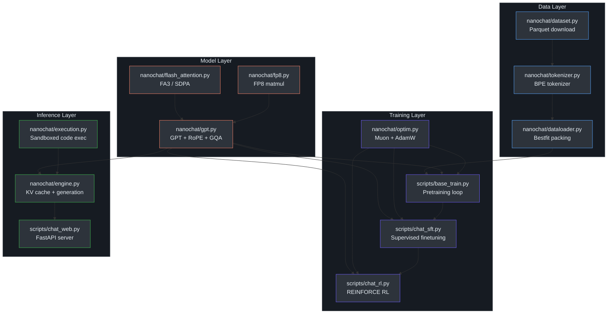

## Welcome to nanochat

**nanochat** is [Andrej Karpathy](https://github.com/karpathy)'s minimal full-stack ChatGPT clone — a single repository that takes you from raw text all the way to a working chat interface. Every stage of the LLM pipeline is implemented in clean, readable PyTorch with a single `--depth` dial that auto-configures all hyperparameters for compute-optimal training. A GPT-2 grade model can be trained from scratch for approximately **$72 in ~3 hours on 8×H100 GPUs**.

### Architecture Overview

The diagram below shows the end-to-end pipeline that nanochat implements:

### Key Module Map

