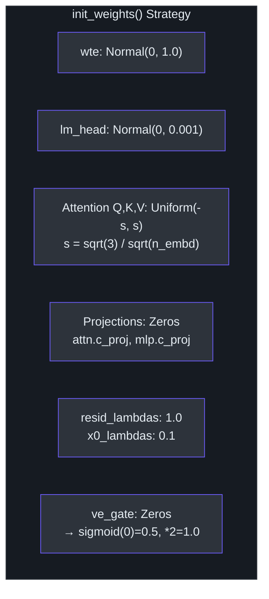

# Principal-Level Onboarding Guide

This document provides an architectural deep-dive into **nanochat** — Andrej Karpathy's minimal full-stack ChatGPT clone. It covers the model architecture, training pipeline, data pipeline, inference engine, and the key design decisions that shape the system. The goal is to give a senior engineer enough context to confidently navigate, extend, and reason about every component.

## High-Level Architecture

nanochat is organized into four top-level directories that form a clean separation between library code, entry points, evaluation tasks, and run configurations.

```mermaid
graph TD
    subgraph "Entry Points (scripts/)"
        BT[base_train.py]
        BE[base_eval.py]
        CS[chat_sft.py]
        CE[chat_eval.py]
        CR[chat_rl.py]
        CW[chat_web.py]
        CC[chat_cli.py]
        TT[tok_train.py]
        TE[tok_eval.py]
    end

    subgraph "Core Library (nanochat/)"
        GPT[gpt.py<br>GPT Model]
        ENG[engine.py<br>KV Cache Inference]
        OPT[optim.py<br>Muon + AdamW]
        DL[dataloader.py<br>BOS-Aligned Bestfit]
        DS[dataset.py<br>FineWeb-Edu Parquets]
        TOK[tokenizer.py<br>RustBPE + tiktoken]
        FA[flash_attention.py<br>FA3 / SDPA]
        FP8[fp8.py<br>FP8 Training]
        CM[checkpoint_manager.py]
        COM[common.py<br>DDP, Logging]
        CORE[core_eval.py<br>DCLM CORE]
        LOSS[loss_eval.py<br>Bits Per Byte]
    end

    subgraph "Eval Tasks (tasks/)"
        GSM[gsm8k.py]
        MMLU[mmlu.py]
        ARC[arc.py]
        HE[humaneval.py]
        SB[spellingbee.py]
        SM[smoltalk.py]
        TC[common.py<br>Task Base Class]
    end

    BT --> GPT & OPT & DL & DS & FA & FP8 & CM & COM
    CS --> GPT & OPT & TOK & CM & COM
    CE --> ENG & TOK & CM
    BE --> CORE & LOSS & ENG
    CC --> ENG & TOK
    CW --> ENG & TOK
    CR --> ENG & TOK
    CS --> TC & GSM & MMLU & SM & SB
    CE --> TC & GSM & MMLU & ARC & HE
    GPT --> FA & OPT & COM
    DL --> DS & TOK & COM
    ENG --> COM & CM
```



## GPT Model Architecture

The model is defined in [gpt.py](../nanochat/gpt.py) and implements a modern GPT variant with several post-GPT-2 innovations. The `GPTConfig` dataclass captures the full architecture specification.

### Rotary Position Embeddings (RoPE)

nanochat replaces learned absolute positional embeddings with **Rotary Position Embeddings** ([source](../nanochat/gpt.py), lines 51–57). The implementation splits each head dimension in half, computing sinusoidal frequencies across channel pairs and applying rotation in the forward pass via `apply_rotary_emb`. The base theta is 10,000, and frequencies are precomputed once at init time for `sequence_len * 10` positions — over-allocated to avoid runtime recomputation. RoPE provides relative position awareness without any learned parameters, and generalizes better to unseen sequence lengths.

### QK-Norm

After projecting queries and keys and applying RoPE, nanochat applies **RMS normalization** to both Q and K tensors ([source](../nanochat/gpt.py), line 94). This `norm(q), norm(k)` step stabilizes attention logit magnitudes, preventing the dot-product from growing unboundedly as embedding dimension increases. The `norm` function is a purely functional RMSNorm with no learnable parameters ([source](../nanochat/gpt.py), lines 42–44), which keeps the model lean.

### Group-Query Attention (GQA)

The attention module supports **Group-Query Attention** through separate `n_head` (query heads) and `n_kv_head` (key/value heads) parameters ([source](../nanochat/gpt.py), lines 33–34). When `n_kv_head < n_head`, multiple query heads share the same K/V pair, reducing KV cache memory and improving inference throughput. The Flash Attention integration handles GQA natively via its `enable_gqa` parameter.

### relu² MLP

The MLP uses `F.relu(x).square()` as its activation function ([source](../nanochat/gpt.py), lines 128–129), replacing the standard GELU. This "squared ReLU" activation has been shown to produce sparser activations — most neurons output exactly zero, and those that fire contribute quadratically. The hidden dimension is `4 * n_embd` with no bias terms, and both `c_fc` and `c_proj` use bias-free linear layers throughout.

### Value Embeddings (ResFormer-style)

Alternating layers include **value embeddings** — per-token learned vectors that are mixed into the value stream via an input-dependent gate ([source](../nanochat/gpt.py), lines 47–49, 86–89). The gate computes `2 * sigmoid(ve_gate(x[:ve_gate_channels]))` per head, producing a gating coefficient in range (0, 2). At initialization, gate weights are zero so `sigmoid(0) = 0.5`, scaled by 2 gives 1.0 — a neutral starting point. The `has_ve` function determines which layers get value embeddings based on alternating even/odd indices, with the last layer always included.

### Sliding Window Attention

The `window_pattern` config string (default `"SSSL"`) tiles a pattern of short (`S`) and long (`L`) attention windows across layers ([source](../nanochat/gpt.py), lines 260–287). Short windows attend to half the sequence length, while long windows attend to the full context. The final layer always gets full context regardless of the pattern. This saves compute in lower layers while preserving the model's ability to attend globally in upper layers. Window sizes are passed as `(left, right)` tuples to Flash Attention's `window_size` parameter.

### Logit Softcap

Before computing the loss, logits are squashed through `softcap * tanh(logits / softcap)` with `softcap = 15` ([source](../nanochat/gpt.py), lines 410–414). This smoothly caps logits to the range [-15, 15], preventing extreme confidence and improving training stability. The logits are cast to fp32 before this operation to avoid precision issues in bfloat16.

### Per-Layer Residual Scaling

Each layer applies learnable scalars to the residual stream ([source](../nanochat/gpt.py), lines 169–173, 403–404):

```python
x = self.resid_lambdas[i] * x + self.x0_lambdas[i] * x0
```

`resid_lambdas` (initialized to 1.0) controls the standard residual connection, while `x0_lambdas` (initialized to 0.1) blends back the initial normalized embedding. This is inspired by modded-nanogpt and provides the model with a skip connection directly from the input embedding to any layer.

### Weight Initialization

The `init_weights()` method ([source](../nanochat/gpt.py), lines 188–240) uses a deliberate scheme: token embeddings are normal with std=1.0, the lm_head is normal with std=0.001 (near-zero for stability), attention Q/K/V and MLP `c_fc` use uniform initialization with std = `1/sqrt(n_embd)`, and output projections (`c_proj`) are initialized to zero. Embeddings are cast to bf16 on CUDA to save memory since the optimizer can tolerate reduced precision for these parameters.



## Training Pipeline

### Optimizer Design: Muon + AdamW

The optimizer ([source](../nanochat/optim.py)) splits parameters into two groups based on their role:

| Parameter Group | Optimizer | Rationale |
|---|---|---|
| Transformer matrices (Q, K, V, projections, MLP) | **Muon** | Matrix-shaped params benefit from orthogonalization |
| Token embeddings (`wte`), value embeddings | **AdamW** | Embedding lookups are not matrices in the optimization sense |
| Unembedding head (`lm_head`) | **AdamW** | Same reasoning as embeddings |
| Per-layer scalars (`resid_lambdas`, `x0_lambdas`) | **AdamW** | 1D parameters; Muon requires 2D |

**Muon** (MomentUm Orthogonalized by Newton-schulz) applies Nesterov momentum followed by **Polar Express** orthogonalization (5 iterations) and **NorMuon variance reduction**. The entire Muon step — momentum, polar express, variance reduction, and cautious weight decay — is fused into a single `@torch.compile` kernel to eliminate Python overhead ([source](../nanochat/optim.py), lines 90–147). Parameters of the same shape are stacked into a single tensor for batched matrix operations.

The **distributed version** (`DistMuonAdamW`) uses a 3-phase async communication pattern: (1) launch all async reduce operations, (2) wait for reduces, compute updates, and launch gathers, (3) wait for gathers and copy back ([source](../nanochat/optim.py), lines 297–533). For Muon groups, params are stacked and sharded across ranks (ZeRO-2 style). For AdamW, small params use all-reduce while large params use reduce-scatter/all-gather with sharded optimizer state.

Learning rates are scaled by `∝ 1/√(d_model/768)` for AdamW parameters ([source](../nanochat/gpt.py), lines 361–363), making hyperparameters transferable across model sizes.

### FP8 Training

The [fp8.py](../nanochat/fp8.py) module provides a minimal (~150-line) FP8 training implementation as a drop-in replacement for torchao's Float8Linear (~2000 lines). It uses **tensorwise dynamic scaling** — one scalar scale per tensor — and replaces each `nn.Linear` with `Float8Linear` that quantizes operands to FP8 on the fly. The forward uses `float8_e4m3fn` (higher precision) for inputs and weights, while backward uses `float8_e5m2` (wider range) for gradients. The custom autograd function `_Float8Matmul` is marked `@allow_in_graph` so `torch.compile` treats it as an opaque node.

### Distributed Training Strategy

nanochat uses **torchrun** with NCCL backend for multi-GPU training. Rather than wrapping the model in DDP, the `DistMuonAdamW` optimizer handles all gradient communication directly. This gives fine-grained control over overlap between communication and computation. Gradient accumulation is configured automatically from `total_batch_size / (device_batch_size * max_seq_len * world_size)`.

## Data Pipeline

### FineWeb-Edu Dataset

The pretraining dataset is **FineWeb-Edu 100B** (shuffled), hosted as parquet files on HuggingFace ([source](../nanochat/dataset.py)). There are 1823 shards (`shard_00000.parquet` through `shard_01822.parquet`), each ~100MB compressed. The download system supports parallel workers, automatic retries with exponential backoff, and atomic writes via temp files. The last shard is reserved for validation. Data is stored in `~/.cache/nanochat/base_data/` by default (configurable via `NANOCHAT_BASE_DIR`).

### BOS-Aligned Bestfit Packing

The dataloader ([source](../nanochat/dataloader.py)) implements a **BOS-aligned best-fit** packing strategy:

1. Every row starts with a BOS token — no document ever begins mid-sequence.
2. Documents are buffered (default 1000), and for each row position the **largest fitting document** is selected from the buffer.
3. When no document fits the remaining space, the **shortest buffered document** is cropped to fill exactly.
4. This achieves 100% utilization (no padding) with ~35% of tokens cropped.

The trade-off versus naive concatenation: BOS-aligned packing ensures every token can attend back to a BOS boundary and sees full document context, at the cost of discarding ~35% of tokens due to cropping. Pre-allocated pinned CPU buffers and a single HtoD transfer per batch minimize data movement overhead.

For SFT, the packing strategy is modified: instead of cropping when no conversation fits, the row is **padded** (targets masked with -1), ensuring no supervised tokens are ever discarded ([source](../scripts/chat_sft.py), lines 127–233).

### Tokenizer

The tokenizer ([source](../nanochat/tokenizer.py)) uses **RustBPE** for training and **tiktoken** for efficient inference. It follows GPT-4's byte-level BPE pattern with a modified number regex (`\p{N}{1,2}` instead of `\p{N}{1,3}`) to avoid wasting token capacity on long numbers at smaller vocab sizes. The default vocab size is 32,768. Nine special tokens are defined for conversation structure:

```
<|bos|>, <|user_start|>, <|user_end|>, <|assistant_start|>, <|assistant_end|>,
<|python_start|>, <|python_end|>, <|output_start|>, <|output_end|>
```

The `render_conversation` method converts chat messages into token sequences with supervision masks, handling tool-call parts (python, python_output) via structured content lists.

## Inference Architecture

### KV Cache

The `KVCache` class ([source](../nanochat/engine.py), lines 83–132) pre-allocates key/value tensors in `(B, T, H, D)` layout matching FA3's native format. It tracks per-batch-element position via `cache_seqlens` (int32 tensor). The `prefill` method enables batch=1 prompt encoding followed by multi-sample generation by cloning the KV state. The cache advances position only after the last layer processes each token, coordinated through `layer_idx` checks.

### Tool Use State Machine

The `Engine.generate` method ([source](../nanochat/engine.py), lines 171–276) implements a per-row state machine for tool use during generation. Each `RowState` tracks:

- `in_python_block`: whether the model is currently outputting a calculator expression
- `python_expr_tokens`: accumulated tokens inside `<|python_start|>` ... `<|python_end|>`
- `forced_tokens`: a queue of tokens to force-inject (calculator results)

When the model emits `<|python_end|>`, the engine evaluates the expression via `use_calculator`, and if successful, force-injects `<|output_start|>`, result tokens, and `<|output_end|>` into the token stream. Generation terminates on `<|assistant_end|>` or BOS tokens. The calculator is sandboxed: math expressions are restricted to digits and basic operators (no `**`), and string operations only allow `.count()`. All evaluations are time-bounded (3 seconds) via `signal.SIGALRM`.

### Flash Attention Abstraction

The [flash_attention.py](../nanochat/flash_attention.py) module exports a unified `flash_attn` namespace that auto-detects FA3 availability (Hopper sm90 only) and falls back to PyTorch SDPA otherwise. Both training (`flash_attn_func`) and inference (`flash_attn_with_kvcache`) share the same API. The SDPA fallback handles sliding window attention by constructing explicit boolean masks when needed, and transposes between FA3's `(B, T, H, D)` and SDPA's `(B, H, T, D)` layouts transparently.

## Evaluation System

The evaluation framework uses a `Task` base class ([source](../tasks/common.py)) with two key properties: `eval_type` (generative or categorical) and lightweight slicing via `start/stop/step`. Tasks can be composed via `TaskMixture` (shuffled interleaving for SFT) or `TaskSequence` (curriculum ordering). The multiple choice rendering uses a deliberate format where the letter appears **after** the choice (`- choice=A`) to improve smaller model binding, and avoids whitespace before the letter to match the exact token IDs the model will generate.

Evaluation benchmarks include DCLM CORE (aggregate language understanding), bits-per-byte on train/val splits, GSM8K (math + tool use), MMLU (knowledge), ARC (science reasoning), HumanEval (code generation), and SpellingBee (character-level reasoning).

## Key Design Decisions and Trade-offs

1. **No DDP wrapper**: Instead of `DistributedDataParallel`, gradient communication lives inside the optimizer. This enables fine-grained overlap of communication and compute, and allows ZeRO-2-style optimizer state sharding.

2. **Untied embeddings**: The token embedding (`wte`) and lm_head are separate parameters, initialized differently (std 1.0 vs 0.001). This departs from weight-tying conventions but gives each layer independent capacity.

3. **No learnable RMSNorm**: The `norm` function has zero parameters — just `F.rms_norm(x, (x.size(-1),))`. This simplifies the model and reduces parameter count without measurable quality loss.

4. **Meta device initialization**: The `GPT.__init__` runs on meta device (shapes only, no data). All actual parameter initialization happens in `init_weights()`, called after the model is materialized on a real device ([source](../nanochat/gpt.py), lines 147–152). This is critical for large models where you don't want to allocate full-precision parameters on CPU before moving to GPU.

5. **Vocab padding**: The vocabulary is padded to the nearest multiple of 64 for tensor core alignment and DDP efficiency ([source](../nanochat/gpt.py), lines 159–162). Logits are sliced back to the real vocab size before loss computation.

6. **Minimal FP8**: The custom 150-line FP8 module avoids torchao's 2000-line tensor subclass machinery. The trade-off is losing cross-boundary fusion with `torch.compile`, but the matmul kernels are identical and the simpler code is faster to compile and easier to debug.

7. **BOS-aligned packing vs. concatenation**: Trading ~35% token waste for clean document boundaries. Every token can attend back to the start of its document, eliminating confusion from cross-document attention patterns during pretraining.
