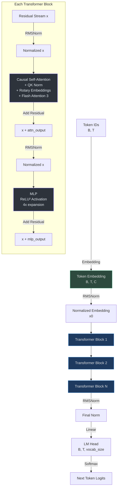
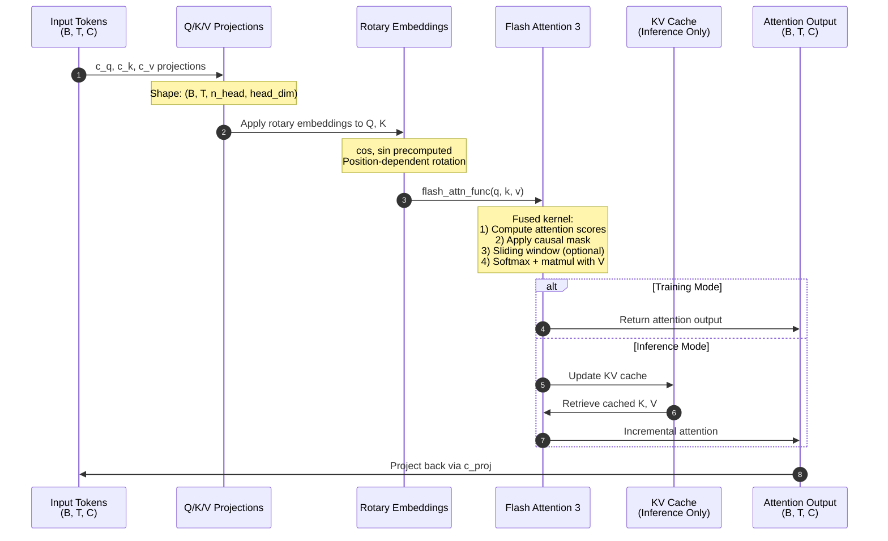
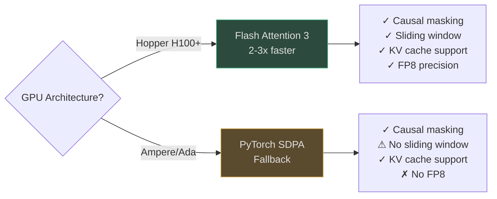
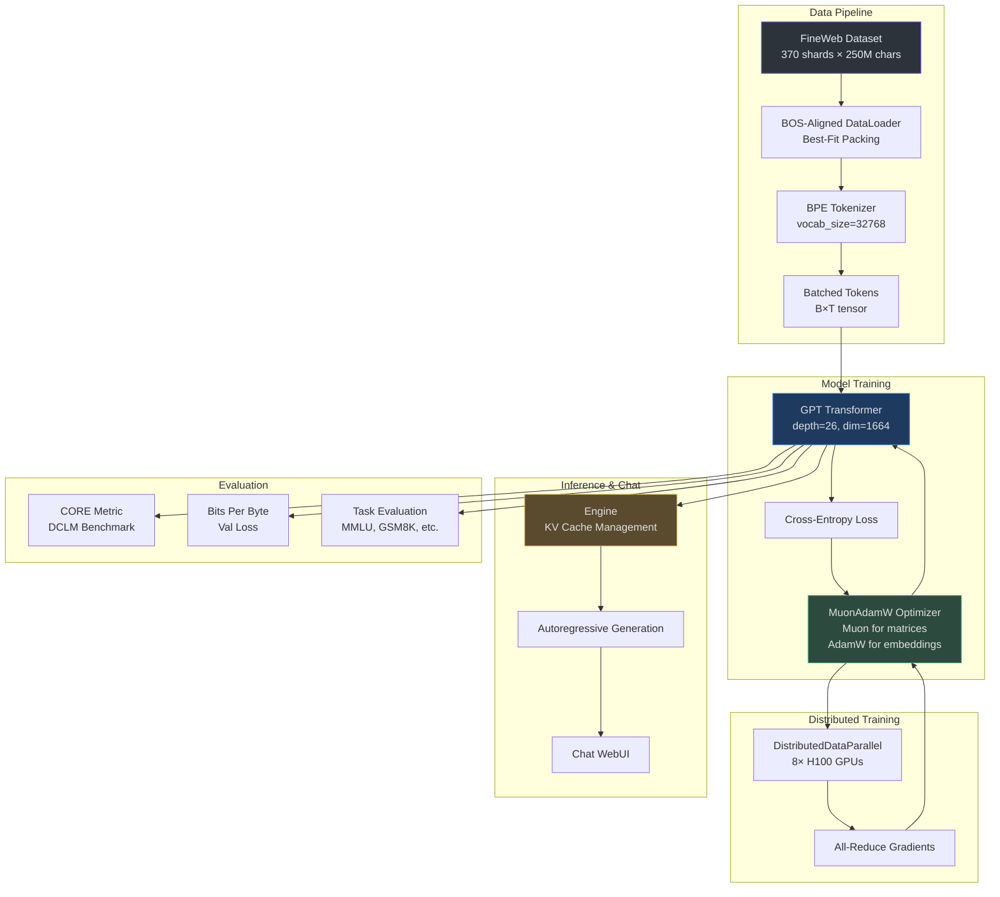
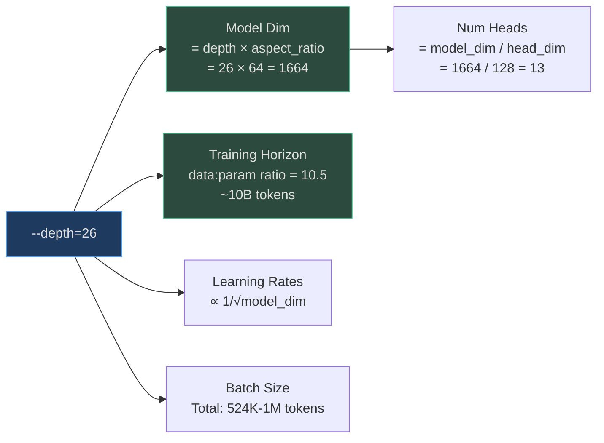
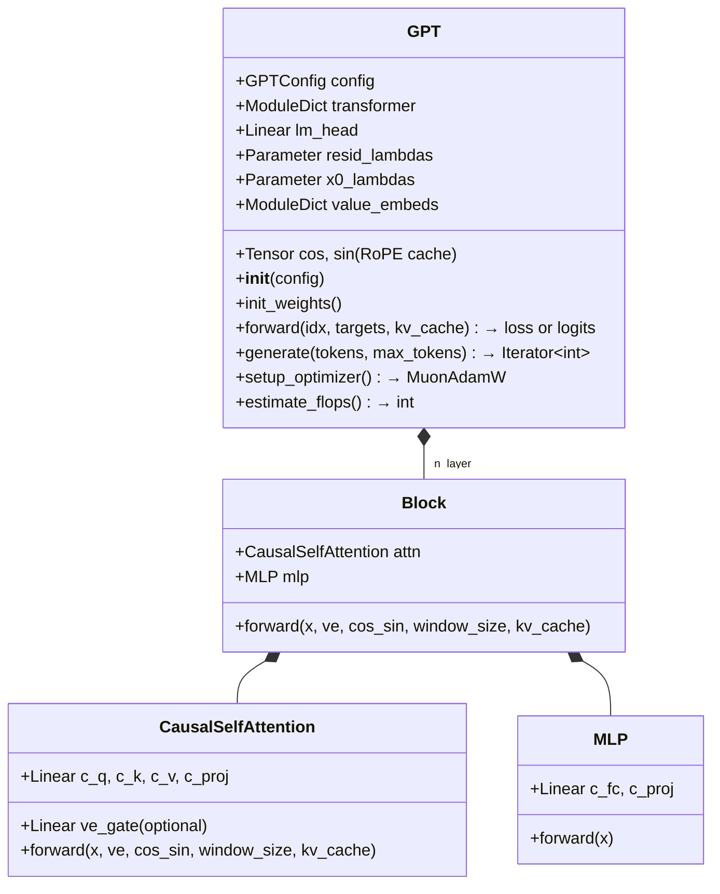
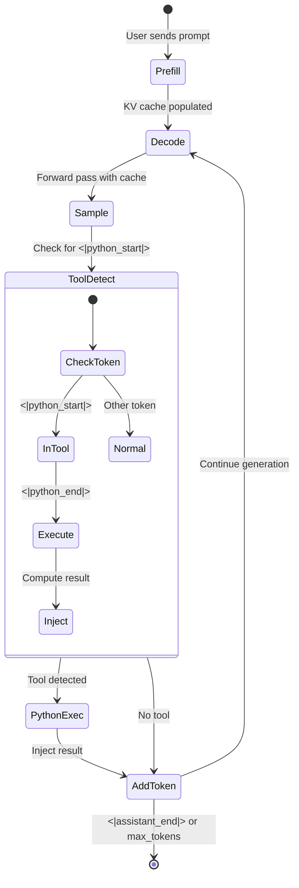
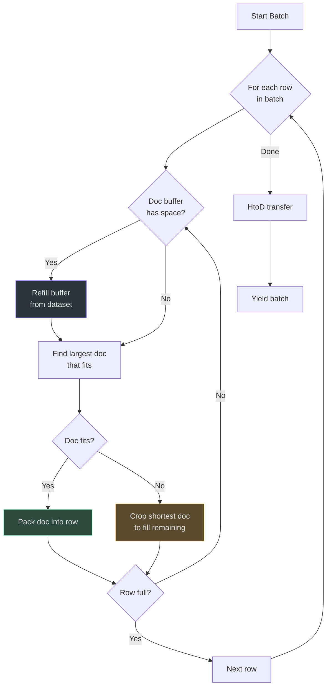
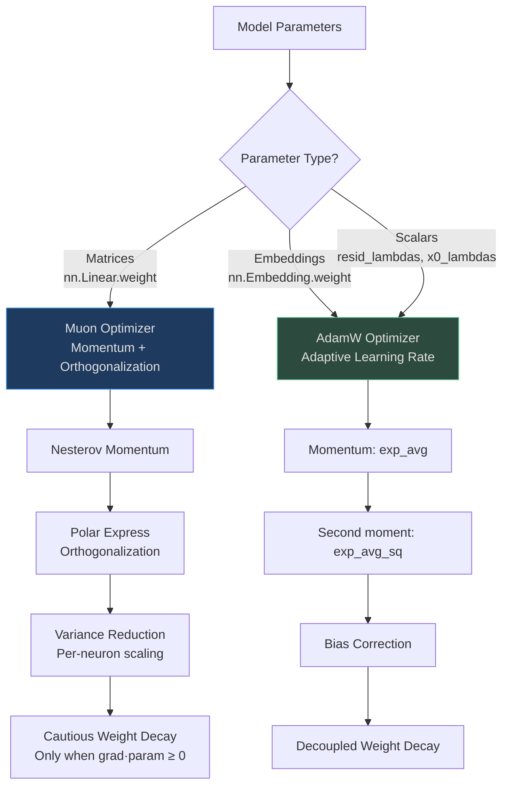
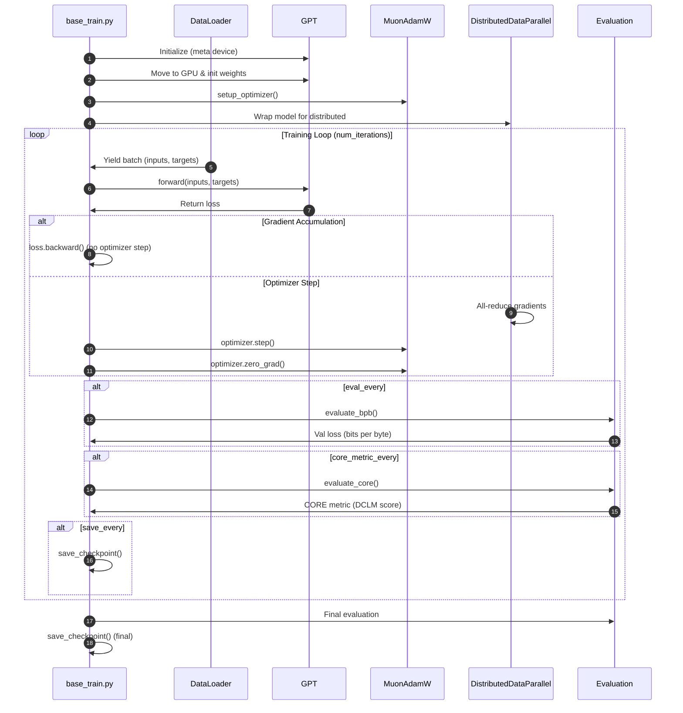

# Contributor Onboarding Guide

Welcome to **nanochat** — the simplest experimental harness for training LLMs from scratch. This guide will help you become productive in the codebase, whether you're contributing bug fixes, new features, or research improvements.

**Target Audience**: Contributors with Python and PyTorch proficiency looking to contribute to nanochat.

**Time to Complete**: 2-3 hours for initial read, 1-2 weeks to become fully productive.

---

## Table of Contents

[[toc]]

---

## Part I: PyTorch & LLM Foundations

### 1.1 Core Concepts Cross-Reference

If you're coming from another framework, here's how nanochat's PyTorch patterns map to equivalent concepts:

| Concept | PyTorch (nanochat) | TensorFlow/Keras | JAX/Flax | NumPy Equivalent |
|---------|-------------------|-----------------|---------|------------------|
| **Model Definition** | `nn.Module` subclass | `tf.keras.Model` | `nn.Module` (Flax) | Class with methods |
| **Forward Pass** | `def forward(self, x)` | `def call(self, x)` | `def __call__(self, x)` | Function composition |
| **Parameter Init** | `torch.nn.init.*` | `kernel_initializer=` | `nn.initializers.*` | Manual assignment |
| **Optimizer** | `optim.AdamW(params)` | `tf.keras.optimizers.AdamW` | `optax.adamw()` | Manual gradient descent |
| **Autocast (Mixed Precision)** | `torch.amp.autocast()` | `tf.keras.mixed_precision` | `jax.jit(donate_argnums)` | N/A |
| **Distributed Training** | `torch.distributed` (DDP) | `tf.distribute.Strategy` | `pmap` / `pjit` | N/A |
| **Attention Mechanism** | Flash Attention 3 | `tf.nn.scaled_dot_product_attention` | Custom implementation | Matrix multiplication |

**Key PyTorch Idioms in nanochat**:
- **In-place operations**: `tensor.add_()`, `tensor.mul_()` — saves memory, mutates tensor
- **Context managers**: `torch.no_grad()`, `torch.amp.autocast()` — control autograd and precision
- **Device management**: `.to(device)`, `.cuda()` — move tensors between CPU/GPU
- **Compiled graphs**: `@torch.compile` — JIT compiles functions for performance

---

### 1.2 The GPT Transformer Architecture

nanochat implements a **decoder-only Transformer** (GPT-style) with modern enhancements. Here's how it differs from the original "Attention Is All You Need" paper:



<!-- Sources: nanochat/gpt.py:1-455 -->

**Key Architectural Choices** ([nanochat/gpt.py:1-13](https://github.com/karpathy/nanochat/blob/master/nanochat/gpt.py#L1-L13)):

| Feature | nanochat Choice | GPT-2 (2019) | Why Different? |
|---------|----------------|--------------|----------------|
| **Position Encoding** | Rotary Embeddings (RoPE) | Learned absolute embeddings | RoPE generalizes to longer sequences, uses no learned params |
| **Normalization** | RMSNorm (no learnable params) | LayerNorm | Simpler, faster, works just as well |
| **Activation** | ReLU² (`F.relu(x).square()`) | GELU | Faster to compute, good inductive bias |
| **Attention** | Flash Attention 3 + QK Norm | Standard scaled dot-product | FA3 = 2-3x faster, QK Norm = training stability |
| **Embeddings** | Untied (separate wte, lm_head) | Tied weights | Allows different learning rates |
| **Bias Terms** | None (all Linear layers `bias=False`) | Biases everywhere | Reduces param count with no quality loss |
| **MLP Structure** | Pre-norm residual | Post-norm residual | Modern standard, better gradient flow |

---

### 1.3 Attention Mechanism Deep Dive



<!-- Sources: nanochat/gpt.py:59-118, nanochat/engine.py:83-133 -->

**Rotary Position Embeddings (RoPE)** ([nanochat/gpt.py:51-58](https://github.com/karpathy/nanochat/blob/master/nanochat/gpt.py#L51-L58)):

RoPE applies a rotation to query and key vectors based on their position. For position `t` and dimension pair `(d, d+1)`:

```
# Pseudocode (actual implementation in PyTorch)
freq = 1 / (10000 ^ (d / head_dim))
cos_t = cos(t * freq)
sin_t = sin(t * freq)

# Split vector into pairs and rotate
q_rotated = [q[d] * cos_t + q[d+1] * sin_t,
             q[d] * (-sin_t) + q[d+1] * cos_t]
```

**Why RoPE?** It encodes relative positions naturally: the dot product `q_i^T k_j` depends only on `(i - j)`, allowing the model to generalize to longer sequences than seen during training.

---

### 1.4 Flash Attention 3 Integration

nanochat uses **Flash Attention 3** (Hopper GPUs) with automatic fallback to PyTorch SDPA ([nanochat/flash_attention.py](https://github.com/karpathy/nanochat/blob/master/nanochat/flash_attention.py)):



<!-- Sources: nanochat/flash_attention.py:1-100 -->

**Key Performance Benefits**:
- **Memory Efficiency**: O(N) memory instead of O(N²) for attention matrix
- **Speed**: Fused kernel eliminates memory transfers between HBM and SRAM
- **Sliding Window**: Limits attention to recent `window_size` tokens for efficiency

**Usage Pattern** ([nanochat/gpt.py:96-113](https://github.com/karpathy/nanochat/blob/master/nanochat/gpt.py#L96-L113)):

```python
# Training: causal attention with optional sliding window
y = flash_attn.flash_attn_func(q, k, v, causal=True, window_size=(1024, 0))

# Inference: use KV cache for autoregressive generation
y = flash_attn.flash_attn_with_kvcache(
    q, k_cache, v_cache,
    k=k, v=v,
    cache_seqlens=kv_cache.cache_seqlens,
    causal=True,
)
```

---

## Part II: nanochat's Architecture & Domain Model

### 2.1 System Architecture Overview



<!-- Sources: README.md:96-149, nanochat/gpt.py:146-455, nanochat/engine.py:164-300, nanochat/dataloader.py:1-166 -->

---

### 2.2 The Single Dial Philosophy: `--depth`

**The Core Innovation**: nanochat exposes **one dial** — `--depth` (number of transformer layers) — that auto-configures all other hyperparameters for compute-optimal training ([scripts/base_train.py:49](https://github.com/karpathy/nanochat/blob/master/scripts/base_train.py#L49)).



<!-- Sources: scripts/base_train.py:125-139 -->

**Compute-Optimal Scaling** ([scripts/base_train.py:125-139](https://github.com/karpathy/nanochat/blob/master/scripts/base_train.py#L125-L139)):

| Depth | Params | Model Dim | Heads | Training Tokens | FLOPs | Wall Time (8×H100) | Cost |
|-------|--------|-----------|-------|----------------|-------|-------------------|------|
| 12 (GPT-1) | ~117M | 768 | 6 | 1.2B | 1.4e18 | ~5 min | ~$2 |
| 20 | ~320M | 1280 | 10 | 3.4B | 6.5e18 | ~15 min | ~$6 |
| 26 (GPT-2) | ~540M | 1664 | 13 | 5.7B | 1.8e19 | ~2.8 hrs | ~$72 |

The `--depth` dial works because:
1. **Model architecture scales predictably**: width ∝ depth, heads ∝ width
2. **Chinchilla scaling laws**: optimal tokens ∝ params (nanochat uses ratio ~10.5)
3. **Learning rate scaling**: LR ∝ 1/√model_dim prevents instability in deeper models

**Why This Matters**: Contributors can experiment at **d=12** (~5 min training) and have confidence the changes will transfer to **d=26** (GPT-2 capability).

---

### 2.3 Domain Model: Key Classes

#### **GPT** ([nanochat/gpt.py:146-455](https://github.com/karpathy/nanochat/blob/master/nanochat/gpt.py#L146-L455))



<!-- Sources: nanochat/gpt.py:146-455 -->

**Key Methods**:
- `init_weights()` — Custom initialization: embeddings N(0, 1), matrices Uniform, projections zeros
- `forward()` — Training (returns loss) or inference (returns logits)
- `setup_optimizer()` — Creates MuonAdamW with parameter groups (matrices → Muon, embeddings → AdamW)
- `estimate_flops()` — Computes FLOPs per token for MFU calculation

---

#### **Engine** ([nanochat/engine.py:164-300](https://github.com/karpathy/nanochat/blob/master/nanochat/engine.py#L164-L300))

Efficient autoregressive inference with KV caching and tool use.



<!-- Sources: nanochat/engine.py:164-300 -->

**Key Features** ([nanochat/engine.py:164-300](https://github.com/karpathy/nanochat/blob/master/nanochat/engine.py#L164-L300)):
- **KV Cache**: Stores past key/value tensors to avoid recomputation
- **Batch Prefill**: Computes KV cache once, then clones for multiple samples
- **Tool Use**: Detects `<|python_start|>...<|python_end|>` and executes calculator
- **Forced Tokens**: Queue of tokens to inject (e.g., tool results)

---

#### **DataLoader** ([nanochat/dataloader.py:73-166](https://github.com/karpathy/nanochat/blob/master/nanochat/dataloader.py#L73-L166))

BOS-aligned dataloader with best-fit packing.



<!-- Sources: nanochat/dataloader.py:73-166 -->

**Best-Fit Packing Algorithm** ([nanochat/dataloader.py:130-150](https://github.com/karpathy/nanochat/blob/master/nanochat/dataloader.py#L130-L150)):
1. Each row starts with BOS token
2. From buffer, pick **largest** doc that fits entirely in remaining space
3. Repeat until no doc fits
4. Crop a document to fill remaining space exactly (100% utilization, no padding)

**Why Best-Fit?** Compared to greedy packing, best-fit reduces token waste from ~40% to ~35% by being smarter about which documents to pack ([nanochat/dataloader.py:1-17](https://github.com/karpathy/nanochat/blob/master/nanochat/dataloader.py#L1-L17)).

---

#### **MuonAdamW Optimizer** ([nanochat/optim.py:1-150](https://github.com/karpathy/nanochat/blob/master/nanochat/optim.py#L1-L150))

Hybrid optimizer combining **Muon** (for weight matrices) and **AdamW** (for embeddings/scalars).



<!-- Sources: nanochat/optim.py:52-147 -->

**Why Muon for Matrices?** ([nanochat/optim.py:52-78](https://github.com/karpathy/nanochat/blob/master/nanochat/optim.py#L52-L78)):
- **Polar Express**: Iterative method to orthogonalize gradient updates → better convergence
- **Variance Reduction**: Normalizes update scales across neurons → uniform learning
- **Cautious Weight Decay**: Only decays weights when gradient agrees with parameter sign → prevents oscillation

**Parameter Grouping** ([nanochat/gpt.py:348-386](https://github.com/karpathy/nanochat/blob/master/nanochat/gpt.py#L348-L386)):

| Group | Parameters | Optimizer | Learning Rate | Weight Decay |
|-------|-----------|-----------|---------------|--------------|
| **Matrices** | `c_q`, `c_k`, `c_v`, `c_proj`, `c_fc` | Muon | 0.02 × 1/√(dim/768) | 0.2 |
| **Embeddings** | `wte`, `value_embeds` | AdamW | 0.3 × 1/√(dim/768) | 0.0 |
| **Unembedding** | `lm_head` | AdamW | 0.004 × 1/√(dim/768) | 0.0 |
| **Scalars** | `resid_lambdas` | AdamW | 0.005 | 0.0 |
| **Scalars** | `x0_lambdas` | AdamW | 0.5 | 0.0 |

---

### 2.4 Training Pipeline Flow



<!-- Sources: scripts/base_train.py:200-455 -->

---

### 2.5 Key File Reference

| File | Purpose | Key Functions/Classes | Lines |
|------|---------|----------------------|-------|
| [nanochat/gpt.py](https://github.com/karpathy/nanochat/blob/master/nanochat/gpt.py) | GPT model definition | `GPT`, `Block`, `CausalSelfAttention`, `MLP` | 455 |
| [nanochat/engine.py](https://github.com/karpathy/nanochat/blob/master/nanochat/engine.py) | Inference engine | `Engine.generate()`, `KVCache` | 357 |
| [nanochat/dataloader.py](https://github.com/karpathy/nanochat/blob/master/nanochat/dataloader.py) | Data loading | `tokenizing_distributed_data_loader_bos_bestfit()` | 166 |
| [nanochat/optim.py](https://github.com/karpathy/nanochat/blob/master/nanochat/optim.py) | Optimizer | `MuonAdamW`, `DistMuonAdamW` | 450+ |
| [scripts/base_train.py](https://github.com/karpathy/nanochat/blob/master/scripts/base_train.py) | Pretraining script | Training loop, evaluation | 600+ |
| [scripts/chat_sft.py](https://github.com/karpathy/nanochat/blob/master/scripts/chat_sft.py) | SFT script | Supervised fine-tuning | 400+ |
| [tasks/common.py](https://github.com/karpathy/nanochat/blob/master/tasks/common.py) | Task abstraction | `Task`, `TaskMixture` | 100 |

---

## Part III: Getting Productive

### 3.1 Development Setup

#### **Prerequisites**
- Python 3.10+
- CUDA 11.8+ (for GPU training) or CPU/MPS (for small experiments)
- 16GB+ RAM (32GB+ recommended)
- For GPU: 24GB+ VRAM (80GB H100 for full speedrun)

#### **Installation**

```bash
# Clone the repository
git clone https://github.com/karpathy/nanochat.git
cd nanochat

# Install uv (fast package manager)
curl -LsSf https://astral.sh/uv/install.sh | sh

# Create virtual environment
uv venv

# Install dependencies
uv sync --extra gpu  # for GPU
# OR
uv sync  # for CPU only

# Activate environment
source .venv/bin/activate
```

([runs/speedrun.sh:19-28](https://github.com/karpathy/nanochat/blob/master/runs/speedrun.sh#L19-L28))

---

### 3.2 Running Your First Training

**Quick d=12 Test Run** (5 minutes on 8×H100):

```bash
OMP_NUM_THREADS=1 torchrun --standalone --nproc_per_node=8 -m scripts.base_train -- \
    --depth=12 \
    --run="d12_test" \
    --core-metric-every=999999 \
    --sample-every=-1 \
    --save-every=-1
```

**Monitor Progress**:
- Watch terminal output for `train/tok_per_sec`, `train/mfu` (Model FLOPs Utilization)
- Check wandb dashboard for `val_bpb` (validation loss)

**On CPU** (for development):

```bash
python -m scripts.base_train \
    --depth=4 \
    --max-seq-len=512 \
    --device-batch-size=1 \
    --total-batch-size=512 \
    --num-iterations=20 \
    --eval-tokens=512 \
    --core-metric-every=-1
```

([runs/runcpu.sh](https://github.com/karpathy/nanochat/blob/master/runs/runcpu.sh))

---

### 3.3 Understanding the Codebase

#### **Directory Structure** ([README.md:96-149](https://github.com/karpathy/nanochat/blob/master/README.md#L96-L149))

```
nanochat/
├── nanochat/              # Core library
│   ├── gpt.py            # GPT model
│   ├── engine.py         # Inference engine
│   ├── dataloader.py     # Data loading
│   ├── optim.py          # MuonAdamW optimizer
│   ├── tokenizer.py      # BPE tokenizer
│   ├── core_eval.py      # CORE metric evaluation
│   └── checkpoint_manager.py
├── scripts/               # Executable scripts
│   ├── base_train.py     # Pretraining
│   ├── base_eval.py      # Base model evaluation
│   ├── chat_sft.py       # Supervised fine-tuning
│   ├── chat_eval.py      # Chat model evaluation
│   └── chat_web.py       # Web UI
├── tasks/                 # Evaluation tasks
│   ├── mmlu.py
│   ├── gsm8k.py
│   └── smoltalk.py
├── runs/                  # Shell scripts for common workflows
│   ├── speedrun.sh       # Full GPT-2 training pipeline
│   └── miniseries.sh     # Sweep multiple depths
└── tests/                 # Unit tests
```

---

### 3.4 Testing & Validation

#### **Run Tests**

```bash
# All tests
pytest tests/

# Specific test
pytest tests/test_engine.py
```

([tests/test_engine.py](https://github.com/karpathy/nanochat/blob/master/tests/test_engine.py))

#### **Validate Changes**

When making changes, ensure:
1. **Correctness**: Test on d=12 (~5 min) before scaling to d=26
2. **Generalization**: Changes should work across all depths
3. **Performance**: Monitor MFU, throughput, VRAM usage
4. **Backwards Compatibility**: Don't break existing checkpoints

**Validation Checklist**:
```bash
# 1. Quick d=12 run
torchrun --standalone --nproc_per_node=8 -m scripts.base_train -- --depth=12 --num-iterations=100

# 2. Check val_bpb improved
# Compare against baseline in wandb

# 3. Verify CORE metric (if changing architecture)
torchrun --standalone --nproc_per_node=8 -m scripts.base_eval -- --device-batch-size=16

# 4. Test inference
python -m scripts.chat_cli -p "Hello world"
```

---

### 3.5 Contributing Workflow

#### **Contribution Types**

| Type | Description | Example |
|------|-------------|---------|
| **Speedup** | Improve training throughput | Optimize dataloader, better kernel fusion |
| **Quality** | Improve CORE metric at same FLOPs | Better initialization, attention variants |
| **Feature** | New capability | Add new task, tool, UI feature |
| **Bug Fix** | Fix incorrect behavior | Memory leak, NaN loss, wrong computation |

#### **Pull Request Process**

1. **Fork & Branch**
   ```bash
   git checkout -b feature/your-feature-name
   ```

2. **Develop & Test**
   - Run tests locally
   - Test on d=12 (quick validation)
   - Document changes in PR description

3. **Benchmark** (for speedups/quality improvements)
   ```bash
   # Run d=12 for both baseline and your change
   # Compare: val_bpb, train/tok_per_sec, train/mfu
   ```

4. **Submit PR**
   - Clear title: "Improve dataloader throughput by 15%"
   - Description includes:
     - **What**: What does this change?
     - **Why**: Why is it better?
     - **Results**: Quantitative comparison (val_bpb, throughput, etc.)
     - **AI Disclosure**: Which parts (if any) had LLM contribution?

5. **Address Reviews**
   - Be responsive to feedback
   - Keep PRs focused (one change per PR)

([README.md:151-156](https://github.com/karpathy/nanochat/blob/master/README.md#L151-L156))

---

### 3.6 Common Pitfalls & Debugging

#### **Out of Memory (OOM)**

**Symptom**: `RuntimeError: CUDA out of memory`

**Solutions**:
1. Reduce `--device-batch-size` (32 → 16 → 8 → 4)
2. Reduce `--max-seq-len` (2048 → 1024)
3. Use gradient checkpointing (not implemented yet)
4. Use `--fp8` for FP8 training (H100 only)

```bash
# Example for 24GB GPU
torchrun --standalone --nproc_per_node=1 -m scripts.base_train -- \
    --depth=12 \
    --device-batch-size=4 \
    --max-seq-len=1024
```

---

#### **NaN Loss**

**Symptom**: Loss becomes `nan` during training

**Causes & Fixes**:
1. **Learning rate too high**: Reduce `--matrix-lr`, `--embedding-lr`
2. **Mixed precision instability**: Check autocast is enabled
3. **Gradient clipping**: Not implemented, but might be needed for very deep models
4. **Bad initialization**: Verify `init_weights()` is called

**Debug Steps**:
```python
# Add to training loop
if torch.isnan(loss):
    print(f"NaN loss at step {step}")
    print(f"Max gradient: {max(p.grad.abs().max() for p in model.parameters() if p.grad is not None)}")
    break
```

---

#### **Slow Throughput**

**Symptom**: `train/tok_per_sec` is low, `train/mfu` < 0.3

**Diagnose**:
1. **CPU bottleneck**: Check if dataloader is slow
   ```python
   # Profile dataloader
   import time
   t0 = time.time()
   batch = next(dataloader)
   print(f"Dataloader time: {time.time() - t0:.3f}s")
   ```

2. **GPU underutilization**: Check `nvidia-smi` for GPU util %
3. **Small batch size**: Increase `--device-batch-size` if VRAM allows
4. **DDP overhead**: Ensure `OMP_NUM_THREADS=1` is set

**Optimizations**:
- Use `torch.compile()` (already enabled)
- Use Flash Attention 3 (requires H100)
- Use `--fp8` for FP8 training (2-3x speedup)

([scripts/base_train.py:104-113](https://github.com/karpathy/nanochat/blob/master/scripts/base_train.py#L104-L113))

---

#### **Checkpoint Not Loading**

**Symptom**: `RuntimeError: state_dict keys mismatch`

**Causes**:
1. Model architecture changed (e.g., `n_layer`, `n_embd`)
2. Checkpoint from different phase (`base` vs `sft`)
3. Checkpoint corrupted or incomplete

**Solutions**:
```python
# Flexible loading (ignore mismatches)
model.load_state_dict(checkpoint, strict=False)

# Inspect checkpoint
checkpoint = torch.load("path/to/checkpoint.pt")
print(checkpoint.keys())
```

---

### 3.7 Advanced Topics

#### **FP8 Training** ([scripts/base_train.py:161-186](https://github.com/karpathy/nanochat/blob/master/scripts/base_train.py#L161-L186))

Enable FP8 on H100 GPUs for 2-3x speedup:

```bash
torchrun --standalone --nproc_per_node=8 -m scripts.base_train -- \
    --depth=26 \
    --fp8 \
    --fp8-recipe=tensorwise
```

**How it works**:
- Converts `nn.Linear` layers to `Float8Linear`
- Uses 8-bit floating point for activations and weights during forward/backward
- Requires dims divisible by 16 (hardware constraint)
- Falls back to BF16 for evaluation

---

#### **Custom Tasks**

Add a new evaluation task:

```python
# tasks/mytask.py
from tasks.common import Task

class MyTask(Task):
    @property
    def eval_type(self):
        return 'generative'  # or 'categorical'
    
    def num_examples(self):
        return len(self.dataset)
    
    def get_example(self, index):
        # Return conversation dict with 'messages' list
        return {
            'messages': [
                {'role': 'user', 'content': 'Question?'},
                {'role': 'assistant', 'content': 'Answer.'}
            ]
        }
    
    def evaluate(self, problem, completion):
        # Return score (0-1)
        return 1.0 if completion.strip() == problem['answer'] else 0.0
```

Add to `TaskMixture` in `scripts/chat_sft.py` or `scripts/chat_eval.py`.

([tasks/common.py:10-52](https://github.com/karpathy/nanochat/blob/master/tasks/common.py#L10-L52))

---

#### **Custom Optimizer Schedules**

Modify learning rate schedule in `scripts/base_train.py`:

```python
# Cosine schedule with warmup (already implemented)
def get_lr(step, num_iterations, warmup_ratio=0.0, warmdown_ratio=0.5):
    warmup_steps = int(warmup_ratio * num_iterations)
    warmdown_steps = int(warmdown_ratio * num_iterations)
    
    if step < warmup_steps:
        return step / warmup_steps  # Linear warmup
    elif step > num_iterations - warmdown_steps:
        progress = (num_iterations - step) / warmdown_steps
        return 0.5 * (1 + math.cos(math.pi * (1 - progress)))  # Cosine
    else:
        return 1.0
```

---

## Glossary

| Term | Definition |
|------|------------|
| **BPE** | Byte Pair Encoding — subword tokenization algorithm |
| **BPB** | Bits Per Byte — vocab-size-invariant measure of loss |
| **CORE** | DCLM benchmark metric (aggregate of 53 tasks) |
| **DDP** | DistributedDataParallel — PyTorch's data parallelism |
| **FA3** | Flash Attention 3 — fused attention kernel for Hopper GPUs |
| **FP8** | 8-bit floating point precision (E4M3 or E5M2) |
| **GQA** | Grouped-Query Attention — shares K/V heads across query heads |
| **KV Cache** | Cached key/value tensors for efficient autoregressive generation |
| **MFU** | Model FLOPs Utilization — fraction of theoretical peak FLOPs achieved |
| **Muon** | Momentum + Orthogonalization optimizer for weight matrices |
| **RMSNorm** | Root Mean Square Normalization (no learnable params) |
| **RoPE** | Rotary Position Embeddings — relative position encoding |
| **SFT** | Supervised Fine-Tuning — training on conversational data |
| **Sliding Window** | Attention limited to recent N tokens (not full context) |

---

## Appendix A: Architecture Diagram (Detailed)

```mermaid
graph TB
    subgraph Input["Input Processing"]
        Tokens[Token IDs<br/>B×T] --> Emb[Token Embedding<br/>wte: vocab_size → n_embd]
        Emb --> Norm0[RMSNorm<br/>No learnable params]
    end
    
    subgraph Layers["Transformer Layers (×n_layer)"]
        Norm0 --> L1[Layer 1]
        L1 --> L2[Layer 2]
        L2 --> Ln[Layer n_layer]
        
        subgraph Layer["Each Layer"]
            X[Residual x] --> Scale1[resid_lambda × x]
            Scale1 --> X0Add[+ x0_lambda × x0]
            X0Add --> AttnNorm[RMSNorm]
            AttnNorm --> Attn[Attention]
            
            subgraph Attention["CausalSelfAttention"]
                Q[Q = c_q·x] --> RoPEQ[Apply RoPE]
                K[K = c_k·x] --> RoPEK[Apply RoPE]
                V[V = c_v·x] --> VE[+ Value Embed]
                RoPEQ --> QKNorm[QK Norm]
                RoPEK --> QKNorm
                VE --> VE2[V with gate]
                QKNorm --> FA[Flash Attention 3]
                VE2 --> FA
                FA --> Proj[c_proj]
            end
            
            Proj --> Res1[+ Residual]
            Res1 --> MLPNorm[RMSNorm]
            MLPNorm --> MLP
            
            subgraph MLP
                FC[c_fc: n_embd → 4×n_embd] --> ReLU[ReLU²]
                ReLU --> Proj2[c_proj: 4×n_embd → n_embd]
            end
            
            Proj2 --> Res2[+ Residual]
        end
    end
    
    subgraph Output["Output Processing"]
        Ln --> NormFinal[RMSNorm]
        NormFinal --> LMHead[lm_head: n_embd → vocab_size]
        LMHead --> Softcap[Softcap<br/>tanh(logits/15)×15]
        Softcap --> Loss{Training?}
        Loss -->|Yes| CE[Cross-Entropy Loss]
        Loss -->|No| Logits[Return Logits]
    end
    
    style Emb fill:#2d333b,stroke:#6d5dfc,color:#e6edf3
    style Attn fill:#1e3a5f,stroke:#4a9eed,color:#e0e0e0
    style MLP fill:#2d4a3e,stroke:#4aba8a,color:#e0e0e0
    style FA fill:#5a4a2e,stroke:#d4a84b,color:#e0e0e0
```

<!-- Sources: nanochat/gpt.py:146-424 -->

---

## Appendix B: Comparison with Other Frameworks

| Feature | nanochat | nanoGPT | modded-nanoGPT | llm.c |
|---------|----------|---------|----------------|-------|
| **Language** | Python + PyTorch | Python + PyTorch | Python + PyTorch | C + CUDA |
| **Scope** | Pretrain + SFT + RL + Chat | Pretraining only | Pretraining only | Pretraining only |
| **Optimizer** | MuonAdamW | AdamW | Muon | AdamW |
| **Attention** | Flash Attention 3 | PyTorch SDPA | Flash Attention 2 | Custom CUDA |
| **Tokenizer** | BPE (GPT-4 style) | GPT-2 tokenizer | GPT-2 tokenizer | Custom |
| **FP8 Support** | Yes (H100) | No | No | No |
| **Evaluation** | CORE, BPB, tasks | Loss only | Loss only | Loss only |
| **Leaderboard** | Yes | No | Yes | Yes |
| **Chat UI** | Yes | No | No | No |
| **Lines of Code** | ~3000 | ~400 | ~800 | ~5000 |

---

## Appendix C: Further Reading

### **Official Resources**
- [GitHub Discussions](https://github.com/karpathy/nanochat/discussions) — Q&A, guides, announcements
- [DeepWiki](https://deepwiki.com/karpathy/nanochat) — AI-powered codebase Q&A
- [Discord #nanochat](https://discord.com/channels/1020383067459821711/1427295580895314031) — Community chat

### **Papers & References**
- [Attention Is All You Need](https://arxiv.org/abs/1706.03762) — Original Transformer
- [Chinchilla Scaling Laws](https://arxiv.org/abs/2203.15556) — Optimal compute allocation
- [Flash Attention](https://arxiv.org/abs/2205.14135) — Fast attention algorithm
- [RoFormer](https://arxiv.org/abs/2104.09864) — Rotary Position Embeddings
- [DCLM Paper](https://arxiv.org/abs/2406.11794) — CORE metric definition
- [Muon Optimizer](https://github.com/KellerJordan/modded-nanogpt) — modded-nanoGPT inspiration

### **Guides**
- [Beating GPT-2 for <<$100](https://github.com/karpathy/nanochat/discussions/481) — nanochat journey
- [Adding Abilities](https://github.com/karpathy/nanochat/discussions/164) — Extend model capabilities
- [Infusing Identity](https://github.com/karpathy/nanochat/discussions/139) — Synthetic data for personality

---

## Summary

You now have:
1. ✅ **Foundations**: PyTorch patterns, GPT architecture, attention mechanisms
2. ✅ **Architecture**: Key classes (GPT, Engine, DataLoader, MuonAdamW), domain model
3. ✅ **Productivity**: Setup, testing, debugging, contribution workflow

**Next Steps**:
1. Run a d=12 training locally (~5 min)
2. Read through `nanochat/gpt.py` line by line
3. Pick a GitHub issue and submit your first PR
4. Join Discord and ask questions!

**Remember**: nanochat is designed around the single `--depth` dial. Changes should be **principled** (work for all depths), **measurable** (improve val_bpb or throughput), and **simple** (no unnecessary abstraction).

Happy contributing! 🚀
