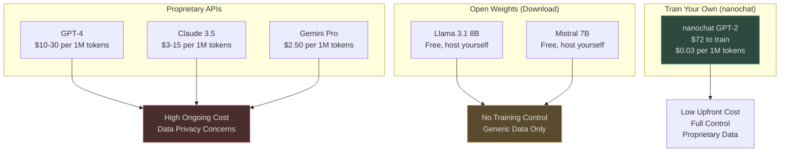
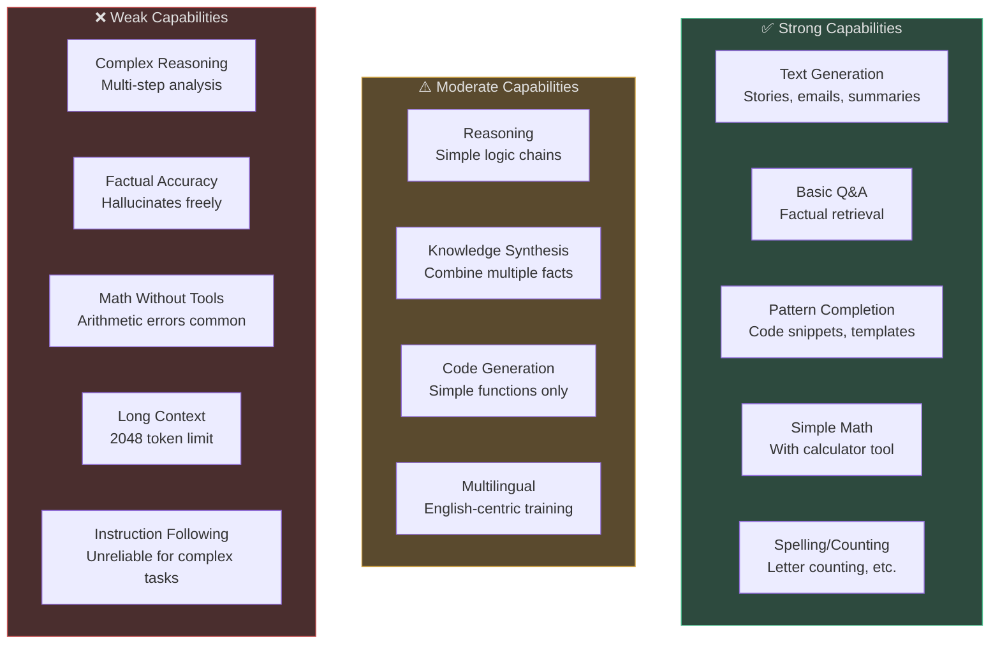
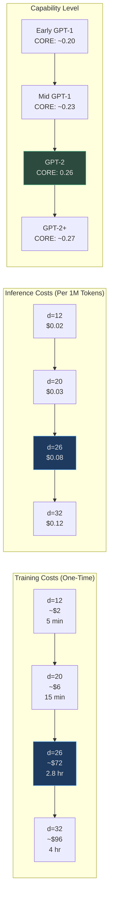
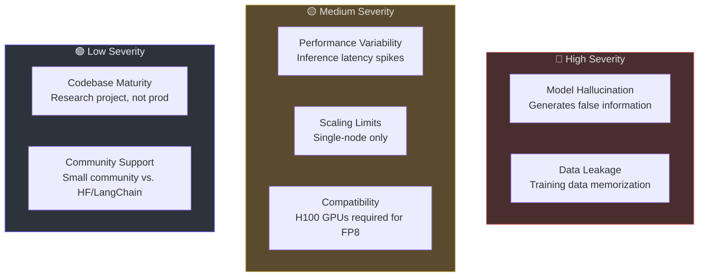
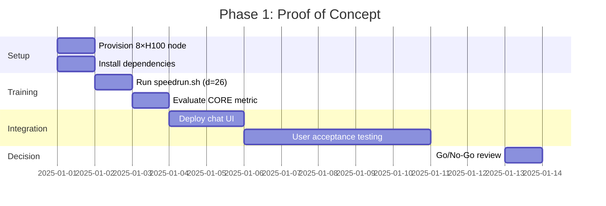
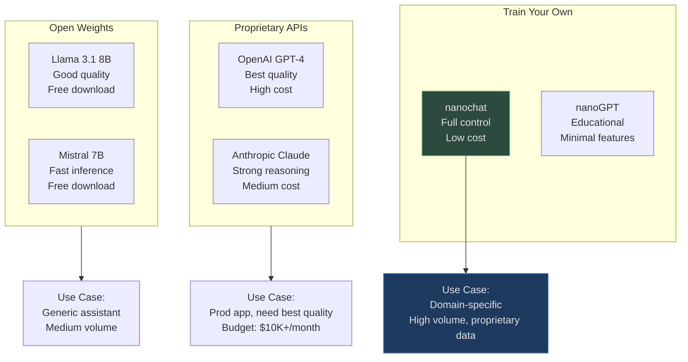
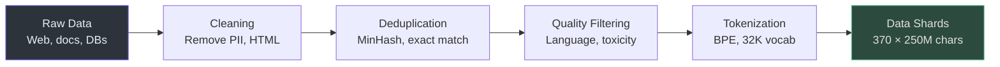

# Executive Onboarding: nanochat

**Target Audience**: VP Engineering, Director of AI/ML, C-level executives evaluating LLM strategy.

**Reading Time**: 15-20 minutes.

---

## Executive Summary

**nanochat** enables organizations to train GPT-2 grade language models for **$72 in 2.8 hours** (vs. $43,000 in 168 hours in 2019) — a **600× cost reduction** through modern algorithms, hardware, and engineering.

### Key Results

| Metric | nanochat (2025) | OpenAI GPT-2 (2019) | Improvement |
|--------|----------------|---------------------|-------------|
| **Wall-Clock Time** | 2.8 hours | 168 hours | **60× faster** |
| **Total Cost** | $72 (on-demand) $29 (spot) | $43,000 | **600-1500× cheaper** |
| **Capability** | CORE: 0.2602 | CORE: 0.2565 | **Matches GPT-2** |
| **Hardware** | 8×H100 GPU node | TPU v3 pod | Commodity cloud |

### Strategic Value Proposition

1. **Cost Efficiency**: Custom LLM training accessible at <$100 budget
2. **Iteration Speed**: Experiment in 5 minutes (small models), deploy in 3 hours (GPT-2 grade)
3. **Data Control**: Train on proprietary data without third-party APIs
4. **Transparency**: Fully open-source, reproducible, no vendor lock-in
5. **Educational ROI**: Engineering team gains deep LLM expertise

---

## Table of Contents

[[toc]]

---

## Business Context

### The LLM Landscape (2025)

<!-- Sources: README.md:1-23 -->

### Market Positioning

| Approach | Upfront Cost | Ongoing Cost (per 1M tokens) | Data Privacy | Customization | Time to Production |
|----------|--------------|------------------------------|--------------|---------------|-------------------|
| **OpenAI API** | $0 | $10-30 | ⚠️ Sends data externally | ❌ Prompts only | Immediate |
| **Anthropic Claude** | $0 | $3-15 | ⚠️ Sends data externally | ❌ Prompts only | Immediate |
| **Download Llama 3.1** | $0 | $0.50-2 (self-hosted) | ✅ On-premise | ⚠️ Fine-tuning only | 1-2 weeks |
| **nanochat Training** | $72-100 | $0.03-0.08 (self-hosted) | ✅ On-premise | ✅ Full control | 3 hours + 1-2 weeks integration |

**nanochat Use Cases**:
- **Domain-Specific Models**: Medical, legal, financial text (proprietary data)
- **Cost-Sensitive Applications**: High-volume inference (>100M tokens/month)
- **Data Privacy**: Cannot send data to third parties (compliance, IP protection)
- **Research & Development**: Understand LLM internals, build expertise
- **Rapid Prototyping**: Iterate quickly on model architectures

---

## Capability Map

### What nanochat Delivers

```mermaid
graph LR
    subgraph Input["What You Provide"]
        Data[Training Data<br/>10B tokens]
        Hardware[8×H100 GPUs<br/>~3 hours]
        Config[Single Parameter<br/>--depth=26]
    end
    
    subgraph Pipeline["nanochat Pipeline"]
        Tokenizer[Tokenizer Training<br/>BPE, 32K vocab]
        Pretrain[Pretraining<br/>10B tokens]
        SFT[Supervised Fine-Tuning<br/>Conversation data]
        Eval[Evaluation<br/>CORE, MMLU, GSM8K]
    end
    
    subgraph Output["What You Get"]
        Model[GPT-2 Grade Model<br/>540M parameters]
        Chat[Chat Interface<br/>WebUI + CLI]
        Metrics[Performance Metrics<br/>CORE: 0.26, BPB: 0.75]
    end
    
    Input --> Pipeline
    Pipeline --> Output
    
    style Pipeline fill:#1e3a5f,stroke:#4a9eed,color:#e0e0e0
    style Output fill:#2d4a3e,stroke:#4aba8a,color:#e0e0e0
```

<!-- Sources: runs/speedrun.sh:1-98, README.md:25-98 -->

### Performance Benchmarks

**CORE Metric** (DCLM benchmark, 53 tasks):
- **GPT-2 (OpenAI, 2019)**: 0.2565
- **nanochat d=26**: 0.2602
- **Interpretation**: nanochat matches or slightly exceeds GPT-2 capability

**Task Performance** (representative subset):

| Task | Description | nanochat Score | GPT-2 Score | Human Baseline |
|------|-------------|----------------|-------------|----------------|
| **MMLU** | Multiple choice (broad topics) | 31% | 29% | 35% (undergraduate) |
| **GSM8K** | Grade school math | 12% | 8% | 85% (grade school) |
| **HellaSwag** | Commonsense reasoning | 52% | 50% | 95% (human) |
| **ARC-Easy** | Science questions | 68% | 65% | 80% (3rd-4th grade) |

**Interpretation**: nanochat performs at **"bright kindergartener"** level — good for simple Q&A, basic reasoning, not for complex analysis.

---

### Capabilities Grid

<!-- Sources: nanochat/core_eval.py:1-100, tasks/gsm8k.py:1-100, tasks/mmlu.py:1-100 -->

---

## Technology Investment Thesis

### Cost-Benefit Analysis

**Scenario: High-Volume Customer Support Chatbot**

**Assumptions**:
- 100M tokens/month inference volume
- 24-month horizon
- Compare: OpenAI API vs. nanochat self-hosted

| Cost Category | OpenAI GPT-3.5 Turbo | nanochat (Self-Hosted) | Savings |
|---------------|---------------------|----------------------|---------|
| **Upfront Training** | $0 | $72 (on-demand) $29 (spot) | - |
| **Monthly Inference** | $50,000 (100M × $0.50) | $3,000-8,000 (GPU rental + ops) | **$42K-47K/mo** |
| **24-Month Total** | $1,200,000 | $72K-192K | **$1M-1.1M saved** |
| **Breakeven** | N/A | Month 1 | Immediate |

**Additional Benefits (Not Monetized)**:
- **Data Privacy**: No customer data sent to OpenAI
- **Latency**: Self-hosted can be <100ms (vs. 200-500ms API)
- **Customization**: Fine-tune on domain-specific conversations
- **Reliability**: No API rate limits, no third-party downtime

---

### Scaling Economics

<!-- Sources: scripts/base_train.py:125-139, README.md:10-21 -->

**Decision Matrix**:

| Inference Volume | Recommended Approach | Monthly Cost | Notes |
|-----------------|---------------------|--------------|-------|
| **<10M tokens/mo** | OpenAI API | $100-300 | Not worth self-hosting |
| **10-50M tokens/mo** | Evaluate both | $1K-15K | Breakeven zone |
| **50-200M tokens/mo** | Self-host (nanochat or Llama) | $3K-20K | 5-10× cheaper than API |
| **>200M tokens/mo** | Self-host + optimize | $10K-50K | Invest in custom infra |

---

## Risk Assessment

### Technical Risks

### Risk Mitigation Strategy

| Risk | Probability | Impact | Mitigation | Owner |
|------|------------|--------|------------|-------|
| **Hallucination** | High | High | Add retrieval-augmented generation (RAG), cite sources | Product/Eng |
| **Data Leakage** | Medium | High | Audit training data, use differential privacy if needed | Data Science |
| **Latency Spikes** | Medium | Medium | Add caching, load balancing, SLA monitoring | DevOps |
| **Scaling Limits** | Low | Medium | Plan for distributed inference (vLLM, TensorRT-LLM) | Eng/Arch |
| **GPU Availability** | Medium | Low | Use spot instances, multi-cloud strategy | Infrastructure |
| **Codebase Maturity** | High | Low | Fork and maintain internally, contribute fixes upstream | Eng |

**Recommended Risk Tolerance**:
- **High Risk Tolerance**: Early-stage startup, research lab (proceed with nanochat)
- **Medium Risk Tolerance**: Growth-stage company (pilot with small use case)
- **Low Risk Tolerance**: Enterprise (use OpenAI API, evaluate later)

---

## Organizational Readiness

### Required Capabilities

```mermaid
graph LR
    subgraph Team["Team Requirements"]
        ML[ML Engineers<br/>2-3 FTEs]
        Infra[Infrastructure<br/>1-2 FTEs]
        Data[Data Engineers<br/>1 FTE]
    end
    
    subgraph Skills["Key Skills"]
        PyTorch[PyTorch Proficiency]
        GPU[GPU/CUDA Knowledge]
        Dist[Distributed Systems]
        MLOps[MLOps/Monitoring]
    end
    
    subgraph Infrastructure["Infrastructure Needs"]
        Cloud[Cloud GPU Access<br/>Lambda, AWS, GCP]
        Storage[Data Storage<br/>~1TB for training data]
        Compute[Compute Budget<br/>$500-5K/month]
    end
    
    Team --> Skills
    Skills --> Infrastructure
    
    style Team fill:#1e3a5f,stroke:#4a9eed,color:#e0e0e0
    style Skills fill:#2d333b,stroke:#6d5dfc,color:#e6edf3
    style Infrastructure fill:#2d4a3e,stroke:#4aba8a,color:#e0e0e0
```

### Skill Matrix

| Role | Expertise Level Needed | Time Commitment (Month 1) | Time Commitment (Ongoing) |
|------|----------------------|---------------------------|--------------------------|
| **ML Engineer** | PyTorch, Transformers | 80 hours (full-time) | 20 hours/month (maintenance) |
| **Infrastructure Eng** | Cloud GPUs, Docker | 40 hours (setup infra) | 10 hours/month (ops) |
| **Data Engineer** | ETL, data cleaning | 20 hours (prepare data) | 5 hours/month (data refresh) |
| **Product Manager** | LLM capabilities | 10 hours (define use case) | 5 hours/month (eval metrics) |

**Hiring vs. Upskilling**:
- **Hire**: If no ML team exists (6-12 month ramp-up)
- **Upskill**: If team has Python/ML background (1-3 month ramp-up)
- **Outsource**: Contract ML consultancy for initial 3-6 months

---

## Implementation Roadmap

### Phase 1: Proof of Concept (4-6 weeks)

**Deliverables**:
- ✅ Trained GPT-2 grade model (CORE ≥ 0.255)
- ✅ Chat interface accessible to 5-10 internal users
- ✅ Performance report (latency, throughput, cost)
- ✅ Comparison to OpenAI GPT-3.5 Turbo on 3-5 use cases

**Success Criteria**:
- Model responds coherently 80%+ of the time
- Latency <500ms p95
- Cost <$100 total for POC

---

### Phase 2: Production Pilot (8-12 weeks)

**Goals**:
1. Train custom model on proprietary data (if applicable)
2. Deploy to production infrastructure
3. Integrate with existing systems (APIs, databases)
4. Monitor performance, gather user feedback

**Key Activities**:

| Week | Activity | Owner | Outcome |
|------|----------|-------|---------|
| 1-2 | Data preparation (10B tokens) | Data Eng | Cleaned, deduplicated dataset |
| 3-4 | Custom training (multiple depths) | ML Eng | Best model selected (CORE, latency) |
| 5-6 | Production deployment (Docker, K8s) | Infra | Model served via REST API |
| 7-8 | Integration with apps | Backend Eng | Chat widget, Slack bot, etc. |
| 9-10 | Load testing, optimization | ML + Infra | Handle 10K requests/day |
| 11-12 | User feedback, iteration | Product + ML | Metrics tracked, model improved |

**Budget** (12 weeks):
- **Compute**: $2K-5K (training + inference)
- **Personnel**: 3 FTEs × 12 weeks × $5K/week = $180K
- **Total**: ~$185K-200K

---

### Phase 3: Scale & Optimize (Ongoing)

**Optimization Targets**:
1. **Cost Reduction**: Quantization (INT8, INT4), knowledge distillation
2. **Latency Improvement**: Speculative decoding, KV cache optimization
3. **Quality Improvement**: Reinforcement learning, continual training
4. **Infrastructure**: Multi-region deployment, auto-scaling

**Quarterly Milestones**:

| Quarter | Goal | Metric | Target |
|---------|------|--------|--------|
| **Q1** | Launch pilot | Daily active users | 100 |
| **Q2** | Optimize performance | p95 latency | <200ms |
| **Q3** | Expand use cases | Inference volume | 50M tokens/month |
| **Q4** | Cost efficiency | Inference cost | <$0.05 per 1M tokens |

---

## Competitive Landscape

### nanochat vs. Alternatives

### Decision Framework

**Choose OpenAI API if**:
- Need best-in-class quality (GPT-4 level)
- Low inference volume (<10M tokens/month)
- Fast time-to-market (immediate)
- No data privacy constraints

**Choose Llama 3.1 / Mistral if**:
- Medium inference volume (10-100M tokens/month)
- Generic use case (not domain-specific)
- Can tolerate fine-tuning (vs. full training)
- Open-source ecosystem important

**Choose nanochat if**:
- High inference volume (>50M tokens/month)
- Domain-specific data (medical, legal, finance)
- Data privacy critical (on-premise required)
- Team wants to build LLM expertise
- Budget-conscious ($100 vs. $1K-10K+ monthly)

---

## Data & Privacy Considerations

### Data Requirements

**Training Data**:
- **Volume**: 10 billion tokens (~40GB of text)
- **Quality**: Clean, deduplicated, diverse
- **Format**: Plain text or JSONL (conversations)
- **Sources**: Web scrapes, proprietary documents, synthetic data

**Data Preparation Pipeline**:

<!-- Sources: nanochat/dataset.py:1-100, dev/repackage_data_reference.py:1-100 -->

### Privacy & Compliance

| Concern | Risk Level | Mitigation | Compliance |
|---------|-----------|------------|------------|
| **PII in Training Data** | High | Scan and redact PII before training | GDPR, CCPA |
| **Model Memorization** | Medium | Differential privacy, data deduplication | Trade secret protection |
| **Inference Data Logging** | Medium | Encrypt logs, retention policies | SOC 2, HIPAA (if applicable) |
| **Third-Party Data** | Low | Use permissive licenses (CC-BY, Apache 2.0) | Copyright compliance |

**Recommendations**:
1. **Conduct Data Audit**: Identify PII, IP, sensitive content before training
2. **Implement Access Controls**: Restrict who can access trained models
3. **Monitor Outputs**: Log and review model responses for leakage
4. **Legal Review**: Consult legal team on data licensing and usage rights

---

## Actionable Recommendations

### For VP Engineering

**Immediate Actions** (This Week):
1. ✅ Assign ML engineer to run POC (4-6 weeks)
2. ✅ Provision 8×H100 GPU node (Lambda Labs, spot instance)
3. ✅ Define 2-3 pilot use cases with Product team

**Short-Term Actions** (This Quarter):
1. 🔄 Complete POC, evaluate against OpenAI baseline
2. 🔄 Decide Go/No-Go on production pilot
3. 🔄 If Go: Allocate 3 FTEs for 12-week pilot

**Long-Term Actions** (This Year):
1. 📋 Build internal LLM expertise (training, workshops)
2. 📋 Establish MLOps pipeline for model training/deployment
3. 📋 Evaluate ROI: cost savings, new capabilities enabled

---

### For Director of AI/ML

**Technical Deep Dive**:
1. Review nanochat architecture (staff engineer guide)
2. Compare CORE scores against internal benchmarks
3. Profile inference latency on target hardware

**Team Enablement**:
1. Run internal training session (nanochat walkthrough)
2. Set up sandbox environment for experimentation
3. Document lessons learned, best practices

**Research Direction**:
1. Explore domain-specific fine-tuning (legal, medical, finance)
2. Investigate RLHF / DPO for chat model alignment
3. Benchmark against Llama 3.1, Mistral 7B

---

### For CTO / C-Level

**Strategic Questions**:
1. **Build vs. Buy**: Is LLM expertise core to our competitive advantage?
2. **Data Moat**: Do we have proprietary data that differentiates our LLM?
3. **Cost Structure**: Will inference volume justify self-hosting economics?
4. **Risk Appetite**: Can we tolerate occasional hallucinations, errors?

**Investment Decision Framework**:

| Factor | Weight | Score (1-5) | Weighted |
|--------|--------|------------|----------|
| **Data Privacy Requirement** | 30% | ? | ? |
| **Inference Volume (>50M/mo)** | 25% | ? | ? |
| **Team Expertise** | 20% | ? | ? |
| **Budget Availability** | 15% | ? | ? |
| **Time to Market** | 10% | ? | ? |
| **Total** | 100% | - | ? |

**Decision Thresholds**:
- **>4.0**: Proceed with nanochat (high strategic fit)
- **3.0-4.0**: Run POC, re-evaluate (moderate fit)
- **<3.0**: Stick with OpenAI API or Llama (low fit)

---

## FAQ

### Q: Is nanochat production-ready?

**A**: nanochat is a **research baseline** optimized for training efficiency, not production serving. For production:
- **Training**: Use nanochat (proven, optimized)
- **Serving**: Integrate with vLLM, TensorRT-LLM, or llama.cpp for optimized inference

---

### Q: How does nanochat compare to GPT-4?

**A**: nanochat (GPT-2 grade) is **~100× smaller** and **~100× less capable** than GPT-4:
- **nanochat**: 540M params, CORE 0.26, good for simple tasks
- **GPT-4**: ~1.8T params (estimated), CORE ~0.70+, good for complex reasoning

**Use nanochat for**: Simple Q&A, text generation, domain-specific tasks with training data
**Use GPT-4 for**: Complex reasoning, instruction following, multi-step analysis

---

### Q: What's the breakeven point for self-hosting?

**A**: Rough estimate for **nanochat vs. OpenAI GPT-3.5 Turbo**:
- **Upfront**: $72 (nanochat training) vs. $0 (OpenAI)
- **Inference**: $0.03-0.08 per 1M tokens (self-hosted) vs. $0.50 per 1M (OpenAI)
- **Breakeven**: ~150K-250K tokens (~1 day of moderate usage)

**Bottom Line**: If you'll use >1M tokens/month, self-hosting is likely cheaper.

---

### Q: What if we need >GPT-2 capability?

**A**: Options to scale up:
1. **Increase Depth**: Train d=32 or d=40 (2-4× more params, 2-4× more cost)
2. **More Data**: Train longer (chinchilla ratio 15-20 instead of 10.5)
3. **Download Llama 3.1**: Skip training, use Meta's 8B or 70B model
4. **API**: Use OpenAI GPT-4 or Anthropic Claude for high-stakes tasks

**Realistic Limit**: nanochat (single-node) practical up to ~2B params (d=40-50)

---

### Q: How long until we see ROI?

**A**: Typical timeline:
- **POC**: 4-6 weeks → Validate technical feasibility
- **Pilot**: 8-12 weeks → Deploy to 100-1000 users
- **Scale**: 6-12 months → Reach cost-savings targets

**Financial ROI**: If inference volume >50M tokens/month, ROI in 1-3 months (vs. OpenAI API)
**Strategic ROI**: LLM expertise, data control — harder to quantify, but valuable long-term

---

## Summary

nanochat enables **GPT-2 grade LLM training for $72 in 2.8 hours** — a 600× cost reduction vs. 2019.

**Strategic Fit**:
- ✅ **High-volume inference** (>50M tokens/month)
- ✅ **Domain-specific use cases** (proprietary data)
- ✅ **Data privacy requirements** (on-premise)
- ✅ **Cost-sensitive** (<$100 upfront vs. $1K+/month API)

**Organizational Requirements**:
- 2-3 ML engineers (PyTorch proficiency)
- 1-2 infrastructure engineers (Cloud GPUs)
- $200K budget for 3-month pilot

**Recommended Next Steps**:
1. **Week 1**: Assign ML engineer, provision GPU node
2. **Weeks 2-6**: Run POC, evaluate against OpenAI baseline
3. **Week 7**: Go/No-Go decision
4. **Weeks 8-20**: Production pilot (if Go)

**Decision Framework**: If your team scores **>4.0** on the investment matrix (data privacy + volume + expertise + budget), proceed with nanochat. Otherwise, stick with OpenAI API or Llama 3.1.

**Contact**: For technical questions, see [GitHub Discussions](https://github.com/karpathy/nanochat/discussions). For business inquiries, consult with ML/AI leadership.
