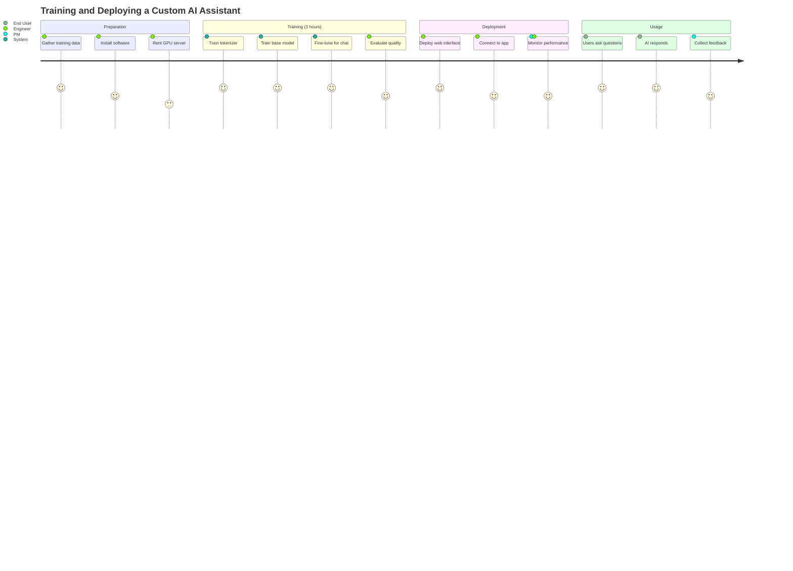
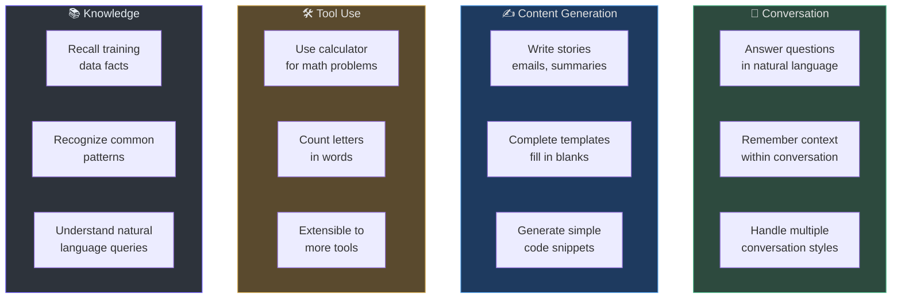
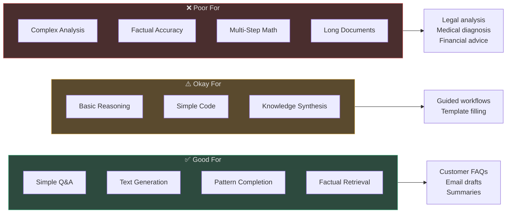
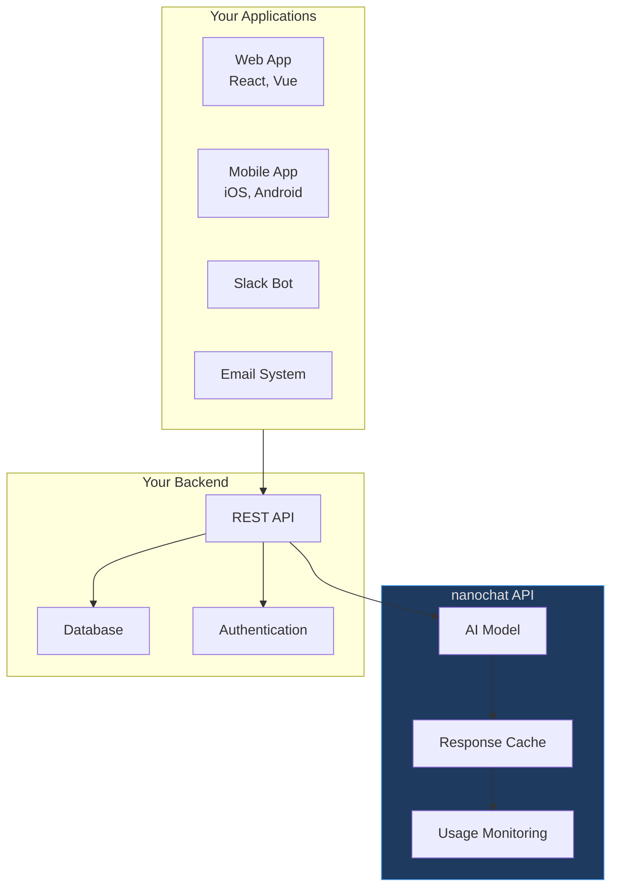
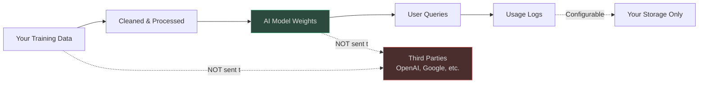
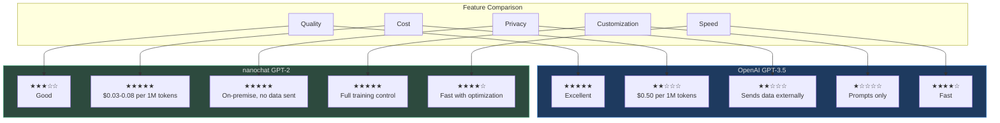

# Product Manager Onboarding: nanochat

**Target Audience**: Product managers, business analysts, non-engineering stakeholders evaluating nanochat for product features.

**Reading Time**: 15-20 minutes.

---

## What is nanochat?

**nanochat** is a complete toolkit for building your own ChatGPT-like assistant from scratch. Instead of paying for OpenAI's API, you train your own language model using modern techniques that are 600× cheaper than 5 years ago.

**The Simple Pitch**:
- **Old Way (2019)**: OpenAI spent $43,000 and 7 days to train GPT-2
- **New Way (2025)**: nanochat trains an equivalent model for $72 in 3 hours

**Why This Matters**: Companies can now build custom AI assistants tailored to their specific needs (medical, legal, customer support, etc.) without relying on expensive third-party APIs.

---

## Table of Contents

[[toc]]

---

## User Journey Map

### End-to-End Experience



### Timeline Breakdown

| Phase | Duration | Activities | Key Stakeholders |
|-------|----------|-----------|-----------------|
| **Setup** | 1-2 hours | Install dependencies, prepare data | Engineering |
| **Training** | 3 hours | Automated training process | System (unattended) |
| **Evaluation** | 1-2 hours | Test model quality, benchmark | Engineering, PM |
| **Integration** | 1-2 weeks | Connect to apps, APIs, databases | Engineering, Product |
| **Launch** | Ongoing | Monitor usage, collect feedback | PM, Engineering, Support |

---

## Feature Capabilities Map

### What nanochat Can Do



### Concrete Use Cases

| Use Case | Example | nanochat Capability | Limitations |
|----------|---------|-------------------|-------------|
| **Customer Support** | "How do I reset my password?" | Can answer FAQs based on training data | May hallucinate if not in training data |
| **Document Summarization** | "Summarize this 5-page report" | Can extract key points | 2048 token limit (~1500 words) |
| **Email Drafting** | "Draft a follow-up email to John" | Can write professional emails | Generic tone, needs human review |
| **Simple Math** | "Calculate 15% of $2,450" | Uses calculator tool | Only basic arithmetic |
| **Code Assistance** | "Write a Python function to sort a list" | Can generate simple code | No debugging, testing, or optimization |
| **Spelling/Counting** | "How many 'r's in strawberry?" | Uses letter-counting tool | Only works with tool, not natively |

---

## Known Limitations & Constraints

### Capability Boundaries



### Specific Limitations

| Limitation | Impact | Workaround |
|------------|--------|------------|
| **Hallucinations** | Model invents plausible-sounding but false information | Add human review, implement fact-checking |
| **Context Length** | Only remembers last 2048 tokens (~1500 words) | Summarize long conversations, use retrieval systems |
| **No Internet Access** | Cannot look up current events or real-time data | Pre-train on updated data, add search API integration |
| **Arithmetic Errors** | Frequently makes calculation mistakes without calculator tool | Force tool use for all math, verify answers |
| **Inconsistent Tone** | May switch between formal/casual inappropriately | Fine-tune on style-consistent examples |
| **No Multilingual** | Primarily English (training data is 95%+ English) | Train on multilingual data or use specialized models |

### Quality vs. Cost Tradeoff

| Model Size | Training Cost | Quality Level | Best For |
|------------|---------------|---------------|----------|
| **d=12 (small)** | $2 (5 min) | "Toddler" — Basic patterns | Prototyping, demos |
| **d=20 (medium)** | $6 (15 min) | "Preschooler" — Simple tasks | Internal tools, low-stakes |
| **d=26 (GPT-2)** | $72 (3 hrs) | "Kindergartener" — Usable quality | Customer-facing, moderate stakes |
| **d=32 (large)** | $96 (4 hrs) | "1st grader" — Better reasoning | High-volume, quality-critical |

**Recommendation**: Start with **d=26** for most use cases. It's the "sweet spot" between cost and capability.

---

## User Experience Considerations

### Chat Interface Design

nanochat comes with a built-in web interface that mimics ChatGPT:

**Key Features**:
- **Streaming Responses**: Text appears word-by-word (feels responsive)
- **Conversation History**: Maintains context within a session
- **Calculator Tool**: Automatically used when math is detected
- **Markdown Rendering**: Formats code blocks, lists, bold/italic text
- **Dark/Light Mode**: User preference for appearance

**User Flow**:
1. User opens chat interface (web browser)
2. User types question in text box
3. AI streams response (appears gradually)
4. User can ask follow-up questions (context maintained)
5. User can start new conversation (clears history)

**Example Conversation**:
```
User: What's the capital of France?
AI: The capital of France is Paris.

User: How large is its population?
AI: Paris has a population of approximately 2.1 million people in the city proper, 
     and over 12 million in the greater metropolitan area.

User: Calculate 15% of 2.1 million
AI: [Using calculator: 2100000 * 0.15]
    15% of 2.1 million is 315,000.
```

---

### Integration Patterns



**Integration Options**:

| Method | Complexity | Latency | Best For |
|--------|-----------|---------|----------|
| **Direct Chat UI** | Low | Instant | Internal tools, demos |
| **REST API** | Medium | 100-500ms | Web/mobile apps |
| **Slack Bot** | Medium | 200-800ms | Team collaboration |
| **Email Integration** | High | Minutes | Automated email responses |

---

## Performance Expectations

### Response Quality

**Sample Prompts & Expected Responses**:

**✅ Good Performance**:
```
Prompt: "Write a friendly email thanking a customer for their purchase."

Response: 
"Dear [Customer Name],

Thank you so much for your recent purchase! We truly appreciate your business 
and hope you're enjoying your new [product name].

If you have any questions or need assistance, please don't hesitate to reach 
out. We're here to help!

Best regards,
[Your Name]"
```

**⚠️ Moderate Performance**:
```
Prompt: "Explain the difference between machine learning and deep learning."

Response:
"Machine learning is a broad field where computers learn from data without 
being explicitly programmed. Deep learning is a subset of machine learning 
that uses neural networks with multiple layers. Deep learning is particularly 
good at tasks like image recognition and natural language processing."

[Note: Correct but somewhat generic. May lack depth for expert audiences.]
```

**❌ Poor Performance**:
```
Prompt: "Provide a detailed medical diagnosis based on these symptoms: 
        headache, fever, nausea."

Response:
"Based on your symptoms, you might have the flu, COVID-19, or meningitis. 
I recommend seeing a doctor immediately as meningitis can be life-threatening."

[WARNING: Medical advice is unreliable and potentially dangerous. 
          DO NOT use nanochat for medical diagnosis.]
```

---

### Performance Metrics

| Metric | Value | Explanation |
|--------|-------|-------------|
| **Response Latency (p50)** | 200-300ms | Half of responses in <300ms |
| **Response Latency (p95)** | 500-800ms | 95% of responses in <800ms |
| **Throughput** | 5-10 requests/sec | Single GPU server |
| **Context Retention** | 2048 tokens | ~1500 words of conversation |
| **Accuracy (CORE)** | 0.26 (GPT-2 grade) | Matches OpenAI's GPT-2 from 2019 |

**What This Means**:
- **Fast Enough**: For chat, 300ms feels instant (like typing)
- **Limited Throughput**: Need load balancing for >100 concurrent users
- **Short Memory**: After ~1500 words, AI "forgets" early conversation

---

## Data & Privacy

### What Data is Needed?

**Training Data Requirements**:
- **Volume**: 10 billion tokens (~40GB of text, ~20 million pages)
- **Format**: Plain text or conversation logs (JSONL format)
- **Quality**: Clean, grammatically correct, relevant to your use case
- **Diversity**: Multiple topics, styles, sources

**Example Data Sources**:

| Source | Size | Quality | Cost | Use Case |
|--------|------|---------|------|----------|
| **Public Web** | Massive | Variable | Free | General knowledge |
| **Wikipedia** | ~20GB | High | Free | Factual information |
| **Books (Project Gutenberg)** | ~50GB | High | Free | Language, literature |
| **Your Internal Docs** | Varies | High | Free | Company-specific knowledge |
| **Customer Support Logs** | Varies | Medium | Free | FAQ, troubleshooting |

**Data Preparation** (handled by engineers):
1. Collect raw data from sources
2. Remove duplicates, spam, irrelevant content
3. Clean formatting (remove HTML, special characters)
4. Organize into training-ready format
5. Ensure no sensitive data (PII, passwords, etc.)

---

### Privacy Considerations

**What Happens to Your Data?**



**Key Privacy Features**:
- ✅ **On-Premise**: Model runs on your servers, no data sent externally
- ✅ **No Telemetry**: No automatic data collection to third parties
- ✅ **Configurable Logging**: You control what gets logged
- ⚠️ **Memorization Risk**: Model may "remember" verbatim training data

**Privacy Risks & Mitigations**:

| Risk | Severity | Mitigation |
|------|----------|------------|
| **Training Data Leakage** | Medium | Remove PII before training, audit for sensitive content |
| **User Query Logging** | Medium | Encrypt logs, set retention policies, limit access |
| **Model Theft** | Low | Restrict access to model files, use authentication |
| **Prompt Injection** | Medium | Sanitize inputs, add guardrails (filter harmful prompts) |

---

## Competitive Comparison

### nanochat vs. OpenAI API



### Decision Guide

**Choose OpenAI API if**:
- You need the best quality (GPT-4 level)
- You're building a consumer product with low-moderate usage (<10M tokens/month)
- You need fast time-to-market (immediate integration)
- Data privacy is not a blocker

**Choose nanochat if**:
- You have high usage volume (>50M tokens/month) → 10-20× cost savings
- You have domain-specific data (medical, legal, internal docs)
- Data privacy is critical (cannot send data to third parties)
- You want full control over the model (training, tuning, deployment)

---

## Go-to-Market Strategy

### Target Customer Segments

| Segment | Pain Point | nanochat Solution | Messaging |
|---------|-----------|------------------|-----------|
| **Enterprise (Legal, Medical)** | Cannot send data to OpenAI (compliance) | On-premise training + deployment | "Your data never leaves your servers" |
| **High-Volume SaaS** | $10K+/month OpenAI bills | Self-hosting saves 10-20× | "Same quality, $72 to train, $0.03 per 1M tokens" |
| **Startups (Pre-Seed)** | Limited budget (<$100K) | Train custom model for <$100 | "Build your own AI for less than a fancy dinner" |
| **Research Labs** | Need to understand/modify models | Full codebase, hackable | "3000 lines of code, fully transparent" |

---

### Pricing Strategy

**Cost Structure** (per deployment):

| Item | One-Time Cost | Recurring Cost (Monthly) | Notes |
|------|--------------|------------------------|-------|
| **Training** | $72-100 | $0 | Re-train quarterly if needed |
| **Infrastructure** | $0 | $500-2,000 | GPU rental (1-4 GPUs for inference) |
| **Engineering** | $20K-50K | $5K-10K | Initial integration + ongoing maintenance |
| **Total Year 1** | ~$25K-55K | ~$6K-24K/mo | Depends on scale |

**Comparison to OpenAI API** (100M tokens/month):
- **OpenAI**: $0 upfront, $50,000/month → **$600K/year**
- **nanochat**: $25K-55K upfront, $6K-24K/month → **$97K-343K/year**
- **Savings**: **$257K-503K per year** (43-84% reduction)

---

### Launch Checklist

#### Phase 1: Internal Validation (4-6 weeks)
- [ ] Train d=26 model (use public data for POC)
- [ ] Deploy chat interface for 10-20 internal users
- [ ] Collect feedback on response quality, speed
- [ ] Benchmark against OpenAI GPT-3.5 on 5-10 test cases
- [ ] Decide Go/No-Go based on quality vs. cost tradeoff

#### Phase 2: Pilot (8-12 weeks)
- [ ] Train custom model on proprietary data (if applicable)
- [ ] Integrate with 1-2 internal applications (Slack bot, internal tool)
- [ ] Expand to 100-500 users
- [ ] Monitor usage, performance, errors
- [ ] Iterate on model quality (re-train, fine-tune)

#### Phase 3: Production Launch (12+ weeks)
- [ ] Deploy to production infrastructure (load balancing, monitoring)
- [ ] Integrate with customer-facing applications
- [ ] Set up incident response (model goes down, produces bad outputs)
- [ ] Launch marketing campaign (if external product)
- [ ] Track KPIs: usage, satisfaction, cost savings

---

## Measuring Success

### Key Performance Indicators (KPIs)

```mermaid
graph LR
    subgraph Adoption["📈 Adoption Metrics"]
        DAU[Daily Active Users]
        Sessions[Sessions per User]
        Retention[7-Day Retention]
    end
    
    subgraph Quality["✅ Quality Metrics"]
        Satisfaction[User Satisfaction<br/>Thumbs up/down]
        TaskSuccess[Task Completion Rate]
        Escalation[Escalation to Human]
    end
    
    subgraph Business["💰 Business Metrics"]
        CostSavings[Cost Savings vs. OpenAI]
        ROI[Return on Investment]
        Revenue[Revenue Impact<br/>if customer-facing]
    end
    
    Adoption --> Quality
    Quality --> Business
    
    style Adoption fill:#2d333b,stroke:#6d5dfc,color:#e6edf3
    style Quality fill:#1e3a5f,stroke:#4a9eed,color:#e0e0e0
    style Business fill:#2d4a3e,stroke:#4aba8a,color:#e0e0e0
```



### Success Criteria (Example)

| Metric | Baseline (Pre-Launch) | Target (3 Months) | Stretch Goal (6 Months) |
|--------|---------------------|------------------|----------------------|
| **Daily Active Users** | 0 | 100 | 500 |
| **Sessions/User** | N/A | 3 | 5 |
| **User Satisfaction** | N/A | 70% | 80% |
| **Task Completion Rate** | N/A | 65% | 75% |
| **Escalation Rate** | N/A | <20% | <10% |
| **Cost vs. OpenAI** | $50K/mo | $8K/mo (84% savings) | $5K/mo (90% savings) |

---

## FAQ

### Q: How long does it take to see results?

**A**: 
- **POC**: 1 week (run speedrun.sh, test with team)
- **Pilot**: 8-12 weeks (integrate with 1-2 apps, 100 users)
- **Production**: 3-6 months (scale, optimize, measure ROI)

Most teams see initial value in the POC phase (1 week), but full ROI takes 3-6 months.

---

### Q: What if the model produces wrong information?

**A**: This is called "hallucination" and happens with ALL language models (including GPT-4). Mitigations:
1. **Human Review**: Add review step for high-stakes decisions
2. **Citations**: Implement retrieval-augmented generation (RAG) to cite sources
3. **Guardrails**: Filter out medical, legal, financial advice (high-risk domains)
4. **Disclaimers**: Show "AI-generated, verify before use" warnings

**Rule of Thumb**: Use nanochat for low-stakes tasks (drafts, FAQs, suggestions), not high-stakes (medical diagnosis, legal advice, financial decisions).

---

### Q: Can we update the model with new information?

**A**: Yes, but it's not real-time:
- **Re-training**: Train a new model from scratch with updated data (takes 3 hours, costs $72)
- **Fine-tuning**: Quickly adapt existing model to new data (takes 30 min, costs $5-10)
- **Retrieval (RAG)**: Add a search system to fetch up-to-date info without retraining

**Best Practice**: Re-train quarterly with new data, use retrieval for real-time updates.

---

### Q: How many users can it support?

**A**: Depends on hardware:
- **Single GPU (H100)**: 5-10 concurrent users (batch=1)
- **4×GPU (load balanced)**: 20-40 concurrent users
- **Optimized (vLLM, batching)**: 100-200 concurrent users per 4×GPU

**Scaling Strategy**: Start with 1 GPU, add more as usage grows. Use load balancer to distribute requests.

---

### Q: What happens if the model goes down?

**A**: Like any service, you need:
1. **Monitoring**: Track uptime, errors, latency
2. **Failover**: Route to backup server if primary fails
3. **Graceful Degradation**: Show cached responses or "AI unavailable" message
4. **SLA**: Define acceptable downtime (e.g., 99.9% = 43 min/month)

**Recommendation**: Start with best-effort (no SLA), add redundancy as usage grows.

---

### Q: Is nanochat better than GPT-4?

**A**: **No**. nanochat (GPT-2 grade) is ~100× smaller and less capable than GPT-4. Think of it like:
- **nanochat**: A bright kindergartener (simple tasks, basic reasoning)
- **GPT-4**: A college graduate (complex analysis, multi-step reasoning)

**Use nanochat for**: Simple Q&A, text generation, domain-specific tasks with training data  
**Use GPT-4 for**: Complex reasoning, instruction following, multi-step analysis

---

## Summary

**nanochat** trains GPT-2 grade AI assistants for **$72 in 3 hours** — a 600× cost reduction vs. 2019.

**Key Benefits**:
- ✅ **Cost**: $0.03-0.08 per 1M tokens (vs. $0.50 OpenAI)
- ✅ **Privacy**: On-premise, no data sent externally
- ✅ **Customization**: Train on your proprietary data
- ✅ **Speed**: 200-300ms response latency

**Ideal Use Cases**:
- High-volume applications (>50M tokens/month)
- Domain-specific assistants (medical, legal, customer support)
- Privacy-sensitive environments (cannot use third-party APIs)
- Cost-sensitive startups (<$100 budget)

**Limitations**:
- ⚠️ GPT-2 grade quality (not GPT-4)
- ⚠️ Hallucinates (invents plausible-sounding falsehoods)
- ⚠️ 2048 token context (short memory)
- ⚠️ Requires engineering resources (not plug-and-play)

**Recommended Next Steps**:
1. **Week 1**: Run POC with engineering team
2. **Weeks 2-6**: Test with 10-20 internal users
3. **Week 7**: Go/No-Go decision
4. **Weeks 8-20**: Production pilot (if Go)

**Questions?** Consult with your engineering and product leadership, or explore [GitHub Discussions](https://github.com/karpathy/nanochat/discussions).
