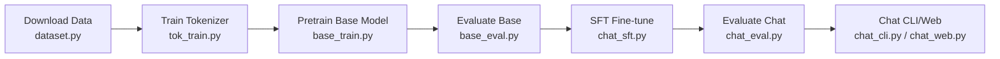
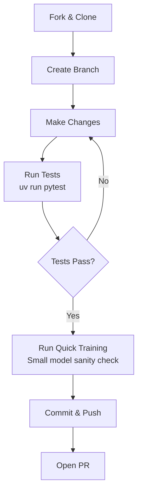

# Zero to Hero Guide

Welcome to **nanochat** — the minimal full-stack ChatGPT clone by Andrej Karpathy. This guide walks you from first clone to first contribution, covering setup, your first training run, understanding the codebase, and making meaningful changes.

## Prerequisites

Before you begin, make sure you have:

- **Python 3.10+** — required by the project (`requires-python = ">=3.10"` in [pyproject.toml](../pyproject.toml))
- **uv** package manager — the project uses `uv` for dependency management and virtual environments. If you don't have it, the run scripts install it automatically via `curl -LsSf https://astral.sh/uv/install.sh | sh`
- **Git** — for cloning and contributing
- **CUDA GPU (recommended)** — an NVIDIA GPU (H100 ideal, A100/4090 workable) for real training. CPU and Apple MPS are supported for learning but will produce toy models
- **~50GB disk space** — for dataset shards, model checkpoints, and tokenizer artifacts (stored in `~/.cache/nanochat/` by default)

## Step-by-Step Setup

### 1. Clone the Repository

```bash
git clone https://github.com/karpathy/nanochat.git
cd nanochat
```

### 2. Create Virtual Environment and Install Dependencies

For **CPU/Mac** development:
```bash
uv venv
uv sync --extra cpu
source .venv/bin/activate
```

For **GPU** training:
```bash
uv venv
uv sync --extra gpu
source .venv/bin/activate
```

The `cpu` and `gpu` extras control which PyTorch wheel is installed (CPU-only vs CUDA 12.8). See [pyproject.toml](../pyproject.toml) for details.

### 3. Set the Base Directory

All intermediate artifacts (dataset, tokenizer, checkpoints) are stored in a base directory:

```bash
export NANOCHAT_BASE_DIR="$HOME/.cache/nanochat"
mkdir -p $NANOCHAT_BASE_DIR
```

This is the default location. Override it with the `NANOCHAT_BASE_DIR` environment variable if needed.

## Your First Training Run

### CPU/Mac Run (Educational)

The [runs/runcpu.sh](../runs/runcpu.sh) script is designed for Macbooks and CPU-only machines. It runs the full pipeline end-to-end in about 40 minutes on an M3 Max:

```bash
bash runs/runcpu.sh
```

This script will:
1. Download 8 data shards (~800MB) from FineWeb-Edu
2. Train a BPE tokenizer on ~2B characters
3. Train a small 6-layer model for 5000 steps
4. Run SFT (supervised fine-tuning) for 1500 steps
5. The model should learn to answer simple questions like "What is the capital of France?"

You can also run commands one at a time by copying them from the script — this is great for learning what each step does.

### GPU Speedrun (8×H100, ~3 Hours)

The [runs/speedrun.sh](../runs/speedrun.sh) script trains a full GPT-2-grade model on 8 H100 GPUs:

```bash
# Simple launch
bash runs/speedrun.sh

# With wandb logging (recommended)
WANDB_RUN=my-first-run bash runs/speedrun.sh

# In a screen session (for long runs)
screen -S speedrun bash runs/speedrun.sh
```

This trains a 26-layer model with FP8 on ~10B tokens, runs SFT, and generates a comprehensive report.

### What Happens During Training



## Understanding the Code: A Guided Tour

### The Model: `nanochat/gpt.py`

Start here. This is the GPT model definition — about 450 lines of clean PyTorch. Key things to notice:

- **`GPTConfig`** (line 29): The full model architecture in one dataclass — `n_layer`, `n_head`, `n_kv_head`, `n_embd`, `sequence_len`, `vocab_size`, `window_pattern`
- **`CausalSelfAttention`** (line 59): Implements RoPE, QK-norm, GQA, value embeddings, and sliding window attention
- **`MLP`** (line 121): Simple — two linear layers with `relu²` activation
- **`GPT.forward`** (line 388): The forward pass — embed, normalize, run through blocks with per-layer scaling, normalize, project to logits, apply softcap
- **`GPT.setup_optimizer`** (line 348): See how parameters are split into Muon and AdamW groups

### The Optimizer: `nanochat/optim.py`

The Muon+AdamW optimizer. Both `adamw_step_fused` and `muon_step_fused` are `@torch.compile` kernels. The distributed version (`DistMuonAdamW`) handles all gradient communication — nanochat does **not** use PyTorch DDP.

### The Data Pipeline: `nanochat/dataloader.py` + `nanochat/dataset.py`

- `dataset.py` handles downloading FineWeb-Edu parquet shards
- `dataloader.py` implements BOS-aligned best-fit packing — every sequence starts with BOS, documents are packed greedily, and remaining space is filled by cropping

### The Inference Engine: `nanochat/engine.py`

The `Engine` class does efficient autoregressive generation with a KV cache and built-in calculator tool use. Study the `RowState` class to understand the per-sample state machine.

### Eval Tasks: `tasks/`

Each task (GSM8K, MMLU, ARC, HumanEval, SpellingBee) inherits from `Task` in [tasks/common.py](../tasks/common.py). Tasks are composable via `TaskMixture` (shuffled mix for SFT) and `TaskSequence` (curriculum).

## How to Make Your First Contribution

### Development Workflow



### Running Tests

```bash
uv run pytest                      # run all tests
uv run pytest -m "not slow"        # skip slow tests
uv run pytest tests/test_gpt.py    # run specific test file
```

## Common Tasks

### Changing Model Depth

Model depth is controlled by the `--depth` CLI argument in `base_train.py`. The width is computed as `depth * aspect_ratio` (default aspect ratio is 64):

```bash
# Small 6-layer model (good for CPU debugging)
python -m scripts.base_train --depth=6 --max-seq-len=512

# Medium 12-layer model
python -m scripts.base_train --depth=12

# Large 26-layer model (speedrun default, needs 8 GPUs)
torchrun --nproc_per_node=8 -m scripts.base_train -- --depth=26 --fp8
```

The number of heads is derived from `n_embd / head_dim`. GQA ratio is automatic.

### Adding a New Eval Task

1. Create a new file in `tasks/`, e.g. `tasks/my_task.py`
2. Inherit from `Task` in [tasks/common.py](../tasks/common.py):

```python
from tasks.common import Task

class MyTask(Task):
    @property
    def eval_type(self):
        return 'generative'  # or 'categorical'

    def num_examples(self):
        return len(self.data)

    def get_example(self, index):
        # Return a conversation dict with 'messages' key
        item = self.data[index]
        return {
            "messages": [
                {"role": "user", "content": item["question"]},
                {"role": "assistant", "content": item["answer"]},
            ]
        }

    def evaluate(self, problem, completion):
        # Return True/False for correctness
        return problem["expected"] in completion
```

3. Import and register it in `scripts/chat_eval.py` or `scripts/chat_sft.py`

### Customizing the Model Identity

The model's personality comes from a synthetic identity conversations file downloaded during SFT:

```bash
curl -L -o $NANOCHAT_BASE_DIR/identity_conversations.jsonl \
  https://karpathy-public.s3.us-west-2.amazonaws.com/identity_conversations.jsonl
```

To customize, create your own JSONL file with conversation objects:

```json
{"messages": [{"role": "user", "content": "What is your name?"}, {"role": "assistant", "content": "I'm MyBot, an AI assistant."}]}
```

Place it at `$NANOCHAT_BASE_DIR/identity_conversations.jsonl` (or modify the path in [scripts/chat_sft.py](../scripts/chat_sft.py), line 105).

### Changing the Sliding Window Pattern

The `--window-pattern` flag controls per-layer attention windows. Characters tile across layers:

- `L` = full context (attend to all previous tokens)
- `S` = short window (attend to half the sequence length)

Examples:
```bash
--window-pattern=L        # All layers full context (simplest)
--window-pattern=SL       # Alternating short/long
--window-pattern=SSSL     # Three short, one long (default)
```

The last layer always uses full context regardless of the pattern.

## Debugging Tips

### Memory Issues (OOM)

If you run out of GPU memory:
1. **Reduce `--device-batch-size`** — try 16, 8, or 4
2. **Reduce `--max-seq-len`** — try 1024 or 512
3. **Check `--fp8`** — FP8 training cuts memory usage significantly on H100+

### Slow Training

- Check **MFU** (Model FLOPs Utilization) in the training logs. Good values: >40% on H100
- Ensure `torch.compile` is working — first few steps are slow due to compilation
- Check `grad_accum_steps` in logs — if it's very high, your `total_batch_size` might be too large for your hardware

### Verifying Model Quality

After training, quick sanity checks:

```bash
# Chat interactively
python -m scripts.chat_cli

# Chat with a specific prompt
python -m scripts.chat_cli -p "What is the capital of France?"

# Launch the web UI
python -m scripts.chat_web
```

### Common Pitfalls

- **Forgetting `--` with torchrun**: When using torchrun, separate its args from script args with `--`:
  ```bash
  torchrun --nproc_per_node=8 -m scripts.base_train -- --depth=26
  ```
- **Wrong PyTorch extra**: If you see CUDA errors on CPU, or vice versa, make sure you installed with the correct extra (`--extra cpu` or `--extra gpu`)
- **Stale checkpoints**: nanochat auto-discovers the largest model in the checkpoint directory. If you trained multiple models, specify `--model-tag` explicitly

### Understanding Training Logs

A typical training log line:
```
step 00100 (1.25%) | loss: 4.123456 | lrm: 1.00 | dt: 150.00ms | tok/sec: 3,495,253 | mfu: 42.50
```

- **loss**: Debiased EMA of cross-entropy loss (lower is better; a good base model reaches ~3.0–3.5)
- **lrm**: Learning rate multiplier (1.0 = peak, decays during warmdown phase)
- **dt**: Wall-clock time per optimization step (includes gradient accumulation microsteps)
- **tok/sec**: Tokens processed per second across all GPUs
- **mfu**: Model FLOPs Utilization as percentage of hardware peak (>40% is good on H100)
- **epoch**: Current pass through the dataset (most pretraining runs do <1 epoch)

### Inspecting Checkpoints

Checkpoints are saved in `~/.cache/nanochat/` under `base_checkpoints/`, `chatsft_checkpoints/`, and `chatrl_checkpoints/`, organized by model tag (e.g., `d26` for a 26-layer model). Each checkpoint consists of three files:

- `model_NNNNNN.pt` — model state dict
- `optim_NNNNNN_rankN.pt` — optimizer state (one per GPU rank, sharded)
- `meta_NNNNNN.json` — metadata including model config, training args, and metrics

You can load and inspect a checkpoint directly:

```python
from nanochat.checkpoint_manager import load_model
model, tokenizer, meta = load_model("base", device, phase="eval")
print(meta["model_config"])  # see architecture details
```

### Using wandb for Experiment Tracking

nanochat has built-in wandb integration. To enable it:

```bash
pip install wandb
wandb login
WANDB_RUN=experiment-name bash runs/speedrun.sh
```

Setting `WANDB_RUN=dummy` (the default) disables wandb logging entirely — no account needed for development.

## Project Conventions

- **No bias terms**: All linear layers use `bias=False` throughout the model
- **Module invocation via `-m`**: Scripts are run as `python -m scripts.base_train`, not as direct file paths
- **`print0`**: Used instead of `print` for DDP-safe logging (only rank 0 prints)
- **Meta device init**: The model constructor runs on meta device; actual weight initialization is deferred to `init_weights()`
- **Artifact storage**: All generated files go in `NANOCHAT_BASE_DIR` (default `~/.cache/nanochat/`), keeping the repo directory clean
